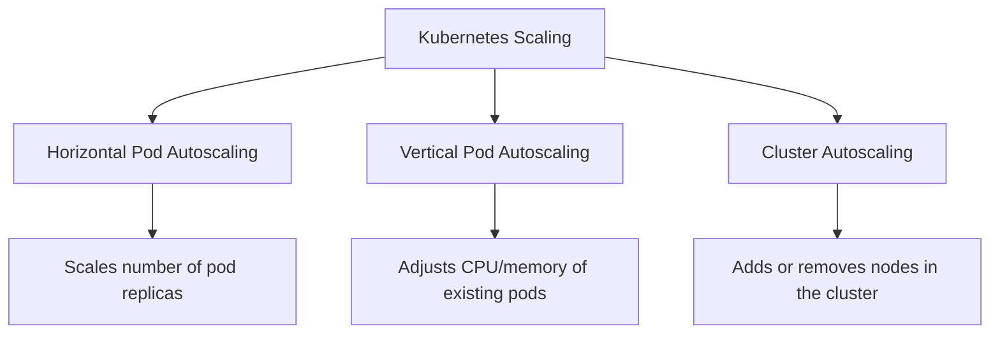

# Kubernetes Cluster Scaling

## Introduction

Scaling is one of the most powerful features of Kubernetes. As your applications face varying workloads, the ability to scale resources up or down becomes crucial for maintaining performance while optimizing costs. Kubernetes offers several approaches to scaling, from manually adjusting the number of running pods to sophisticated automatic scaling based on resource utilization metrics.

In this guide, we'll explore different scaling strategies for Kubernetes clusters, how to implement them, and best practices to ensure your applications remain responsive regardless of traffic patterns.

## Understanding Scaling Types in Kubernetes

Before diving into implementation, let's understand the different types of scaling available in Kubernetes:

### 1. Horizontal Pod Autoscaling (HPA)

Horizontal scaling increases or decreases the number of pod replicas in a deployment or replication controller. This is useful when your application can distribute load across multiple instances.

### 2. Vertical Pod Autoscaling (VPA)

Vertical scaling adjusts the CPU and memory resources allocated to existing pods. This is helpful for applications that can't be easily horizontally scaled.

### 3. Cluster Autoscaling (CA)

Cluster scaling adjusts the number of nodes in your cluster based on resource requirements. This ensures you have enough infrastructure to run your workloads.



## Horizontal Pod Autoscaling

### How Horizontal Pod Autoscaling Works

Horizontal Pod Autoscaling automatically scales the number of pods in a deployment, replication controller, or replica set based on observed CPU utilization or custom metrics.

### Setting Up an HPA

To use the Horizontal Pod Autoscaler, you need the metrics server installed in your cluster. Most managed Kubernetes services have this pre-installed.

Here's a simple example of creating an HPA:

```yaml
apiVersion: autoscaling/v2
kind: HorizontalPodAutoscaler
metadata:
  name: example-app
spec:
  scaleTargetRef:
    apiVersion: apps/v1
    kind: Deployment
    name: example-app
  minReplicas: 2
  maxReplicas: 10
  metrics:
  - type: Resource
    resource:
      name: cpu
      target:
        type: Utilization
        averageUtilization: 50
```

This HPA will:
- Target a deployment named `example-app`
- Maintain between 2 and 10 replicas
- Scale based on CPU utilization, targeting 50% average utilization

You can apply this configuration using:

```bash
kubectl apply -f hpa.yaml
```

### Checking HPA Status

You can check the status of your HPAs using:

```bash
kubectl get hpa
```

Example output:

```
NAME         REFERENCE               TARGETS    MINPODS   MAXPODS   REPLICAS   AGE
example-app  Deployment/example-app  85%/50%   2         10        6          2m
```

In this example, the current CPU utilization is 85%, causing the HPA to scale up to 6 replicas.

### Scaling Based on Custom Metrics

You can also scale based on custom metrics using Prometheus and the Prometheus Adapter. Here's an example HPA that scales based on requests per second:

```yaml
apiVersion: autoscaling/v2
kind: HorizontalPodAutoscaler
metadata:
  name: example-app
spec:
  scaleTargetRef:
    apiVersion: apps/v1
    kind: Deployment
    name: example-app
  minReplicas: 2
  maxReplicas: 10
  metrics:
  - type: Pods
    pods:
      metric:
        name: http_requests_per_second
      target:
        type: AverageValue
        averageValue: 100
```

## Vertical Pod Autoscaling

### How Vertical Pod Autoscaling Works

Vertical Pod Autoscaling (VPA) automatically adjusts the CPU and memory resource requests and limits of containers in pods. This is useful for applications that can't be horizontally scaled.

### Setting Up VPA

To use VPA, you first need to install the Vertical Pod Autoscaler operator:

```bash
git clone https://github.com/kubernetes/autoscaler.git
cd autoscaler/vertical-pod-autoscaler/
./hack/vpa-up.sh
```

Here's an example VPA configuration:

```yaml
apiVersion: autoscaling.k8s.io/v1
kind: VerticalPodAutoscaler
metadata:
  name: example-app-vpa
spec:
  targetRef:
    apiVersion: "apps/v1"
    kind: Deployment
    name: example-app
  updatePolicy:
    updateMode: "Auto"
  resourcePolicy:
    containerPolicies:
      - containerName: '*'
        minAllowed:
          cpu: 100m
          memory: 50Mi
        maxAllowed:
          cpu: 1
          memory: 500Mi
```

This VPA will:
- Target a deployment named `example-app`
- Automatically update resource requirements
- Set min/max boundaries for CPU and memory

### VPA Modes

VPA supports three update modes:
1. `Off`: VPA only provides recommendations, doesn't apply them
2. `Initial`: VPA applies recommendations only at pod creation
3. `Auto`: VPA automatically updates resource requirements for running pods

### Checking VPA Status

You can check VPA recommendations with:

```bash
kubectl describe vpa example-app-vpa
```

## Cluster Autoscaling

### How Cluster Autoscaling Works

Cluster Autoscaler adjusts the size of your Kubernetes cluster when:
- There are pods that failed to run due to insufficient resources
- There are nodes that have been underutilized for a significant amount of time

### Setting Up Cluster Autoscaler

Setting up Cluster Autoscaler varies by cloud provider. Here's an example for Google Kubernetes Engine (GKE):

```bash
gcloud container clusters update example-cluster \
  --enable-autoscaling \
  --min-nodes=3 \
  --max-nodes=10 \
  --zone=us-central1-a
```

For AWS EKS, you would typically deploy the autoscaler as a deployment:

```yaml
apiVersion: apps/v1
kind: Deployment
metadata:
  name: cluster-autoscaler
  namespace: kube-system
  labels:
    app: cluster-autoscaler
spec:
  replicas: 1
  selector:
    matchLabels:
      app: cluster-autoscaler
  template:
    metadata:
      labels:
        app: cluster-autoscaler
    spec:
      serviceAccountName: cluster-autoscaler
      containers:
        - image: k8s.gcr.io/autoscaling/cluster-autoscaler:v1.23.0
          name: cluster-autoscaler
          command:
            - ./cluster-autoscaler
            - --v=4
            - --stderrthreshold=info
            - --cloud-provider=aws
            - --skip-nodes-with-local-storage=false
            - --expander=least-waste
            - --node-group-auto-discovery=asg:tag=k8s.io/cluster-autoscaler/enabled,k8s.io/cluster-autoscaler/<YOUR-CLUSTER-NAME>
          resources:
            limits:
              cpu: 100m
              memory: 300Mi
            requests:
              cpu: 100m
              memory: 300Mi
```

### Node Affinity and Taints for Controlled Scaling

You can control where pods are scheduled using node affinity and taints, which helps the Cluster Autoscaler make better decisions:

```yaml
apiVersion: apps/v1
kind: Deployment
metadata:
  name: example-app
spec:
  replicas: 3
  selector:
    matchLabels:
      app: example-app
  template:
    metadata:
      labels:
        app: example-app
    spec:
      affinity:
        nodeAffinity:
          requiredDuringSchedulingIgnoredDuringExecution:
            nodeSelectorTerms:
            - matchExpressions:
              - key: node-type
                operator: In
                values:
                - compute-optimized
      containers:
      - name: example-app
        image: example/app:latest
        resources:
          requests:
            memory: "256Mi"
            cpu: "500m"
          limits:
            memory: "512Mi"
            cpu: "1000m"
```

## Practical Real-World Scaling Scenarios

### Scenario 1: Handling Daily Traffic Patterns

Many applications experience predictable traffic patterns. For example, an e-commerce site might see more traffic during evenings and weekends. In this case, you might use HPA in combination with Cluster Autoscaler:

```yaml
apiVersion: autoscaling/v2
kind: HorizontalPodAutoscaler
metadata:
  name: shopping-app
spec:
  scaleTargetRef:
    apiVersion: apps/v1
    kind: Deployment
    name: shopping-app
  minReplicas: 5  # Higher baseline during business hours
  maxReplicas: 20
  behavior:
    scaleUp:
      stabilizationWindowSeconds: 60  # Scale up quickly
    scaleDown:
      stabilizationWindowSeconds: 300  # Scale down slowly
  metrics:
  - type: Resource
    resource:
      name: cpu
      target:
        type: Utilization
        averageUtilization: 60
```

### Scenario 2: Handling Unexpected Traffic Spikes

For applications that might experience sudden, unpredictable traffic spikes (like a news site), you'll want a more aggressive scaling strategy:

```yaml
apiVersion: autoscaling/v2
kind: HorizontalPodAutoscaler
metadata:
  name: news-app
spec:
  scaleTargetRef:
    apiVersion: apps/v1
    kind: Deployment
    name: news-app
  minReplicas: 5
  maxReplicas: 50  # Allow more headroom for unexpected spikes
  behavior:
    scaleUp:
      policies:
      - type: Percent
        value: 100
        periodSeconds: 15  # Double pods every 15 seconds if needed
  metrics:
  - type: Resource
    resource:
      name: cpu
      target:
        type: Utilization
        averageUtilization: 50  # More aggressive target
```

### Scenario 3: Batch Processing Jobs

For batch processing workloads, you might want to scale nodes with specific capabilities:

```yaml
apiVersion: batch/v1
kind: Job
metadata:
  name: data-processing-job
spec:
  parallelism: 10
  template:
    spec:
      affinity:
        nodeAffinity:
          requiredDuringSchedulingIgnoredDuringExecution:
            nodeSelectorTerms:
            - matchExpressions:
              - key: node.kubernetes.io/instance-type
                operator: In
                values:
                - c5.2xlarge
      containers:
      - name: data-processor
        image: data-processor:latest
        resources:
          requests:
            cpu: 1
            memory: 4Gi
          limits:
            cpu: 2
            memory: 8Gi
      restartPolicy: Never
```

Combined with a properly configured Cluster Autoscaler, this will provision the right type of nodes for the job and scale them back when complete.

## Best Practices for Kubernetes Scaling

### 1. Set Resource Requests and Limits

Always set proper resource requests and limits for your containers:

```yaml
resources:
  requests:
    memory: "256Mi"
    cpu: "100m"
  limits:
    memory: "512Mi"
    cpu: "500m"
```

This helps Kubernetes make better scheduling and scaling decisions.

### 2. Start with Conservative Autoscaling Settings

Begin with conservative settings and adjust based on observed behavior:

- HPA: Start with a higher CPU threshold (70-80%)
- VPA: Use the "Initial" or "Off" update mode first
- Cluster Autoscaler: Set scale-down delay to a higher value (10-15 minutes)

### 3. Monitor Your Scaling Behavior

Use Kubernetes dashboard, Prometheus, and Grafana to monitor scaling events:

```bash
kubectl get events --field-selector reason=ScalingReplicaSet
```

### 4. Use Pod Disruption Budgets

Protect your applications during scaling with Pod Disruption Budgets:

```yaml
apiVersion: policy/v1
kind: PodDisruptionBudget
metadata:
  name: example-app-pdb
spec:
  minAvailable: 2  # or maxUnavailable: 1
  selector:
    matchLabels:
      app: example-app
```

### 5. Configure Proper Readiness and Liveness Probes

Ensure Kubernetes knows when your pods are ready to receive traffic:

```yaml
readinessProbe:
  httpGet:
    path: /health
    port: 8080
  initialDelaySeconds: 5
  periodSeconds: 5
livenessProbe:
  httpGet:
    path: /health
    port: 8080
  initialDelaySeconds: 15
  periodSeconds: 20
```

## Advanced Topics

### Multi-Dimensional Scaling with KEDA

Kubernetes Event-Driven Autoscaling (KEDA) allows scaling based on event sources like message queues:

```yaml
apiVersion: keda.sh/v1alpha1
kind: ScaledObject
metadata:
  name: rabbitmq-scaledobject
spec:
  scaleTargetRef:
    name: consumer-app
  minReplicaCount: 1
  maxReplicaCount: 30
  triggers:
  - type: rabbitmq
    metadata:
      protocol: amqp
      queueName: orders
      host: rabbitmq.default.svc:5672
      queueLength: "50"
```

### Scaling Based on Custom Business Metrics

You can scale based on business metrics like response time:

```yaml
apiVersion: autoscaling/v2
kind: HorizontalPodAutoscaler
metadata:
  name: example-app
spec:
  scaleTargetRef:
    apiVersion: apps/v1
    kind: Deployment
    name: example-app
  minReplicas: 2
  maxReplicas: 20
  metrics:
  - type: External
    external:
      metric:
        name: nginx_ingress_controller_response_duration_seconds_sum
      target:
        type: AverageValue
        averageValue: 0.1
```

## Summary

Kubernetes offers powerful scaling capabilities to ensure your applications remain responsive and cost-effective:

1. **Horizontal Pod Autoscaling (HPA)** scales the number of pod replicas based on resource utilization or custom metrics.
2. **Vertical Pod Autoscaling (VPA)** adjusts the CPU and memory resources for existing pods.
3. **Cluster Autoscaling (CA)** adds or removes nodes in your cluster based on resource requirements.

By combining these approaches and following best practices, you can build a responsive, self-healing infrastructure that automatically adapts to changing workloads. Remember that effective scaling requires proper monitoring, resource configuration, and an understanding of your application's behavior under load.

## Additional Resources

- [Kubernetes Official Documentation on HPA](https://kubernetes.io/docs/tasks/run-application/horizontal-pod-autoscale/)
- [Kubernetes Autoscaler GitHub Repository](https://github.com/kubernetes/autoscaler)
- [KEDA - Kubernetes Event-Driven Autoscaling](https://keda.sh/)

## Exercises

1. Set up an HPA for a simple web application and test it by generating load with a tool like `hey` or `siege`.
2. Configure Cluster Autoscaler on a test cluster and observe how it reacts when you deploy resource-intensive workloads.
3. Implement a VPA for a stateful application and analyze the recommendations it provides.
4. Design a scaling strategy for an application with variable workloads throughout the day.
5. Set up scaling based on a custom metric from Prometheus, such as request latency or queue length.