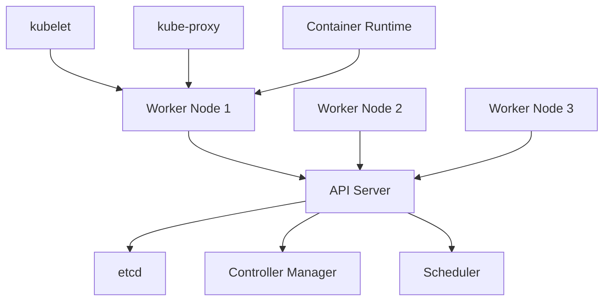
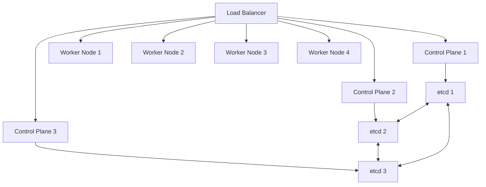
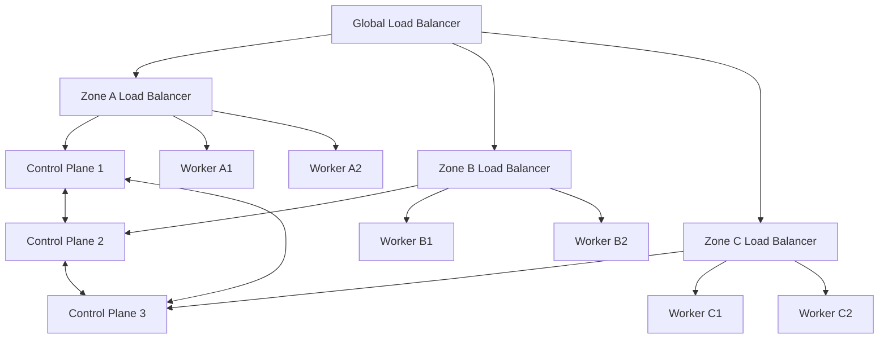

# Kubernetes High Availability

## Introduction

High Availability (HA) is a critical concept in production Kubernetes environments. It refers to the ability of a system to continue operating without interruption when one or more of its components fail. In the context of Kubernetes, high availability means ensuring that your cluster remains operational even if some nodes, control plane components, or other parts of the infrastructure experience failures.

This guide will walk you through the key concepts, architecture patterns, and implementation steps to create highly available Kubernetes clusters that can withstand various types of failures while maintaining your applications' uptime.

## Why High Availability Matters

Before diving into the technical details, let's understand why high availability is essential:

- **Minimize Downtime**: Ensures your applications remain accessible even during infrastructure failures
- **Business Continuity**: Prevents service interruptions that could impact users or revenue
- **SLA Compliance**: Helps meet service level agreements that specify uptime requirements
- **Disaster Recovery**: Provides resilience against various failure scenarios from hardware issues to zone outages

## Understanding Kubernetes Cluster Architecture

To implement high availability, we first need to understand the standard Kubernetes architecture:



In a basic setup, you have:

- **Control Plane (Master) Components**:
  - API Server: The entry point for all REST commands
  - etcd: The cluster's database that stores all cluster state
  - Controller Manager: Runs controller processes
  - Scheduler: Assigns workloads to nodes

- **Worker Nodes**:
  - kubelet: Ensures containers are running in a Pod
  - kube-proxy: Maintains network rules
  - Container Runtime: Software that runs containers (e.g., containerd)

A non-HA Kubernetes cluster typically has a single control plane node, which creates a single point of failure.

## High Availability Architecture

A highly available Kubernetes cluster has the following key characteristics:

1. **Multiple Control Plane Nodes**: At least three control plane nodes to provide redundancy
2. **Distributed etcd**: Either stacked with control plane or external as a separate cluster
3. **Load Balancer**: Distributes traffic across the API servers
4. **Multiple Worker Nodes**: Distributed across failure domains

Here's what a typical HA architecture looks like:



## HA Control Plane Components

### API Server HA

The Kubernetes API server is stateless and can run in an active-active configuration:

- Multiple instances can run simultaneously
- Traffic is distributed via a load balancer
- Requires a unique binding address for each instance

Example configuration in a kubeadm init file:

```yaml
apiVersion: kubeadm.k8s.io/v1beta3
kind: ClusterConfiguration
kubernetesVersion: v1.26.0
controlPlaneEndpoint: "kube-api-lb.example.com:6443"
apiServer:
  extraArgs:
    advertise-address: 0.0.0.0
```

### etcd High Availability

etcd is the most critical component for HA as it stores all cluster state. It uses the Raft consensus algorithm and requires an odd number of nodes (typically 3, 5, or 7) to maintain quorum.

There are two deployment options:

1. **Stacked etcd** (easier): etcd runs on the same nodes as other control plane components
2. **External etcd** (more robust): etcd runs on dedicated nodes

#### Stacked etcd Configuration Example

```yaml
apiVersion: kubeadm.k8s.io/v1beta3
kind: ClusterConfiguration
etcd:
  local:
    dataDir: "/var/lib/etcd"
    extraArgs:
      initial-cluster: "cp1=https://10.0.1.1:2380,cp2=https://10.0.1.2:2380,cp3=https://10.0.1.3:2380"
      initial-cluster-state: new
      name: "cp1"
      listen-peer-urls: "https://10.0.1.1:2380"
      listen-client-urls: "https://10.0.1.1:2379,https://127.0.0.1:2379"
      advertise-client-urls: "https://10.0.1.1:2379"
      initial-advertise-peer-urls: "https://10.0.1.1:2380"
```

### Controller Manager and Scheduler HA

These components run in an active-passive configuration:

- Multiple instances run simultaneously, but only one is active (leader)
- Leadership is determined through a leader election process
- No load balancer needed as they only communicate with the API server

## Implementing HA with kubeadm

Let's go through a step-by-step guide to create an HA cluster using kubeadm, which is the most common approach for beginners:

### Prerequisites

- At least 3 machines for control plane nodes
- At least 2 machines for worker nodes
- A load balancer (can be hardware or software like HAProxy/Nginx)
- Proper network connectivity between all nodes

### Step 1: Set Up the Load Balancer

Here's a simple example using HAProxy:

```
frontend kubernetes-frontend
    bind *:6443
    mode tcp
    option tcplog
    default_backend kubernetes-backend

backend kubernetes-backend
    mode tcp
    option tcp-check
    balance roundrobin
    server cp1 10.0.1.1:6443 check fall 3 rise 2
    server cp2 10.0.1.2:6443 check fall 3 rise 2
    server cp3 10.0.1.3:6443 check fall 3 rise 2
```

### Step 2: Initialize the First Control Plane Node

Create a configuration file called `kubeadm-config.yaml`:

```yaml
apiVersion: kubeadm.k8s.io/v1beta3
kind: ClusterConfiguration
kubernetesVersion: v1.26.0
controlPlaneEndpoint: "kube-lb.example.com:6443"
networking:
  podSubnet: 192.168.0.0/16
```

Initialize the first control plane:

```bash
sudo kubeadm init --config=kubeadm-config.yaml --upload-certs
```

The output will include a command to join additional control plane nodes and worker nodes.

### Step 3: Set Up kubectl on the First Control Plane

```bash
mkdir -p $HOME/.kube
sudo cp -i /etc/kubernetes/admin.conf $HOME/.kube/config
sudo chown $(id -u):$(id -g) $HOME/.kube/config
```

### Step 4: Install a Pod Network Add-on

For example, Calico:

```bash
kubectl apply -f https://docs.projectcalico.org/manifests/calico.yaml
```

### Step 5: Join Additional Control Plane Nodes

Use the command from the output of the `kubeadm init` command:

```bash
sudo kubeadm join kube-lb.example.com:6443 \
  --token <token> \
  --discovery-token-ca-cert-hash sha256:<hash> \
  --control-plane \
  --certificate-key <cert-key>
```

### Step 6: Join Worker Nodes

```bash
sudo kubeadm join kube-lb.example.com:6443 \
  --token <token> \
  --discovery-token-ca-cert-hash sha256:<hash>
```

### Step 7: Verify Your HA Setup

Check the status of your nodes:

```bash
kubectl get nodes
```

Output example:

```
NAME    STATUS   ROLES           AGE     VERSION
cp1     Ready    control-plane   10m     v1.26.0
cp2     Ready    control-plane   8m      v1.26.0
cp3     Ready    control-plane   6m      v1.26.0
node1   Ready    <none>          4m      v1.26.0
node2   Ready    <none>          3m      v1.26.0
```

## etcd Backup and Recovery

An essential part of high availability is having a backup and recovery plan for etcd.

### Backing Up etcd

```bash
ETCDCTL_API=3 etcdctl --endpoints=https://127.0.0.1:2379 \
  --cacert=/etc/kubernetes/pki/etcd/ca.crt \
  --cert=/etc/kubernetes/pki/etcd/server.crt \
  --key=/etc/kubernetes/pki/etcd/server.key \
  snapshot save /backup/etcd-snapshot-$(date +%Y-%m-%d-%H-%M-%S).db
```

### Restoring etcd from Backup

```bash
# Stop the kubelet and etcd container
sudo systemctl stop kubelet
sudo docker stop etcd

# Restore the snapshot
ETCDCTL_API=3 etcdctl --endpoints=https://127.0.0.1:2379 \
  --cacert=/etc/kubernetes/pki/etcd/ca.crt \
  --cert=/etc/kubernetes/pki/etcd/server.crt \
  --key=/etc/kubernetes/pki/etcd/server.key \
  --data-dir=/var/lib/etcd-backup \
  --initial-cluster="cp1=https://10.0.1.1:2380,cp2=https://10.0.1.2:2380,cp3=https://10.0.1.3:2380" \
  --initial-cluster-token="etcd-cluster-1" \
  --initial-advertise-peer-urls="https://10.0.1.1:2380" \
  snapshot restore /backup/etcd-snapshot.db

# Update configuration and restart services
sudo mv /var/lib/etcd /var/lib/etcd.old
sudo mv /var/lib/etcd-backup /var/lib/etcd
sudo systemctl start kubelet
```

## Best Practices for Kubernetes HA

1. **Use Odd Number of Control Plane Nodes**: Always use 3, 5, or 7 control plane nodes to maintain proper quorum
2. **Distribute Across Failure Domains**: Spread nodes across availability zones
3. **Network Redundancy**: Implement redundant network paths
4. **Regular Backups**: Schedule automated etcd backups
5. **Monitoring and Alerting**: Implement monitoring for all HA components
6. **Automated Recovery**: Use tools like Cluster API for self-healing capabilities
7. **Practice DR Scenarios**: Regularly test failure scenarios

## Practical Example: Testing Failure Scenarios

Let's simulate a control plane node failure to see high availability in action:

1. Check the current status:

```bash
kubectl get nodes
kubectl get pods -n kube-system
```

2. Simulate a control plane failure (do this in a test environment):

```bash
# On one of the control plane nodes
sudo systemctl stop kubelet
sudo systemctl stop docker
```

3. Verify the cluster remains functional:

```bash
kubectl get nodes
kubectl create deployment nginx --image=nginx --replicas=3
kubectl get pods
```

You should observe:
- The failed node shows as NotReady
- The leader election selects a new active controller and scheduler
- New deployments continue to work

## Advanced HA Configurations

### Multi-Zone and Multi-Region Clusters

For enhanced availability, you can distribute your cluster across multiple availability zones or even regions:



### Using External etcd Clusters

For maximum resilience, separate etcd from your control plane:

```yaml
apiVersion: kubeadm.k8s.io/v1beta3
kind: ClusterConfiguration
etcd:
  external:
    endpoints:
    - https://10.0.1.10:2379
    - https://10.0.1.11:2379
    - https://10.0.1.12:2379
    caFile: /etc/kubernetes/pki/etcd/ca.crt
    certFile: /etc/kubernetes/pki/apiserver-etcd-client.crt
    keyFile: /etc/kubernetes/pki/apiserver-etcd-client.key
```

## Summary

Kubernetes High Availability is essential for production deployments where uptime is critical. By implementing redundant control plane nodes, distributed etcd storage, proper load balancing, and following best practices, you can create resilient clusters that continue operating even when components fail.

Remember these key points:
- HA requires at least 3 control plane nodes
- etcd quorum is critical for cluster health
- Load balancing the API server is necessary
- Regular backups and testing are essential
- Distributing components across failure domains enhances reliability

## Additional Resources

- [Kubernetes Documentation: High Availability](https://kubernetes.io/docs/setup/production-environment/tools/kubeadm/high-availability/)
- [etcd Documentation](https://etcd.io/docs/)
- [Kubernetes the Hard Way](https://github.com/kelseyhightower/kubernetes-the-hard-way)

## Practice Exercises

1. Set up a 3-node HA Kubernetes cluster using kubeadm in a test environment
2. Create and restore an etcd backup
3. Simulate different failure scenarios (control plane node failure, network partition)
4. Design a multi-zone HA architecture for a production environment
5. Implement automated etcd backups using cron jobs