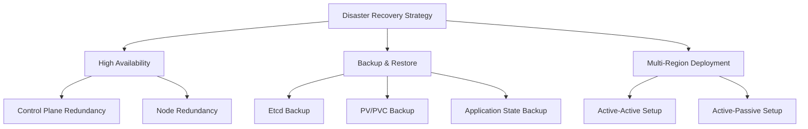
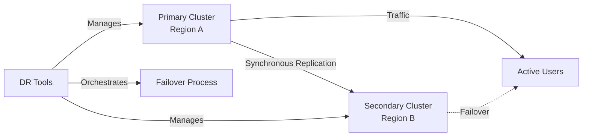

# Kubernetes Disaster Recovery

## Introduction

Disaster recovery (DR) is a critical aspect of Kubernetes administration that ensures business continuity when unexpected events occur. In the context of Kubernetes, disasters can range from accidental deletion of resources to complete cluster failures, network partitions, or even data center outages.

This guide will walk you through the fundamentals of Kubernetes disaster recovery, key strategies, implementation techniques, and best practices to help you prepare for and recover from various failure scenarios.

## Why Disaster Recovery Matters in Kubernetes

Even with Kubernetes' built-in resiliency features, clusters remain vulnerable to various risks:

- Human errors (accidental `kubectl delete` commands)
- Infrastructure failures
- Application bugs or misconfigurations
- Security breaches
- Natural disasters affecting data centers

A well-designed disaster recovery plan minimizes downtime, prevents data loss, and ensures that your applications remain available to users even when things go wrong.

## Key Concepts in Kubernetes Disaster Recovery

### Recovery Time Objective (RTO)

RTO represents the maximum acceptable time required to restore normal operations after a disaster. In Kubernetes terms, this measures how quickly you can rebuild your cluster and redeploy your applications.

### Recovery Point Objective (RPO)

RPO indicates the maximum amount of data loss acceptable measured in time. For example, an RPO of 1 hour means your system can lose up to 1 hour of data during recovery.

### High Availability vs. Disaster Recovery

While related, these concepts serve different purposes:

- **High Availability (HA)**: Focuses on minimizing downtime through redundancy within a single location.
- **Disaster Recovery (DR)**: Focuses on recovering from catastrophic failures, often involving multiple locations.



## Backup Strategies for Kubernetes

### 1. Etcd Backup

The etcd database stores all Kubernetes cluster state. Backing it up regularly is essential.

```bash
# Create an etcd snapshot
ETCDCTL_API=3 etcdctl --endpoints=https://127.0.0.1:2379 \
  --cacert=/etc/kubernetes/pki/etcd/ca.crt \
  --cert=/etc/kubernetes/pki/etcd/server.crt \
  --key=/etc/kubernetes/pki/etcd/server.key \
  snapshot save /backup/etcd-snapshot-$(date +%Y-%m-%d-%H-%M-%S).db
```

The output will look something like:

```
Snapshot saved at /backup/etcd-snapshot-2023-09-25-10-30-45.db
```

### 2. Kubernetes Resource Backups

Use tools to back up Kubernetes API objects.

```bash
# Using kubectl to export all resources in a namespace
kubectl get all -n my-application -o yaml > my-application-backup.yaml
```

### 3. Persistent Volume Backups

For stateful applications, backing up persistent volumes is crucial.

#### Using Velero for Backups

[Velero](https://velero.io) is a popular open-source tool for backing up and restoring Kubernetes clusters.

```bash
# Install Velero CLI
brew install velero # MacOS
# or
curl -L -o velero.tar.gz https://github.com/vmware-tanzu/velero/releases/download/v1.11.0/velero-v1.11.0-linux-amd64.tar.gz
tar -xvf velero.tar.gz
sudo mv velero-v1.11.0-linux-amd64/velero /usr/local/bin/

# Create a backup using Velero
velero backup create my-app-backup --include-namespaces my-application
```

Output:

```
Backup request "my-app-backup" submitted successfully.
Run `velero backup describe my-app-backup` or `velero backup logs my-app-backup` for more details.
```

## Restore Strategies

### 1. Restoring Etcd

```bash
# Stop the API server
sudo systemctl stop kube-apiserver

# Restore from snapshot
ETCDCTL_API=3 etcdctl --endpoints=https://127.0.0.1:2379 \
  --cacert=/etc/kubernetes/pki/etcd/ca.crt \
  --cert=/etc/kubernetes/pki/etcd/server.crt \
  --key=/etc/kubernetes/pki/etcd/server.key \
  snapshot restore /backup/etcd-snapshot-2023-09-25-10-30-45.db \
  --data-dir=/var/lib/etcd-restored

# Update etcd to use the restored data directory
# Edit /etc/kubernetes/manifests/etcd.yaml to point to the new directory

# Restart the API server
sudo systemctl start kube-apiserver
```

### 2. Restoring Kubernetes Resources

```bash
# Apply the backed-up resources
kubectl apply -f my-application-backup.yaml
```

### 3. Restoring with Velero

```bash
# List available backups
velero backup get

# Restore from a specific backup
velero restore create --from-backup my-app-backup
```

Output:

```
Restore request "my-app-backup-20230925104523" submitted successfully.
Run `velero restore describe my-app-backup-20230925104523` or `velero restore logs my-app-backup-20230925104523` for more details.
```

## Implementing Disaster Recovery for Different Components

### Control Plane DR

The Kubernetes control plane consists of the API server, scheduler, controller manager, and etcd. For effective DR:

1. Use a multi-master setup with at least 3 control plane nodes
2. Configure etcd as a cluster with at least 3 nodes
3. Implement regular etcd backups
4. Consider using managed Kubernetes services which handle control plane DR for you

### Worker Node DR

Worker nodes run your application workloads. For effective DR:

1. Spread nodes across availability zones
2. Use node auto-scaling groups
3. Implement proper node monitoring and auto-healing
4. Use taints and tolerations to control workload placement

### Application Data DR

For stateful applications, data recovery is crucial:

1. Use a reliable storage class with replication features
2. Implement application-level backups (database dumps, etc.)
3. Consider using StatefulSets with persistent volumes
4. Set up cross-region replication for critical data

## Building a Comprehensive DR Plan

### 1. Risk Assessment

Start by identifying potential failure scenarios specific to your environment:

- Node failures
- Network partitions
- Data corruption
- Region/zone outages
- Accidental deletions
- Security incidents

### 2. DR Policy Creation

Document your DR policies:

```yaml
# Example DR policy in structured format
DR_Policy:
  # Define the maximum acceptable downtime
  RTO: "4 hours"
  
  # Define the maximum acceptable data loss
  RPO: "15 minutes"
  
  # Backup frequency
  BackupSchedule:
    etcd: "Every 6 hours"
    applicationData: "Every hour"
    kubernetesResources: "Every 12 hours"
  
  # Retention policy
  RetentionPolicy:
    daily: "7 days"
    weekly: "4 weeks"
    monthly: "6 months"
```

### 3. Implement Automation

Create automated backup workflows using tools like:

- Velero for Kubernetes resource backups
- Cronjobs for etcd backups
- CI/CD pipelines for application-specific backups

Example of a CronJob for automated etcd backups:

```yaml
apiVersion: batch/v1
kind: CronJob
metadata:
  name: etcd-backup
  namespace: kube-system
spec:
  schedule: "0 */6 * * *"  # Every 6 hours
  jobTemplate:
    spec:
      template:
        spec:
          serviceAccountName: etcd-backup
          containers:
          - name: etcd-backup
            image: k8s.gcr.io/etcd:3.5.1-0
            command:
            - /bin/sh
            - -c
            - |
              ETCDCTL_API=3 etcdctl --endpoints=https://127.0.0.1:2379 \
                --cacert=/etc/kubernetes/pki/etcd/ca.crt \
                --cert=/etc/kubernetes/pki/etcd/server.crt \
                --key=/etc/kubernetes/pki/etcd/server.key \
                snapshot save /backup/etcd-snapshot-$(date +%Y-%m-%d-%H-%M-%S).db
            volumeMounts:
            - name: etcd-certs
              mountPath: /etc/kubernetes/pki/etcd
              readOnly: true
            - name: backup
              mountPath: /backup
          restartPolicy: OnFailure
          volumes:
          - name: etcd-certs
            hostPath:
              path: /etc/kubernetes/pki/etcd
              type: Directory
          - name: backup
            persistentVolumeClaim:
              claimName: etcd-backup-pvc
```

### 4. Testing Your DR Plan

Regularly test your disaster recovery procedures:

1. **Tabletop exercises**: Discuss recovery scenarios with your team
2. **Limited scope tests**: Restore specific components in a test environment
3. **Full DR drills**: Simulate major outages and execute full recovery procedures

## Real-World DR Scenarios and Solutions

### Scenario 1: Accidental Namespace Deletion

A team member accidentally runs `kubectl delete namespace production`.

**Recovery steps:**

1. Immediately attempt to recreate critical resources from CI/CD pipelines
2. Restore the namespace from the latest Velero backup:

```bash
velero restore create --from-backup hourly-backup-$(date +%Y%m%d) --include-namespaces production
```

### Scenario 2: Etcd Data Corruption

The etcd database becomes corrupted, causing the API server to malfunction.

**Recovery steps:**

1. Identify the issue through logs:

```bash
kubectl logs -n kube-system etcd-master-1
```

2. Stop the API server
3. Restore etcd from the latest snapshot
4. Restart the API server

### Scenario 3: Complete Cluster Failure

A major infrastructure issue causes the entire cluster to fail.

**Recovery steps:**

1. Provision a new Kubernetes cluster
2. Restore etcd data
3. Use Velero to restore all namespaces:

```bash
velero restore create --from-backup full-cluster-backup
```

4. Verify application functionality

## Best Practices for Kubernetes DR

1. **Adopt GitOps**: Store all Kubernetes configurations in Git
2. **Use Infrastructure as Code**: Terraform, CloudFormation, etc.
3. **Implement proper monitoring**: Detect issues before they become disasters
4. **Regular backup testing**: Ensure backups can actually be restored
5. **Documentation**: Keep DR procedures well-documented and accessible
6. **Automation**: Automate as much of the DR process as possible
7. **Multi-region strategy**: Consider geographic redundancy for critical workloads
8. **Immutable infrastructure**: Rebuild rather than repair when possible

## Advanced DR Topics

### Multi-Cluster DR Strategy

For critical workloads, consider maintaining multiple Kubernetes clusters:



### Stateful Application Considerations

Stateful applications require special consideration:

1. **Databases**: Use database-specific replication and backup tools
2. **Shared file systems**: Consider solutions like Rook/Ceph with replication
3. **Message queues**: Ensure proper persistence and replication

## Summary

Kubernetes disaster recovery is a critical aspect of maintaining reliable applications. By implementing a comprehensive DR strategy, you can minimize downtime and data loss when inevitable failures occur.

Key takeaways:
- Regularly back up etcd and application state
- Define clear RTO and RPO objectives
- Test your DR procedures frequently
- Automate recovery processes
- Document everything

## Additional Resources

- [Kubernetes Documentation on Backing Up an etcd Cluster](https://kubernetes.io/docs/tasks/administer-cluster/configure-upgrade-etcd/#backing-up-an-etcd-cluster)
- [Velero Documentation](https://velero.io/docs/)
- [CNCF Kubernetes Disaster Recovery Working Group](https://github.com/cncf/tag-app-delivery)

## Exercises

1. Set up a test Kubernetes cluster and practice backing up and restoring etcd
2. Install Velero and configure it to back up a namespace to a storage provider
3. Create a DR plan template for your organization's Kubernetes workloads
4. Conduct a tabletop DR exercise with your team
5. Implement a CronJob for automated etcd backups in your cluster