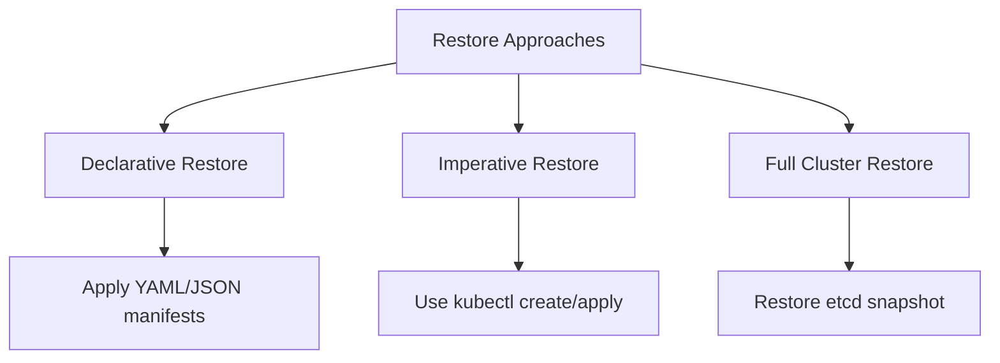

# Kubernetes Restore

## Introduction

Restoring Kubernetes resources is a critical skill for any Kubernetes administrator. No matter how stable your cluster is, you'll eventually face situations where you need to recover from data loss, configuration errors, or cluster failures. This guide will walk you through the concepts, tools, and techniques for effectively restoring Kubernetes resources from backups.

## Understanding Kubernetes Restore

Kubernetes restore is the process of recreating resources and applications in a Kubernetes cluster using previously saved backup data. A proper restore strategy is essential for:

- Recovering from accidental deletions
- Migrating to new clusters
- Rollback after failed upgrades
- Disaster recovery scenarios
- Meeting compliance and business continuity requirements

## Prerequisites

Before diving into restore operations, make sure you have:

- Access to your Kubernetes cluster with appropriate permissions
- Previously created backups of your resources
- Knowledge of your cluster's configuration
- Backup/restore tools installed (we'll cover several options)

## Basic Restore Concepts

### What Can Be Restored?

In Kubernetes, you can restore:

1. **Cluster state** - API objects like deployments, services, and configmaps
2. **Application data** - Persistent volumes and their contents
3. **Etcd data** - The underlying database storing all cluster information
4. **Custom resources** - CRDs and their instances

### Restore Approaches



## Restoring Individual Resources

The simplest form of restore is recreating individual resources from stored manifests.

### Using kubectl apply

If you've saved your resource definitions as YAML or JSON files, you can restore them using `kubectl apply`:

```bash
# Restore a single resource
kubectl apply -f deployment-backup.yaml

# Restore multiple resources
kubectl apply -f backup-directory/

# Restore an entire namespace
kubectl apply -f namespace-backup/ -n my-namespace
```

Example output:
```
deployment.apps/nginx-deployment created
service/nginx-service created
configmap/nginx-config created
```

### Restoring from etcd Snapshots

For more critical scenarios, you might need to restore the entire etcd database:

```bash
# Stop the API server
sudo systemctl stop kube-apiserver

# Restore etcd from snapshot
ETCDCTL_API=3 etcdctl snapshot restore snapshot.db \
  --data-dir=/var/lib/etcd-restore \
  --initial-cluster="master-1=https://192.168.1.10:2380" \
  --initial-cluster-token="etcd-cluster" \
  --initial-advertise-peer-urls="https://192.168.1.10:2380"

# Update etcd configuration to use restored data
sudo mv /var/lib/etcd /var/lib/etcd.old
sudo mv /var/lib/etcd-restore /var/lib/etcd

# Restart etcd and API server
sudo systemctl restart etcd
sudo systemctl start kube-apiserver
```

## Using Specialized Backup/Restore Tools

Several tools exist specifically for Kubernetes backup and restore operations.

### Velero

[Velero](https://velero.io) is one of the most popular Kubernetes backup/restore tools.

#### Installing Velero
```bash
# Install the client
brew install velero  # macOS
# OR
wget https://github.com/vmware-tanzu/velero/releases/download/v1.11.0/velero-v1.11.0-linux-amd64.tar.gz  # Linux

# Install Velero in your cluster (AWS example)
velero install \
  --provider aws \
  --plugins velero/velero-plugin-for-aws:v1.6.0 \
  --bucket velero-backups \
  --backup-location-config region=us-east-1 \
  --secret-file ./credentials-velero
```

#### Restoring with Velero

```bash
# List available backups
velero backup get

# Restore an entire backup
velero restore create --from-backup my-backup

# Restore specific resources
velero restore create --from-backup my-backup --include-resources deployments,services

# Restore to a different namespace
velero restore create --from-backup my-backup --namespace-mappings source-ns:destination-ns
```

Example output:
```
Restore request "my-backup-20230615133021" submitted successfully.
Run `velero restore describe my-backup-20230615133021` or `velero restore logs my-backup-20230615133021` for more details.
```

You can check the status of your restore:

```bash
velero restore get
```

Output:
```
NAME                          BACKUP        STATUS      STARTED                         COMPLETED                       ERRORS   WARNINGS   CREATED                         SELECTOR
my-backup-20230615133021      my-backup     Completed   2023-06-15 13:30:21 +0000 UTC   2023-06-15 13:32:38 +0000 UTC   0        2          2023-06-15 13:30:21 +0000 UTC   <none>
```

### Kasten K10

Kasten K10 is an enterprise-focused backup and restore solution with a user-friendly dashboard.

```bash
# Install Kasten K10
helm repo add kasten https://charts.kasten.io/
helm repo update
helm install k10 kasten/k10 --namespace=kasten-io --create-namespace
```

Restore operations can be performed through the K10 dashboard or via CLI:

```bash
# Create a restore action
kubectl create -f restore-action.yaml

# Example restore-action.yaml
apiVersion: actions.kio.kasten.io/v1alpha1
kind: Restore
metadata:
  name: restore-mysql-app
spec:
  restorePoint:
    backupID: gw3rgbdl
    restorePointID: jx3rgbsq
  options:
    applicationBackupName: "mysql-backup"
```

## Stateful Application Restore

Restoring stateful applications requires extra attention to persistent volumes.

### Example: Restoring a PostgreSQL Database

1. First, create a restore for the PVC using Velero:

```bash
velero restore create --from-backup postgres-backup \
  --include-resources persistentvolumeclaims,persistentvolumes
```

2. Then deploy the PostgreSQL application pointing to the restored volume:

```yaml
apiVersion: apps/v1
kind: StatefulSet
metadata:
  name: postgres
spec:
  serviceName: "postgres"
  replicas: 1
  selector:
    matchLabels:
      app: postgres
  template:
    metadata:
      labels:
        app: postgres
    spec:
      containers:
      - name: postgres
        image: postgres:14
        volumeMounts:
        - name: postgres-data
          mountPath: /var/lib/postgresql/data
        env:
        - name: POSTGRES_PASSWORD
          valueFrom:
            secretKeyRef:
              name: postgres-secret
              key: password
  volumeClaimTemplates:
  - metadata:
      name: postgres-data
    spec:
      accessModes: [ "ReadWriteOnce" ]
      resources:
        requests:
          storage: 10Gi
```

3. Verify the restore:

```bash
kubectl exec -it postgres-0 -- psql -U postgres -c "\l"
```

## Best Practices for Kubernetes Restore

1. **Test your restores regularly**
   - Don't wait for a disaster to find out if your restore process works
   - Schedule regular restore drills to validate procedures

2. **Document restore procedures**
   - Maintain clear, step-by-step instructions
   - Include both automated and manual recovery steps

3. **Use namespaces for isolation**
   - Restore to temporary namespaces to verify data before replacing production resources

4. **Consider application consistency**
   - Some applications require special handling for consistent restores
   - Database restores may need extra steps beyond volume restoration

5. **Implement restore validation**
   - Develop automated tests to verify application functionality after restore
   - Check that applications can connect to their dependencies

6. **Maintain backup/restore version compatibility**
   - Ensure your restore tools are compatible with the Kubernetes version you're restoring to
   - Test restores across different versions when upgrading clusters

## Troubleshooting Common Restore Issues

### Incomplete Restores

If resources are missing after a restore:

```bash
# Check restore status
velero restore describe my-restore

# Look for resource filtering issues
kubectl get events -n velero
```

### Permission Issues

Restores might fail due to RBAC restrictions:

```bash
# Ensure the restore service account has proper permissions
kubectl create clusterrolebinding restore-admin \
  --clusterrole=cluster-admin \
  --serviceaccount=velero:velero
```

### Volume Restore Problems

If PVs aren't properly restored:

```bash
# Check volume status
kubectl get pv,pvc

# Look for storage provider errors
kubectl describe pv <problem-pv>
```

## Real-World Restore Scenarios

### Scenario 1: Recovery After Accidental Namespace Deletion

```bash
# Restore entire namespace and its contents
velero restore create --from-backup daily-backup-20230610 \
  --include-namespaces production-api
```

### Scenario 2: Migrating Applications Between Clusters

```bash
# On source cluster
velero backup create migration-backup --include-namespaces app-namespace

# On destination cluster
velero restore create --from-backup migration-backup
```

### Scenario 3: Rollback After Failed Upgrade

```bash
# Restore the pre-upgrade state
velero restore create --from-backup pre-upgrade-backup \
  --include-resources deployments,statefulsets,configmaps,secrets \
  --namespace app-namespace
```

## Summary

Kubernetes restore operations are a critical aspect of cluster administration. By understanding the different restore approaches and tools, you can develop effective strategies for various recovery scenarios. Remember to:

- Regularly test your restore procedures
- Choose the right tool for your specific needs
- Consider both resource configuration and persistent data
- Document your processes for emergency situations

With proper planning and practice, you'll be well-prepared to handle any recovery situation in your Kubernetes environment.

## Additional Resources

- [Kubernetes Documentation on Backup and Restore](https://kubernetes.io/docs/tasks/administer-cluster/configure-upgrade-etcd/#backing-up-an-etcd-cluster)
- [Velero Documentation](https://velero.io/docs/)
- [Kasten K10 Documentation](https://docs.kasten.io/)

## Exercises

1. Set up Velero on a test cluster and perform a backup and restore of a simple application.
2. Create a disaster recovery plan for a stateful application running in Kubernetes.
3. Practice restoring a database application and verify data consistency after restore.
4. Simulate an accidental deletion of critical resources and perform a recovery.
5. Develop a script to automate the verification of a successful restore operation.