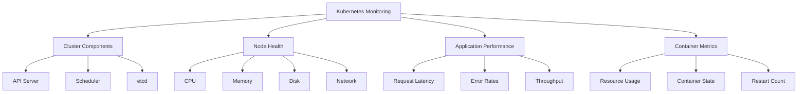

# Kubernetes Monitoring

## Introduction

Monitoring is a critical aspect of Kubernetes administration that helps ensure the health, performance, and reliability of your cluster. As Kubernetes environments grow in complexity, having robust monitoring in place becomes essential for troubleshooting issues, optimizing resource usage, and maintaining high availability.

In this guide, we'll explore the fundamentals of Kubernetes monitoring, discuss important metrics to track, and walk through setting up basic monitoring solutions. By the end, you'll have a solid understanding of how to keep an eye on your Kubernetes environment.

## Why Monitor Kubernetes?

Kubernetes orchestrates containers across multiple nodes, making traditional monitoring approaches insufficient. Here's why specialized Kubernetes monitoring is crucial:

1. **Complex Architecture** - Kubernetes consists of multiple components (API server, scheduler, controller manager, etc.) that need individual monitoring
2. **Dynamic Workloads** - Pods can be created, destroyed, and rescheduled frequently
3. **Resource Optimization** - Proper monitoring helps identify resource bottlenecks and optimization opportunities
4. **Faster Troubleshooting** - Comprehensive monitoring reduces mean time to detection (MTTD) and resolution (MTTR)

## Key Monitoring Dimensions in Kubernetes

Effective Kubernetes monitoring covers four main dimensions:



Let's explore what to monitor in each area.

## Cluster-Level Monitoring

### Control Plane Components

Monitor these key control plane components:

- **API Server**: Request rate, latency, and error rates
- **Scheduler**: Scheduling latency and errors
- **Controller Manager**: Controller reconciliation times
- **etcd**: Read/write latency, disk usage, and leader changes

For example, to check API server health using `kubectl`:

```bash
kubectl get --raw /healthz
```

Output:
```
ok
```

For more detailed metrics, you can access the metrics endpoint:

```bash
kubectl get --raw /metrics
```

This will return Prometheus-formatted metrics that look like:

```
# HELP apiserver_request_total Counter of apiserver requests broken out for each verb, dry run value, group, version, resource, scope, component, and HTTP response code.
# TYPE apiserver_request_total counter
apiserver_request_total{code="200",component="apiserver",dry_run="",group="",resource="namespaces",scope="cluster",subresource="",verb="list",version="v1"} 1234
apiserver_request_total{code="200",component="apiserver",dry_run="",group="",resource="nodes",scope="cluster",subresource="",verb="list",version="v1"} 5678
```

### Node Monitoring

For each node, track:

1. **Resource Usage**:
   - CPU utilization
   - Memory usage
   - Disk I/O and space
   - Network throughput

2. **Node Conditions**:
   - Ready
   - DiskPressure
   - MemoryPressure
   - PIDPressure
   - NetworkUnavailable

You can view node conditions with:

```bash
kubectl describe node <node-name>
```

Output:
```
Conditions:
  Type                 Status  LastHeartbeatTime                 LastTransitionTime                Reason                       Message
  ----                 ------  -----------------                 ------------------                ------                       -------
  NetworkUnavailable   False   Wed, 02 Feb 2022 15:24:12 +0000   Wed, 02 Feb 2022 15:24:12 +0000   RouteCreated                 RouteController created a route
  MemoryPressure       False   Wed, 02 Feb 2022 15:24:15 +0000   Wed, 02 Feb 2022 15:20:19 +0000   KubeletHasSufficientMemory   kubelet has sufficient memory available
  DiskPressure         False   Wed, 02 Feb 2022 15:24:15 +0000   Wed, 02 Feb 2022 15:20:19 +0000   KubeletHasNoDiskPressure     kubelet has no disk pressure
  PIDPressure          False   Wed, 02 Feb 2022 15:24:15 +0000   Wed, 02 Feb 2022 15:20:19 +0000   KubeletHasSufficientPID      kubelet has sufficient PID available
  Ready                True    Wed, 02 Feb 2022 15:24:15 +0000   Wed, 02 Feb 2022 15:20:39 +0000   KubeletReady                 kubelet is posting ready status
```

## Workload Monitoring

### Pod Metrics

For pods and containers, monitor:

1. **Resource Utilization**:
   - CPU and memory usage compared to requests and limits
   - Network I/O
   - Disk usage for persistent volumes

2. **Health Status**:
   - Pod phase (Pending, Running, Succeeded, Failed, Unknown)
   - Container restarts
   - Readiness and liveness probe results

You can check pod resource usage with:

```bash
kubectl top pods -n <namespace>
```

Output:
```
NAME                          CPU(cores)   MEMORY(bytes)
nginx-deployment-66b6c48dd5-7xzsj   1m           12Mi
nginx-deployment-66b6c48dd5-jk8xk   1m           11Mi
```

### Application-Level Metrics

Beyond Kubernetes-specific metrics, monitor application-level metrics:

- Request latency
- Error rates
- Throughput
- Business-specific metrics

These metrics usually require instrumenting your application with a monitoring library such as Prometheus client libraries.

## Setting Up Monitoring Tools

### Prometheus and Grafana

The most popular monitoring stack for Kubernetes is Prometheus and Grafana. Here's how to set them up using Helm:

1. Add the Prometheus community Helm repository:

```bash
helm repo add prometheus-community https://prometheus-community.github.io/helm-charts
helm repo update
```

2. Install the kube-prometheus-stack chart:

```bash
helm install prometheus prometheus-community/kube-prometheus-stack --namespace monitoring --create-namespace
```

3. Access Grafana (the default username is `admin` and password is `prom-operator`):

```bash
kubectl port-forward svc/prometheus-grafana 3000:80 -n monitoring
```

You can now access Grafana at `http://localhost:3000` and explore pre-configured dashboards for Kubernetes monitoring.

### Basic Prometheus Configuration

Prometheus collects metrics from targets defined in its configuration. Here's a basic configuration for monitoring Kubernetes:

```yaml
apiVersion: v1
kind: ConfigMap
metadata:
  name: prometheus-config
  namespace: monitoring
data:
  prometheus.yml: |
    global:
      scrape_interval: 15s
    
    scrape_configs:
      - job_name: 'kubernetes-apiservers'
        kubernetes_sd_configs:
        - role: endpoints
        scheme: https
        tls_config:
          ca_file: /var/run/secrets/kubernetes.io/serviceaccount/ca.crt
        bearer_token_file: /var/run/secrets/kubernetes.io/serviceaccount/token
        relabel_configs:
        - source_labels: [__meta_kubernetes_namespace, __meta_kubernetes_service_name, __meta_kubernetes_endpoint_port_name]
          action: keep
          regex: default;kubernetes;https
      
      - job_name: 'kubernetes-nodes'
        scheme: https
        tls_config:
          ca_file: /var/run/secrets/kubernetes.io/serviceaccount/ca.crt
        bearer_token_file: /var/run/secrets/kubernetes.io/serviceaccount/token
        kubernetes_sd_configs:
        - role: node
        relabel_configs:
        - action: labelmap
          regex: __meta_kubernetes_node_label_(.+)
```

## Setting Up Alerts

Alerts notify you when metrics cross predefined thresholds. Here's a basic Prometheus AlertManager configuration:

```yaml
apiVersion: v1
kind: ConfigMap
metadata:
  name: alertmanager-config
  namespace: monitoring
data:
  alertmanager.yml: |
    global:
      resolve_timeout: 5m
    
    route:
      group_by: ['alertname', 'job']
      group_wait: 30s
      group_interval: 5m
      repeat_interval: 12h
      receiver: 'webhook'
    
    receivers:
    - name: 'webhook'
      webhook_configs:
      - url: 'http://alertmanager-webhook:8080/'
```

An example alert rule for high CPU usage:

```yaml
apiVersion: monitoring.coreos.com/v1
kind: PrometheusRule
metadata:
  name: high-cpu-usage-alert
  namespace: monitoring
spec:
  groups:
  - name: node.rules
    rules:
    - alert: HighCPUUsage
      expr: 100 - (avg by(instance) (irate(node_cpu_seconds_total{mode="idle"}[5m])) * 100) > 80
      for: 5m
      labels:
        severity: warning
      annotations:
        summary: "High CPU usage detected"
        description: "CPU usage is above 80% on instance {{ $labels.instance }}"
```

## Custom Metrics with Prometheus Exporters

For metrics that aren't automatically exposed, you can use Prometheus exporters.

Example: Setting up a Node Exporter to collect system metrics:

```yaml
apiVersion: apps/v1
kind: DaemonSet
metadata:
  name: node-exporter
  namespace: monitoring
spec:
  selector:
    matchLabels:
      app: node-exporter
  template:
    metadata:
      labels:
        app: node-exporter
    spec:
      hostNetwork: true
      containers:
      - name: node-exporter
        image: prom/node-exporter:latest
        ports:
        - containerPort: 9100
          name: metrics
        volumeMounts:
        - name: proc
          mountPath: /host/proc
          readOnly: true
        - name: sys
          mountPath: /host/sys
          readOnly: true
      volumes:
      - name: proc
        hostPath:
          path: /proc
      - name: sys
        hostPath:
          path: /sys
```

## Practical Monitoring Examples

### Example 1: Detecting Pod Resource Issues

To identify pods that are reaching their resource limits, use this Prometheus query:

```
container_memory_usage_bytes / container_spec_memory_limit_bytes > 0.8
```

This helps you identify containers using more than 80% of their memory limit, which might need resource adjustments.

### Example 2: Monitoring Application Response Time

For an application instrumented with Prometheus client, you might track HTTP request duration:

```
histogram_quantile(0.95, sum(rate(http_request_duration_seconds_bucket[5m])) by (le, service))
```

This shows the 95th percentile of response times for each service over 5-minute intervals.

### Example 3: Tracking Unhealthy Pods

To monitor pods that are frequently restarting:

```
increase(kube_pod_container_status_restarts_total[1h]) > 5
```

This query identifies containers that have restarted more than 5 times in the last hour, potentially indicating application issues.

## Best Practices for Kubernetes Monitoring

1. **Start with the basics**: Focus first on node and pod-level metrics
2. **Implement the USE method**: Monitor Utilization, Saturation, and Errors for each resource
3. **Set up meaningful alerts**: Alert on symptoms that affect users, not just causes
4. **Avoid alert fatigue**: Too many alerts can lead to ignored notifications
5. **Use labels effectively**: Proper labeling helps filter and group metrics
6. **Retain metrics appropriately**: Define retention policies based on metric importance
7. **Visualize data intelligently**: Create dashboards that tell a story at a glance

## Common Monitoring Pitfalls

1. **Monitoring everything**: Focus on what matters rather than collecting every possible metric
2. **Ignoring application metrics**: System metrics alone don't tell the whole story
3. **Relying solely on threshold-based alerts**: Consider trend-based alerting for gradual degradations
4. **Not correlating metrics**: Look at relationships between metrics to find root causes
5. **Overlooking costs**: High-cardinality metrics can lead to excessive storage and compute costs

## Summary

Effective Kubernetes monitoring is essential for maintaining reliable and efficient clusters. By monitoring cluster components, nodes, pods, and application performance, you can ensure your Kubernetes environment operates smoothly and detect issues before they impact users.

We've covered:
- The importance of Kubernetes monitoring
- Key metrics to track at different levels
- How to set up Prometheus and Grafana for monitoring
- Practical examples and best practices

Remember that monitoring should evolve with your environment. Start with the basics, then expand your monitoring strategy as you identify specific needs for your applications and workloads.

## Additional Resources

- [Prometheus Documentation](https://prometheus.io/docs/introduction/overview/)
- [Grafana Kubernetes Dashboard](https://grafana.com/grafana/dashboards/315-kubernetes-cluster-monitoring-via-prometheus/)
- [Kubernetes Metric Server GitHub](https://github.com/kubernetes-sigs/metrics-server)

## Exercises

1. Set up Prometheus and Grafana on a test Kubernetes cluster
2. Create a custom dashboard in Grafana to monitor your application's key metrics
3. Configure alerts for high resource usage on your nodes
4. Implement custom metrics for an application using Prometheus client libraries
5. Explore using kube-state-metrics to get additional insights into your cluster state