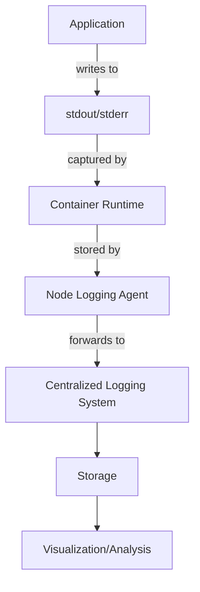
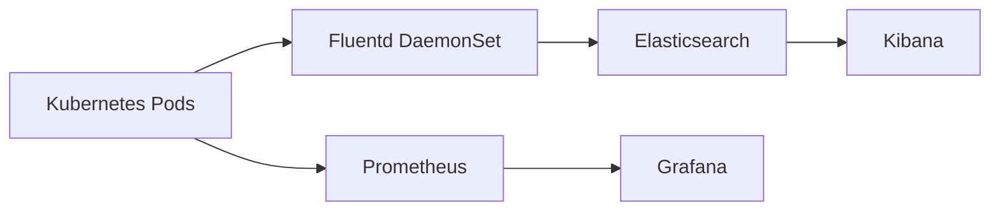

# Kubernetes Logging

## Introduction

Logging is a critical component of any production-grade Kubernetes deployment. When running distributed applications across multiple containers and nodes, having a centralized and efficient logging strategy becomes essential for troubleshooting, monitoring, and maintaining the health of your applications and infrastructure.

In this guide, we'll explore how logging works in Kubernetes, examine various logging architectures, and implement practical logging solutions that you can apply to your own Kubernetes clusters.

## Understanding Kubernetes Logging Basics

### How Logging Works in Kubernetes

In Kubernetes, logs are generated at several levels:

1. **Container logs**: Output from applications running inside containers
2. **Pod logs**: Aggregated logs from all containers in a pod
3. **Node logs**: System-level logs from the Kubernetes nodes
4. **Cluster-level logs**: Logs from the Kubernetes control plane components

By default, Kubernetes captures the standard output (`stdout`) and standard error (`stderr`) streams from containers. This follows the containerization best practice of treating logs as streams rather than files.

Let's look at how logs flow through a Kubernetes environment:



## Accessing Container Logs

The simplest way to access logs is using the `kubectl logs` command.

### Basic Log Access

```bash
# View logs for a specific pod
kubectl logs my-pod-name

# View logs for a specific container in a multi-container pod
kubectl logs my-pod-name -c my-container-name

# Stream logs in real-time
kubectl logs -f my-pod-name

# Show only the most recent 20 lines
kubectl logs --tail=20 my-pod-name

# Show logs from the previous instance of the container
kubectl logs --previous my-pod-name
```

### Example: Viewing Application Logs

Let's imagine we have a simple web application deployed as a pod named `web-app`:

```bash
# Deploy a sample web application
kubectl create deployment web-app --image=nginx
```

Once the pod is running, we can view its logs:

```bash
# Get the pod name
kubectl get pods -l app=web-app

# Output example:
# NAME                      READY   STATUS    RESTARTS   AGE
# web-app-7b9b4f45cb-x2v4r  1/1     Running   0          35s

# View the logs
kubectl logs web-app-7b9b4f45cb-x2v4r
```

Output example:
```
10.244.0.1 - - [09/Mar/2023:10:23:45 +0000] "GET / HTTP/1.1" 200 615 "-" "Mozilla/5.0 (Windows NT 10.0; Win64; x64) Chrome/90.0.4430.212 Safari/537.36" "-"
10.244.0.1 - - [09/Mar/2023:10:23:46 +0000] "GET /favicon.ico HTTP/1.1" 404 555 "http://localhost:8080/" "Mozilla/5.0 (Windows NT 10.0; Win64; x64) Chrome/90.0.4430.212 Safari/537.36" "-"
```

## Logging Architectures in Kubernetes

There are several approaches to collecting and managing logs in Kubernetes:

### 1. Node-level Logging

In this approach, logs are collected directly from the nodes.

```yaml
# Example configuration for a pod using a node-level logging setup
apiVersion: v1
kind: Pod
metadata:
  name: counter
spec:
  containers:
  - name: count
    image: busybox
    args:
    - /bin/sh
    - -c
    - >
      i=0;
      while true;
      do
        echo "$i: $(date)" >> /var/log/counter.log;
        i=$((i+1));
        sleep 1;
      done
    volumeMounts:
    - name: varlog
      mountPath: /var/log
  volumes:
  - name: varlog
    hostPath:
      path: /var/log
```

### 2. Sidecar Container Logging

This pattern uses a second container in the same pod to handle logs.

```yaml
# Example of a pod with a sidecar logging container
apiVersion: v1
kind: Pod
metadata:
  name: counter-with-sidecar
spec:
  containers:
  - name: count
    image: busybox
    args:
    - /bin/sh
    - -c
    - >
      i=0;
      while true;
      do
        echo "$i: $(date)" >> /var/log/count.log;
        i=$((i+1));
        sleep 1;
      done
    volumeMounts:
    - name: varlog
      mountPath: /var/log
  - name: log-sidecar
    image: busybox
    args: [/bin/sh, -c, 'tail -f /var/log/count.log']
    volumeMounts:
    - name: varlog
      mountPath: /var/log
  volumes:
  - name: varlog
    emptyDir: {}
```

### 3. Centralized Logging with the EFK/ELK Stack

A popular approach is to use the Elasticsearch, Fluentd/Fluent Bit, and Kibana (EFK) or Elasticsearch, Logstash, and Kibana (ELK) stack:



## Implementing a Logging Solution

Let's implement a basic EFK stack for centralized logging in Kubernetes.

### Step 1: Deploy Elasticsearch

```yaml
# elasticsearch.yaml
apiVersion: apps/v1
kind: StatefulSet
metadata:
  name: elasticsearch
  namespace: logging
spec:
  serviceName: elasticsearch
  replicas: 1
  selector:
    matchLabels:
      app: elasticsearch
  template:
    metadata:
      labels:
        app: elasticsearch
    spec:
      containers:
      - name: elasticsearch
        image: docker.elastic.co/elasticsearch/elasticsearch:7.17.0
        env:
        - name: discovery.type
          value: single-node
        ports:
        - containerPort: 9200
          name: http
        - containerPort: 9300
          name: transport
        volumeMounts:
        - name: data
          mountPath: /usr/share/elasticsearch/data
      volumes:
      - name: data
        emptyDir: {}
---
apiVersion: v1
kind: Service
metadata:
  name: elasticsearch
  namespace: logging
spec:
  selector:
    app: elasticsearch
  ports:
  - port: 9200
    name: http
  - port: 9300
    name: transport
```

### Step 2: Deploy Fluent Bit as a DaemonSet

```yaml
# fluent-bit.yaml
apiVersion: apps/v1
kind: DaemonSet
metadata:
  name: fluent-bit
  namespace: logging
spec:
  selector:
    matchLabels:
      app: fluent-bit
  template:
    metadata:
      labels:
        app: fluent-bit
    spec:
      containers:
      - name: fluent-bit
        image: fluent/fluent-bit:1.9.0
        volumeMounts:
        - name: varlog
          mountPath: /var/log
        - name: varlibdockercontainers
          mountPath: /var/lib/docker/containers
          readOnly: true
        - name: fluent-bit-config
          mountPath: /fluent-bit/etc/
      volumes:
      - name: varlog
        hostPath:
          path: /var/log
      - name: varlibdockercontainers
        hostPath:
          path: /var/lib/docker/containers
      - name: fluent-bit-config
        configMap:
          name: fluent-bit-config
```

### Step 3: Configure Fluent Bit

```yaml
# fluent-bit-configmap.yaml
apiVersion: v1
kind: ConfigMap
metadata:
  name: fluent-bit-config
  namespace: logging
data:
  fluent-bit.conf: |
    [SERVICE]
        Flush         1
        Log_Level     info
        Daemon        off
        Parsers_File  parsers.conf

    [INPUT]
        Name              tail
        Tag               kube.*
        Path              /var/log/containers/*.log
        Parser            docker
        DB                /var/log/flb_kube.db
        Mem_Buf_Limit     5MB
        Skip_Long_Lines   On
        Refresh_Interval  10

    [FILTER]
        Name                kubernetes
        Match               kube.*
        Kube_URL            https://kubernetes.default.svc:443
        Kube_CA_File        /var/run/secrets/kubernetes.io/serviceaccount/ca.crt
        Kube_Token_File     /var/run/secrets/kubernetes.io/serviceaccount/token
        Merge_Log           On
        K8S-Logging.Parser  On
        K8S-Logging.Exclude Off

    [OUTPUT]
        Name            es
        Match           *
        Host            elasticsearch
        Port            9200
        Logstash_Format On
        Logstash_Prefix kubernetes
        Retry_Limit     False

  parsers.conf: |
    [PARSER]
        Name        docker
        Format      json
        Time_Key    time
        Time_Format %Y-%m-%dT%H:%M:%S.%L
        Time_Keep   On
```

### Step 4: Deploy Kibana

```yaml
# kibana.yaml
apiVersion: apps/v1
kind: Deployment
metadata:
  name: kibana
  namespace: logging
spec:
  replicas: 1
  selector:
    matchLabels:
      app: kibana
  template:
    metadata:
      labels:
        app: kibana
    spec:
      containers:
      - name: kibana
        image: docker.elastic.co/kibana/kibana:7.17.0
        env:
        - name: ELASTICSEARCH_HOSTS
          value: http://elasticsearch:9200
        ports:
        - containerPort: 5601
---
apiVersion: v1
kind: Service
metadata:
  name: kibana
  namespace: logging
spec:
  selector:
    app: kibana
  ports:
  - port: 5601
  type: NodePort
```

### Step 5: Apply the Configuration

```bash
# Create the logging namespace
kubectl create namespace logging

# Apply all configurations
kubectl apply -f elasticsearch.yaml
kubectl apply -f fluent-bit-configmap.yaml
kubectl apply -f fluent-bit.yaml
kubectl apply -f kibana.yaml
```

## Best Practices for Kubernetes Logging

1. **Structured Logging**: Use JSON or another structured format for logs to make them easier to parse and query.

   ```javascript
   // Example of structured logging in Node.js
   logger.info({
     message: 'User logged in',
     userId: 'user123',
     timestamp: new Date().toISOString(),
     component: 'auth-service'
   });
   ```

2. **Include Contextual Information**: Add correlation IDs, request IDs, or trace IDs to track requests across microservices.

3. **Log Levels**: Use appropriate log levels (DEBUG, INFO, WARN, ERROR) consistently across your applications.

4. **Resource Annotations**: Add metadata to your Kubernetes resources to enrich logs.

   ```yaml
   apiVersion: apps/v1
   kind: Deployment
   metadata:
     name: my-app
     annotations:
       fluentbit.io/parser: json
   ```

5. **Log Rotation**: Configure log rotation to prevent logs from consuming excessive disk space.

6. **Security**: Ensure sensitive information is not logged (passwords, tokens, personal data).

## Common Logging Tools for Kubernetes

Here's a comparison of popular logging tools:

| Tool | Description | Pros | Cons |
|------|-------------|------|------|
| Fluentd | Data collector for unified logging | Highly flexible, extensive plugin ecosystem | Resource intensive |
| Fluent Bit | Lightweight log processor and forwarder | Low resource footprint, good K8s integration | Fewer features than Fluentd |
| Elasticsearch | Distributed search and analytics engine | Powerful search capabilities, scalable | Resource hungry |
| Loki | Log aggregation system by Grafana | Works well with Prometheus and Grafana, low resource usage | Limited search capabilities compared to Elasticsearch |
| Datadog | Commercial monitoring and logging solution | Comprehensive monitoring, good UI | Subscription cost |

## Troubleshooting Common Logging Issues

### Issue 1: Missing Logs

If you're not seeing logs from certain pods:

```bash
# Check if the pod is actually generating logs
kubectl exec -it my-pod -- tail -f /var/log/application.log

# Verify Fluent Bit pods are running on all nodes
kubectl get pods -n logging -o wide

# Check Fluent Bit logs for errors
kubectl logs -n logging fluent-bit-xyz
```

### Issue 2: Elasticsearch Not Receiving Logs

```bash
# Check Fluent Bit output configuration
kubectl get configmap -n logging fluent-bit-config -o yaml

# Test connectivity to Elasticsearch
kubectl exec -it -n logging fluent-bit-xyz -- curl elasticsearch:9200
```

### Issue 3: High Resource Usage

```bash
# Check resource usage of logging components
kubectl top pods -n logging

# Configure resource limits for logging components
kubectl edit deployment -n logging kibana
```

## Advanced Logging Techniques

### Logging for Specific Kubernetes Components

For control plane components:

```bash
# View API server logs (if running as a pod in kubeadm setup)
kubectl logs -n kube-system kube-apiserver-master-node

# For systemd-based setups
sudo journalctl -u kube-apiserver
```

### Audit Logging

Kubernetes audit logging tracks actions performed by users and processes:

```yaml
# Example audit policy file
apiVersion: audit.k8s.io/v1
kind: Policy
rules:
- level: Metadata
  resources:
  - group: ""
    resources: ["pods"]
```

### Multitenancy Logging

For clusters with multiple teams, you can separate logs by namespace:

```yaml
# fluent-bit-multitenancy.conf
[FILTER]
    Name               kubernetes
    Match              kube.*
    Kube_Tag_Prefix    kube.var.log.containers.
    Merge_Log          On
    Merge_Log_Key      log
    K8S-Logging.Parser On
    K8S-Logging.Exclude Off
    Annotations        Off

[OUTPUT]
    Name               es
    Match              kube.var.log.containers.team-a-*
    Host               elasticsearch-team-a
    Port               9200
    Index              team-a

[OUTPUT]
    Name               es
    Match              kube.var.log.containers.team-b-*
    Host               elasticsearch-team-b
    Port               9200
    Index              team-b
```

## Summary

Kubernetes logging is an essential part of operating reliable, observable applications in container environments. In this guide, we've covered:

- The basics of how logging works in Kubernetes
- Different logging architectures
- How to set up a centralized logging solution using the EFK stack
- Best practices for effective logging
- Troubleshooting common logging issues
- Advanced logging techniques for specific use cases

By implementing a robust logging strategy, you'll gain better visibility into your applications and be better equipped to identify and resolve issues quickly.

## Exercise

1. Set up a basic EFK stack in your Kubernetes cluster using the configurations provided.
2. Deploy a sample application that generates structured logs in JSON format.
3. Create a Kibana dashboard to visualize important metrics from your application logs.
4. Implement log filtering to focus on ERROR-level logs across all applications.
5. Create alerts for specific error patterns in your logs.

## Additional Resources

- [Kubernetes Documentation: Logging Architecture](https://kubernetes.io/docs/concepts/cluster-administration/logging/)
- [Fluent Bit Documentation](https://docs.fluentbit.io/)
- [Elasticsearch Documentation](https://www.elastic.co/guide/index.html)
- [Loki: Like Prometheus, but for logs](https://grafana.com/oss/loki/)
- [OpenTelemetry for Kubernetes](https://opentelemetry.io/docs/kubernetes/)