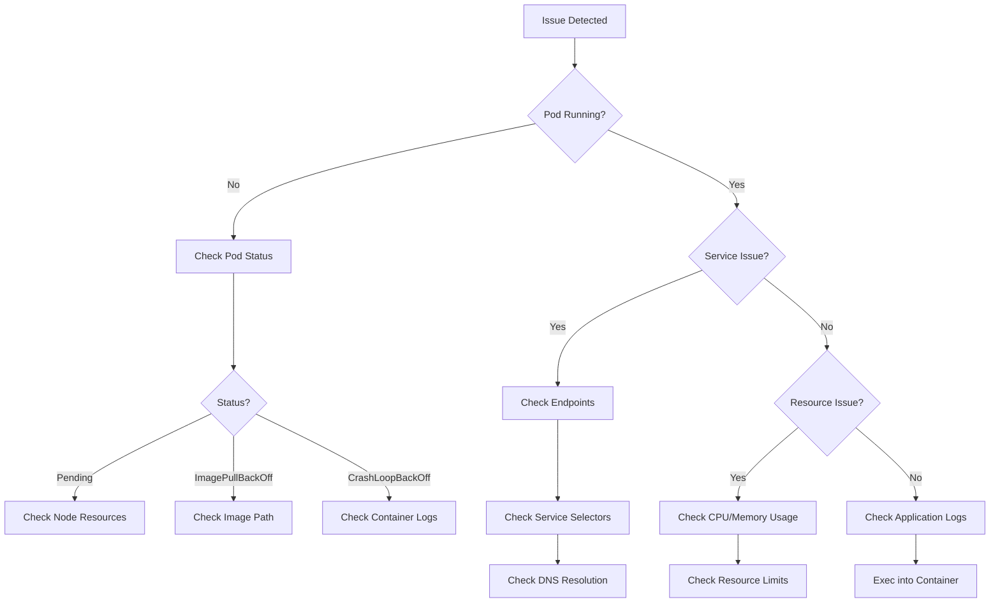

# Kubernetes Debugging

## Introduction

Debugging applications in Kubernetes can be challenging due to the distributed nature of containerized applications. When something goes wrong, identifying the root cause requires understanding how to navigate Kubernetes resources, extract relevant information, and analyze system behavior. This guide will walk you through the essential debugging techniques every Kubernetes administrator should know.

## Common Debugging Scenarios

Before diving into specific tools, let's understand some common scenarios that require debugging:

1. Pods failing to start or run properly
2. Services not routing traffic correctly
3. Performance issues and resource constraints
4. Configuration errors
5. Networking problems between pods or services

## Essential Kubectl Commands for Debugging

The `kubectl` command-line tool is your primary interface for debugging Kubernetes clusters. Here are the most useful commands for troubleshooting:

### Viewing Resource Information

```bash
# Get detailed information about a pod
kubectl describe pod <pod-name> -n <namespace>

# Get detailed information about a node
kubectl describe node <node-name>

# Get detailed information about a service
kubectl describe service <service-name> -n <namespace>
```

The `describe` command provides rich information including events, which often contain clues about failures or issues.

### Viewing Pod Logs

Logs are your window into application behavior:

```bash
# Get logs from a pod
kubectl logs <pod-name> -n <namespace>

# Get logs from a specific container in a multi-container pod
kubectl logs <pod-name> -c <container-name> -n <namespace>

# Follow logs in real-time
kubectl logs -f <pod-name> -n <namespace>

# Get logs from previous container instance (if it crashed)
kubectl logs <pod-name> --previous -n <namespace>
```

Example output:

```
2023-05-15T12:34:56.789Z INFO Starting application...
2023-05-15T12:34:57.123Z INFO Connected to database
2023-05-15T12:35:01.456Z ERROR Failed to process request: connection timeout
```

### Executing Commands in Containers

Sometimes you need to run commands inside a container to debug issues:

```bash
# Run a command in a pod
kubectl exec -it <pod-name> -n <namespace> -- <command>

# Start a shell session in a pod
kubectl exec -it <pod-name> -n <namespace> -- /bin/bash
```

For example, to check network connectivity from inside a pod:

```bash
kubectl exec -it nginx-pod -- curl -v http://backend-service:8080
```

### Checking Pod Status and Events

```bash
# Get pod status
kubectl get pods -n <namespace>

# Watch pod status changes in real-time
kubectl get pods -n <namespace> -w

# Get events sorted by timestamp
kubectl get events -n <namespace> --sort-by='.lastTimestamp'
```

## Debugging Pod Issues

### Common Pod Status Meanings

Understanding pod status is crucial for troubleshooting:

| Status | Meaning |
|--------|---------|
| Pending | Pod is scheduled but containers aren't running yet |
| Running | Pod is running with all containers started |
| Succeeded | All containers in the pod have terminated successfully |
| Failed | At least one container has terminated with failure |
| Unknown | Pod state cannot be determined |
| CrashLoopBackOff | Container is crashing repeatedly |
| ImagePullBackOff | Unable to pull the container image |
| ContainerCreating | Containers are being created |
| Terminating | Pod is being terminated |

### Debugging Pod Startup Issues

When a pod is stuck in `Pending` state:

1. Check if the cluster has enough resources:

```bash
kubectl describe nodes | grep -A 5 "Allocated resources"
```

2. Check if pod placement is restricted by node affinity, taints, or tolerations:

```bash
kubectl describe pod <pod-name> -n <namespace> | grep -A 10 "Tolerations:"
```

3. Check events for scheduling issues:

```bash
kubectl get events -n <namespace> --field-selector involvedObject.name=<pod-name>
```

### Debugging CrashLoopBackOff

When a pod is in `CrashLoopBackOff`:

1. Check container logs:

```bash
kubectl logs <pod-name> -n <namespace> --previous
```

2. Check the container exit code:

```bash
kubectl describe pod <pod-name> -n <namespace>
```

Exit codes can provide hints about the problem:

| Exit Code | Meaning |
|-----------|---------|
| 0 | Container exited successfully |
| 1 | General error |
| 137 | Container was killed (probably due to OOM) |
| 143 | Container received SIGTERM |

3. If it's an application error, you may need to debug the application code or configuration.

## Debugging Service and Networking Issues

### DNS Troubleshooting

DNS issues are common in Kubernetes. To debug:

1. Create a temporary debugging pod:

```bash
kubectl run debug-dns --image=busybox -it --rm -- nslookup <service-name>.<namespace>.svc.cluster.local
```

Example output:

```
Server:    10.96.0.10
Address 1: 10.96.0.10 kube-dns.kube-system.svc.cluster.local

Name:      my-service.default.svc.cluster.local
Address 1: 10.107.31.5
```

2. Check if the service has endpoints:

```bash
kubectl get endpoints <service-name> -n <namespace>
```

### Service Connectivity Testing

To test connectivity to a service:

1. From another pod:

```bash
kubectl exec -it <some-pod> -- curl -v http://<service-name>:<port>
```

2. Check if service selectors match pod labels:

```bash
# Check service selectors
kubectl describe service <service-name> -n <namespace> | grep Selector

# Check pod labels
kubectl get pod <pod-name> -n <namespace> --show-labels
```

## Using Port-Forward for Debugging

The `port-forward` command creates a secure tunnel to a pod or service for debugging:

```bash
# Forward a local port to a pod port
kubectl port-forward pod/<pod-name> <local-port>:<pod-port> -n <namespace>

# Forward a local port to a service port
kubectl port-forward svc/<service-name> <local-port>:<service-port> -n <namespace>
```

Example:

```bash
kubectl port-forward pod/my-app-pod 8080:80
```

This forwards your local port 8080 to port 80 on the pod, allowing you to access it via `http://localhost:8080`.

## Debugging with Custom Debugging Pods

Sometimes you need a dedicated debugging pod with specific tools:

```yaml
apiVersion: v1
kind: Pod
metadata:
  name: debugging-pod
spec:
  containers:
  - name: debugging-tools
    image: nicolaka/netshoot
    command:
      - sleep
      - "3600"
```

Save this as `debug-pod.yaml` and create it:

```bash
kubectl apply -f debug-pod.yaml
```

This creates a pod with networking tools like `dig`, `curl`, `tcpdump`, etc., that you can use for advanced debugging.

## Debugging Resource Issues

### CPU and Memory Usage

To check resource usage:

```bash
# Get resource usage per node
kubectl top nodes

# Get resource usage per pod
kubectl top pods -n <namespace>
```

Example output:

```
NAME         CPU(cores)   MEMORY(bytes)
pod-name-1   12m          45Mi
pod-name-2   1456m        231Mi
```

### Analyzing Resource Constraints

If pods are being terminated due to resource constraints:

1. Check if the pod is being OOM killed:

```bash
kubectl describe pod <pod-name> -n <namespace> | grep -i "killed"
```

2. Check resource requests and limits:

```bash
kubectl describe pod <pod-name> -n <namespace> | grep -A 3 "Limits:"
```

## Advanced Debugging Techniques

### Using the Kubernetes Dashboard

The Kubernetes Dashboard provides a visual interface for debugging:

```bash
# Deploy the dashboard
kubectl apply -f https://raw.githubusercontent.com/kubernetes/dashboard/v2.7.0/aio/deploy/recommended.yaml

# Create a service account with access
kubectl create serviceaccount dashboard-admin
kubectl create clusterrolebinding dashboard-admin --clusterrole=cluster-admin --serviceaccount=default:dashboard-admin

# Get the token
kubectl describe secret $(kubectl get secret | grep dashboard-admin | awk '{print $1}')

# Start the proxy
kubectl proxy
```

Access the dashboard at: http://localhost:8001/api/v1/namespaces/kubernetes-dashboard/services/https:kubernetes-dashboard:/proxy/

### Using ksniff for Packet Capture

ksniff allows you to capture network traffic from a pod:

```bash
# Install ksniff plugin
kubectl krew install sniff

# Capture traffic
kubectl sniff <pod-name> -n <namespace> -o capture.pcap
```

### Debug Kubernetes Control Plane

For cluster-level issues, you may need to check control plane components:

```bash
# Check control plane pods (if running as pods)
kubectl get pods -n kube-system

# Check kube-apiserver logs (for Kubernetes installed with kubeadm)
kubectl logs -n kube-system kube-apiserver-<node-name>
```

## Visualizing Kubernetes Debugging Flow

Here's a flowchart to help guide your debugging process:



## Real-World Debugging Example

Let's walk through a complete debugging example:

### Scenario: Web Application Not Accessible

1. Check the pod status:

```bash
kubectl get pods -n web-app
```

Output:
```
NAME                      READY   STATUS    RESTARTS   AGE
web-frontend-59c78f6b89   1/1     Running   0          15m
web-backend-75b9c7c7f5    1/1     Running   0          15m
```

2. Check the service:

```bash
kubectl get svc -n web-app
```

Output:
```
NAME          TYPE        CLUSTER-IP       EXTERNAL-IP   PORT(S)    AGE
web-frontend  ClusterIP   10.100.200.123   <none>        80/TCP     15m
web-backend   ClusterIP   10.100.200.124   <none>        8080/TCP   15m
```

3. Check if service has endpoints:

```bash
kubectl get endpoints web-frontend -n web-app
```

Output:
```
NAME          ENDPOINTS           AGE
web-frontend  <none>              15m
```

No endpoints! Let's check why:

4. Check service selectors vs. pod labels:

```bash
kubectl describe svc web-frontend -n web-app | grep Selector
```

Output:
```
Selector:          app=frontend,env=prod
```

```bash
kubectl get pod web-frontend-59c78f6b89 -n web-app --show-labels
```

Output:
```
NAME                      READY   STATUS    RESTARTS   AGE   LABELS
web-frontend-59c78f6b89   1/1     Running   0          20m   app=frontend,env=staging
```

5. Found the issue! The service is selecting pods with `env=prod`, but our pod has `env=staging`. Fix by updating the service selector:

```bash
kubectl patch svc web-frontend -n web-app -p '{"spec":{"selector":{"app":"frontend","env":"staging"}}}'
```

6. Verify endpoints again:

```bash
kubectl get endpoints web-frontend -n web-app
```

Output:
```
NAME          ENDPOINTS           AGE
web-frontend  10.244.2.15:80      22m
```

Problem solved! The service now has endpoints.

## Best Practices for Effective Debugging

1. **Be methodical**: Follow a systematic approach to eliminate potential issues one by one.
2. **Use labels effectively**: Proper labeling makes it easier to identify and filter resources.
3. **Set appropriate resource requests and limits**: This helps prevent resource-related issues.
4. **Implement health checks**: Liveness and readiness probes help Kubernetes manage application health.
5. **Collect metrics**: Use tools like Prometheus for monitoring and alerting.
6. **Create good logs**: Design applications to log meaningful information at appropriate levels.
7. **Use namespaces**: Organize resources in namespaces for better manageability.

## Debugging Tools Ecosystem

Beyond built-in Kubernetes tools, consider these tools for enhanced debugging capabilities:

1. **k9s**: Terminal-based UI for managing Kubernetes clusters
2. **Lens**: Graphical IDE for Kubernetes
3. **Stern**: Multi-pod log tailing
4. **Kube-ps1**: Kubernetes prompt for bash
5. **kubectx/kubens**: Tools for switching between contexts and namespaces
6. **Popeye**: Scans cluster for misconfigurations

## Summary

Kubernetes debugging requires understanding various components and their interactions. By mastering the tools and techniques covered in this guide, you'll be able to:

- Identify and resolve pod issues quickly
- Troubleshoot service and networking problems
- Diagnose and fix resource constraints
- Use advanced debugging tools when needed

Remember that effective debugging in Kubernetes is as much about being methodical as it is about knowing the right commands.

## Exercises

1. Create a deliberately broken deployment (e.g., with an invalid image) and practice debugging it.
2. Set up a service with incorrect selectors and fix it using the debugging techniques covered.
3. Create a pod with insufficient resource limits and debug the resulting issues.
4. Practice capturing and analyzing logs from a multi-container pod.
5. Set up network policies and debug connectivity issues between pods.

## Additional Resources

- [Kubernetes Documentation: Troubleshooting](https://kubernetes.io/docs/tasks/debug/)
- [Kubectl Cheat Sheet](https://kubernetes.io/docs/reference/kubectl/cheatsheet/)
- [Debug Running Pods](https://kubernetes.io/docs/tasks/debug/debug-application/debug-running-pod/)
- [Debug Services](https://kubernetes.io/docs/tasks/debug/debug-application/debug-service/)