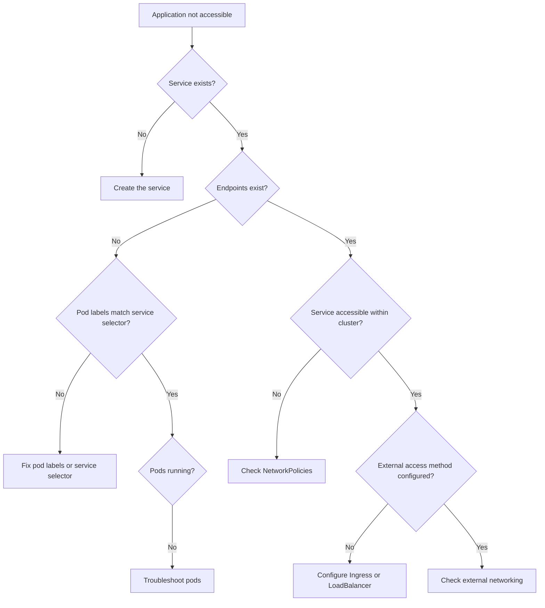
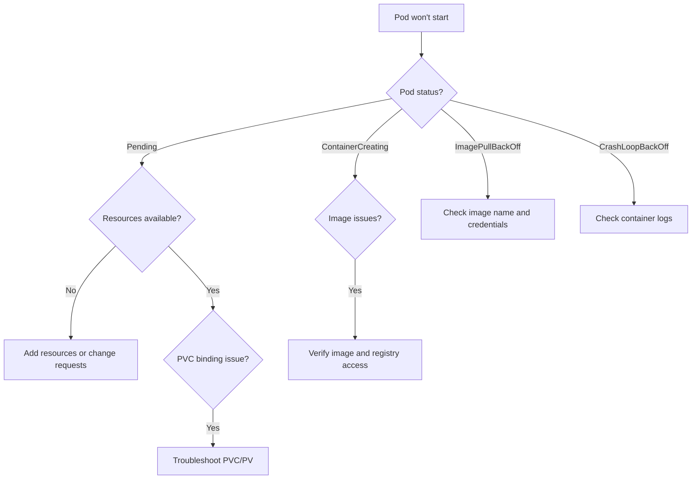

# Kubernetes Troubleshooting

## Introduction

When working with Kubernetes clusters, you'll inevitably encounter issues that require troubleshooting. Whether it's pods failing to start, services not connecting properly, or nodes becoming unresponsive, developing strong troubleshooting skills is essential for effective Kubernetes administration.

This guide will walk you through a systematic approach to diagnosing and resolving common Kubernetes problems. We'll cover the essential tools, commands, and techniques that will help you identify issues quickly and implement appropriate solutions.

## Understanding the Kubernetes Troubleshooting Mindset

Before diving into specific techniques, it's important to approach Kubernetes troubleshooting with the right mindset:

1. **Follow the data flow**: Understand how components connect and communicate
2. **Check logs first**: Logs often contain the exact error information you need
3. **Isolate issues**: Determine if the problem is at the pod, node, or cluster level
4. **Use the Kubernetes troubleshooting tools**: Kubernetes provides robust tooling for debugging

## Essential Kubernetes Troubleshooting Commands

Let's start with the fundamental commands you'll use for troubleshooting:

### Checking Cluster Status

To verify the overall health of your cluster:

```bash
kubectl cluster-info
kubectl get nodes
kubectl describe node <node-name>
```

Example output:

```
$ kubectl cluster-info
Kubernetes control plane is running at https://kubernetes.docker.internal:6443
CoreDNS is running at https://kubernetes.docker.internal:6443/api/v1/namespaces/kube-system/services/kube-dns:dns/proxy

$ kubectl get nodes
NAME             STATUS   ROLES           AGE   VERSION
docker-desktop   Ready    control-plane   45d   v1.25.4
```

### Viewing Logs

Logs are your best source of information when troubleshooting:

```bash
# Get logs from a pod
kubectl logs <pod-name>

# Get logs from a specific container in a pod
kubectl logs <pod-name> -c <container-name>

# Stream logs in real-time
kubectl logs -f <pod-name>

# Get previous container logs if container has restarted
kubectl logs <pod-name> --previous
```

Example:

```bash
$ kubectl logs nginx-deployment-66b6c48dd5-zvh78
/docker-entrypoint.sh: /docker-entrypoint.d/ is not empty, will attempt to perform configuration
/docker-entrypoint.sh: Looking for shell scripts in /docker-entrypoint.d/
/docker-entrypoint.sh: Launching /docker-entrypoint.d/10-listen-on-ipv6-by-default.sh
10-listen-on-ipv6-by-default.sh: info: Getting the checksum of /etc/nginx/conf.d/default.conf
...
```

### Describing Resources

The `describe` command provides detailed information about Kubernetes resources:

```bash
kubectl describe pod <pod-name>
kubectl describe deployment <deployment-name>
kubectl describe service <service-name>
```

Example:

```bash
$ kubectl describe pod nginx-deployment-66b6c48dd5-zvh78
Name:             nginx-deployment-66b6c48dd5-zvh78
Namespace:        default
Priority:         0
Service Account:  default
Node:             docker-desktop/192.168.65.4
Start Time:       Wed, 15 Feb 2023 10:43:26 -0800
Labels:           app=nginx
                  pod-template-hash=66b6c48dd5
...
Events:
  Type    Reason     Age   From               Message
  ----    ------     ----  ----               -------
  Normal  Scheduled  12m   default-scheduler  Successfully assigned default/nginx-deployment-66b6c48dd5-zvh78 to docker-desktop
  Normal  Pulled     12m   kubelet            Container image "nginx:1.14.2" already present on machine
  Normal  Created    12m   kubelet            Created container nginx
  Normal  Started    12m   kubelet            Started container nginx
```

### Executing Commands in Containers

Sometimes you need to run commands inside a container to troubleshoot:

```bash
# Run a command in a pod
kubectl exec <pod-name> -- <command>

# Get an interactive shell
kubectl exec -it <pod-name> -- /bin/bash
```

Example:

```bash
$ kubectl exec -it nginx-deployment-66b6c48dd5-zvh78 -- /bin/bash
root@nginx-deployment-66b6c48dd5-zvh78:/# cat /etc/nginx/nginx.conf
user  nginx;
worker_processes  auto;

error_log  /var/log/nginx/error.log notice;
pid        /var/run/nginx.pid;
...
```

## Troubleshooting Pod Issues

Pods are the smallest deployable units in Kubernetes and often the first place to look when troubleshooting.

### Common Pod States and What They Mean

```bash
kubectl get pods
```

Common states you might see:

- **Pending**: Pod has been created but not yet scheduled
- **ContainerCreating**: Pod is scheduled and containers are being created
- **Running**: Pod is running all containers successfully
- **Completed**: All containers in the pod have completed successfully
- **CrashLoopBackOff**: One or more containers are crashing and restarting repeatedly
- **Error**: Pod failed to execute properly
- **ImagePullBackOff**: Failed to pull the container image

### Debugging Pod Issues

When a pod is stuck in a non-running state, follow these steps:

1. **Check pod status** to understand the current state:

```bash
kubectl get pod <pod-name>
```

2. **View detailed pod information** to identify issues:

```bash
kubectl describe pod <pod-name>
```

Look for:
- **Events** section at the bottom (often contains error details)
- **Status** section (shows current container states)
- **Conditions** section (PodScheduled, ContainersReady, etc.)

3. **Check pod logs** for application errors:

```bash
kubectl logs <pod-name>
```

### Example: Troubleshooting a CrashLoopBackOff

Let's walk through a real-world example of troubleshooting a pod in CrashLoopBackOff state:

```bash
$ kubectl get pods
NAME                         READY   STATUS             RESTARTS      AGE
myapp-pod-67d8fb7b48-2xvzt   0/1     CrashLoopBackOff   4 (30s ago)   2m
```

First, let's examine the pod details:

```bash
$ kubectl describe pod myapp-pod-67d8fb7b48-2xvzt
...
Events:
  Type     Reason     Age                From               Message
  ----     ------     ----               ----               -------
  Normal   Scheduled  2m                 default-scheduler  Successfully assigned default/myapp-pod-67d8fb7b48-2xvzt to node-1
  Normal   Pulled     1m (x3 over 2m)    kubelet            Container image "myapp:v1" already present on machine
  Normal   Created    1m (x3 over 2m)    kubelet            Created container myapp
  Normal   Started    1m (x3 over 2m)    kubelet            Started container myapp
  Warning  BackOff    30s (x6 over 1m)   kubelet            Back-off restarting failed container
```

Now, let's check the container logs:

```bash
$ kubectl logs myapp-pod-67d8fb7b48-2xvzt
Error: Database connection failed - could not connect to database at db-service:3306
```

The issue is now clear: the pod is crashing because it can't connect to a database. Let's check if the database service exists:

```bash
$ kubectl get service db-service
Error from server (NotFound): services "db-service" not found
```

Found the problem! The database service doesn't exist. Let's create it:

```bash
$ kubectl apply -f db-service.yaml
service/db-service created

$ kubectl get pods
NAME                         READY   STATUS    RESTARTS   AGE
myapp-pod-67d8fb7b48-2xvzt   1/1     Running   0          30s
```

The pod is now running successfully after creating the missing database service.

## Troubleshooting Service Connectivity

Services are a common source of issues in Kubernetes. Here's how to diagnose service connectivity problems:

### Verifying Service Configuration

First, check if the service exists and is configured correctly:

```bash
kubectl get service <service-name>
kubectl describe service <service-name>
```

Example:

```bash
$ kubectl get service my-service
NAME         TYPE        CLUSTER-IP       EXTERNAL-IP   PORT(S)    AGE
my-service   ClusterIP   10.96.145.123    <none>        80/TCP     1h

$ kubectl describe service my-service
Name:              my-service
Namespace:         default
Labels:            app=my-app
Annotations:       <none>
Selector:          app=my-app
Type:              ClusterIP
IP:                10.96.145.123
Port:              <unset>  80/TCP
TargetPort:        8080/TCP
Endpoints:         10.244.0.15:8080,10.244.0.16:8080
Session Affinity:  None
Events:            <none>
```

### Checking Endpoint Configuration

Services connect to pods through endpoints. Verify that endpoints exist:

```bash
kubectl get endpoints <service-name>
```

Example:

```bash
$ kubectl get endpoints my-service
NAME         ENDPOINTS                           AGE
my-service   10.244.0.15:8080,10.244.0.16:8080   1h
```

If you see `<none>` or no endpoints, this indicates that your service's selector isn't matching any pod labels.

### Testing Service from Within the Cluster

You can test connectivity to a service from another pod:

```bash
kubectl run test-pod --image=busybox --rm -it -- wget -O- <service-name>:<port>
```

Example:

```bash
$ kubectl run test-pod --image=busybox --rm -it -- wget -qO- my-service:80
<!DOCTYPE html>
<html>
<head>
    <title>Welcome to My App</title>
</head>
<body>
    <h1>Hello, Kubernetes!</h1>
</body>
</html>
```

### Debugging Example: Service Not Connecting to Pods

Let's troubleshoot a service that's not connecting to its pods:

```bash
$ kubectl get service frontend-service
NAME               TYPE        CLUSTER-IP      EXTERNAL-IP   PORT(S)   AGE
frontend-service   ClusterIP   10.96.145.123   <none>        80/TCP    30m

$ kubectl get endpoints frontend-service
NAME               ENDPOINTS   AGE
frontend-service   <none>      30m
```

The service has no endpoints! Let's check the service's selector:

```bash
$ kubectl describe service frontend-service
Name:              frontend-service
Namespace:         default
Labels:            app=frontend
Annotations:       <none>
Selector:          app=frontend
Type:              ClusterIP
IP:                10.96.145.123
Port:              <unset>  80/TCP
TargetPort:        8080/TCP
Endpoints:         <none>
Session Affinity:  None
Events:            <none>
```

Now let's check if any pods match the selector `app=frontend`:

```bash
$ kubectl get pods --selector=app=frontend
No resources found in default namespace.
```

No pods match! Let's see what pods we have and their labels:

```bash
$ kubectl get pods --show-labels
NAME                       READY   STATUS    RESTARTS   AGE   LABELS
frontend-7b6f8fd65-5z7xj   1/1     Running   0          30m   app=frontend-app
frontend-7b6f8fd65-x2vd5   1/1     Running   0          30m   app=frontend-app
```

Found the issue! The pods have the label `app=frontend-app` but the service is looking for `app=frontend`. Let's update the service:

```bash
$ kubectl patch service frontend-service --type='json' -p='[{"op": "replace", "path": "/spec/selector", "value":{"app":"frontend-app"}}]'
service/frontend-service patched

$ kubectl get endpoints frontend-service
NAME               ENDPOINTS                               AGE
frontend-service   10.244.0.21:8080,10.244.0.22:8080      31m
```

Now the service has endpoints and can route traffic to the pods successfully.

## Troubleshooting Persistent Volume Issues

Persistent volumes can cause problems when they don't bind properly or have permission issues.

### Checking PersistentVolumeClaim Status

```bash
kubectl get pvc
kubectl describe pvc <pvc-name>
```

Example:

```bash
$ kubectl get pvc
NAME         STATUS    VOLUME   CAPACITY   ACCESS MODES   STORAGECLASS   AGE
data-pvc     Pending   <none>   <none>     <none>         standard       5m
```

A PVC in `Pending` status usually means no suitable PV is available.

### Verifying Available PersistentVolumes

```bash
kubectl get pv
```

Example:

```bash
$ kubectl get pv
NAME                  CAPACITY   ACCESS MODES   RECLAIM POLICY   STATUS      CLAIM   STORAGECLASS   AGE
pv-volume             10Gi       RWO            Retain           Available           standard       10m
```

### Example: Troubleshooting a PVC That Won't Bind

Let's examine why a PVC isn't binding:

```bash
$ kubectl describe pvc data-pvc
Name:          data-pvc
Namespace:     default
StorageClass:  fast
Status:        Pending
Volume:        
Labels:        <none>
Annotations:   <none>
Finalizers:    [kubernetes.io/pvc-protection]
Capacity:      
Access Modes:  
VolumeMode:    Filesystem
Used By:       db-pod
Events:
  Type     Reason              Age                 From                         Message
  ----     ------              ----                ----                         -------
  Normal   WaitForFirstConsumer 1m                  persistentvolume-controller  waiting for first consumer to be created before binding
```

In this case, the PVC is using the `fast` StorageClass with a volume binding mode of `WaitForFirstConsumer`. Let's check if the pod is actually using this PVC:

```bash
$ kubectl get pod db-pod
NAME     READY   STATUS     RESTARTS   AGE
db-pod   0/1     Pending    0          2m

$ kubectl describe pod db-pod
Name:         db-pod
...
Events:
  Type     Reason            Age   From               Message
  ----     ------            ----  ----               -------
  Warning  FailedScheduling  2m    default-scheduler  0/3 nodes are available: 3 pod has unbound immediate PersistentVolumeClaims
```

We have a circular dependency! The PVC is waiting for the pod, and the pod is waiting for the PVC. In this case, we need to check our StorageClass:

```bash
$ kubectl get sc
NAME                PROVISIONER                    RECLAIMPOLICY   VOLUMEBINDINGMODE      ALLOWVOLUMEEXPANSION   AGE
standard (default)  kubernetes.io/host-path        Delete          Immediate              false                  1d
fast                kubernetes.io/host-path        Delete          WaitForFirstConsumer   false                  1d
```

The solution is to either:
1. Change the StorageClass to one with `Immediate` binding
2. Pre-provision a PV that matches the PVC's requirements

## Troubleshooting ConfigMaps and Secrets

Configuration issues can arise when ConfigMaps or Secrets aren't properly set up.

### Checking ConfigMaps and Their Data

```bash
kubectl get configmap <configmap-name>
kubectl describe configmap <configmap-name>
```

Example:

```bash
$ kubectl describe configmap app-config
Name:         app-config
Namespace:    default
Labels:       <none>
Annotations:  <none>

Data
====
app.properties:
----
database.url=jdbc:mysql://db-service:3306/mydb
database.user=appuser
```

### Verifying Secrets

```bash
kubectl get secret <secret-name>
kubectl describe secret <secret-name>
```

Example:

```bash
$ kubectl describe secret db-credentials
Name:         db-credentials
Namespace:    default
Labels:       <none>
Annotations:  <none>

Type:  Opaque

Data
====
password:  16 bytes
username:  8 bytes
```

### Example: Troubleshooting a ConfigMap Mount Issue

Let's debug a pod that's failing to mount a ConfigMap:

```bash
$ kubectl describe pod app-pod
...
Events:
  Type     Reason       Age                From               Message
  ----     ------       ----               ----               -------
  Normal   Scheduled    1m                 default-scheduler  Successfully assigned default/app-pod to node-1
  Warning  FailedMount  1m (x3 over 1m)    kubelet            MountVolume.SetUp failed for volume "config-volume" : configmap "app-settings" not found
```

The pod is looking for a ConfigMap named `app-settings` but it doesn't exist. Let's check existing ConfigMaps:

```bash
$ kubectl get configmaps
NAME               DATA   AGE
app-config         3      5m
kube-root-ca.crt   1      1d
```

We have an `app-config` ConfigMap, but the pod is trying to use `app-settings`. Let's update the pod definition:

```yaml
apiVersion: v1
kind: Pod
metadata:
  name: app-pod
spec:
  containers:
  - name: app
    image: myapp:v1
    volumeMounts:
    - name: config-volume
      mountPath: /etc/config
  volumes:
  - name: config-volume
    configMap:
      name: app-config  # Changed from app-settings to app-config
```

Apply the updated configuration:

```bash
$ kubectl apply -f app-pod.yaml
pod/app-pod configured
```

## Troubleshooting Network Policies

Network policies can cause connectivity issues if not configured correctly.

### Checking Network Policies

```bash
kubectl get networkpolicies
kubectl describe networkpolicy <policy-name>
```

Example:

```bash
$ kubectl describe networkpolicy restrict-db-access
Name:         restrict-db-access
Namespace:    default
Labels:       <none>
Annotations:  <none>
Spec:
  PodSelector:     app=database
  Allowing ingress traffic:
    To Port: 3306/TCP
    From:
      PodSelector: app=backend
  Not affecting egress traffic
  Policy Types: Ingress
```

### Testing Network Connectivity

You can use a temporary pod to test connectivity:

```bash
kubectl run test-pod --image=busybox --rm -it -- ping <service-or-pod-ip>
```

### Example: Troubleshooting a Network Policy Issue

Let's investigate a network connectivity issue between frontend and backend pods:

```bash
$ kubectl get pods
NAME                       READY   STATUS    RESTARTS   AGE
frontend-8b9f6d87c-x4f1r   1/1     Running   0          10m
backend-5d76b7f96d-pf8xz   1/1     Running   0          10m
database-f7765dc68-q92vx   1/1     Running   0          10m

$ kubectl logs frontend-8b9f6d87c-x4f1r
Error: Could not connect to backend service: Connection timed out
```

Let's check if any network policies might be affecting communication:

```bash
$ kubectl get networkpolicy
NAME                  POD-SELECTOR     AGE
restrict-all-traffic  app in (backend) 15m
```

Let's examine this policy:

```bash
$ kubectl describe networkpolicy restrict-all-traffic
Name:         restrict-all-traffic
Namespace:    default
Labels:       <none>
Annotations:  <none>
Spec:
  PodSelector:     app in (backend)
  Allowing ingress traffic:
    From: []
  Not affecting egress traffic
  Policy Types: Ingress
```

This policy is blocking all ingress traffic to backend pods! Let's modify it to allow traffic from frontend pods:

```yaml
apiVersion: networking.k8s.io/v1
kind: NetworkPolicy
metadata:
  name: restrict-all-traffic
spec:
  podSelector:
    matchLabels:
      app: backend
  policyTypes:
  - Ingress
  ingress:
  - from:
    - podSelector:
        matchLabels:
          app: frontend
```

After applying the updated policy:

```bash
$ kubectl logs frontend-8b9f6d87c-x4f1r
Successfully connected to backend service
```

## Troubleshooting Cluster-Level Issues

Sometimes issues affect the entire cluster or specific nodes.

### Checking Node Status

```bash
kubectl get nodes
kubectl describe node <node-name>
```

Example:

```bash
$ kubectl get nodes
NAME        STATUS     ROLES    AGE   VERSION
node-1      Ready      master   90d   v1.23.3
node-2      Ready      <none>   90d   v1.23.3
node-3      NotReady   <none>   90d   v1.23.3
```

### Checking System Pods

Key system pods in `kube-system` namespace:

```bash
kubectl get pods -n kube-system
```

Example:

```bash
$ kubectl get pods -n kube-system
NAME                               READY   STATUS    RESTARTS   AGE
coredns-78fcd69978-f5q82           1/1     Running   0          90d
coredns-78fcd69978-hm8v5           1/1     Running   0          90d
etcd-node-1                        1/1     Running   0          90d
kube-apiserver-node-1              1/1     Running   0          90d
kube-controller-manager-node-1     1/1     Running   0          90d
kube-proxy-jvs2l                   1/1     Running   0          90d
kube-proxy-nx9qv                   1/1     Running   0          90d
kube-proxy-smr84                   1/1     Running   0          90d
kube-scheduler-node-1              1/1     Running   0          90d
```

### Checking Control Plane Logs

If you have access to the control plane nodes:

```bash
# On the control plane node
sudo crictl logs $(sudo crictl ps -a | grep kube-apiserver | awk '{print $1}')
```

### Example: Troubleshooting a Node Not Ready

Let's investigate a node that's in `NotReady` state:

```bash
$ kubectl describe node node-3
...
Conditions:
  Type             Status  LastHeartbeatTime                 LastTransitionTime                Reason                       Message
  ----             ------  -----------------                 ------------------                ------                       -------
  MemoryPressure   False   Wed, 15 Feb 2023 13:41:52 -0800   Wed, 15 Feb 2023 08:23:45 -0800   KubeletHasSufficientMemory   kubelet has sufficient memory available
  DiskPressure     False   Wed, 15 Feb 2023 13:41:52 -0800   Wed, 15 Feb 2023 08:23:45 -0800   KubeletHasNoDiskPressure     kubelet has no disk pressure
  PIDPressure      False   Wed, 15 Feb 2023 13:41:52 -0800   Wed, 15 Feb 2023 08:23:45 -0800   KubeletHasSufficientPID      kubelet has sufficient PID available
  Ready            False   Wed, 15 Feb 2023 13:41:52 -0800   Wed, 15 Feb 2023 13:31:20 -0800   KubeletNotReady              container runtime network not ready: NetworkReady=false reason:NetworkPluginNotReady message:docker: network plugin is not ready: cni config uninitialized
...
```

The issue is with the CNI (Container Network Interface) - it's not properly initialized. This could be resolved by:

1. Check if the CNI pods are running:

```bash
$ kubectl get pods -n kube-system | grep cni
calico-node-b82kl                  0/1     CrashLoopBackOff   8          15m
calico-node-cs52k                  1/1     Running            0          90d
calico-node-xs9sl                  1/1     Running            0          90d
```

2. Check the logs for the failing CNI pod:

```bash
$ kubectl logs calico-node-b82kl -n kube-system
Failed to open config file: /etc/cni/net.d/10-calico.conflist: no such file or directory
```

3. The issue might be that the CNI configuration file is missing. We would need to reinstall or reconfigure the CNI plugin on the affected node.

## Troubleshooting Tools Beyond kubectl

While `kubectl` is powerful, sometimes you need additional tools:

### Using `kubectl port-forward`

This allows you to access services that aren't exposed outside the cluster:

```bash
kubectl port-forward service/<service-name> <local-port>:<service-port>
```

Example:

```bash
$ kubectl port-forward service/my-database 3306:3306
Forwarding from 127.0.0.1:3306 -> 3306
Forwarding from [::1]:3306 -> 3306
```

### Debugging with Specialized Pods

You can deploy debugging tools to help troubleshoot:

```yaml
apiVersion: v1
kind: Pod
metadata:
  name: debug-pod
spec:
  containers:
  - name: debug-container
    image: nicolaka/netshoot
    command: ["sleep", "3600"]
```

This container includes many networking tools (dig, nslookup, curl, etc.) for troubleshooting.

### Using `kubectl debug`

For Kubernetes 1.18+, you can use `kubectl debug` to create debugging containers:

```bash
kubectl debug -it <pod-name> --image=busybox --target=<container-name>
```

## Common Troubleshooting Workflows

Let's go through some systematic workflows for common problems:

### Workflow: Application Not Accessible



### Workflow: Pod Won't Start



## Best Practices for Kubernetes Troubleshooting

Follow these guidelines for effective troubleshooting:

1. **Document your environment**: Know your cluster's version, configuration, and topology
2. **Establish baseline metrics**: Understand what "normal" looks like
3. **Practice progressive debugging**: Start with simple checks before deep diving
4. **Use namespaces effectively**: Organize resources for easier debugging
5. **Implement proper logging**: Ensure applications log in a Kubernetes-friendly way
6. **Create troubleshooting runbooks**: Document common issues and their solutions
7. **Use labels and annotations**: These make it easier to identify resources
8. **Limit blast radius**: Use resource limits and pod disruption budgets

## Summary

Kubernetes troubleshooting requires a systematic approach and knowledge of the key components and their interactions. In this guide, we've covered:

- Essential troubleshooting commands for inspecting Kubernetes resources
- Common pod, service, networking, and storage issues
- Systematic workflows for addressing specific problems
- Best practices for maintaining a healthy Kubernetes environment

As you gain experience, you'll develop an intuition for quickly identifying and resolving issues in your Kubernetes clusters.

## Additional Resources

- [Kubernetes Official Documentation: Troubleshooting](https://kubernetes.io/docs/tasks/debug/)
- [Kubernetes Debugging: Pod Troubleshooting](https://kubernetes.io/docs/tasks/debug/debug-application/debug-pods/)
- [Kubernetes Debugging: Service Troubleshooting](https://kubernetes.io/docs/tasks/debug/debug-application/debug-service/)
- [Linux Foundation Course: Kubernetes for Developers (LFD259)](https://training.linuxfoundation.org/training/kubernetes-for-developers/)

## Exercises

1. **Pod Debugging Challenge**: Create a pod with an incorrect image name and practice troubleshooting it.
2. **Service Connectivity Exercise**: Create a service with a deliberate mismatch between pod labels and service selector, then fix it.
3. **Storage Troubleshooting**: Set up a PVC with a storage class that doesn't exist, then modify it to use an available storage class.
4. **Network Policy Practice**: Create a network policy that blocks all traffic to a pod, then modify it to allow specific traffic.
5. **Resource Constraints Experiment**: Deploy a pod with resource requests that exceed your node capacity, then troubleshoot and fix it.