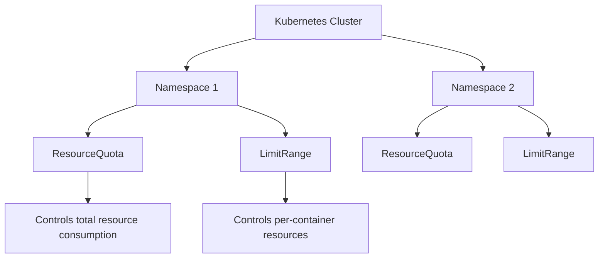

# Kubernetes Resource Quotas

## Introduction

Resource management is a critical aspect of running applications in Kubernetes. As your cluster grows and hosts multiple workloads, you'll need mechanisms to prevent any single application from consuming all available resources. This is where **Resource Quotas** come into play.

Kubernetes Resource Quotas provide constraints that limit aggregate resource consumption per namespace. They help cluster administrators control resource usage, prevent resource starvation, and ensure fair allocation across teams and workloads. Without proper resource quotas, a single namespace could potentially use all the resources in a cluster, affecting other applications.

In this tutorial, we'll explore:
- What resource quotas are and why they're important
- How to create and apply resource quotas
- Different types of resource quotas
- Best practices for implementing quotas in production environments

## Understanding Resource Quotas

Resource Quotas in Kubernetes are objects that define hard limits on the resources that can be consumed by all pods collectively within a namespace. They apply to:

1. **Compute resources** like CPU and memory
2. **Storage resources** like persistent volume claims
3. **Object counts** like the number of pods, services, or configmaps

When a resource quota is created in a namespace, the Kubernetes API server begins enforcing those constraints. If a user tries to create or update a resource that would exceed the quota, the request is denied with an error message.

### Key Benefits

- **Resource Fairness**: Ensures equitable distribution of cluster resources
- **Cost Control**: Helps manage cloud expenses by limiting resource consumption
- **Noisy Neighbor Prevention**: Stops one team's workload from impacting others
- **Resource Predictability**: Makes cluster capacity planning more reliable

## Creating a Resource Quota

Resource quotas are defined using YAML manifests. Let's create a basic resource quota that limits CPU, memory, and pod count in a namespace:

```yaml
apiVersion: v1
kind: ResourceQuota
metadata:
  name: compute-quota
  namespace: development
spec:
  hard:
    pods: "10"
    requests.cpu: "4"
    requests.memory: 8Gi
    limits.cpu: "8"
    limits.memory: 16Gi
```

This quota specifies that in the `development` namespace:
- Maximum of 10 pods can be created
- Total CPU requests across all pods cannot exceed 4 CPU cores
- Total memory requests cannot exceed 8GiB
- Total CPU limits cannot exceed 8 CPU cores
- Total memory limits cannot exceed 16GiB

### Applying the Resource Quota

To apply this quota to your cluster, save it to a file (e.g., `compute-quota.yaml`) and run:

```bash
kubectl apply -f compute-quota.yaml
```

After application, you can verify the quota has been created:

```bash
kubectl get resourcequota -n development
```

You should see output similar to:

```
NAME            AGE   REQUEST                                            LIMIT
compute-quota   10s   pods: 0/10, requests.cpu: 0/4, requests.memory: 0/8Gi   limits.cpu: 0/8, limits.memory: 0/16Gi
```

## Types of Resource Quotas

Kubernetes supports various types of quotas, each controlling different aspects of resource usage:

### 1. Compute Resource Quotas

These limit CPU and memory consumption:

```yaml
apiVersion: v1
kind: ResourceQuota
metadata:
  name: compute-resources
  namespace: team-blue
spec:
  hard:
    requests.cpu: "1"
    requests.memory: 1Gi
    limits.cpu: "2"
    limits.memory: 2Gi
```

### 2. Storage Resource Quotas

These limit storage consumption across persistent volumes:

```yaml
apiVersion: v1
kind: ResourceQuota
metadata:
  name: storage-resources
  namespace: team-red
spec:
  hard:
    persistentvolumeclaims: "5"
    requests.storage: 500Gi
    ssd.storageclass.storage.k8s.io/requests.storage: 300Gi
```

### 3. Object Count Quotas

These limit the number of Kubernetes objects that can be created:

```yaml
apiVersion: v1
kind: ResourceQuota
metadata:
  name: object-counts
  namespace: team-green
spec:
  hard:
    configmaps: "10"
    persistentvolumeclaims: "5"
    pods: "20"
    replicationcontrollers: "5"
    secrets: "10"
    services: "5"
    services.loadbalancers: "1"
```

## Viewing Resource Quota Usage

To see the current usage against defined quotas, use:

```bash
kubectl describe resourcequota compute-quota -n development
```

This will show output like:

```
Name:            compute-quota
Namespace:       development
Resource         Used  Hard
--------         ----  ----
limits.cpu       1     8
limits.memory    1Gi   16Gi
pods             3     10
requests.cpu     500m  4
requests.memory  512Mi 8Gi
```

## Resource Quotas in Action: A Practical Example

Let's walk through a complete example of setting up resource quotas for a team developing a web application.

### Step 1: Create a Namespace for the Team

```bash
kubectl create namespace web-team
```

### Step 2: Create a Resource Quota for the Namespace

```yaml
apiVersion: v1
kind: ResourceQuota
metadata:
  name: web-team-quota
  namespace: web-team
spec:
  hard:
    pods: "20"
    requests.cpu: "4"
    requests.memory: 8Gi
    limits.cpu: "8"
    limits.memory: 16Gi
    services: "5"
    persistentvolumeclaims: "10"
    requests.storage: 100Gi
```

Apply the quota:

```bash
kubectl apply -f web-team-quota.yaml
```

### Step 3: Deploy an Application with Resource Requirements

Here's a simple deployment of a web application with defined resource requests and limits:

```yaml
apiVersion: apps/v1
kind: Deployment
metadata:
  name: web-app
  namespace: web-team
spec:
  replicas: 3
  selector:
    matchLabels:
      app: web-app
  template:
    metadata:
      labels:
        app: web-app
    spec:
      containers:
      - name: web-app
        image: nginx:latest
        ports:
        - containerPort: 80
        resources:
          requests:
            memory: "256Mi"
            cpu: "500m"
          limits:
            memory: "512Mi"
            cpu: "1"
```

Apply the deployment:

```bash
kubectl apply -f web-app-deployment.yaml
```

### Step 4: View Resource Usage Against Quota

```bash
kubectl describe resourcequota web-team-quota -n web-team
```

This should show the resources consumed by the three nginx pods against the quota:

```
Name:            web-team-quota
Namespace:       web-team
Resource         Used   Hard
--------         ----   ----
limits.cpu       3      8
limits.memory    1536Mi 16Gi
pods             3      20
requests.cpu     1500m  4
requests.memory  768Mi  8Gi
services         0      5
persistentvolumeclaims  0      10
requests.storage 0      100Gi
```

### Step 5: Try to Exceed the Quota

Let's try to create a deployment that would exceed our quota:

```yaml
apiVersion: apps/v1
kind: Deployment
metadata:
  name: resource-hungry-app
  namespace: web-team
spec:
  replicas: 5
  selector:
    matchLabels:
      app: resource-hungry-app
  template:
    metadata:
      labels:
        app: resource-hungry-app
    spec:
      containers:
      - name: resource-hungry-app
        image: nginx:latest
        resources:
          requests:
            memory: "1Gi"
            cpu: "1"
          limits:
            memory: "2Gi"
            cpu: "2"
```

When you try to apply this deployment:

```bash
kubectl apply -f resource-hungry-app.yaml
```

You'll likely receive an error similar to:

```
Error from server (Forbidden): error when creating "resource-hungry-app.yaml": 
pods "resource-hungry-app" is forbidden: exceeded quota: web-team-quota, 
requested: requests.cpu=5,requests.memory=5Gi, 
used: requests.cpu=1500m,requests.memory=768Mi, 
limited: requests.cpu=4,requests.memory=8Gi
```

This demonstrates how resource quotas protect your cluster from resource exhaustion.

## Advanced Quota Management

### Quota Scopes

You can further refine how quotas are applied using scopes:

```yaml
apiVersion: v1
kind: ResourceQuota
metadata:
  name: scoped-quota
  namespace: development
spec:
  scopes:
  - BestEffort
  hard:
    pods: "5"
```

This quota only applies to pods with a `BestEffort` quality of service class (pods with no resource requests or limits).

Common scopes include:

- `BestEffort`: Applies to pods with no resource requirements
- `NotBestEffort`: Applies to pods that have at least one resource requirement
- `PriorityClass`: Applies to pods with a specific priority class

### Quota Per Priority Class

You can set different quotas based on pod priority:

```yaml
apiVersion: v1
kind: ResourceQuota
metadata:
  name: high-priority-quota
  namespace: production
spec:
  scopeSelector:
    matchExpressions:
    - operator: In
      scopeName: PriorityClass
      values: ["high"]
  hard:
    pods: "10"
    requests.cpu: "4"
    requests.memory: 8Gi
```

This quota only applies to pods with the "high" priority class.

## Best Practices for Resource Quotas

1. **Start with Monitoring**: Before implementing strict quotas, monitor actual resource usage to understand your requirements.

2. **Set Namespace Quotas**: Always set resource quotas for production namespaces to prevent resource starvation.

3. **Require Resource Specifications**: Make resource requests and limits mandatory through `LimitRange` objects.

4. **Balance Flexibility and Control**: Set generous enough quotas to allow for peaks in demand while still preventing abuse.

5. **Document Quota Policies**: Communicate quota policies to developers so they understand the constraints.

6. **Review Regularly**: As application requirements change, periodically review and adjust quotas.

7. **Use Multiple Quotas**: Consider using separate quotas for different resource types for better granularity.

8. **Implement Hierarchical Quotas**: For larger organizations, consider implementing hierarchical quota management.

## Common Issues and Troubleshooting

### 1. Quota Exceeded Errors

If you encounter quota exceeded errors, check current quota usage:

```bash
kubectl describe resourcequota -n <namespace>
```

Then, either:
- Increase the quota if appropriate
- Optimize resource requests in your deployments
- Clean up unused resources

### 2. Quota Not Updating

If quota usage doesn't seem to be updating correctly:

```bash
kubectl delete resourcequota <quota-name> -n <namespace>
kubectl apply -f quota.yaml
```

### 3. Missing Resource Requirements

If pods are rejected because they lack resource requests or limits, implement a `LimitRange`:

```yaml
apiVersion: v1
kind: LimitRange
metadata:
  name: default-limits
  namespace: development
spec:
  limits:
  - default:
      memory: 512Mi
      cpu: 500m
    defaultRequest:
      memory: 256Mi
      cpu: 200m
    type: Container
```

## LimitRange vs ResourceQuota

It's important to understand the difference between these two resource management mechanisms:

- **LimitRange**: Operates at the pod/container level, setting default, min, and max values for individual containers
- **ResourceQuota**: Operates at the namespace level, setting aggregate limits across all resources

Using both together provides comprehensive resource management:



## Summary

Kubernetes Resource Quotas are essential for maintaining stability and fairness in multi-tenant Kubernetes clusters. By implementing quotas, you can:

- Prevent any single team or application from consuming all cluster resources
- Ensure predictable performance for all workloads
- Manage costs effectively by limiting resource consumption
- Provide a better experience for all cluster users

Remember to start with monitoring, set appropriate quotas based on actual usage patterns, and communicate policies clearly to all stakeholders. Regularly review and adjust quotas as your applications and requirements evolve.

## Additional Resources

- [Kubernetes Documentation on Resource Quotas](https://kubernetes.io/docs/concepts/policy/resource-quotas/)
- [Resource Management for Pods and Containers](https://kubernetes.io/docs/concepts/configuration/manage-resources-containers/)
- [Kubernetes LimitRange](https://kubernetes.io/docs/concepts/policy/limit-range/)

## Exercises

1. Create a namespace and set up a resource quota limiting it to 5 pods, 2 CPU cores, and 4GB memory.
2. Deploy an application to this namespace and observe how the quota usage changes.
3. Try to deploy a resource-intensive application that would exceed your quota, and observe the error.
4. Create a LimitRange to set default resource requests and limits for containers.
5. Create a quota that only applies to pods with a specific priority class.