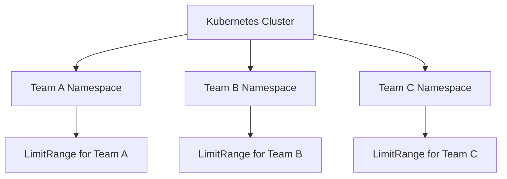

# Kubernetes LimitRanges

## Introduction

When managing a Kubernetes cluster, one of the key challenges is efficient resource allocation. Without proper constraints, some workloads might consume excessive resources, leaving others resource-starved. This is where **LimitRanges** come into play.

LimitRanges are Kubernetes objects that enforce constraints on resource consumption in a namespace. They provide a way to:

- Set default resource requests and limits for containers
- Establish minimum and maximum constraints for resource usage
- Control the ratio between requests and limits

By using LimitRanges effectively, cluster administrators can ensure fair resource distribution and prevent resource hogging by individual pods or containers.

## Why Use LimitRanges?

Before diving into how LimitRanges work, let's understand why they're important:

1. **Resource Fairness**: Ensure all applications have access to the resources they need
2. **Cost Control**: Prevent wastage of expensive cluster resources
3. **Predictable Performance**: Avoid situations where applications fail unpredictably due to resource starvation
4. **Quota Compliance**: Help teams stay within assigned resource quotas

## Understanding LimitRange Concepts

A LimitRange resource has several constraint types that can be applied to different Kubernetes objects:

| Constraint Type | Description |
|-----------------|-------------|
| **Container** | Applies to individual containers within pods |
| **Pod** | Applies to the sum of all containers in a pod |
| **PersistentVolumeClaim** | Applies to storage requests |

For each type, you can specify the following constraints:

- `default`: Default limits for a container if not specified
- `defaultRequest`: Default requests for a container if not specified
- `min`: Minimum amount of resources allowed
- `max`: Maximum amount of resources allowed
- `maxLimitRequestRatio`: Maximum ratio between limit and request

## Creating Your First LimitRange

Let's create a basic LimitRange that sets constraints for CPU and memory:

```yaml
apiVersion: v1
kind: LimitRange
metadata:
  name: cpu-memory-limit-range
  namespace: default
spec:
  limits:
  - type: Container
    default:
      cpu: "1"
      memory: "512Mi"
    defaultRequest:
      cpu: "0.5"
      memory: "256Mi"
    min:
      cpu: "100m"
      memory: "64Mi"
    max:
      cpu: "2"
      memory: "1Gi"
    maxLimitRequestRatio:
      cpu: 4
```

Let's break down this example:

- We're creating a LimitRange named `cpu-memory-limit-range` in the `default` namespace
- For container constraints, we set:
  - Default limits: 1 CPU core and 512 MiB memory
  - Default requests: 0.5 CPU core and 256 MiB memory
  - Minimum requirements: 100 millicores CPU and 64 MiB memory
  - Maximum allowed: 2 CPU cores and 1 GiB memory
  - Maximum ratio between limit and request for CPU: 4

## Applying the LimitRange

Save the above YAML to a file named `limitrange.yaml` and apply it using `kubectl`:

```bash
kubectl apply -f limitrange.yaml
```

Output:
```
limitrange/cpu-memory-limit-range created
```

To verify the LimitRange was created successfully:

```bash
kubectl get limitranges
```

Output:
```
NAME                    CREATED AT
cpu-memory-limit-range  2023-09-25T10:15:30Z
```

For more details:

```bash
kubectl describe limitrange cpu-memory-limit-range
```

Output:
```
Name:       cpu-memory-limit-range
Namespace:  default
Type        Resource  Min    Max  Default Request  Default Limit  Max Limit/Request Ratio
----        --------  ---    ---  ---------------  -------------  -----------------------
Container   cpu       100m   2    500m             1              4
Container   memory    64Mi   1Gi  256Mi            512Mi          -
```

## LimitRange in Action

Let's see how LimitRanges affect pods in practice with a few examples.

### Example 1: Pod with No Resource Specifications

When you deploy a pod without specifying resources, the default values from the LimitRange are applied:

```yaml
apiVersion: v1
kind: Pod
metadata:
  name: default-pod
spec:
  containers:
  - name: default-container
    image: nginx
```

After deploying this pod, Kubernetes will automatically add the default values:

```bash
kubectl get pod default-pod -o=jsonpath='{.spec.containers[0].resources}'
```

Output:
```json
{"limits":{"cpu":"1","memory":"512Mi"},"requests":{"cpu":"500m","memory":"256Mi"}}
```

### Example 2: Pod That Violates Minimum Requirements

Let's try to create a pod that doesn't meet the minimum requirements:

```yaml
apiVersion: v1
kind: Pod
metadata:
  name: small-pod
spec:
  containers:
  - name: small-container
    image: nginx
    resources:
      requests:
        memory: "32Mi"  # Less than the 64Mi minimum
        cpu: "50m"      # Less than the 100m minimum
```

When you try to create this pod, you'll get an error:

```bash
kubectl apply -f small-pod.yaml
```

Output:
```
Error from server (Forbidden): error when creating "small-pod.yaml": pods "small-pod" is forbidden: 
[minimum memory usage per Container is 64Mi, but request is 32Mi, 
minimum cpu usage per Container is 100m, but request is 50m]
```

### Example 3: Pod That Exceeds Maximum Limits

Similarly, pods that exceed maximum limits will be rejected:

```yaml
apiVersion: v1
kind: Pod
metadata:
  name: large-pod
spec:
  containers:
  - name: large-container
    image: nginx
    resources:
      limits:
        memory: "2Gi"  # More than the 1Gi maximum
        cpu: "3"       # More than the 2 CPU maximum
```

When you try to create this pod:

```bash
kubectl apply -f large-pod.yaml
```

Output:
```
Error from server (Forbidden): error when creating "large-pod.yaml": pods "large-pod" is forbidden: 
[maximum memory usage per Container is 1Gi, but limit is 2Gi, 
maximum cpu usage per Container is 2, but limit is 3]
```

## Setting Up LimitRanges for Storage

LimitRanges can also control PersistentVolumeClaim sizes:

```yaml
apiVersion: v1
kind: LimitRange
metadata:
  name: storage-limit-range
  namespace: default
spec:
  limits:
  - type: PersistentVolumeClaim
    min:
      storage: 1Gi
    max:
      storage: 10Gi
```

This example:
- Sets a minimum storage request of 1 GiB
- Sets a maximum storage request of 10 GiB

## Namespace-Specific LimitRanges

One key feature of LimitRanges is that they're namespace-scoped. This allows different teams or environments to have different constraints:

```yaml
apiVersion: v1
kind: Namespace
metadata:
  name: development
---
apiVersion: v1
kind: LimitRange
metadata:
  name: dev-limits
  namespace: development
spec:
  limits:
  - type: Container
    default:
      cpu: "0.5"
      memory: "256Mi"
---
apiVersion: v1
kind: Namespace
metadata:
  name: production
---
apiVersion: v1
kind: LimitRange
metadata:
  name: prod-limits
  namespace: production
spec:
  limits:
  - type: Container
    default:
      cpu: "1"
      memory: "512Mi"
```

This configuration gives development environments more relaxed defaults than production environments.

## Advanced LimitRange Patterns

### Multi-Container Pod Constraints

For pods with multiple containers, you can set limits on the total pod resources:

```yaml
apiVersion: v1
kind: LimitRange
metadata:
  name: pod-limit-range
spec:
  limits:
  - type: Pod
    max:
      cpu: "4"
      memory: "4Gi"
    min:
      cpu: "200m"
      memory: "128Mi"
```

### Enforcing Resource Ratios

The `maxLimitRequestRatio` ensures that limits and requests aren't too far apart, which helps with resource predictability:

```yaml
apiVersion: v1
kind: LimitRange
metadata:
  name: ratio-limit-range
spec:
  limits:
  - type: Container
    maxLimitRequestRatio:
      cpu: 2
      memory: 2
```

## Real-World Use Cases

### Scenario 1: Multi-Tenant Cluster

In a shared cluster with multiple teams, you can use namespaces and LimitRanges to ensure fair resource allocation:



Each team gets its own namespace with appropriate limits based on their needs and priorities.

### Scenario 2: Staging vs Production Environments

You can apply different constraints to different environments:

```yaml
# For staging
apiVersion: v1
kind: LimitRange
metadata:
  name: staging-limits
  namespace: staging
spec:
  limits:
  - type: Container
    default:
      cpu: "0.5"
      memory: "256Mi"
    max:
      cpu: "1"
      memory: "1Gi"

# For production
apiVersion: v1
kind: LimitRange
metadata:
  name: production-limits
  namespace: production
spec:
  limits:
  - type: Container
    default:
      cpu: "1"
      memory: "512Mi"
    max:
      cpu: "4"
      memory: "8Gi"
```

### Scenario 3: Cost Optimization

For cloud environments where resources cost money, LimitRanges can help control expenses:

```yaml
apiVersion: v1
kind: LimitRange
metadata:
  name: cost-saving-limits
spec:
  limits:
  - type: Container
    defaultRequest:
      cpu: "100m"  # Start with minimal CPU
      memory: "128Mi"  # Start with minimal memory
    default:
      cpu: "300m"  # Cap at reasonable levels
      memory: "256Mi"
```

## Best Practices for Using LimitRanges

1. **Start with Monitoring**: Before setting hard limits, monitor your applications to understand their resource usage patterns
2. **Set Reasonable Defaults**: Make default values reasonable for most of your workloads
3. **Consider Application Types**: Different applications have different resource profiles; consider having multiple namespaces with appropriate limits
4. **Combine with ResourceQuotas**: Use LimitRanges alongside ResourceQuotas for complete resource governance
5. **Educate Your Teams**: Make sure developers understand the constraints and how to optimize their applications
6. **Regularly Review**: Resource needs change over time; review and update your LimitRanges periodically

## Limitations and Considerations

While LimitRanges are powerful, they have some limitations:

1. **No Aggregate Control**: LimitRanges don't control the total resources used in a namespace (use ResourceQuotas for that)
2. **Per-Creation Enforcement**: LimitRanges are only enforced at creation time; existing pods aren't affected by new LimitRanges
3. **Limited Resource Types**: Only supports constraints on CPU, memory, and storage
4. **No Horizontal Pod Autoscaler Awareness**: LimitRanges don't consider the scaling behavior of HPA

## Troubleshooting LimitRanges

If you're encountering issues with LimitRanges, here are some troubleshooting steps:

1. **Check LimitRange Configuration**:
   ```bash
   kubectl describe limitrange <limitrange-name> -n <namespace>
   ```

2. **Verify Pod Resource Specifications**:
   ```bash
   kubectl get pod <pod-name> -n <namespace> -o yaml
   ```

3. **Check for Rejection Events**:
   ```bash
   kubectl get events -n <namespace> | grep "Error"
   ```

4. **Review Namespace Association**:
   Ensure your LimitRange is in the same namespace as your pods

## Summary

Kubernetes LimitRanges provide a powerful mechanism for controlling resource usage at a namespace level. They help ensure fair resource allocation, prevent resource hoarding, and maintain cluster stability.

Key takeaways:
- LimitRanges set constraints on resources that containers and pods can use
- They can define minimum, maximum, default values and ratios
- LimitRanges are namespace-scoped, allowing different constraints for different teams or environments
- They're enforced at creation time, not retroactively
- Combine them with ResourceQuotas for comprehensive resource management

## Additional Resources

- [Kubernetes Documentation on LimitRanges](https://kubernetes.io/docs/concepts/policy/limit-range/)
- [Resource Quotas in Kubernetes](https://kubernetes.io/docs/concepts/policy/resource-quotas/)
- [Resource Management for Pods and Containers](https://kubernetes.io/docs/concepts/configuration/manage-resources-containers/)

## Exercises

1. Set up a LimitRange in a test namespace that enforces CPU limits between 100m and 1 core.
2. Create a pod that complies with your LimitRange and another that violates it. Observe the behavior.
3. Implement a LimitRange that sets default resource requests but no hard limits.
4. Create a multi-container pod and apply a Pod-type LimitRange to restrict its total resource consumption.
5. Implement a complete resource governance strategy combining LimitRanges and ResourceQuotas for a simulated multi-tenant environment.