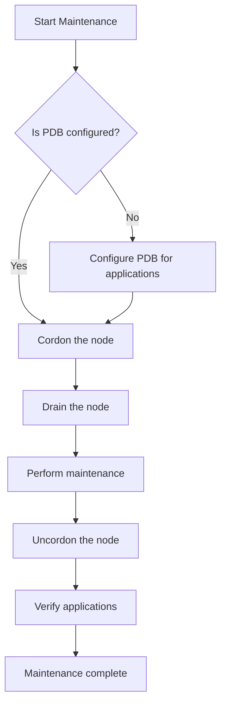

# Kubernetes Node Maintenance

## Introduction

In a Kubernetes cluster, nodes are the worker machines that run your containerized applications. Just like any other infrastructure component, nodes require regular maintenance — whether it's for security updates, kernel upgrades, hardware repairs, or resource scaling. However, performing maintenance on nodes that are actively running workloads can lead to application downtime if not handled correctly.

This guide will walk you through the proper procedures for performing maintenance on Kubernetes nodes while minimizing disruption to your applications.

## Why Node Maintenance Matters

Proper node maintenance is crucial for several reasons:

- **Security**: Regular updates help protect your cluster from vulnerabilities
- **Stability**: Kernel and OS updates can improve node performance and reliability
- **Resource management**: Scaling up or down requires adding or removing nodes
- **Hardware maintenance**: Physical servers occasionally need repairs or replacements

Kubernetes provides specific tools to help you safely maintain nodes without disrupting your workloads.

## Prerequisites

Before you begin, make sure you have:

- A running Kubernetes cluster
- `kubectl` installed and configured to communicate with your cluster
- Appropriate permissions to manage nodes in your cluster

## Understanding Node States

Kubernetes nodes can be in different states that affect how workloads are scheduled:

1. **Ready**: The node is healthy and available to accept new pods
2. **NotReady**: The node is unhealthy and cannot accept new pods
3. **SchedulingDisabled**: The node is cordoned (marked as unschedulable) but existing pods continue to run

Let's see how to check the current state of nodes in your cluster:

```bash
# List all nodes with their status
kubectl get nodes

# Output
NAME           STATUS   ROLES    AGE    VERSION
worker-node-1  Ready    <none>   45d    v1.26.5
worker-node-2  Ready    <none>   45d    v1.26.5
worker-node-3  Ready    <none>   45d    v1.26.5
```

You can get more detailed information about a specific node with:

```bash
kubectl describe node worker-node-1
```

## Key Node Maintenance Operations

### 1. Cordoning a Node

Cordoning a node marks it as unschedulable, which prevents new pods from being scheduled on it. This is the first step in the maintenance process.

```bash
# Mark a node as unschedulable
kubectl cordon worker-node-1

# Verify the node is cordoned
kubectl get nodes
```

After running the cordon command, you'll see `SchedulingDisabled` in the STATUS column:

```
NAME           STATUS                     ROLES    AGE    VERSION
worker-node-1  Ready,SchedulingDisabled   <none>   45d    v1.26.5
worker-node-2  Ready                      <none>   45d    v1.26.5
worker-node-3  Ready                      <none>   45d    v1.26.5
```

**Important**: Cordoning a node only prevents new pods from being scheduled. Existing pods continue to run.

### 2. Draining a Node

Draining a node safely evicts all pods from the node, allowing them to be rescheduled on other nodes. This is the crucial step before performing actual maintenance.

```bash
# Drain a node (will also cordon if not already done)
kubectl drain worker-node-1 --ignore-daemonsets --delete-emptydir-data
```

Let's understand the flags:

- `--ignore-daemonsets`: DaemonSet pods are designed to run on all nodes and will be recreated after maintenance, so we can ignore them during draining.
- `--delete-emptydir-data`: Allows deletion of pods using emptyDir volumes. Data in these volumes will be lost!

You'll see output showing the pods being evicted:

```
node/worker-node-1 cordoned
evicting pod default/nginx-deployment-66b6c48dd5-7bqxz
evicting pod kube-system/coredns-74ff55c5b-7vxsh
...
node/worker-node-1 drained
```

**Warning**: Pods using local storage (emptyDir) will lose their data when evicted. Plan accordingly!

### 3. Performing Maintenance

With the node drained, you can now safely perform maintenance operations. This might include:

```bash
# SSH into the node
ssh user@worker-node-1

# Update the system
sudo apt update && sudo apt upgrade -y

# Restart the node if necessary
sudo reboot
```

### 4. Uncordoning a Node

Once maintenance is complete and the node is back online, make it schedulable again:

```bash
# Mark the node as schedulable
kubectl uncordon worker-node-1

# Verify the node is uncordoned
kubectl get nodes
```

The node will return to the normal `Ready` state:

```
NAME           STATUS   ROLES    AGE    VERSION
worker-node-1  Ready    <none>   45d    v1.26.5
worker-node-2  Ready    <none>   45d    v1.26.5
worker-node-3  Ready    <none>   45d    v1.26.5
```

## Pod Disruption Budgets (PDBs)

To ensure high availability during node maintenance, you should configure Pod Disruption Budgets (PDBs) for your applications. PDBs define how many replicas of an application can be down at once.

Here's an example PDB that ensures at least 2 replicas of your application remain available at all times:

```yaml
apiVersion: policy/v1
kind: PodDisruptionBudget
metadata:
  name: app-pdb
spec:
  minAvailable: 2
  selector:
    matchLabels:
      app: my-app
```

You can apply this using:

```bash
kubectl apply -f pdb.yaml
```

With a PDB in place, the `kubectl drain` command will respect these constraints and ensure your application maintains minimum availability.

## Automating Node Maintenance

For larger clusters, you might want to automate maintenance with tools like:

1. **kured** (Kubernetes Reboot Daemon): Automatically coordinates node reboots after updates
2. **Cluster Autoscaler**: Automatically adjusts the size of your cluster
3. **Node Problem Detector**: Identifies node issues automatically

Here's a quick example of setting up kured:

```bash
# Install kured using Helm
helm repo add kured https://weaveworks.github.io/kured
helm install kured kured/kured --namespace kube-system
```

## Real-World Maintenance Workflow

Let's walk through a complete node maintenance scenario for replacing a failing disk:

1. **Identify the node that needs maintenance**:
   ```bash
   kubectl get nodes
   kubectl describe node worker-node-1
   ```

2. **Cordon the node to prevent new workloads**:
   ```bash
   kubectl cordon worker-node-1
   ```

3. **Drain the node safely**:
   ```bash
   kubectl drain worker-node-1 --ignore-daemonsets --delete-emptydir-data
   ```

4. **Perform the hardware maintenance**:
   ```bash
   # SSH to the node
   ssh admin@worker-node-1
   
   # Shutdown the node
   sudo shutdown -h now
   
   # Replace the disk physically
   # Boot the node back up
   ```

5. **Verify the node is healthy**:
   ```bash
   kubectl get nodes
   kubectl describe node worker-node-1
   ```

6. **Make the node schedulable again**:
   ```bash
   kubectl uncordon worker-node-1
   ```

7. **Monitor as workloads return to the node**:
   ```bash
   kubectl get pods -o wide
   ```

## Node Maintenance Best Practices

1. **Plan maintenance during low-traffic periods** when possible
2. **Always use PDBs** for critical applications to maintain availability
3. **Perform rolling maintenance** on one node at a time
4. **Monitor cluster capacity** before draining nodes to ensure there are enough resources for rescheduled pods
5. **Have alerting in place** to notify you of any issues during maintenance
6. **Document your maintenance procedures** for consistency and knowledge sharing

## Troubleshooting Common Issues

### Pods Won't Evict During Drain

If pods are stuck during eviction, check:

```bash
# Get details of the pod
kubectl describe pod stuck-pod-name

# Check for PDB issues
kubectl get pdb
kubectl describe pdb my-pdb
```

Common causes include:
- Insufficient resources on other nodes
- Pod Disruption Budget constraints
- StatefulSets with local storage
- Pods with `nodeName` directly specified

### Node Won't Return to Ready State

If a node doesn't return to `Ready` after maintenance:

```bash
# Check node status
kubectl describe node worker-node-1

# Check kubelet logs on the node
ssh admin@worker-node-1
sudo journalctl -u kubelet
```

## Node Maintenance Flowchart



## Summary

Proper node maintenance is essential for keeping your Kubernetes cluster healthy, secure, and performant. By following the steps outlined in this guide, you can perform maintenance tasks with minimal disruption to your applications:

1. Cordon the node to prevent new workloads
2. Drain the node to safely evict existing pods
3. Perform the necessary maintenance
4. Uncordon the node to make it schedulable again

Remember that Kubernetes was designed to handle node failures and maintenance gracefully, but proper preparation and procedures are still necessary to ensure smooth operations.

## Additional Resources

- [Kubernetes Official Documentation on Draining Nodes](https://kubernetes.io/docs/tasks/administer-cluster/safely-drain-node/)
- [Pod Disruption Budgets](https://kubernetes.io/docs/concepts/workloads/pods/disruptions/)
- [Kured - Kubernetes Reboot Daemon](https://github.com/weaveworks/kured)

## Practice Exercises

1. Set up a test cluster and practice cordoning and draining nodes
2. Create PDBs for a sample application and observe how they affect the drain process
3. Automate a node maintenance workflow using shell scripts
4. Simulate a node failure and practice recovery procedures