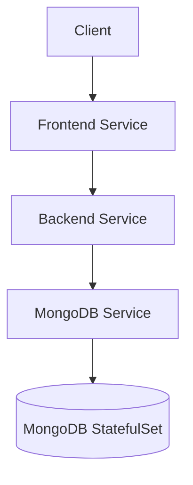

# Kubernetes Helm

## Introduction

Imagine you're setting up a complex application on Kubernetes that requires dozens of configuration files, services, deployments, and other resources. Managing all these components manually would be time-consuming and error-prone. This is where Helm comes in.

Helm is the package manager for Kubernetes, similar to how npm is for JavaScript or apt is for Ubuntu. It allows you to define, install, and upgrade even the most complex Kubernetes applications through packages called "charts."

In this guide, you'll learn:
- What Helm is and why it's valuable
- Key Helm concepts
- How to install and use Helm
- Creating and managing your own Helm charts
- Real-world examples and best practices

## What is Helm?

Helm is a tool that streamlines installing and managing Kubernetes applications. It's like a package manager for Kubernetes that helps you manage Kubernetes applications through Helm Charts, which are packages of pre-configured Kubernetes resources.

### Why Use Helm?

1. **Simplifies Complexity**: Package multiple Kubernetes resources into a single chart
2. **Version Control**: Track and control versions of deployed applications
3. **Easy Updates and Rollbacks**: Simplify application upgrades and rollbacks
4. **Reusability**: Share and reuse Kubernetes configurations
5. **Templating**: Customize deployments with variable substitution

## Key Helm Concepts

### Charts

A Helm chart is a collection of files that describe a related set of Kubernetes resources. A chart contains:

- YAML configuration files for Kubernetes objects (deployments, services, etc.)
- Templates that generate Kubernetes manifest files
- Values that can be used to customize the templates
- Metadata about the chart itself

### Releases

When a chart is installed into the Kubernetes cluster, Helm creates a "release" of that chart. A release is a specific instance of a chart running in a Kubernetes cluster.

### Repositories

Helm charts can be stored in repositories, which are HTTP servers that house packaged charts. There are public repositories like the official Helm repository, and you can also create private repositories for your organization.

## Installing Helm

Let's start by installing Helm:

```bash
# Using Homebrew (macOS)
brew install helm

# Using Chocolatey (Windows)
choco install kubernetes-helm

# Using apt (Debian/Ubuntu)
curl https://baltocdn.com/helm/signing.asc | gpg --dearmor | sudo tee /usr/share/keyrings/helm.gpg > /dev/null
sudo apt-get install apt-transport-https --yes
echo "deb [arch=$(dpkg --print-architecture) signed-by=/usr/share/keyrings/helm.gpg] https://baltocdn.com/helm/stable/debian/ all main" | sudo tee /etc/apt/sources.list.d/helm-stable-debian.list
sudo apt-get update
sudo apt-get install helm
```

Verify your installation:

```bash
helm version
```

Expected output:
```
version.BuildInfo{Version:"v3.12.0", GitCommit:"c9f554d5d3874e407c6677e3c9a35e592ca06138", GitTreeState:"clean", GoVersion:"go1.20.4"}
```

## Using Helm

### Adding a Repository

Let's add the official Helm stable repository:

```bash
helm repo add stable https://charts.helm.sh/stable
helm repo update
```

### Searching for Charts

You can search for available charts:

```bash
helm search repo stable
```

Expected output (truncated):
```
NAME                                 	CHART VERSION	APP VERSION  	DESCRIPTION                                       
stable/acs-engine-autoscaler         	2.2.2        	2.1.1        	DEPRECATED Scales worker nodes within agent pools 
stable/aerospike                     	0.3.5        	v4.5.0.5     	DEPRECATED A Helm chart for Aerospike in Kubern...
stable/airflow                       	7.13.3       	1.10.12      	DEPRECATED Airflow is a platform to programmatic...
...
```

### Installing a Chart

Let's install a simple example chart - Nginx:

```bash
helm repo add bitnami https://charts.bitnami.com/bitnami
helm install my-nginx bitnami/nginx
```

Expected output:
```
NAME: my-nginx
LAST DEPLOYED: Wed Mar 10 15:05:44 2023
NAMESPACE: default
STATUS: deployed
REVISION: 1
TEST SUITE: None
NOTES:
CHART NAME: nginx
CHART VERSION: 13.2.26
APP VERSION: 1.23.3

** Please be patient while the chart is being deployed **

NGINX can be accessed through the following DNS name from within your cluster:

    my-nginx.default.svc.cluster.local (port 80)

To access NGINX from outside the cluster, follow the steps below:

1. Get the NGINX URL by running these commands:

  NOTE: It may take a few minutes for the LoadBalancer IP to be available.
        Watch the status with: 'kubectl get svc --namespace default -w my-nginx'

    export SERVICE_PORT=$(kubectl get --namespace default -o jsonpath="{.spec.ports[0].port}" services my-nginx)
    export SERVICE_IP=$(kubectl get svc --namespace default my-nginx -o jsonpath='{.status.loadBalancer.ingress[0].ip}')
    echo "http://${SERVICE_IP}:${SERVICE_PORT}"
```

### Listing Installed Releases

View all your deployed releases:

```bash
helm list
```

Expected output:
```
NAME    	NAMESPACE	REVISION	UPDATED                             	STATUS  	CHART      	APP VERSION
my-nginx	default  	1       	2023-03-10 15:05:44.96131 -0700 MST	deployed	nginx-13.2.26	1.23.3     
```

### Upgrading a Release

Let's upgrade our Nginx installation by changing some values:

```bash
helm upgrade my-nginx bitnami/nginx --set replicaCount=2
```

Expected output:
```
Release "my-nginx" has been upgraded. Happy Helming!
NAME: my-nginx
LAST DEPLOYED: Wed Mar 10 15:10:23 2023
NAMESPACE: default
STATUS: deployed
REVISION: 2
TEST SUITE: None
NOTES:
...
```

### Rollback a Release

If something goes wrong, you can rollback to a previous version:

```bash
helm rollback my-nginx 1
```

Expected output:
```
Rollback was a success! Happy Helming!
```

### Uninstalling a Release

To remove a release:

```bash
helm uninstall my-nginx
```

Expected output:
```
release "my-nginx" uninstalled
```

## Creating Your Own Helm Chart

Let's create a simple Helm chart for a basic web application:

```bash
# Create a new chart
helm create mychart
```

This creates a directory structure like:

```
mychart/
  ├── Chart.yaml           # Chart metadata
  ├── values.yaml          # Default configuration values
  ├── templates/           # Templates that generate Kubernetes manifests
  │   ├── deployment.yaml
  │   ├── service.yaml
  │   ├── _helpers.tpl     # Template helpers
  │   └── ...
  └── charts/              # Dependencies (optional)
```

### Understanding Chart Structure

Let's examine the key files:

**Chart.yaml** - Contains chart metadata:
```yaml
apiVersion: v2
name: mychart
description: A Helm chart for Kubernetes
type: application
version: 0.1.0
appVersion: "1.16.0"
```

**values.yaml** - Default configuration values:
```yaml
replicaCount: 1

image:
  repository: nginx
  pullPolicy: IfNotPresent
  tag: ""

service:
  type: ClusterIP
  port: 80

resources: {}
```

**templates/deployment.yaml** - Notice the use of template variables with `{{ }}`:
```yaml
apiVersion: apps/v1
kind: Deployment
metadata:
  name: {{ include "mychart.fullname" . }}
  labels:
    {{- include "mychart.labels" . | nindent 4 }}
spec:
  replicas: {{ .Values.replicaCount }}
  selector:
    matchLabels:
      {{- include "mychart.selectorLabels" . | nindent 6 }}
  template:
    metadata:
      labels:
        {{- include "mychart.selectorLabels" . | nindent 8 }}
    spec:
      containers:
        - name: {{ .Chart.Name }}
          image: "{{ .Values.image.repository }}:{{ .Values.image.tag | default .Chart.AppVersion }}"
          imagePullPolicy: {{ .Values.image.pullPolicy }}
          ports:
            - name: http
              containerPort: 80
              protocol: TCP
```

### Customizing Your Chart

Let's modify our chart to deploy a simple Node.js application. Edit `values.yaml`:

```yaml
replicaCount: 2

image:
  repository: node
  pullPolicy: IfNotPresent
  tag: "16-alpine"

service:
  type: LoadBalancer
  port: 3000

application:
  name: "my-nodejs-app"
  environment:
    NODE_ENV: production
```

Now, let's modify the deployment template to use these values. Edit `templates/deployment.yaml`:

```yaml
apiVersion: apps/v1
kind: Deployment
metadata:
  name: {{ include "mychart.fullname" . }}
  labels:
    {{- include "mychart.labels" . | nindent 4 }}
    app.kubernetes.io/name: {{ .Values.application.name }}
spec:
  replicas: {{ .Values.replicaCount }}
  selector:
    matchLabels:
      {{- include "mychart.selectorLabels" . | nindent 6 }}
  template:
    metadata:
      labels:
        {{- include "mychart.selectorLabels" . | nindent 8 }}
    spec:
      containers:
        - name: {{ .Chart.Name }}
          image: "{{ .Values.image.repository }}:{{ .Values.image.tag | default .Chart.AppVersion }}"
          imagePullPolicy: {{ .Values.image.pullPolicy }}
          env:
          {{- range $key, $value := .Values.application.environment }}
            - name: {{ $key }}
              value: {{ $value | quote }}
          {{- end }}
          ports:
            - name: http
              containerPort: {{ .Values.service.port }}
              protocol: TCP
```

### Testing Your Chart

You can see what Kubernetes manifests would be generated using:

```bash
helm template mychart
```

To check for potential issues:

```bash
helm lint mychart
```

Expected output:
```
==> Linting mychart
[INFO] Chart.yaml: icon is recommended

1 chart(s) linted, 0 chart(s) failed
```

### Installing Your Chart

Install your chart into your Kubernetes cluster:

```bash
helm install myapp ./mychart
```

### Packaging Your Chart

To share your chart with others, package it into an archive:

```bash
helm package mychart
```

Expected output:
```
Successfully packaged chart and saved it to: /path/to/mychart-0.1.0.tgz
```

## Helm Chart Repository Management

### Creating a Chart Repository

You can host your own chart repository using any HTTP server. Here's a simple example using GitHub Pages:

1. Create a GitHub repository
2. Clone it locally
3. Create an `index.yaml` file
4. Add packaged charts
5. Generate index file:

```bash
helm repo index --url https://yourusername.github.io/helm-charts/ .
```

6. Push to GitHub and enable GitHub Pages

## Real-World Example: Deploying a Multi-Tier Application

Let's see how Helm can be used to deploy a three-tier application with:
- Frontend (React)
- Backend API (Node.js)
- Database (MongoDB)

### Architecture Diagram



### Creating the Chart Structure

```bash
helm create multi-tier-app
```

Modify `values.yaml` to define our components:

```yaml
frontend:
  name: frontend
  replicaCount: 2
  image:
    repository: myapp/frontend
    tag: "1.0.0"
  service:
    type: LoadBalancer
    port: 80

backend:
  name: backend-api
  replicaCount: 3
  image:
    repository: myapp/backend
    tag: "1.0.0"
  service:
    type: ClusterIP
    port: 3000

database:
  name: mongodb
  image:
    repository: mongo
    tag: "5.0.9"
  persistence:
    enabled: true
    size: 10Gi
  service:
    type: ClusterIP
    port: 27017
```

Create templates for each component:

**templates/frontend-deployment.yaml**:
```yaml
apiVersion: apps/v1
kind: Deployment
metadata:
  name: {{ .Release.Name }}-{{ .Values.frontend.name }}
spec:
  replicas: {{ .Values.frontend.replicaCount }}
  selector:
    matchLabels:
      app: {{ .Values.frontend.name }}
  template:
    metadata:
      labels:
        app: {{ .Values.frontend.name }}
    spec:
      containers:
      - name: {{ .Values.frontend.name }}
        image: "{{ .Values.frontend.image.repository }}:{{ .Values.frontend.image.tag }}"
        ports:
        - containerPort: 80
        env:
        - name: BACKEND_URL
          value: "http://{{ .Release.Name }}-{{ .Values.backend.name }}:{{ .Values.backend.service.port }}"
```

Similarly, create templates for backend, database, and all required services and volumes.

### Installing the Multi-Tier Application

```bash
helm install my-app ./multi-tier-app
```

## Best Practices

1. **Version Control**: Store your Helm charts in a version control system like Git
2. **Use Semantic Versioning**: Follow semantic versioning for your charts
3. **Document Values**: Add comments to your `values.yaml` file
4. **Validate Charts**: Use `helm lint` and `helm template` before deployment
5. **Security**: Use secrets for sensitive information
6. **Use Dependencies**: Leverage chart dependencies for complex applications
7. **Test Installations**: Test chart installation in a staging environment before production
8. **Consistent Naming**: Use consistent naming conventions for your charts and templates

## Debugging Helm Charts

When things go wrong:

```bash
# Debug a chart
helm install --debug --dry-run my-release ./mychart

# Get release status
helm status my-release

# Get release history
helm history my-release

# View release notes
helm get notes my-release

# View release values
helm get values my-release
```

## Advanced Topics

### Helm Hooks

Hooks let you intervene at certain points in a release's life cycle:

```yaml
apiVersion: batch/v1
kind: Job
metadata:
  name: {{ .Release.Name }}-db-init
  annotations:
    "helm.sh/hook": post-install
    "helm.sh/hook-weight": "-5"
    "helm.sh/hook-delete-policy": hook-succeeded
spec:
  template:
    spec:
      containers:
      - name: db-init
        image: mongo:5.0.9
        command: ["mongo", "--host", "{{ .Release.Name }}-mongodb", "--eval", "db.createUser({user:'admin',pwd:'password',roles:['readWrite']})"]
      restartPolicy: Never
```

### Using Subcharts

For large applications, break down your chart into subcharts:

```
mychart/
  ├── Chart.yaml
  ├── values.yaml
  ├── charts/
  │   ├── frontend/
  │   ├── backend/
  │   └── database/
  └── templates/
```

In `Chart.yaml`, define dependencies:

```yaml
dependencies:
  - name: frontend
    version: "1.0.0"
    repository: "file://charts/frontend"
  - name: backend
    version: "1.0.0"
    repository: "file://charts/backend"
  - name: database
    version: "1.0.0"
    repository: "file://charts/database"
```

## Summary

Helm provides a powerful way to package, distribute, and manage Kubernetes applications:

- **Charts** provide a reusable package format
- **Releases** let you track installations
- **Templating** enables dynamic configuration
- **Repositories** facilitate sharing charts

By mastering Helm, you can significantly simplify Kubernetes application management, standardize deployments, and reduce the likelihood of configuration errors.

## Additional Resources

- [Official Helm Documentation](https://helm.sh/docs/)
- [Artifact Hub](https://artifacthub.io/) - Find and publish Helm charts
- [Helm GitHub Repository](https://github.com/helm/helm)
- [Helm Best Practices](https://helm.sh/docs/chart_best_practices/)

## Exercises

1. Create a Helm chart for a simple web application
2. Modify an existing Helm chart to add health checks
3. Package your chart and create a simple chart repository
4. Create a Helm chart with dependencies
5. Write a script to automate Helm chart testing and deployment