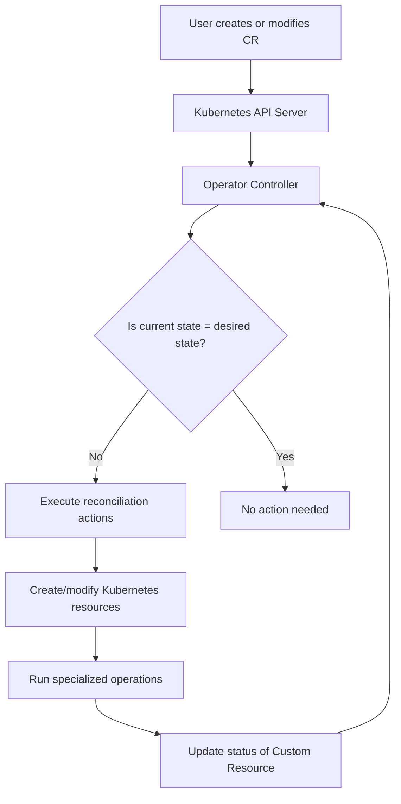

# Kubernetes Operators

## Introduction

Kubernetes Operators are specialized software extensions that use custom resources to manage applications and their components. They act as application-specific controllers that extend the Kubernetes API to create, configure, and manage complex applications on behalf of humans.

Think of Operators as automated site reliability engineers who know exactly how a specific application should be deployed, updated, backed up, and recovered. They represent the operational knowledge of human administrators encoded into software.

## Why Do We Need Operators?

Kubernetes already provides built-in resources like Deployments, Services, and ConfigMaps for running applications. However, these basic resources aren't enough for managing complex, stateful applications like databases, monitoring systems, or distributed applications that require specialized knowledge.

For example, when deploying a database like PostgreSQL, you need to:
- Configure primary and replica instances
- Set up authentication
- Implement backup procedures
- Handle version upgrades
- Manage data replication

Operators automate these tasks by encoding domain-specific knowledge into custom controllers and custom resources.

## Core Concepts

### Custom Resources

Custom Resources (CRs) extend the Kubernetes API by defining new resource types specific to your application. These work just like built-in resources (Pods, Deployments), but are tailored for your application.

For example, a PostgreSQL Operator might define a custom resource called `PostgresCluster` to represent a database cluster.

```yaml
apiVersion: postgres-operator.example.com/v1
kind: PostgresCluster
metadata:
  name: example-database
spec:
  version: "13.4"
  instances: 3
  storage:
    size: 10Gi
  backup:
    schedule: "0 0 * * *"
    retention: 7d
```

### Custom Controllers

Custom controllers are the active components of Operators that watch for changes in custom resources and take actions to bring the current state in line with the desired state (reconciliation).

The controller continuously:
1. Observes changes to custom resources
2. Compares current state with desired state
3. Takes actions to reconcile any differences

## How Operators Work



1. **Define the API**: First, the Operator creator defines custom resources that represent their application components.

2. **Install the CRD**: The Custom Resource Definition (CRD) is installed in the cluster to teach Kubernetes about the new resource type.

3. **Deploy the Controller**: The Operator's controller is deployed to watch for these custom resources.

4. **Usage**: Users create instances of the custom resources to request the desired state of their application.

5. **Reconciliation**: The controller continuously works to ensure the actual state matches the desired state.

## Building an Operator

There are several frameworks and tools to help you build Operators:

### Operator SDK

The [Operator SDK](https://sdk.operatorframework.io/) is the most popular framework for building Operators. It provides:

1. High-level APIs and abstractions
2. Scaffolding tools to generate boilerplate code
3. Extension points for custom logic

Here's a simplified workflow for creating an Operator with Operator SDK:

```bash
# Install Operator SDK
$ operator-sdk version
operator-sdk version: "v1.22.0"

# Create a new Operator project
$ operator-sdk init --domain example.com --repo github.com/example/app-operator

# Create a new API (Custom Resource and Controller)
$ operator-sdk create api --group apps --version v1alpha1 --kind AppService

# Implement controller logic in controllers/appservice_controller.go

# Build and push the Operator image
$ make docker-build docker-push IMG=example.com/app-operator:v0.0.1

# Deploy the Operator to the cluster
$ make deploy IMG=example.com/app-operator:v0.0.1
```

### KUDO (Kubernetes Universal Declarative Operator)

For simpler use cases, KUDO allows you to create Operators declaratively without writing Go code:

```yaml
apiVersion: kudo.dev/v1beta1
kind: Operator
metadata:
  name: mysql
spec:
  operatorVersion:
    name: mysql-1.0.0
    appVersion: 8.0.20
    parameters:
      - name: MYSQL_ROOT_PASSWORD
        default: password
```

## Real-World Examples

Let's explore some popular Kubernetes Operators and how they solve complex problems:

### Prometheus Operator

The Prometheus Operator simplifies the deployment and management of Prometheus monitoring stacks:

```yaml
apiVersion: monitoring.coreos.com/v1
kind: Prometheus
metadata:
  name: prometheus
spec:
  serviceAccountName: prometheus
  replicas: 2
  version: v2.36.0
  serviceMonitorSelector:
    matchLabels:
      team: frontend
```

With this simple resource, the Operator:
- Deploys multiple Prometheus instances
- Configures service discovery
- Manages configuration
- Sets up alerting rules
- Handles upgrades seamlessly

### Postgres Operator

The Postgres Operator by Zalando automates PostgreSQL database management:

```yaml
apiVersion: acid.zalan.do/v1
kind: postgresql
metadata:
  name: acid-postgres-cluster
spec:
  teamId: "acid"
  volume:
    size: 5Gi
  numberOfInstances: 3
  users:
    admin:
    - superuser
    - createdb
  postgresql:
    version: "14"
```

This Operator handles:
- High availability configuration
- Automated failover
- User management
- Backup and restore procedures
- Major and minor version upgrades

## Creating a Simple Operator: Step by Step

Let's create a simple ConfigMap Watcher Operator that watches for changes to ConfigMaps and prints their data:

1. First, create the project structure with Operator SDK:

```bash
# Initialize a new project
$ operator-sdk init --domain example.com --repo github.com/example/configmap-operator

# Create the controller (without a new CRD since we're using built-in ConfigMaps)
$ operator-sdk create controller --name ConfigMap --resource=false --controller=true
```

2. Implement the controller logic:

```go
// controllers/configmap_controller.go
package controllers

import (
	"context"
	
	corev1 "k8s.io/api/core/v1"
	"k8s.io/apimachinery/pkg/runtime"
	ctrl "sigs.k8s.io/controller-runtime"
	"sigs.k8s.io/controller-runtime/pkg/client"
	"sigs.k8s.io/controller-runtime/pkg/log"
)

// ConfigMapReconciler reconciles ConfigMap objects
type ConfigMapReconciler struct {
	client.Client
	Scheme *runtime.Scheme
}

// Reconcile handles ConfigMap events
func (r *ConfigMapReconciler) Reconcile(ctx context.Context, req ctrl.Request) (ctrl.Result, error) {
	logger := log.FromContext(ctx)
	
	// Fetch the ConfigMap
	configMap := &corev1.ConfigMap{}
	if err := r.Get(ctx, req.NamespacedName, configMap); err != nil {
		// ConfigMap not found, possibly deleted
		return ctrl.Result{}, client.IgnoreNotFound(err)
	}
	
	// Log the ConfigMap data
	logger.Info("ConfigMap reconciled", 
		"name", configMap.Name, 
		"namespace", configMap.Namespace, 
		"data", configMap.Data)
	
	return ctrl.Result{}, nil
}

// SetupWithManager sets up the controller with the Manager
func (r *ConfigMapReconciler) SetupWithManager(mgr ctrl.Manager) error {
	return ctrl.NewControllerManagedBy(mgr).
		For(&corev1.ConfigMap{}).
		Complete(r)
}
```

3. Register the controller in main.go:

```go
// main.go
func main() {
	// ...
	if err = (&controllers.ConfigMapReconciler{
		Client: mgr.GetClient(),
		Scheme: mgr.GetScheme(),
	}).SetupWithManager(mgr); err != nil {
		setupLog.Error(err, "unable to create controller", "controller", "ConfigMap")
		os.Exit(1)
	}
	// ...
}
```

4. Build and deploy the Operator:

```bash
$ make docker-build docker-push IMG=example.com/configmap-operator:v0.0.1
$ make deploy IMG=example.com/configmap-operator:v0.0.1
```

5. Test the Operator by creating a ConfigMap:

```bash
$ kubectl create configmap test-config --from-literal=key1=value1
```

6. Check the Operator logs to see it processing the ConfigMap:

```bash
$ kubectl logs -n configmap-operator-system \
  -l control-plane=controller-manager

INFO ConfigMap reconciled {"name": "test-config", "namespace": "default", "data": {"key1":"value1"}}
```

## Operator Maturity Model

The Operator Framework defines five levels of capability for Operators:

1. **Basic Installation**: Automated application installation and version upgrades
2. **Seamless Upgrades**: Application version upgrades with no service disruption
3. **Full Lifecycle**: Backups, failure recovery, and scaling
4. **Deep Insights**: Metrics, alerts, and log processing
5. **Auto-Pilot**: Automatic horizontal/vertical scaling, tuning, and failure remediation

As your Operator advances through these levels, it becomes more capable of running applications with minimal human intervention.

## Best Practices

When building Operators, follow these best practices:

1. **Start Simple**: Begin with basic installation capabilities before adding advanced features.

2. **Proper Status Reporting**: Update the status field of your custom resources to reflect the actual state.

```yaml
status:
  phase: Running
  conditions:
  - type: Available
    status: "True"
  - type: Progressing
    status: "False"
```

3. **Graceful Degradation**: Design Operators to function in degraded mode when dependencies are unavailable.

4. **Security First**: Use RBAC to limit the Operator's permissions to only what it needs.

5. **Idempotent Reconciliation**: The reconciliation function should be able to be run multiple times without causing problems.

6. **Meaningful Events**: Emit Kubernetes events to help users understand what's happening.

## Common Pitfalls

1. **Over-Engineering**: Don't build an Operator if a Helm chart would suffice.

2. **Resource Leaks**: Ensure your Operator cleans up resources when custom resources are deleted.

3. **Tight Coupling**: Avoid tight coupling between the Operator and the application.

4. **Insufficient Validation**: Implement thorough validation for custom resources.

5. **Missing Finalizers**: Use finalizers to handle cleanup when resources are deleted.

## Summary

Kubernetes Operators extend the platform's capabilities by automating complex application lifecycle management tasks. They combine custom resources (defining the desired state) with custom controllers (ensuring that state is achieved).

Key benefits include:
- Automated application management
- Encoded operational knowledge
- Consistent deployments
- Reduced operational burden
- Application-specific expertise built into software

As cloud-native applications grow more complex, Operators will play an increasingly important role in simplifying their deployment and management.

## Additional Resources

- [Operator Framework](https://operatorframework.io/)
- [Kubernetes Operator Pattern](https://kubernetes.io/docs/concepts/extend-kubernetes/operator/)
- [OperatorHub.io](https://operatorhub.io/) - A registry of community Operators

## Exercises

1. Install an existing Operator from OperatorHub and experiment with its custom resources.

2. Use the Operator SDK to create a simple Operator that watches for changes to Pods and logs their status.

3. Design a custom resource for an application you're familiar with. What fields would it need? What reconciliation actions would the controller need to take?

4. Convert an existing Helm chart to an Operator using the Operator SDK's Helm-based Operator support.