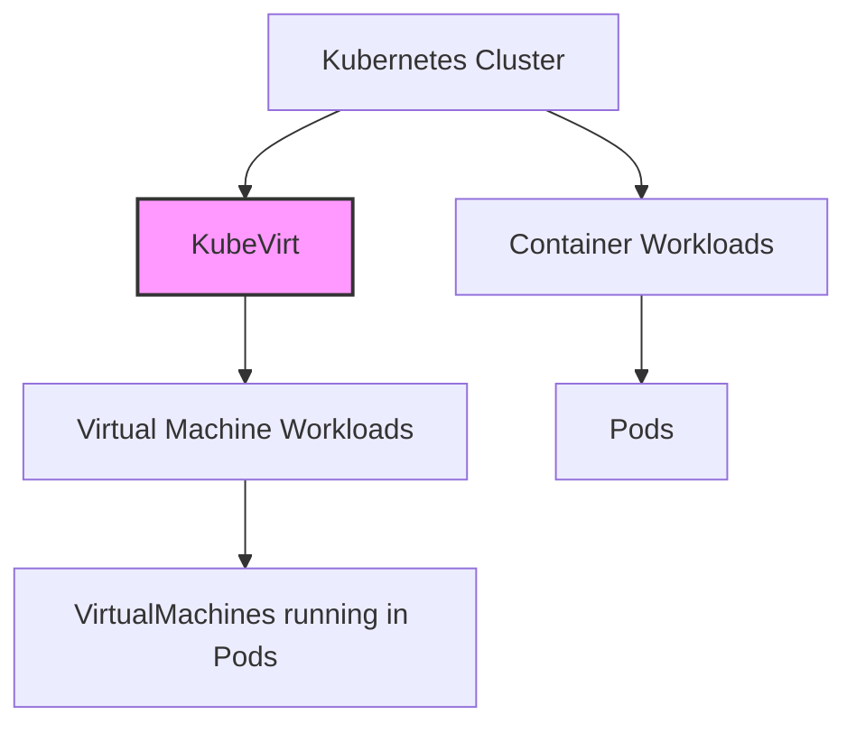
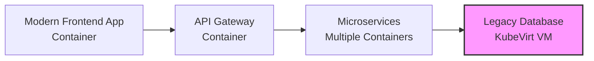

# Kubernetes KubeVirt

## Introduction

Have you ever wanted to run traditional virtual machines (VMs) alongside containers in your Kubernetes cluster? KubeVirt is the solution you've been looking for! As organizations transition to containerized applications, many still have workloads that require full virtualization. KubeVirt bridges this gap by bringing VM management to Kubernetes.

In this guide, we'll explore KubeVirt, how it extends the Kubernetes API to handle virtual machines, and how you can use it in your own infrastructure for a truly hybrid deployment strategy.

## What is KubeVirt?

KubeVirt is an open-source project that extends Kubernetes with Custom Resource Definitions (CRDs) to create, modify, and manage virtual machine workloads alongside your containerized applications. It allows you to run VMs within Kubernetes pods, letting you manage both containers and VMs using the same tooling and infrastructure.



### Why KubeVirt?

- **Legacy Application Support**: Run applications that require a full OS
- **Hybrid Infrastructure**: Manage both containers and VMs with one platform
- **Migration Path**: Gradually containerize applications while maintaining VMs
- **Specialized Workloads**: Support workloads that need direct hardware access
- **Consistent Operations**: Use the same Kubernetes tools to manage everything

## Getting Started with KubeVirt

### Prerequisites

Before we begin, you'll need:

- A working Kubernetes cluster (v1.19+)
- `kubectl` command-line tool configured to communicate with your cluster
- Cluster admin privileges

### Installation

Let's install KubeVirt on your Kubernetes cluster:

```bash
# Apply the KubeVirt operator
kubectl apply -f https://github.com/kubevirt/kubevirt/releases/download/v0.54.0/kubevirt-operator.yaml

# Create the KubeVirt custom resource
kubectl apply -f https://github.com/kubevirt/kubevirt/releases/download/v0.54.0/kubevirt-cr.yaml

# Wait for KubeVirt to be ready
kubectl wait -n kubevirt kv kubevirt --for condition=Available --timeout=300s
```

### Installing the virtctl Client Tool

`virtctl` is a command-line utility that helps you interact with KubeVirt:

```bash
# Download virtctl for Linux
curl -L -o virtctl https://github.com/kubevirt/kubevirt/releases/download/v0.54.0/virtctl-v0.54.0-linux-amd64

# Make it executable
chmod +x virtctl

# Move it to your PATH
sudo mv virtctl /usr/local/bin/
```

## Working with Virtual Machines

### Creating Your First Virtual Machine

Let's create a simple VM using KubeVirt. We'll define a VM specification in YAML:

```yaml
apiVersion: kubevirt.io/v1
kind: VirtualMachine
metadata:
  name: my-first-vm
spec:
  running: true
  template:
    metadata:
      labels:
        kubevirt.io/vm: my-first-vm
    spec:
      domain:
        devices:
          disks:
            - name: containerdisk
              disk:
                bus: virtio
            - name: cloudinitdisk
              disk:
                bus: virtio
          interfaces:
            - name: default
              masquerade: {}
        resources:
          requests:
            memory: 1Gi
            cpu: "1"
      networks:
        - name: default
          pod: {}
      volumes:
        - name: containerdisk
          containerDisk:
            image: quay.io/kubevirt/cirros-container-disk-demo:latest
        - name: cloudinitdisk
          cloudInitNoCloud:
            userDataBase64: SGkuXG4=
```

Save this file as `my-first-vm.yaml` and create the VM:

```bash
kubectl apply -f my-first-vm.yaml
```

### Understanding the VM Specification

Let's break down the VM specification:

1. **Basic Metadata**: Defines a name for the VM
2. **Running State**: `running: true` ensures the VM starts automatically
3. **Domain Section**: Defines VM hardware (CPU, memory, disks, interfaces)
4. **Volumes Section**: Defines the storage for the VM:
   - `containerDisk`: A disk image packaged as a container image
   - `cloudInitNoCloud`: Cloud-init configuration for VM initialization
5. **Networks Section**: Configures networking for the VM

### Checking VM Status

To see the status of your VMs:

```bash
kubectl get vms
```

Output:
```
NAME          AGE   STATUS    READY
my-first-vm   1m    Running   True
```

For more details:

```bash
kubectl describe vm my-first-vm
```

### Connecting to the VM Console

You can connect to the VM's console using `virtctl`:

```bash
virtctl console my-first-vm
```

To access the VM via VNC:

```bash
virtctl vnc my-first-vm
```

### VM Lifecycle Management

KubeVirt provides several operations for VM lifecycle management:

**Starting and stopping a VM:**

```bash
# Stop a VM
virtctl stop my-first-vm

# Start a VM
virtctl start my-first-vm
```

**Pausing and unpausing a VM:**

```bash
# Pause a VM
virtctl pause my-first-vm

# Unpause a VM
virtctl unpause my-first-vm
```

**Restarting a VM:**

```bash
virtctl restart my-first-vm
```

## Advanced KubeVirt Features

### Custom VM Templates

VM templates allow you to standardize VM creation:

```yaml
apiVersion: kubevirt.io/v1
kind: VirtualMachineInstancePreset
metadata:
  name: small-instance
spec:
  selector:
    matchLabels:
      kubevirt.io/size: small
  domain:
    resources:
      requests:
        memory: 2Gi
        cpu: 2
```

Apply this template:

```bash
kubectl apply -f small-instance-preset.yaml
```

### Persistent Storage for VMs

Adding persistent storage using Kubernetes PVCs:

```yaml
apiVersion: kubevirt.io/v1
kind: VirtualMachine
metadata:
  name: vm-with-pvc
spec:
  running: true
  template:
    spec:
      domain:
        devices:
          disks:
            - name: containerdisk
              disk:
                bus: virtio
            - name: datadisk
              disk:
                bus: virtio
      volumes:
        - name: containerdisk
          containerDisk:
            image: quay.io/kubevirt/cirros-container-disk-demo:latest
        - name: datadisk
          persistentVolumeClaim:
            claimName: my-vm-data
```

First, create the PVC:

```yaml
apiVersion: v1
kind: PersistentVolumeClaim
metadata:
  name: my-vm-data
spec:
  accessModes:
    - ReadWriteOnce
  resources:
    requests:
      storage: 10Gi
```

### VM Snapshots

KubeVirt supports VM snapshots for backup and recovery:

```yaml
apiVersion: snapshot.kubevirt.io/v1alpha1
kind: VirtualMachineSnapshot
metadata:
  name: my-vm-snapshot
spec:
  source:
    apiGroup: kubevirt.io
    kind: VirtualMachine
    name: my-first-vm
```

Apply the snapshot:

```bash
kubectl apply -f my-vm-snapshot.yaml
```

Restore from a snapshot:

```yaml
apiVersion: snapshot.kubevirt.io/v1alpha1
kind: VirtualMachineRestore
metadata:
  name: my-vm-restore
spec:
  target:
    apiGroup: kubevirt.io
    kind: VirtualMachine
    name: my-first-vm
  virtualMachineSnapshotName: my-vm-snapshot
```

### Live Migration

KubeVirt supports live migration of VMs between Kubernetes nodes:

```bash
virtctl migrate my-first-vm
```

## Real-World Use Cases

### Use Case 1: Running Legacy Applications

Many organizations have legacy applications that aren't containerized but still need to run alongside modern microservices.

Example scenario: A company has a modern microservice architecture but still relies on a legacy database system that requires a specific OS configuration:



### Use Case 2: Hybrid Cloud Migration

KubeVirt can facilitate a phased migration to containerized applications:

```yaml
apiVersion: kubevirt.io/v1
kind: VirtualMachine
metadata:
  name: windows-server
  labels:
    app: legacy-erp
spec:
  running: true
  template:
    spec:
      domain:
        cpu:
          cores: 4
        memory:
          guest: 8Gi
        devices:
          disks:
            - name: windows-disk
              disk:
                bus: virtio
      volumes:
        - name: windows-disk
          persistentVolumeClaim:
            claimName: windows-disk-pvc
```

### Use Case 3: Specialized Workloads

Some workloads need direct hardware access or specialized kernel features:

```yaml
apiVersion: kubevirt.io/v1
kind: VirtualMachine
metadata:
  name: gpu-workload
spec:
  running: true
  template:
    spec:
      domain:
        resources:
          requests:
            memory: 16Gi
          limits:
            nvidia.com/gpu: 1
        devices:
          disks:
            - name: rootdisk
              disk:
                bus: virtio
          gpus:
            - deviceName: nvidia.com/gpu
              name: gpu1
      volumes:
        - name: rootdisk
          containerDisk:
            image: my-gpu-workload-image:latest
```

## Common Challenges and Solutions

### Resource Allocation

**Challenge**: VMs typically require more resources than containers.

**Solution**: Use resource quotas and limits:

```yaml
apiVersion: v1
kind: ResourceQuota
metadata:
  name: vm-quota
spec:
  hard:
    requests.cpu: "20"
    requests.memory: 40Gi
    limits.cpu: "40"
    limits.memory: 60Gi
```

### Security Considerations

**Challenge**: VMs might need different security contexts than containers.

**Solution**: Use dedicated namespaces and network policies:

```yaml
apiVersion: networking.k8s.io/v1
kind: NetworkPolicy
metadata:
  name: vm-network-policy
spec:
  podSelector:
    matchLabels:
      kubevirt.io: virt-launcher
  policyTypes:
  - Ingress
  - Egress
  ingress:
  - from:
    - podSelector:
        matchLabels:
          app: frontend
  egress:
  - to:
    - namespaceSelector:
        matchLabels:
          purpose: database
```

## Summary

KubeVirt brings the power of virtualization to Kubernetes, allowing you to run and manage virtual machines alongside containerized applications. This hybrid approach solves many challenges in modern infrastructure, providing:

1. A unified platform for both containers and VMs
2. Seamless management using familiar Kubernetes tools
3. A gradual migration path from VMs to containers
4. Support for legacy and specialized workloads

By leveraging KubeVirt, you can truly embrace a cloud-native approach while still supporting workloads that require traditional virtualization. This makes KubeVirt an essential tool for organizations in transition to containerized infrastructure.

## Additional Resources

- [KubeVirt Official Documentation](https://kubevirt.io/documentation/)
- [KubeVirt GitHub Repository](https://github.com/kubevirt/kubevirt)
- [KubeVirt User Guide](https://kubevirt.io/user-guide/)

## Exercises

1. **Basic Exercise**: Install KubeVirt on a test Kubernetes cluster and create your first VM.
2. **Intermediate Exercise**: Create a VM with persistent storage and experiment with snapshots.
3. **Advanced Exercise**: Set up a mixed application with containerized microservices communicating with a virtualized database.
4. **Expert Challenge**: Implement live migration between nodes in your Kubernetes cluster.

By following this guide, you're now equipped to integrate virtual machines into your Kubernetes ecosystem, providing a flexible and powerful platform for all your workloads!