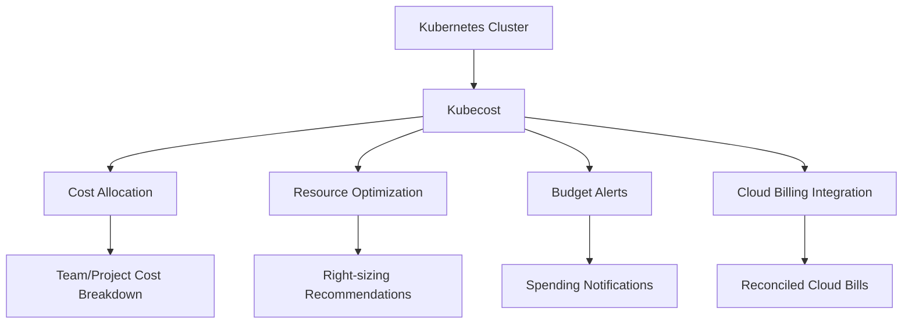

# Kubernetes Kubecost

## Introduction

Kubecost is a powerful cost monitoring and optimization tool designed specifically for Kubernetes environments. As organizations increasingly adopt Kubernetes for container orchestration, understanding and managing cloud costs becomes a critical challenge. Kubecost provides visibility into your Kubernetes spending, helping teams allocate costs to teams, projects, and applications while identifying opportunities for cost reduction.

In this guide, we'll explore what Kubecost is, how it works, and how to implement it in your own Kubernetes clusters. By the end, you'll understand how to gain insights into your Kubernetes spending and optimize resource utilization.

## What is Kubecost?

Kubecost is an open-source solution that provides real-time cost visibility and insights for Kubernetes environments. It was designed to solve several key challenges:

1. **Cost Attribution**: Tracking spending across namespaces, deployments, services, and other Kubernetes concepts
2. **Resource Optimization**: Identifying waste and inefficiencies in resource allocation
3. **Budget Management**: Setting and tracking spending targets for teams and projects
4. **Cloud Cost Reconciliation**: Matching Kubernetes resource usage with cloud provider billing



## How Kubecost Works

Kubecost integrates with your Kubernetes cluster to collect detailed metrics about resource usage. It then applies cloud provider pricing data to calculate costs. Here's how the process works:

1. Kubecost collects resource metrics using Prometheus
2. It applies pricing data from your cloud provider (or custom pricing for on-premises deployments)
3. The data is processed to allocate costs to various Kubernetes concepts
4. Results are displayed in a user-friendly dashboard

## Getting Started with Kubecost

### Prerequisites

Before installing Kubecost, ensure you have:

- A running Kubernetes cluster (version 1.8+)
- Helm (version 3+) installed
- `kubectl` configured to communicate with your cluster

### Installation

The simplest way to install Kubecost is using Helm:

```bash
# Add Kubecost Helm repository
helm repo add kubecost https://kubecost.github.io/cost-analyzer/

# Update Helm repositories
helm repo update

# Install Kubecost
helm install kubecost kubecost/cost-analyzer --namespace kubecost --create-namespace
```

This will deploy Kubecost with its default configuration, which includes Prometheus and Grafana if they're not already installed in your cluster.

### Verifying the Installation

Once installation completes, you can verify that Kubecost is running:

```bash
kubectl get pods -n kubecost
```

You should see several pods running, including:
- cost-analyzer
- prometheus-server
- grafana

### Accessing the Kubecost UI

To access the Kubecost dashboard:

```bash
# Port forward the Kubecost service
kubectl port-forward -n kubecost svc/kubecost-cost-analyzer 9090:9090
```

Now you can access the Kubecost UI by navigating to `http://localhost:9090` in your web browser.

## Core Features

### Cost Allocation

Kubecost provides detailed breakdowns of costs by:

- Namespace
- Deployment
- Service
- Label
- Pod
- Container

This allows you to understand which parts of your application are driving costs.

Example query to see costs by namespace using the Kubecost API:

```bash
curl "http://localhost:9090/model/allocation?window=today&aggregate=namespace"
```

Sample output:

```json
{
  "data": {
    "kube-system": {
      "cpuCost": 0.85,
      "gpuCost": 0,
      "networkCost": 0.10,
      "pvCost": 0.15,
      "ramCost": 0.72,
      "totalCost": 1.82
    },
    "default": {
      "cpuCost": 1.20,
      "gpuCost": 0,
      "networkCost": 0.05,
      "pvCost": 0,
      "ramCost": 0.98,
      "totalCost": 2.23
    }
  }
}
```

### Efficiency Recommendations

Kubecost analyzes your workloads and provides recommendations for right-sizing your resources, identifying:

- Over-provisioned resources
- Idle resources
- Cost-optimization opportunities

### Real-time Alerts

You can configure Kubecost to send alerts when:

- Spending exceeds defined thresholds
- Costs increase abnormally
- Resources are underutilized

Example alert configuration in `values.yaml`:

```yaml
notifications:
  alertConfigs:
    - type: budget
      threshold: 100
      window: 1d
      aggregation: namespace
      filter: namespace=default
  slack:
    enabled: true
    webhook: "https://hooks.slack.com/services/YOUR_WEBHOOK_URL"
```

## Practical Example: Analyzing a Web Application

Let's walk through a practical example of using Kubecost to analyze and optimize a web application.

Imagine you have a web application with the following components:
- Frontend (React)
- Backend API (Node.js)
- Database (PostgreSQL)

### Step 1: Tag your resources

First, ensure your resources are properly labeled:

```yaml
apiVersion: apps/v1
kind: Deployment
metadata:
  name: frontend
  labels:
    app: web-app
    component: frontend
    team: frontend-team
# ...
```

Do this for all components of your application.

### Step 2: Analyze costs

In the Kubecost UI, navigate to the "Allocations" tab and filter by the `app=web-app` label. You might see:

- Frontend: $15/month
- Backend API: $45/month
- Database: $90/month

### Step 3: Identify optimization opportunities

Looking at the details, you notice:
- The database has 2x more CPU allocation than it's using
- The backend has spikes during business hours but is idle at night
- The frontend is appropriately sized

### Step 4: Implement recommendations

Based on this analysis, you might:

1. Reduce the database CPU request/limit by 50%:

```yaml
resources:
  requests:
    cpu: "500m"  # Reduced from 1000m
    memory: "1Gi"
  limits:
    cpu: "1000m"  # Reduced from 2000m
    memory: "2Gi"
```

2. Implement horizontal pod autoscaling for the backend:

```yaml
apiVersion: autoscaling/v2
kind: HorizontalPodAutoscaler
metadata:
  name: backend-hpa
spec:
  scaleTargetRef:
    apiVersion: apps/v1
    kind: Deployment
    name: backend
  minReplicas: 2
  maxReplicas: 10
  metrics:
  - type: Resource
    resource:
      name: cpu
      target:
        type: Utilization
        averageUtilization: 70
```

### Step 5: Monitor results

After implementing these changes, continue monitoring Kubecost to verify the expected cost reductions.

## Advanced Features

### Multi-Cloud Cost Management

Kubecost supports multi-cloud environments, allowing you to compare costs across:
- AWS
- Azure
- Google Cloud
- On-premises clusters

### FinOps Integration

Kubecost can integrate with your FinOps processes:
- Export data to financial systems
- Generate chargeback/showback reports
- Support capacity planning

### Custom Pricing Models

For specialized environments, you can define custom pricing:

```yaml
kubecostProductConfigs:
  customPricesEnabled: true
  customPricesFile: /path/to/custom-prices.json
```

Example `custom-prices.json`:

```json
{
  "CPU": 0.031611,
  "RAM": 0.004237,
  "PV": 0.000170,
  "GPU": 2.100000,
  "nodeType": {
    "standard": 1.0,
    "spot": 0.4
  }
}
```

## Enterprise Features

The enterprise version of Kubecost offers additional capabilities:

- Long-term data retention
- Advanced access controls
- SSO integration
- Enhanced support

## Common Challenges and Solutions

### Challenge: Cost data doesn't match cloud bill

**Solution**: Verify that Kubecost has the correct pricing data for your region and instance types. You may need to configure out-of-cluster resources that contribute to your bill.

### Challenge: High Prometheus resource usage

**Solution**: Adjust retention periods and scrape intervals to balance between data granularity and resource consumption:

```yaml
prometheus:
  server:
    retention: 15d
    resources:
      requests:
        cpu: 500m
        memory: 2Gi
      limits:
        cpu: 1000m
        memory: 4Gi
```

### Challenge: Attributing shared resources

**Solution**: Use Kubecost's namespace allocation methods to fairly distribute shared costs:

```yaml
kubecostProductConfigs:
  sharedNamespaces: "kube-system,kubecost"
  sharedNamespaceMethod: "proportional"
```

## Best Practices

1. **Consistent Labeling**: Develop and enforce a consistent labeling strategy
2. **Regular Review**: Schedule weekly or monthly cost reviews
3. **Team Ownership**: Make teams responsible for their resource costs
4. **Right-sizing First**: Address resource right-sizing before scaling
5. **Automation**: Automate responses to cost anomalies

## Summary

Kubecost provides essential visibility into Kubernetes spending, helping teams optimize resources and control cloud costs. By following the steps in this guide, you can:

1. Install and configure Kubecost in your cluster
2. Understand how costs are distributed across your applications
3. Identify and implement cost-saving opportunities
4. Create a culture of cost awareness in your organization

Through proper resource allocation, right-sizing, and continuous monitoring, Kubecost can help you reduce your Kubernetes spending while maintaining application performance.

## Additional Resources

- [Kubecost Official Documentation](https://docs.kubecost.com/)
- [Kubernetes Resource Management](https://kubernetes.io/docs/concepts/configuration/manage-resources-containers/)
- [FinOps for Kubernetes](https://www.finops.org/kubernetes/)

## Exercises

1. Install Kubecost on a test cluster and analyze the cost breakdown by namespace
2. Create a label strategy for your applications and implement it
3. Identify the top 3 cost-saving opportunities in your environment
4. Configure a Slack alert for when a namespace exceeds its budget
5. Generate a report comparing costs week-over-week and analyze trends