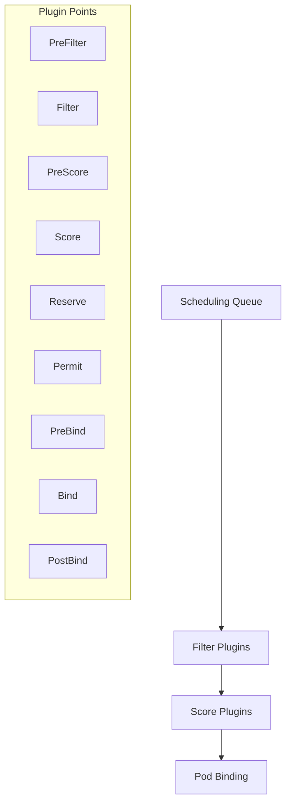

# Kubernetes Plugins

## Introduction

Kubernetes plugins are extensions that enhance the functionality of your Kubernetes environment. They allow you to add new features and capabilities without modifying the core Kubernetes codebase. As your journey with Kubernetes progresses, you'll find that plugins are essential tools that help customize your cluster management experience.

In this guide, we'll explore how Kubernetes plugins work, the different types available, how to install and use them, and some popular plugins that might be useful for your projects.

## What Are Kubernetes Plugins?

Kubernetes plugins are additional components that extend the capabilities of the Kubernetes platform in various ways. They can be broadly categorized into:

1. **kubectl plugins** - Extensions to the kubectl command-line tool
2. **API extensions** - Custom resources and controllers
3. **Scheduler plugins** - Custom scheduling logic
4. **Container Network Interface (CNI) plugins** - Networking solutions
5. **Container Storage Interface (CSI) plugins** - Storage solutions
6. **Container Runtime Interface (CRI) plugins** - Container runtime implementations

Let's explore each category in more detail.

## kubectl Plugins

The kubectl command-line tool is your primary interface for interacting with Kubernetes clusters. kubectl plugins allow you to add new commands to kubectl, making it more powerful and tailored to your needs.

### How kubectl Plugins Work

kubectl plugins follow a simple naming convention: `kubectl-<plugin_name>`. When you run `kubectl plugin_name`, kubectl looks for an executable file named `kubectl-plugin_name` in your PATH.

Let's see how to create a simple kubectl plugin:

1. Create a file named `kubectl-hello` with the following content:

```bash
#!/bin/bash
echo "Hello from my first kubectl plugin!"
```

2. Make it executable:

```bash
chmod +x kubectl-hello
```

3. Move it to a directory in your PATH:

```bash
sudo mv kubectl-hello /usr/local/bin/
```

4. Now you can use your plugin:

```bash
kubectl hello
```

Output:
```
Hello from my first kubectl plugin!
```

### kubectl Plugin Manager: Krew

[Krew](https://krew.sigs.k8s.io/) is the official package manager for kubectl plugins, similar to apt, brew, or npm. It helps you discover, install, and manage plugins.

Here's how to install Krew:

```bash
(
  set -x; cd "$(mktemp -d)" &&
  OS="$(uname | tr '[:upper:]' '[:lower:]')" &&
  ARCH="$(uname -m | sed -e 's/x86_64/amd64/' -e 's/\(arm\)\(64\)\?.*/\1\2/' -e 's/aarch64$/arm64/')" &&
  KREW="krew-${OS}_${ARCH}" &&
  curl -fsSLO "https://github.com/kubernetes-sigs/krew/releases/latest/download/${KREW}.tar.gz" &&
  tar zxvf "${KREW}.tar.gz" &&
  ./"${KREW}" install krew
)
```

Add the following to your `.bashrc` or `.zshrc`:

```bash
export PATH="${KREW_ROOT:-$HOME/.krew}/bin:$PATH"
```

Now you can manage plugins with Krew:

```bash
# List available plugins
kubectl krew search

# Install a plugin
kubectl krew install access-matrix

# List installed plugins
kubectl krew list

# Use an installed plugin
kubectl access-matrix
```

## Custom Resource Definitions (CRDs) and Operators

Custom Resource Definitions (CRDs) and Operators are powerful ways to extend Kubernetes API with your own custom resources.

### Custom Resource Definitions (CRDs)

CRDs allow you to define your own resource types in Kubernetes. For example, you might create a CRD for databases, message queues, or any application-specific concept.

Here's an example of a simple CRD for a "WebApp" resource:

```yaml
apiVersion: apiextensions.k8s.io/v1
kind: CustomResourceDefinition
metadata:
  name: webapps.example.com
spec:
  group: example.com
  versions:
    - name: v1
      served: true
      storage: true
      schema:
        openAPIV3Schema:
          type: object
          properties:
            spec:
              type: object
              properties:
                image:
                  type: string
                replicas:
                  type: integer
                  minimum: 1
  scope: Namespaced
  names:
    plural: webapps
    singular: webapp
    kind: WebApp
    shortNames:
    - wa
```

After applying this CRD, you can create WebApp resources:

```yaml
apiVersion: example.com/v1
kind: WebApp
metadata:
  name: my-web-app
spec:
  image: nginx:latest
  replicas: 3
```

### Operators

Operators take CRDs a step further by adding custom controllers that implement domain-specific logic for your custom resources. They automate operational tasks based on changes to your custom resources.

A typical operator consists of:
1. Custom Resource Definitions (CRDs)
2. Custom controllers that watch these resources
3. Domain-specific logic for managing the resources

You can build operators using frameworks like:
- [Operator Framework](https://operatorframework.io/)
- [Kubebuilder](https://book.kubebuilder.io/)
- [KUDO](https://kudo.dev/)

## Scheduler Plugins

The Kubernetes scheduler is responsible for deciding which nodes your pods should run on. Scheduler plugins allow you to customize this decision-making process with your own scheduling logic.

Since Kubernetes 1.19, the scheduler has a plugin system that allows you to implement custom scheduling behaviors without forking the kube-scheduler code.

Here's a diagram of how scheduler plugins work:



To create a scheduler plugin, you need to:
1. Implement one or more plugin interfaces
2. Compile your plugin with the scheduler
3. Configure the scheduler to use your plugin

This is an advanced topic, and most beginners won't need to create custom scheduler plugins immediately.

## Container Network Interface (CNI) Plugins

CNI plugins implement networking for Kubernetes pods. They set up and manage pod network interfaces and IP addressing.

Popular CNI plugins include:

- **Calico**: Provides network policy enforcement and secure network connectivity
- **Cilium**: Uses eBPF for networking, observability, and security
- **Flannel**: Simple overlay network focused on performance
- **Weave Net**: Creates a virtual network that connects containers across multiple hosts

Installing a CNI plugin is usually done during cluster setup. For example, to install Calico on a kubeadm cluster:

```bash
kubectl apply -f https://docs.projectcalico.org/manifests/calico.yaml
```

## Container Storage Interface (CSI) Plugins

CSI plugins provide storage solutions for Kubernetes. They allow you to use various storage systems with your Kubernetes cluster.

Some popular CSI plugins include:

- **AWS EBS CSI Driver**: For Amazon Elastic Block Store
- **GCE PD CSI Driver**: For Google Compute Engine Persistent Disks
- **Azure Disk CSI Driver**: For Azure Disks
- **Ceph CSI**: For Ceph RBD and CephFS
- **Longhorn**: Distributed block storage system for Kubernetes

Here's how you might deploy the AWS EBS CSI Driver:

```bash
kubectl apply -k "github.com/kubernetes-sigs/aws-ebs-csi-driver/deploy/kubernetes/overlays/stable/?ref=master"
```

After installing a CSI plugin, you can use it through StorageClasses:

```yaml
apiVersion: storage.k8s.io/v1
kind: StorageClass
metadata:
  name: ebs-sc
provisioner: ebs.csi.aws.com
parameters:
  type: gp3
  fsType: ext4
volumeBindingMode: WaitForFirstConsumer
```

## Container Runtime Interface (CRI) Plugins

CRI plugins are container runtimes that Kubernetes can use to run containers. The CRI abstraction allows Kubernetes to work with different container runtimes.

Popular CRI implementations include:

- **containerd**: A lightweight, high-performance container runtime (default in most Kubernetes distributions)
- **CRI-O**: A Kubernetes-specific container runtime
- **Docker** (via cri-dockerd adapter since Kubernetes 1.24)

Configuring a CRI is typically done during cluster setup and requires changes to the kubelet configuration.

## Popular Kubernetes Plugins for Beginners

Here are some useful plugins to enhance your Kubernetes experience:

### kubectl Plugins

1. **kubectl ctx**: Switch between Kubernetes contexts easily
   ```bash
   kubectl krew install ctx
   kubectl ctx minikube  # Switch to minikube context
   ```

2. **kubectl ns**: Switch between Kubernetes namespaces
   ```bash
   kubectl krew install ns
   kubectl ns kube-system  # Switch to kube-system namespace
   ```

3. **kubectl neat**: Clean up Kubernetes YAML and JSON output
   ```bash
   kubectl krew install neat
   kubectl get pod my-pod -o yaml | kubectl neat
   ```

4. **kubectl tree**: Show hierarchical relationships between Kubernetes objects
   ```bash
   kubectl krew install tree
   kubectl tree deployment my-deployment
   ```

### Operator Examples

1. **Prometheus Operator**: Manages Prometheus monitoring instances
2. **Cert-Manager**: Automates certificate management in Kubernetes
3. **MySQL Operator**: Automates MySQL deployment and management

## Creating Your First kubectl Plugin

Let's create a more useful kubectl plugin that shows resource usage per namespace:

```bash
#!/bin/bash

# kubectl-namespace_usage
# Show resource usage per namespace

echo "Resource Usage by Namespace"
echo "==========================="
echo

# Get all namespaces
NAMESPACES=$(kubectl get namespaces -o jsonpath='{.items[*].metadata.name}')

printf "%-20s %-10s %-10s
" "NAMESPACE" "CPU(cores)" "MEMORY(Mi)"
printf "%-20s %-10s %-10s
" "----------" "---------" "----------"

for ns in $NAMESPACES; do
    # Get CPU and memory usage
    CPU=$(kubectl get po -n $ns -o jsonpath="{.items[*].spec.containers[*].resources.requests.cpu}" 2>/dev/null | tr -s ' ' '+' | xargs -r expr 0 +)
    MEMORY=$(kubectl get po -n $ns -o jsonpath="{.items[*].spec.containers[*].resources.requests.memory}" 2>/dev/null | sed 's/Mi//g' | tr -s ' ' '+' | xargs -r expr 0 +)
    
    # Print results
    printf "%-20s %-10s %-10s
" "$ns" "${CPU:-0}" "${MEMORY:-0}"
done
```

Save this as `kubectl-namespace_usage`, make it executable, and move it to your PATH. Then you can use it:

```bash
kubectl namespace_usage
```

This plugin will show you a table of CPU and memory requests by namespace, helping you understand resource allocation across your cluster.

## Best Practices for Using Kubernetes Plugins

1. **Security**: Always review the source code of kubectl plugins before installing them, especially if they're not from trusted sources.

2. **Versioning**: Check if the plugin is compatible with your Kubernetes version.

3. **Resource impact**: Some plugins might consume significant resources. Monitor the impact on your cluster.

4. **Documentation**: Keep track of the plugins you've installed and their purpose.

5. **Updates**: Regularly update your plugins to get the latest features and security fixes.

## Summary

Kubernetes plugins are a powerful way to extend and customize your Kubernetes environment. They allow you to add new features, integrate with other systems, and tailor Kubernetes to your specific needs.

In this guide, we've explored:
- What Kubernetes plugins are and how they work
- Different types of plugins (kubectl, CRDs, Operators, CNI, CSI, CRI)
- How to install and use kubectl plugins with Krew
- How to create your own kubectl plugins
- Some popular plugins to enhance your Kubernetes experience

As you continue your Kubernetes journey, plugins will become an essential part of your toolkit, helping you manage your clusters more effectively and efficiently.

## Additional Resources

- [Kubernetes Documentation on Extending kubectl](https://kubernetes.io/docs/tasks/extend-kubectl/kubectl-plugins/)
- [Krew Plugin Manager](https://krew.sigs.k8s.io/)
- [Kubernetes Operators](https://kubernetes.io/docs/concepts/extend-kubernetes/operator/)
- [Custom Resources](https://kubernetes.io/docs/concepts/extend-kubernetes/api-extension/custom-resources/)
- [Container Network Interface (CNI)](https://github.com/containernetworking/cni)
- [Container Storage Interface (CSI)](https://kubernetes-csi.github.io/docs/)

## Exercises

1. Install Krew and explore available kubectl plugins. Install one that looks useful for your workflow.

2. Create a simple kubectl plugin that displays all pods with their resource requests and limits.

3. Research a CRD/Operator for a technology you use (database, messaging system, etc.) and try to deploy it to a test cluster.

4. Compare two different CNI plugins. What are their strengths and weaknesses?

5. Create a custom StorageClass using a CSI plugin and provision a PersistentVolumeClaim with it.