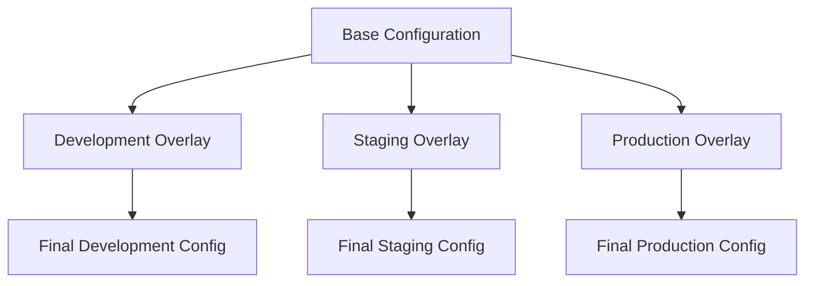

# Kubernetes Kustomize

## Introduction

Kustomize is a powerful configuration management tool that's part of the Kubernetes ecosystem. It allows you to customize Kubernetes resource configurations without modifying the original YAML files. This approach follows the principle of "configuration by layers," where you can maintain a base configuration and apply various customizations for different environments or scenarios.

Kustomize was developed to solve a common problem in Kubernetes: how to manage similar but slightly different configurations across multiple environments (development, staging, production) without duplicating code or using complex templating systems.

## Why Use Kustomize?

Before diving into how Kustomize works, let's understand why it's valuable:

- **No Templates**: Unlike Helm, Kustomize doesn't use templating. It works with standard Kubernetes YAML.
- **Overlay Pattern**: Uses a base/overlay pattern that keeps configurations DRY (Don't Repeat Yourself).
- **Native Integration**: It's built directly into `kubectl` (from v1.14), so there are no additional tools required.
- **GitOps Friendly**: Works well with GitOps workflows, as all configurations are stored as plain text files.

## How Kustomize Works

Kustomize operates on the concept of bases and overlays:

- **Base**: The common configuration that contains shared resources.
- **Overlay**: Environment-specific customizations that modify the base.



## Getting Started with Kustomize

### Prerequisites

- Kubernetes cluster (or Minikube for local development)
- `kubectl` v1.14 or newer (which includes Kustomize built-in)
- Basic understanding of Kubernetes resources (Deployments, Services, etc.)

### Directory Structure

A typical Kustomize project might have a structure like this:

```
my-app/
├── base/
│   ├── deployment.yaml
│   ├── service.yaml
│   └── kustomization.yaml
└── overlays/
    ├── development/
    │   └── kustomization.yaml
    ├── staging/
    │   └── kustomization.yaml
    └── production/
        ├── deployment-patch.yaml
        └── kustomization.yaml
```

## Creating a Base Configuration

Let's start by creating a base configuration for a simple web application:

1. Create a `base` directory
2. Add Kubernetes resource files
3. Create a `kustomization.yaml` file that references these resources

### Example Base Configuration

First, let's create a deployment:

```yaml
# base/deployment.yaml
apiVersion: apps/v1
kind: Deployment
metadata:
  name: web-app
spec:
  replicas: 1
  selector:
    matchLabels:
      app: web-app
  template:
    metadata:
      labels:
        app: web-app
    spec:
      containers:
      - name: web-app
        image: nginx:1.19
        ports:
        - containerPort: 80
```

Next, let's create a service:

```yaml
# base/service.yaml
apiVersion: v1
kind: Service
metadata:
  name: web-app
spec:
  selector:
    app: web-app
  ports:
  - port: 80
    targetPort: 80
  type: ClusterIP
```

Finally, let's create the base kustomization file:

```yaml
# base/kustomization.yaml
apiVersion: kustomize.config.k8s.io/v1beta1
kind: Kustomization

resources:
- deployment.yaml
- service.yaml

commonLabels:
  app: web-app
```

## Creating Overlays

Now let's create overlays for different environments. Each overlay will customize the base configuration.

### Development Overlay

```yaml
# overlays/development/kustomization.yaml
apiVersion: kustomize.config.k8s.io/v1beta1
kind: Kustomization

resources:
- ../../base

namePrefix: dev-

# Change the image tag for development
images:
- name: nginx
  newName: nginx
  newTag: 1.20
```

### Production Overlay

For production, we'll create a patch to increase the number of replicas and use a different image tag:

```yaml
# overlays/production/deployment-patch.yaml
apiVersion: apps/v1
kind: Deployment
metadata:
  name: web-app
spec:
  replicas: 3
```

```yaml
# overlays/production/kustomization.yaml
apiVersion: kustomize.config.k8s.io/v1beta1
kind: Kustomization

resources:
- ../../base

namePrefix: prod-

# Apply patches
patchesStrategicMerge:
- deployment-patch.yaml

# Use production-specific image
images:
- name: nginx
  newName: nginx
  newTag: 1.19-alpine
```

## Using Kustomize

### Previewing Configurations

You can preview what Kustomize will generate without actually applying it to your cluster:

```bash
# Preview development configuration
kubectl kustomize overlays/development

# Preview production configuration
kubectl kustomize overlays/production
```

Output for development:

```yaml
apiVersion: v1
kind: Service
metadata:
  labels:
    app: web-app
  name: dev-web-app
spec:
  ports:
  - port: 80
    targetPort: 80
  selector:
    app: web-app
  type: ClusterIP
---
apiVersion: apps/v1
kind: Deployment
metadata:
  labels:
    app: web-app
  name: dev-web-app
spec:
  replicas: 1
  selector:
    matchLabels:
      app: web-app
  template:
    metadata:
      labels:
        app: web-app
    spec:
      containers:
      - image: nginx:1.20
        name: web-app
        ports:
        - containerPort: 80
```

### Applying Configurations

To apply a configuration to your Kubernetes cluster:

```bash
# Apply development configuration
kubectl apply -k overlays/development

# Apply production configuration 
kubectl apply -k overlays/production
```

## Common Kustomize Transformers

Kustomize provides several transformers to modify resources:

### 1. namePrefix and nameSuffix

Adds a prefix or suffix to all resource names:

```yaml
namePrefix: dev-
nameSuffix: -v1
```

### 2. commonLabels

Adds labels to all resources:

```yaml
commonLabels:
  environment: production
  team: platform
```

### 3. commonAnnotations

Adds annotations to all resources:

```yaml
commonAnnotations:
  note: "This is managed by Kustomize"
```

### 4. images

Modifies container images:

```yaml
images:
- name: nginx
  newName: custom-registry.example.com/nginx
  newTag: 1.21.3
```

### 5. patchesStrategicMerge

Applies strategic merge patches to resources:

```yaml
patchesStrategicMerge:
- deployment-patch.yaml
```

### 6. patches

Applies JSON/YAML patches to specific resources:

```yaml
patches:
- path: patch.yaml
  target:
    kind: Deployment
    name: web-app
```

## Advanced Kustomize Features

### ConfigMap and Secret Generation

Kustomize can generate ConfigMaps and Secrets from files:

```yaml
# kustomization.yaml
configMapGenerator:
- name: app-config
  files:
  - config.properties
  - settings.json

secretGenerator:
- name: app-secrets
  files:
  - secret.properties
  literals:
  - API_KEY=secret-key-value
```

Each generated ConfigMap or Secret includes a content hash suffix, ensuring that pods are restarted when the configuration changes.

### Variants with Overlays

You can create variants for special use cases, like canary deployments:

```
my-app/
├── base/
│   └── ...
└── overlays/
    ├── production/
    │   └── ...
    └── production-canary/
        ├── deployment-patch.yaml
        └── kustomization.yaml
```

The canary overlay could modify the image and reduce the replica count:

```yaml
# overlays/production-canary/kustomization.yaml
resources:
- ../production

nameSuffix: -canary

patchesStrategicMerge:
- deployment-patch.yaml
```

### Component Reuse

Components allow you to reuse configurations across different projects:

```
components/
├── postgres/
│   ├── deployment.yaml
│   ├── service.yaml
│   └── kustomization.yaml
└── redis/
    ├── deployment.yaml
    ├── service.yaml
    └── kustomization.yaml

my-app/
├── base/
│   ├── kustomization.yaml
│   └── ...
└── overlays/
    └── ...
```

You can include components in your base:

```yaml
# my-app/base/kustomization.yaml
components:
- ../../components/postgres
- ../../components/redis
```

## Real-World Example: Multi-Environment Application

Let's build a more complete example of a web application with different environments:

### Base Configuration

```yaml
# base/deployment.yaml
apiVersion: apps/v1
kind: Deployment
metadata:
  name: web-application
spec:
  replicas: 2
  selector:
    matchLabels:
      app: web-application
  template:
    metadata:
      labels:
        app: web-application
    spec:
      containers:
      - name: web-application
        image: my-registry/web-app:latest
        ports:
        - containerPort: 8080
        env:
        - name: LOG_LEVEL
          value: "info"
        resources:
          requests:
            memory: "128Mi"
            cpu: "100m"
          limits:
            memory: "256Mi"
            cpu: "200m"
```

```yaml
# base/service.yaml
apiVersion: v1
kind: Service
metadata:
  name: web-application
spec:
  selector:
    app: web-application
  ports:
  - port: 80
    targetPort: 8080
  type: ClusterIP
```

```yaml
# base/config.properties
app.timeout=30s
app.cache.enabled=true
```

```yaml
# base/kustomization.yaml
apiVersion: kustomize.config.k8s.io/v1beta1
kind: Kustomization

resources:
- deployment.yaml
- service.yaml

configMapGenerator:
- name: app-config
  files:
  - config.properties
```

### Development Overlay

```yaml
# overlays/development/kustomization.yaml
apiVersion: kustomize.config.k8s.io/v1beta1
kind: Kustomization

resources:
- ../../base

namePrefix: dev-

# Development-specific labels
commonLabels:
  environment: development

# Override the base image
images:
- name: my-registry/web-app
  newTag: dev

# Development-specific config
configMapGenerator:
- name: app-config
  behavior: merge
  literals:
  - app.debug=true
```

### Production Overlay

```yaml
# overlays/production/deployment-patch.yaml
apiVersion: apps/v1
kind: Deployment
metadata:
  name: web-application
spec:
  replicas: 5
  template:
    spec:
      containers:
      - name: web-application
        resources:
          requests:
            memory: "512Mi"
            cpu: "500m"
          limits:
            memory: "1Gi"
            cpu: "1000m"
```

```yaml
# overlays/production/kustomization.yaml
apiVersion: kustomize.config.k8s.io/v1beta1
kind: Kustomization

resources:
- ../../base

namePrefix: prod-

# Production-specific labels
commonLabels:
  environment: production
  tier: frontend

# Apply patches
patchesStrategicMerge:
- deployment-patch.yaml

# Use specific production image
images:
- name: my-registry/web-app
  newTag: stable

# Production-specific config
configMapGenerator:
- name: app-config
  behavior: merge
  literals:
  - app.cache.enabled=true
  - app.timeout=60s
```

### Applying the Configurations

```bash
# Development
kubectl apply -k overlays/development

# Production
kubectl apply -k overlays/production
```

The development environment will have fewer replicas and development-specific settings, while the production environment will have more replicas and production-tuned settings.

## Best Practices

1. **Keep Base Configurations Simple**: 
   - Base configurations should be minimal and only include common elements.

2. **Use Meaningful Directory Structure**:
   - Organize overlays by environment, region, or other meaningful distinctions.

3. **Version Control**:
   - Store Kustomize files in version control alongside your application code.

4. **Validate Before Applying**:
   - Always preview generated manifests with `kubectl kustomize` before applying.

5. **Document Customizations**:
   - Add comments to explain why certain customizations are needed.

6. **Avoid Direct Edits in Overlays**:
   - When possible, use Kustomize transformers rather than directly editing resource files.

7. **Use ConfigMap and Secret Generators**:
   - Take advantage of content-based hashing to trigger restarts when configs change.

8. **Test Your Configurations**:
   - Consider automated testing for your Kubernetes configurations.

## Kustomize vs. Helm

Many newcomers to Kubernetes wonder whether to use Kustomize or Helm. Here's a quick comparison:

| Feature | Kustomize | Helm |
| ------- | --------- | ---- |
| Templating | No templates (YAML only) | Uses Go templates |
| Packaging | No packaging system | Charts for packaging |
| Learning Curve | Lower | Higher |
| Community | Native to Kubernetes | Large ecosystem |
| Use Case | Simple customizations | Complex applications with many dependencies |

Both tools can be used together: you can apply Kustomize overlays to rendered Helm charts.

## Summary

Kustomize provides a powerful yet simple approach to managing Kubernetes configurations across different environments. By separating base configurations from environment-specific overlays, you can maintain DRY configurations that are easier to understand and manage.

Key takeaways:
- Kustomize uses a layered approach with bases and overlays
- It's built into kubectl, making it easily accessible
- It doesn't use templates, working directly with standard Kubernetes YAML
- It's particularly well-suited for GitOps workflows
- It integrates well with existing CI/CD pipelines

## Additional Resources and Exercises

### Resources

- [Official Kustomize Documentation](https://kubectl.docs.kubernetes.io/references/kustomize/)
- [Kubernetes SIG Kustomize GitHub Repository](https://github.com/kubernetes-sigs/kustomize)

### Exercises

1. Create a base configuration for a simple application with a Deployment and Service.
2. Create overlays for development, staging, and production environments.
3. Use `namePrefix` to differentiate resources across environments.
4. Generate a ConfigMap from a file and use it in your Deployment.
5. Create a patch that increases the resource limits for the production environment.
6. Apply your configurations to a test cluster or Minikube.
7. Try combining Kustomize with Helm by applying customizations to a rendered Helm chart.

By working through these exercises, you'll gain hands-on experience with Kustomize and be better prepared to use it in real-world scenarios.