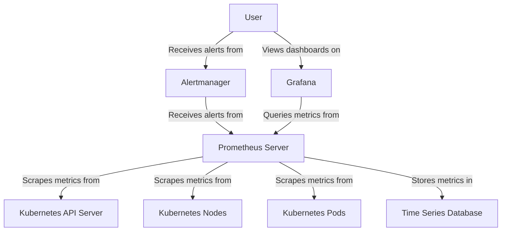

# Kubernetes Prometheus

## Introduction

Monitoring your Kubernetes cluster is crucial for maintaining reliability, performance, and health. Prometheus has emerged as the de facto standard for monitoring Kubernetes environments due to its powerful metrics collection, flexible querying, and deep integration with the Kubernetes ecosystem.

In this guide, we'll explore how Prometheus works within Kubernetes, how to set it up, and how to use it effectively to monitor your applications and infrastructure.

## What is Prometheus?

Prometheus is an open-source monitoring and alerting toolkit originally developed at SoundCloud. It was the second project (after Kubernetes itself) to graduate from the Cloud Native Computing Foundation (CNCF). Prometheus provides:

- A multi-dimensional data model with time series data identified by metric name and key-value pairs
- A flexible query language called PromQL (Prometheus Query Language)
- A pull-based metrics collection system
- An efficient time series database for storing metric data
- Support for multiple graphing and dashboarding options

## How Prometheus Works with Kubernetes

Prometheus and Kubernetes integrate naturally together. Here's a high-level overview of how they interact:



Prometheus operates on a pull model, meaning it periodically scrapes (fetches) metrics from configured targets rather than targets pushing data to Prometheus. In Kubernetes:

1. Prometheus discovers targets using Kubernetes service discovery
2. It scrapes metrics from these targets at configured intervals
3. The metrics are stored in its time series database
4. You can query these metrics using PromQL
5. Alerts can be configured based on metric thresholds

## Setting Up Prometheus in Kubernetes

The most common way to deploy Prometheus in Kubernetes is using the Prometheus Operator, part of the kube-prometheus-stack. Let's walk through a basic setup using Helm.

### Prerequisites

- A running Kubernetes cluster
- Helm installed
- `kubectl` configured to interact with your cluster

### Basic Installation with Helm

```bash
# Add the Prometheus community Helm repository
helm repo add prometheus-community https://prometheus-community.github.io/helm-charts

# Update Helm repositories
helm repo update

# Install Prometheus stack (includes Prometheus, Alertmanager, and Grafana)
helm install prometheus prometheus-community/kube-prometheus-stack
```

After installation, you'll have several resources created in your cluster:

```bash
# Check the created resources
kubectl get pods -n default

# Sample output:
NAME                                                   READY   STATUS    RESTARTS   AGE
alertmanager-prometheus-kube-prometheus-alertmanager-0   2/2     Running   0          2m
prometheus-grafana-59c5f6d486-2c9qh                      2/2     Running   0          2m
prometheus-kube-prometheus-operator-5d5676c64c-f5t7j     1/1     Running   0          2m
prometheus-kube-state-metrics-65b7f69f6c-nfvn8           1/1     Running   0          2m
prometheus-prometheus-kube-prometheus-prometheus-0        2/2     Running   0          2m
prometheus-prometheus-node-exporter-t5p8b                 1/1     Running   0          2m
```

### Accessing Prometheus UI

You can access the Prometheus UI by port-forwarding:

```bash
kubectl port-forward svc/prometheus-kube-prometheus-prometheus 9090:9090
```

Now you can open `http://localhost:9090` in your browser to access the Prometheus UI.

## Core Concepts

### Metrics and Exporters

Prometheus collects metrics from targets. These metrics can come from:

1. **Built-in Kubernetes metrics** - Kubelet exposes metrics about nodes, pods, and containers
2. **Service metrics** - Your applications can expose metrics directly
3. **Exporters** - Specialized applications that convert metrics from a system into Prometheus format

Let's explore a common exporter - the Node Exporter, which provides hardware and OS metrics:

```yaml
apiVersion: apps/v1
kind: DaemonSet
metadata:
  name: node-exporter
  namespace: monitoring
spec:
  selector:
    matchLabels:
      app: node-exporter
  template:
    metadata:
      labels:
        app: node-exporter
    spec:
      containers:
      - name: node-exporter
        image: prom/node-exporter:latest
        ports:
        - containerPort: 9100
          name: metrics
```

### ServiceMonitor

The Prometheus Operator uses Custom Resource Definitions (CRDs) to manage Prometheus configurations. One key CRD is the ServiceMonitor, which defines which services Prometheus should monitor:

```yaml
apiVersion: monitoring.coreos.com/v1
kind: ServiceMonitor
metadata:
  name: example-app
  namespace: monitoring
spec:
  selector:
    matchLabels:
      app: example-app
  endpoints:
  - port: web
    path: /metrics
    interval: 15s
```

This ServiceMonitor will discover all services with the label `app: example-app` and scrape their `/metrics` endpoint every 15 seconds.

## Instrumenting Your Applications

To collect metrics from your applications, you need to instrument them. Let's look at a simple example using a Go application:

```go
package main

import (
	"net/http"
	"github.com/prometheus/client_golang/prometheus"
	"github.com/prometheus/client_golang/prometheus/promhttp"
)

func main() {
	// Create a counter metric
	counter := prometheus.NewCounter(
		prometheus.CounterOpts{
			Name: "my_app_requests_total",
			Help: "Total number of requests received",
		},
	)
	
	// Register the metric
	prometheus.MustRegister(counter)
	
	// Increment the counter on each request
	http.HandleFunc("/", func(w http.ResponseWriter, r *http.Request) {
		counter.Inc()
		w.Write([]byte("Hello, World!"))
	})
	
	// Expose the metrics
	http.Handle("/metrics", promhttp.Handler())
	
	http.ListenAndServe(":8080", nil)
}
```

When accessing the `/metrics` endpoint, you would see output like:

```
# HELP my_app_requests_total Total number of requests received
# TYPE my_app_requests_total counter
my_app_requests_total 5
```

## Querying Metrics with PromQL

Prometheus Query Language (PromQL) is the powerful language used to query metrics. Here are some basic query examples:

### Simple Query

```
node_memory_MemFree_bytes
```

This returns the free memory in bytes for each node.

### Rate of Change

```
rate(http_requests_total[5m])
```

This calculates the per-second rate of HTTP requests over a 5-minute window.

### Aggregation

```
sum by (pod) (container_memory_usage_bytes)
```

This sums the memory usage of all containers, grouped by pod.

## Alerting with Prometheus

Prometheus can trigger alerts when specific conditions are met. Let's set up a basic alert rule:

```yaml
apiVersion: monitoring.coreos.com/v1
kind: PrometheusRule
metadata:
  name: example-alert
  namespace: monitoring
spec:
  groups:
  - name: example
    rules:
    - alert: HighMemoryUsage
      expr: sum(container_memory_usage_bytes) by (pod) > 1024 * 1024 * 1024
      for: 5m
      labels:
        severity: warning
      annotations:
        summary: "High memory usage for pod {{ $labels.pod }}"
        description: "Pod {{ $labels.pod }} has been using more than 1GB of memory for 5 minutes."
```

This rule will fire an alert when a pod uses more than 1GB of memory for 5 minutes.

## Prometheus in Production

For production environments, consider these best practices:

1. **High Availability**: Run multiple Prometheus instances and use remote storage
2. **Resource Limits**: Configure appropriate CPU and memory limits
3. **Retention Policies**: Set up data retention based on your needs
4. **Federation**: Use federation for large-scale deployments
5. **Security**: Apply proper RBAC (Role-Based Access Control) and network policies

Here's an example of configuring resource limits for Prometheus:

```yaml
apiVersion: monitoring.coreos.com/v1
kind: Prometheus
metadata:
  name: prometheus
  namespace: monitoring
spec:
  replicas: 2
  resources:
    requests:
      memory: 2Gi
      cpu: 500m
    limits:
      memory: 4Gi
      cpu: 1000m
  retention: 15d
  storage:
    volumeClaimTemplate:
      spec:
        storageClassName: fast
        resources:
          requests:
            storage: 100Gi
```

## Visualizing Metrics with Grafana

While Prometheus has a basic UI, Grafana is commonly used for creating dashboards. The kube-prometheus-stack includes Grafana by default.

To access Grafana:

```bash
kubectl port-forward svc/prometheus-grafana 3000:80
```

Now visit `http://localhost:3000` (default credentials are usually admin/prom-operator).

## Real-World Examples

### Monitoring Node Resource Usage

Track CPU, memory, disk, and network usage across all nodes:

```
# CPU utilization rate
100 - (avg by (instance) (irate(node_cpu_seconds_total{mode="idle"}[5m])) * 100)

# Memory usage percentage
(1 - (node_memory_MemAvailable_bytes / node_memory_MemTotal_bytes)) * 100

# Disk usage percentage
(1 - node_filesystem_avail_bytes{mountpoint="/"} / node_filesystem_size_bytes{mountpoint="/"}) * 100
```

### Application Performance Monitoring

For a web application, you might track:

```
# Request rate
sum(rate(http_requests_total[5m])) by (service)

# Error rate
sum(rate(http_requests_total{status=~"5.."}[5m])) / sum(rate(http_requests_total[5m]))

# 95th percentile request latency
histogram_quantile(0.95, sum(rate(http_request_duration_seconds_bucket[5m])) by (le))
```

## Common Challenges and Solutions

### Cardinality Explosion

Problem: Too many unique time series can slow down Prometheus.

Solution: Limit the number of labels and use recording rules to pre-compute expensive queries:

```yaml
apiVersion: monitoring.coreos.com/v1
kind: PrometheusRule
metadata:
  name: recording-rules
  namespace: monitoring
spec:
  groups:
  - name: node-recording-rules
    interval: 5m
    rules:
    - record: node:memory:usage:percentage
      expr: (1 - (node_memory_MemAvailable_bytes / node_memory_MemTotal_bytes)) * 100
```

### Storage Management

Problem: Prometheus can consume a lot of disk space.

Solution: Configure appropriate retention periods and consider using remote storage for long-term metrics:

```yaml
apiVersion: monitoring.coreos.com/v1
kind: Prometheus
metadata:
  name: prometheus
spec:
  retention: 7d
  remoteWrite:
  - url: "http://thanos-receive:19291/api/v1/receive"
```

## Summary

Prometheus has become the standard monitoring solution for Kubernetes environments due to its powerful features and deep integration with the ecosystem. In this guide, we've covered:

- Setting up Prometheus in Kubernetes
- Understanding core concepts like metrics and exporters
- Instrumenting applications to expose metrics
- Querying metrics with PromQL
- Configuring alerts based on metric conditions
- Visualizing metrics with Grafana
- Real-world monitoring examples
- Common challenges and solutions

With Prometheus, you gain deep visibility into your Kubernetes cluster, allowing you to identify issues before they affect your users and optimize your applications for better performance.

## Additional Resources

- [Official Prometheus Documentation](https://prometheus.io/docs/introduction/overview/)
- [Prometheus Operator Documentation](https://github.com/prometheus-operator/prometheus-operator/blob/main/Documentation/user-guides/getting-started.md)
- [PromQL Cheat Sheet](https://promlabs.com/promql-cheat-sheet/)

## Exercises

1. Deploy Prometheus to your Kubernetes cluster using Helm.
2. Create a ServiceMonitor for an existing application in your cluster.
3. Write PromQL queries to find the three pods consuming the most memory.
4. Set up an alert that fires when a node's disk usage exceeds 80%.
5. Create a Grafana dashboard that displays key metrics for your applications.