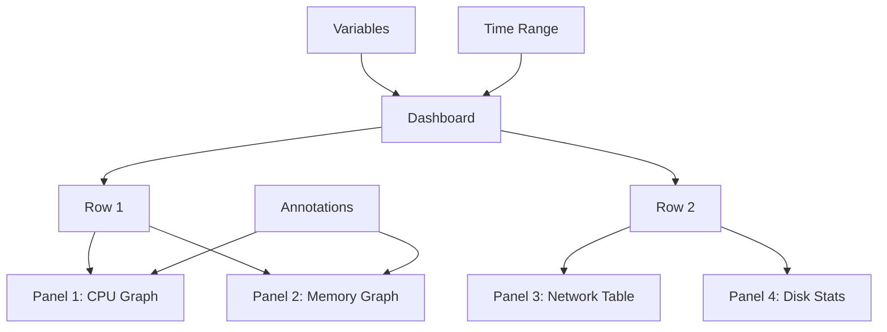

# Kubernetes Grafana

## Introduction

Monitoring is a critical aspect of maintaining healthy Kubernetes clusters. In the complex and distributed world of container orchestration, knowing what's happening inside your cluster can mean the difference between smooth operations and chaotic troubleshooting sessions. This is where Grafana comes into play.

Grafana is an open-source visualization and analytics platform that integrates seamlessly with Kubernetes. It allows you to query, visualize, alert on, and understand your metrics no matter where they are stored. By connecting Grafana to your Kubernetes metrics, you can create comprehensive dashboards that provide real-time insights into your cluster's health and performance.

In this guide, we'll explore how to implement Grafana in a Kubernetes environment, from installation to creating meaningful dashboards, and examine real-world applications that make it an essential tool in the Kubernetes ecosystem.

## Prerequisites

Before we dive in, make sure you have:

- A running Kubernetes cluster
- `kubectl` configured to communicate with your cluster
- Basic understanding of Kubernetes concepts
- Helm (optional, but recommended for easier installation)

## Installing Grafana on Kubernetes

### Using Helm (Recommended Method)

Helm is a package manager for Kubernetes that simplifies the installation process of applications. Let's use it to install Grafana:

```bash
# Add the Grafana Helm repository
helm repo add grafana https://grafana.github.io/helm-charts

# Update Helm repositories
helm repo update

# Install Grafana
helm install grafana grafana/grafana
```

After running these commands, you'll see output providing information about your Grafana installation, including how to access it.

### Using YAML Manifests

If you prefer not to use Helm, you can create a deployment using YAML manifests:

```yaml
# grafana-deployment.yaml
apiVersion: apps/v1
kind: Deployment
metadata:
  name: grafana
  labels:
    app: grafana
spec:
  replicas: 1
  selector:
    matchLabels:
      app: grafana
  template:
    metadata:
      labels:
        app: grafana
    spec:
      containers:
      - name: grafana
        image: grafana/grafana:latest
        ports:
        - containerPort: 3000
          name: http-grafana
        env:
        - name: GF_SECURITY_ADMIN_USER
          value: admin
        - name: GF_SECURITY_ADMIN_PASSWORD
          value: admin
        readinessProbe:
          httpGet:
            path: /api/health
            port: 3000
```

Then, create a service to expose Grafana:

```yaml
# grafana-service.yaml
apiVersion: v1
kind: Service
metadata:
  name: grafana
spec:
  selector:
    app: grafana
  type: LoadBalancer
  ports:
  - port: 3000
    targetPort: 3000
```

Apply these manifests to your cluster:

```bash
kubectl apply -f grafana-deployment.yaml
kubectl apply -f grafana-service.yaml
```

## Accessing Grafana

After installation, you need to access the Grafana UI. The method depends on how you deployed it:

```bash
# For Helm installations, get the admin password
kubectl get secret --namespace default grafana -o jsonpath="{.data.admin-password}" | base64 --decode ; echo

# Forward the Grafana port to your local machine
kubectl port-forward service/grafana 3000:3000
```

Now, open your browser and navigate to `http://localhost:3000`. Log in with username "admin" and the password you retrieved.

## Connecting Prometheus as a Data Source

Grafana needs data sources to visualize metrics. Prometheus is commonly used with Kubernetes:

1. In the Grafana UI, navigate to "Configuration" > "Data Sources"
2. Click "Add data source"
3. Select "Prometheus"
4. Set the URL to your Prometheus server (typically `http://prometheus-server:80` if using the Prometheus Helm chart)
5. Click "Save & Test"

If the connection is successful, you'll see a green "Data source is working" message.

## Creating Your First Kubernetes Dashboard

Let's create a basic dashboard to monitor some essential Kubernetes metrics:

1. In Grafana, click on "+" and select "Dashboard"
2. Click "Add new panel"
3. In the query editor, select your Prometheus data source
4. Enter the following PromQL query to see CPU usage by pod:

```
sum(rate(container_cpu_usage_seconds_total{image!="", container_name!="POD"}[5m])) by (pod)
```

5. Set a title like "Pod CPU Usage"
6. Click "Apply"

Add another panel for memory usage:

1. Click "Add panel"
2. Enter this PromQL query:

```
sum(container_memory_working_set_bytes{image!="", container_name!="POD"}) by (pod)
```

3. Set "Bytes binary" in the "Unit" field under the "Standard options" section
4. Title it "Pod Memory Usage"
5. Click "Apply"
6. Click "Save" on the dashboard and give it a name like "Kubernetes Basics"

## Understanding Grafana Dashboard Components

A Grafana dashboard consists of several components:

- **Panels**: Individual visualization units (graphs, stats, tables, etc.)
- **Rows**: Organizational structures to group panels
- **Variables**: Dynamic elements that allow changing dashboard scope
- **Annotations**: Event markers overlaid on graphs
- **Time Range Controls**: Allow selecting the time window for all panels

Here's a simple diagram showing how these components relate:



## Advanced Grafana Features for Kubernetes

### Using Dashboard Templates

Instead of creating dashboards from scratch, you can import pre-made templates:

1. In Grafana, go to "+" and select "Import"
2. Enter dashboard ID `6417` (a popular Kubernetes dashboard)
3. Select your Prometheus data source
4. Click "Import"

You now have a comprehensive Kubernetes monitoring dashboard!

### Setting Up Alerts

Let's set up a simple alert for high CPU usage:

1. Edit your "Pod CPU Usage" panel
2. Click the "Alert" tab
3. Click "Create Alert"
4. Configure:
   - Name: "High CPU Usage"
   - Evaluate every: "1m"
   - For: "5m" (This means the condition must be true for 5 minutes before alerting)
   - Conditions: "WHEN last() OF query(A, 5m, now) IS ABOVE 0.8"
   - This will alert when any pod uses more than 80% CPU for 5 minutes
5. Add a notification message: "Pod `{{ $labels.pod }}` in namespace `{{ $labels.namespace }}` has high CPU usage: `{{ $value }}%`"
6. Click "Save" to apply the alert

### Creating Variables for Dynamic Dashboards

Variables make your dashboards dynamic and reusable:

1. At the dashboard settings, click "Variables"
2. Click "New"
3. Configure:
   - Name: "namespace"
   - Label: "Namespace"
   - Type: "Query"
   - Data source: Your Prometheus
   - Query: `label_values(kube_pod_info, namespace)`
   - Select "Multi-value" and "Include All option"
4. Click "Add"

Add another variable for pods:

1. Click "New"
2. Configure:
   - Name: "pod"
   - Label: "Pod"
   - Type: "Query"
   - Data source: Your Prometheus
   - Query: `label_values(kube_pod_info{namespace=~"$namespace"}, pod)`
   - Select "Multi-value" and "Include All option"
3. Click "Add"

Now you can filter your dashboard by namespace and pod using dropdown menus at the top.

## Real-World Grafana Use Cases in Kubernetes

### Monitoring Application Performance

Create a dashboard for your specific applications that shows:

- Request rate
- Error rate
- Latency percentiles
- Resource usage

For a web application, you might use queries like:

```
sum(rate(http_requests_total{app="my-app"}[5m])) by (route)
```

### Detecting and Troubleshooting Issues

A practical example of using Grafana for troubleshooting:

1. User reports application slowness
2. Check your Grafana dashboard
3. Notice high memory usage and frequent garbage collection
4. Correlate with a recent deployment
5. Roll back or fix the memory leak

### Capacity Planning

Use Grafana to visualize resource trends over time:

```
avg_over_time(sum(container_memory_usage_bytes{namespace="production"}) by (namespace)[7d:1h])
```

This can help you determine when to scale your cluster.

## Best Practices for Kubernetes Monitoring with Grafana

1. **Focus on the Four Golden Signals**:
   - Latency
   - Traffic
   - Errors
   - Saturation

2. **Use Meaningful Naming Conventions** for dashboards and panels

3. **Layer Your Dashboards** from high-level overviews to detailed drill-downs

4. **Set Up Proper Alerting** to avoid alert fatigue:
   - Alert on symptoms, not causes
   - Make alert thresholds meaningful
   - Include runbooks with alerts

5. **Regularly Review and Update** your dashboards as your applications evolve

## Summary

Grafana is a powerful tool for visualizing and monitoring your Kubernetes clusters. By following this guide, you've learned how to:

- Install Grafana on Kubernetes
- Connect Prometheus as a data source
- Create basic and advanced dashboards
- Set up alerts for proactive monitoring
- Use variables for dynamic dashboards
- Apply Grafana to real-world monitoring scenarios

With these skills, you can build comprehensive monitoring solutions that help maintain the health and performance of your Kubernetes clusters.

## Further Resources

- [Official Grafana Documentation](https://grafana.com/docs/)
- [Prometheus Query Language (PromQL) Reference](https://prometheus.io/docs/prometheus/latest/querying/basics/)
- [Grafana Community Dashboards](https://grafana.com/grafana/dashboards/)

## Exercises

1. Create a dashboard showing the top 5 pods by CPU and memory usage
2. Set up a variable that filters metrics by deployment
3. Create an alert that notifies when pod restarts exceed a threshold
4. Build a dashboard that shows correlations between application latency and resource usage
5. Import the "Kubernetes Cluster" dashboard (ID: 6417) and customize it for your needs