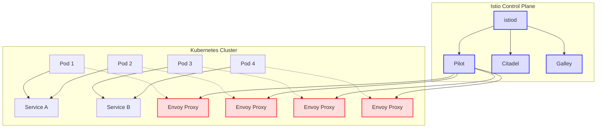
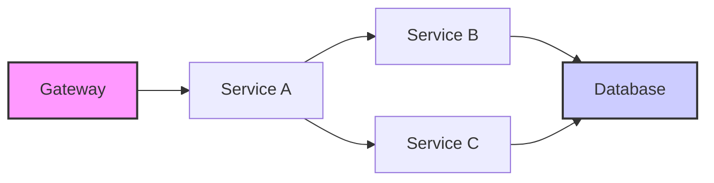

# Kubernetes Istio

## Introduction

Istio is an open-source service mesh that adds a layer of infrastructure to your Kubernetes cluster without requiring any changes to your application code. It provides powerful features for managing, securing, and monitoring microservices, making it an essential tool in the Kubernetes ecosystem.

In this guide, we'll explore what Istio is, why it's useful, and how to get started with implementing it in your Kubernetes clusters.

## What is a Service Mesh?

Before diving into Istio specifically, let's understand what a service mesh is:

A service mesh is a dedicated infrastructure layer for handling service-to-service communication. It's responsible for the reliable delivery of requests through the complex topology of services that comprise a modern, cloud-native application.

In a microservices architecture, the number of services and their interactions can grow exponentially, making them difficult to manage. A service mesh addresses these challenges by providing:

1. **Traffic Management**: Routing, load balancing, and fault handling
2. **Security**: Authentication, authorization, and encryption
3. **Observability**: Metrics, logs, and tracing

## Istio Architecture

Istio consists of two main components:

1. **Control Plane**: Manages and configures the proxies to route traffic
2. **Data Plane**: Consists of a set of intelligent proxies (Envoy) deployed as sidecars



### Key Components

- **istiod**: The central component that combines control plane functionality
- **Envoy Proxy**: High-performance proxy that mediates all inbound and outbound traffic for services in the mesh
- **Pilot**: Service discovery and traffic management
- **Citadel**: Certificate authority and identity management
- **Galley**: Configuration validation and distribution

## Getting Started with Istio

### Prerequisites

Before installing Istio, ensure you have:

1. A running Kubernetes cluster (v1.16 or higher)
2. `kubectl` command-line tool installed
3. Administrative access to your cluster

### Installation

Let's go through the installation process step by step:

1. **Download Istio**:

```bash
curl -L https://istio.io/downloadIstio | sh -
cd istio-1.19.0  # version may differ
export PATH=$PWD/bin:$PATH
```

2. **Install Istio using the default profile**:

```bash
istioctl install --set profile=default -y
```

3. **Enable automatic sidecar injection for a namespace**:

```bash
kubectl label namespace default istio-injection=enabled
```

4. **Verify the installation**:

```bash
kubectl get svc -n istio-system
kubectl get pods -n istio-system
```

Expected output:

```
NAME                   TYPE           CLUSTER-IP       EXTERNAL-IP   PORT(S)                                      AGE
istio-egressgateway    ClusterIP      10.111.219.223   <none>        80/TCP,443/TCP                               93s
istio-ingressgateway   LoadBalancer   10.109.31.226    <pending>     15021:30505/TCP,80:31211/TCP,443:30947/TCP   93s
istiod                 ClusterIP      10.102.57.228    <none>        15010/TCP,15012/TCP,443/TCP,15014/TCP        2m2s
```

## Traffic Management with Istio

One of Istio's most powerful features is its ability to control the flow of traffic and API calls between services.

### Virtual Services and Destination Rules

Istio uses two main resources for traffic management:

1. **VirtualService**: Defines how requests are routed to a service
2. **DestinationRule**: Defines policies that apply to traffic after routing

Let's create a simple example with two versions of a service:

1. **Deploy two versions of a sample application**:

```yaml
apiVersion: apps/v1
kind: Deployment
metadata:
  name: hello-v1
spec:
  replicas: 1
  selector:
    matchLabels:
      app: hello
      version: v1
  template:
    metadata:
      labels:
        app: hello
        version: v1
    spec:
      containers:
      - name: hello
        image: istio/examples-helloworld-v1
        ports:
        - containerPort: 5000
---
apiVersion: apps/v1
kind: Deployment
metadata:
  name: hello-v2
spec:
  replicas: 1
  selector:
    matchLabels:
      app: hello
      version: v2
  template:
    metadata:
      labels:
        app: hello
        version: v2
    spec:
      containers:
      - name: hello
        image: istio/examples-helloworld-v2
        ports:
        - containerPort: 5000
---
apiVersion: v1
kind: Service
metadata:
  name: hello
spec:
  selector:
    app: hello
  ports:
  - port: 80
    targetPort: 5000
```

2. **Create a VirtualService to route traffic**:

```yaml
apiVersion: networking.istio.io/v1beta1
kind: VirtualService
metadata:
  name: hello-routes
spec:
  hosts:
  - hello
  http:
  - match:
    - uri:
        prefix: /v1
    route:
    - destination:
        host: hello
        subset: v1
  - match:
    - uri:
        prefix: /v2
    route:
    - destination:
        host: hello
        subset: v2
  - route:
    - destination:
        host: hello
        subset: v1
      weight: 90
    - destination:
        host: hello
        subset: v2
      weight: 10
```

3. **Create a DestinationRule to define subsets**:

```yaml
apiVersion: networking.istio.io/v1beta1
kind: DestinationRule
metadata:
  name: hello-destination
spec:
  host: hello
  subsets:
  - name: v1
    labels:
      version: v1
  - name: v2
    labels:
      version: v2
```

This configuration does the following:
- Routes all traffic with path `/v1/*` to the v1 subset
- Routes all traffic with path `/v2/*` to the v2 subset
- For all other traffic, splits it with 90% to v1 and 10% to v2 (canary deployment)

## Security Features

Istio provides robust security features without requiring changes to your application code.

### mTLS (Mutual TLS)

Enable mutual TLS for all services in a namespace:

```yaml
apiVersion: security.istio.io/v1beta1
kind: PeerAuthentication
metadata:
  name: default
  namespace: default
spec:
  mtls:
    mode: STRICT
```

### Authentication Policies

Define who can access your services:

```yaml
apiVersion: security.istio.io/v1beta1
kind: AuthorizationPolicy
metadata:
  name: hello-viewer
  namespace: default
spec:
  selector:
    matchLabels:
      app: hello
  rules:
  - from:
    - source:
        namespaces: ["default"]
  - to:
    - operation:
        methods: ["GET"]
```

This policy only allows GET requests from the default namespace to the hello service.

## Observability with Istio

Istio integrates with several telemetry tools to provide insights into your service mesh.

### Installing Addons

1. **Deploy the Istio addons**:

```bash
kubectl apply -f samples/addons
```

This installs:
- Prometheus for metrics collection
- Grafana for metrics visualization
- Jaeger for distributed tracing
- Kiali for service mesh visualization

2. **Access the dashboards**:

```bash
istioctl dashboard kiali
istioctl dashboard grafana
istioctl dashboard jaeger
```

### Visualizing Traffic with Kiali

Kiali provides a service graph that shows how your services are communicating:



## Practical Example: Implementing Canary Deployments

Canary deployments allow you to test new versions of your service with a small percentage of real traffic.

1. **Deploy two versions of your application** (as shown earlier)

2. **Create a canary deployment configuration**:

```yaml
apiVersion: networking.istio.io/v1beta1
kind: VirtualService
metadata:
  name: hello-canary
spec:
  hosts:
  - hello
  http:
  - route:
    - destination:
        host: hello
        subset: v1
      weight: 90
    - destination:
        host: hello
        subset: v2
      weight: 10
```

3. **Gradually shift traffic by updating weights**:

```yaml
apiVersion: networking.istio.io/v1beta1
kind: VirtualService
metadata:
  name: hello-canary
spec:
  hosts:
  - hello
  http:
  - route:
    - destination:
        host: hello
        subset: v1
      weight: 75
    - destination:
        host: hello
        subset: v2
      weight: 25
```

4. **Monitor the new version in your dashboards**

5. **If everything looks good, continue shifting traffic until 100% goes to v2**

## Advanced Istio Features

### Fault Injection

Test your application's resilience by injecting faults:

```yaml
apiVersion: networking.istio.io/v1beta1
kind: VirtualService
metadata:
  name: hello-fault
spec:
  hosts:
  - hello
  http:
  - fault:
      delay:
        percentage:
          value: 25
        fixedDelay: 5s
    route:
    - destination:
        host: hello
        subset: v1
```

This injects a 5-second delay into 25% of requests to test how your application handles latency.

### Circuit Breaking

Prevent cascading failures with circuit breaking:

```yaml
apiVersion: networking.istio.io/v1beta1
kind: DestinationRule
metadata:
  name: hello-circuit-breaker
spec:
  host: hello
  trafficPolicy:
    outlierDetection:
      consecutiveErrors: 5
      interval: 30s
      baseEjectionTime: 1m
```

This configuration will eject a host from the load balancing pool if it has 5 consecutive errors.

## Troubleshooting Istio

Here are some common issues and their solutions:

1. **Sidecar injection not working**:
   - Ensure namespace is labeled: `kubectl label namespace default istio-injection=enabled`
   - Restart pods after labeling: `kubectl rollout restart deployment <deployment-name>`

2. **Services not communicating**:
   - Check if mTLS is configured correctly
   - Verify that authorization policies are not blocking traffic

3. **High latency**:
   - Check resource limits on Istio components
   - Consider enabling horizontal pod autoscaling for istiod

## Best Practices

1. **Start Small**: Begin with a non-critical namespace or application
2. **Incremental Adoption**: Gradually migrate services to the mesh
3. **Resource Planning**: Allocate sufficient resources for Istio components
4. **Security Settings**: Configure mTLS and authorization policies appropriately
5. **Monitoring**: Set up alerts for key metrics
6. **Updates**: Stay current with Istio versions, but test upgrades first

## Summary

Istio is a powerful service mesh that enhances your Kubernetes cluster with advanced traffic management, security, and observability features. By abstracting these concerns from your application code, Istio allows developers to focus on business logic while operators gain deeper insights and control over the service ecosystem.

Key takeaways:
- Istio provides traffic management through VirtualServices and DestinationRules
- Security features include mTLS and fine-grained access controls
- Observability is enhanced through integration with tools like Prometheus, Grafana, and Jaeger
- Advanced features like canary deployments, fault injection, and circuit breaking improve application resilience

## Additional Resources

Here are some resources to continue your Istio journey:

1. Official Documentation:
   - Istio Documentation (https://istio.io/latest/docs/)
   - Istio GitHub Repository

2. Learning:
   - Istio Concepts
   - Traffic Management
   - Security
   - Observability

3. Exercises:
   - Set up a canary deployment
   - Implement mTLS for all services
   - Create a dashboard for monitoring your services
   - Design fault tolerance with circuit breaking and retry policies

Remember, Istio is a complex tool with many features. Start with the basics and gradually explore more advanced capabilities as you become comfortable with the service mesh architecture.