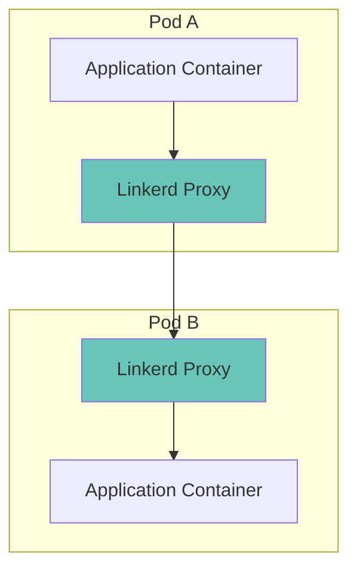
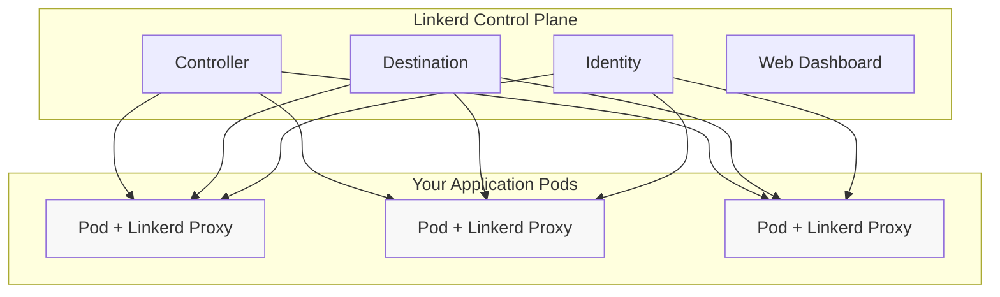

# Kubernetes Linkerd

## Introduction

Linkerd is a lightweight, open-source service mesh designed specifically for Kubernetes. A service mesh is an infrastructure layer that handles service-to-service communication within a Kubernetes cluster, making applications more reliable and secure. Linkerd was created to be simple to use while solving complex problems like traffic management, security, and observability in distributed systems.

Compared to other service meshes, Linkerd prioritizes simplicity and performance. It's often described as the "service mesh for busy engineers" because it's designed to be as lightweight and unobtrusive as possible.

## What Problems Does Linkerd Solve?

Before diving into how Linkerd works, let's understand the challenges that arise in a microservices architecture:

1. **Reliability**: Services can fail for many reasons. How do we handle retries and timeouts?
2. **Security**: How do we ensure encrypted communication between services?
3. **Observability**: How do we monitor service behavior and troubleshoot issues?
4. **Traffic Control**: How do we implement features like load balancing and canary deployments?

Linkerd addresses all these concerns without requiring changes to your application code.

## How Linkerd Works

Linkerd uses a "sidecar" pattern, where a proxy container is automatically injected alongside each of your application containers.



These proxies intercept all network traffic to and from your applications. This setup allows Linkerd to:

1. **Monitor** all requests without modifying your code
2. **Secure** communication between services with mTLS
3. **Control** traffic with features like automatic retries
4. **Observe** metrics, logs, and traces

## Linkerd Architecture

Linkerd consists of two main components:

1. **Control Plane**: A set of services that manage the Linkerd deployment
2. **Data Plane**: The Linkerd proxies running alongside your applications



## Getting Started with Linkerd

### Prerequisites

Before installing Linkerd, ensure you have:

1. A Kubernetes cluster running version 1.17 or later
2. `kubectl` installed and configured
3. The Linkerd CLI installed

### Installing the Linkerd CLI

You can install the Linkerd CLI using:

```bash
# macOS or Linux
curl -sL https://run.linkerd.io/install | sh

# Verify installation
linkerd version
```

Expected output:
```
Client version: stable-2.12.1
Server version: unavailable
```

### Installing Linkerd on Your Cluster

Linkerd installation is a two-step process:

1. First, validate your Kubernetes cluster:

```bash
linkerd check --pre
```

2. Then install the Linkerd control plane:

```bash
linkerd install | kubectl apply -f -
```

3. Verify the installation:

```bash
linkerd check
```

Expected output (if everything is working correctly):
```
kubernetes-api
--------------
√ can initialize the client
√ can query the Kubernetes API

kubernetes-version
-----------------
√ is running the minimum Kubernetes API version

...

linkerd-version
--------------
√ can determine the latest version
√ cli is up-to-date

Status check results are √
```

## Adding Linkerd to Your Applications

### Injecting the Linkerd Proxy

To add Linkerd to your existing applications, you need to "inject" the Linkerd proxy sidecar into your pods. This can be done in several ways:

#### Method 1: Manual Injection

```bash
# Inject the proxy into an existing deployment
kubectl get deploy my-app -o yaml | linkerd inject - | kubectl apply -f -
```

#### Method 2: Automatic Injection

Add the annotation to your namespace:

```bash
kubectl annotate namespace my-namespace linkerd.io/inject=enabled
```

After this, all newly created pods in this namespace will automatically get the Linkerd proxy.

### Basic Example: Deploying a Demo Application

Let's deploy a simple application to see Linkerd in action:

```bash
# Clone the demo application
git clone https://github.com/linkerd/linkerd-examples
cd linkerd-examples/emojivoto

# Inject Linkerd proxies into the application manifests
kubectl apply -f https://raw.githubusercontent.com/linkerd/linkerd-examples/main/emojivoto/emojivoto.yml

# Inject Linkerd into the deployment
kubectl get -n emojivoto deploy -o yaml | linkerd inject - | kubectl apply -f -
```

Now you can verify that the application pods have been injected with Linkerd:

```bash
kubectl -n emojivoto get po
```

Expected output:
```
NAME                        READY   STATUS    RESTARTS   AGE
emoji-6bf9f47bd5-qjpzk      2/2     Running   0          45s
vote-bot-78f8dbd5d8-kjlht   2/2     Running   0          45s
voting-7599c8cb47-tfwxs     2/2     Running   0          45s
web-66bb5fbb76-zxnpw        2/2     Running   0          45s
```

Notice the `2/2` under READY, which indicates that both the application container and the Linkerd proxy are running.

## Key Features of Linkerd

### 1. Automatic mTLS (Mutual TLS)

Linkerd automatically enables mutual TLS between all meshed pods, ensuring encrypted communication:

```bash
# Check which services are meshed and have mTLS enabled
linkerd viz edges deployment
```

Expected output:
```
SRC                  DST                  SRC_NS     DST_NS     SECURED       
web                  emoji                emojivoto  emojivoto  √              
web                  voting               emojivoto  emojivoto  √              
vote-bot             web                  emojivoto  emojivoto  √    
```

The checkmark (√) under SECURED indicates that the connection is secured with mTLS.

### 2. Traffic Metrics and Visualization

Linkerd provides real-time metrics for all traffic:

```bash
# Install the viz extension to enable metrics
linkerd viz install | kubectl apply -f -

# Start the dashboard
linkerd viz dashboard
```

This opens a web dashboard where you can see:
- Success rates
- Request volumes
- Latency statistics
- Topology graphs

### 3. Retries and Timeouts

Linkerd can automatically retry failed requests. Create a `ServiceProfile` to configure this behavior:

```yaml
apiVersion: linkerd.io/v1alpha2
kind: ServiceProfile
metadata:
  name: voting.emojivoto.svc.cluster.local
  namespace: emojivoto
spec:
  routes:
    - name: "POST /emojivoto.v1.VotingService/VoteDoughnut"
      condition:
        method: POST
        pathRegex: /emojivoto\.v1\.VotingService/VoteDoughnut
      retryPolicy:
        retryOn: "5xx"
        numRetries: 3
        perTryTimeout: 100ms
```

Apply this configuration:

```bash
kubectl apply -f voting-service-profile.yaml
```

Now, when the `VoteDoughnut` endpoint returns a 5xx error, Linkerd will automatically retry the request up to 3 times.

### 4. Traffic Splitting for Canary Deployments

Linkerd allows you to gradually roll out new versions of your services:

```yaml
apiVersion: split.smi-spec.io/v1alpha1
kind: TrafficSplit
metadata:
  name: web-split
  namespace: emojivoto
spec:
  service: web-svc
  backends:
  - service: web-svc-v1
    weight: 80
  - service: web-svc-v2
    weight: 20
```

Apply this configuration:

```bash
kubectl apply -f traffic-split.yaml
```

This will send 80% of traffic to version 1 and 20% to version 2, allowing you to safely test the new version.

## Real-World Use Case: Implementing Circuit Breaking

Let's implement a common resilience pattern called "circuit breaking" with Linkerd. This prevents cascading failures when a service is overloaded.

Here's how to configure circuit breaking for a service:

```yaml
apiVersion: linkerd.io/v1alpha2
kind: ServiceProfile
metadata:
  name: voting.emojivoto.svc.cluster.local
  namespace: emojivoto
spec:
  routes:
    - name: "POST /emojivoto.v1.VotingService/VoteDoughnut"
      condition:
        method: POST
        pathRegex: /emojivoto\.v1\.VotingService/VoteDoughnut
      isRetryable: true
  retryBudget:
    retryRatio: 0.2
    minRetriesPerSecond: 10
    ttl: 10s
```

Apply this configuration:

```bash
kubectl apply -f circuit-breaker.yaml
```

With this configuration:
- Linkerd allows retries for up to 20% of the total request volume
- Even in low-traffic situations, 10 retries per second are available
- The retry quota refreshes every 10 seconds

## Debugging with Linkerd

Linkerd provides powerful tools for debugging service issues:

```bash
# See live traffic for a specific deployment
linkerd viz tap deployment/web -n emojivoto

# Check the health of a specific route
linkerd viz routes service/voting -n emojivoto

# Generate a service dependency graph
linkerd viz stat -o json deployments | jq > service-graph.json
```

The `tap` command shows real-time requests, which is invaluable for troubleshooting:

```
req id=1:0 proxy=in  src=10.244.0.941:51234 dst=10.244.0.941:8080 tls=true :method=POST :path=/emojivoto.v1.VotingService/VoteDoughnut :authority=voting.emojivoto:8080 src_deployment=vote-bot dst_deployment=voting
rsp id=1:0 proxy=in  src=10.244.0.941:51234 dst=10.244.0.941:8080 tls=true :status=200 latency=1.9ms
```

## Summary

Linkerd is a powerful yet simple service mesh for Kubernetes that helps you:

1. **Secure** your services with automatic mTLS encryption
2. **Observe** traffic patterns with detailed metrics and visualizations
3. **Control** traffic with features like retries, timeouts, and traffic splitting
4. **Enhance** reliability with circuit breaking and load balancing

The beauty of Linkerd is that it adds these capabilities without requiring changes to your application code. This makes it an excellent choice for teams looking to improve their Kubernetes infrastructure without increasing complexity.

## Additional Resources

- [Official Linkerd Documentation](https://linkerd.io/docs/)
- [Linkerd Community Slack](https://slack.linkerd.io/)
- [CNCF Linkerd Project Page](https://www.cncf.io/projects/linkerd/)

## Practice Exercises

1. **Basic**: Install Linkerd on a test cluster and deploy the Emojivoto demo application.
2. **Intermediate**: Configure automatic retries for a service and test the configuration using fault injection.
3. **Advanced**: Implement a canary deployment using TrafficSplit and gradually shift traffic from one version to another.

By mastering Linkerd, you'll add a powerful tool to your Kubernetes toolkit that can significantly improve the reliability, security, and observability of your applications.