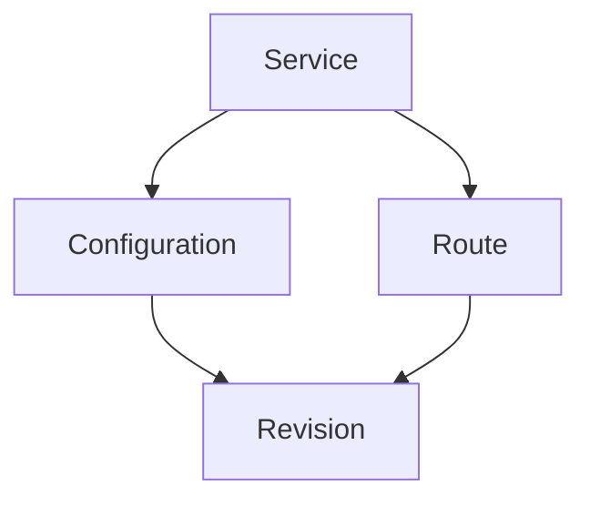
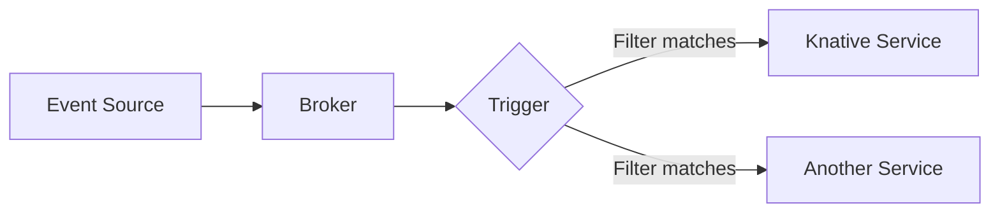

# Kubernetes Knative

## Introduction

Knative is an open-source platform built on top of Kubernetes that provides a simplified experience for deploying, serving, and autoscaling cloud-native applications. It extends Kubernetes with components that implement essential patterns for serverless workloads, making it easier to build and manage event-driven and serverless applications.

Think of Knative as adding "serverless superpowers" to your Kubernetes cluster. It handles many of the complex infrastructure concerns for you, allowing developers to focus more on writing code and less on configuring infrastructure.

## Core Components of Knative

Knative consists of two main components:

1. **Serving** - Manages the deployment and automatic scaling of your applications
2. **Eventing** - Provides tools for creating event-driven architectures

Let's explore each of these components in detail.

### Knative Serving

Knative Serving focuses on deploying and managing your containerized applications. It provides:

- **Rapid deployment** of containerized workloads
- **Automatic scaling** including scale-to-zero functionality (when your service isn't being used, it can scale down to zero instances)
- **Revision management** for easy rollbacks and traffic splitting

The core resource types in Knative Serving are:

- **Service**: The top-level resource that manages the entire lifecycle of your workload
- **Route**: Maps network endpoints to Revisions
- **Configuration**: Maintains the desired state of your deployment
- **Revision**: Immutable snapshots of your application code and configuration

Here's a diagram showing how these components relate:



## Setting Up Knative

Before diving into examples, let's set up Knative on your Kubernetes cluster.

### Prerequisites

- A Kubernetes cluster (v1.23 or newer)
- `kubectl` installed and configured
- Helm (optional, but helpful)

### Installing Knative Serving

We'll use the Knative Operator to install Knative components:

```bash
# Install the Knative Operator
kubectl apply -f https://github.com/knative/operator/releases/download/knative-v1.10.0/operator.yaml

# Create a Knative Serving instance
cat <<EOF | kubectl apply -f -
apiVersion: operator.knative.dev/v1beta1
kind: KnativeServing
metadata:
  name: knative-serving
  namespace: knative-serving
EOF

# Wait for the installation to complete
kubectl wait deployment --all --timeout=-1s --for=condition=Available -n knative-serving
```

Once installed, you can verify your installation:

```bash
kubectl get pods -n knative-serving
```

Expected output:
```
NAME                                     READY   STATUS    RESTARTS   AGE
activator-7454cbf7d5-mfj7t               1/1     Running   0          2m
autoscaler-6578c85c96-7ppbq              1/1     Running   0          2m
controller-5c9b6c86c8-n9bjs              1/1     Running   0          2m
domain-mapping-65f58c79c5-5zsjt          1/1     Running   0          2m
domainmapping-webhook-778b7cf5c4-zsxwz   1/1     Running   0          2m
webhook-54c69d4c94-xrxzl                 1/1     Running   0          2m
```

## Deploying Your First Knative Service

Let's create a simple Hello World application using Knative Serving:

```yaml
apiVersion: serving.knative.dev/v1
kind: Service
metadata:
  name: hello-world
  namespace: default
spec:
  template:
    spec:
      containers:
        - image: gcr.io/knative-samples/helloworld-go
          env:
            - name: TARGET
              value: "Knative Beginner"
          ports:
            - containerPort: 8080
```

Apply this configuration:

```bash
kubectl apply -f hello-world.yaml
```

After a few moments, verify that your service is running:

```bash
kubectl get ksvc hello-world
```

Expected output:
```
NAME          URL                                          LATESTCREATED       LATESTREADY         READY   REASON
hello-world   http://hello-world.default.example.com       hello-world-00001   hello-world-00001   True
```

The URL displayed is where your application is accessible. However, to actually access it, you'll need to set up DNS or use a temporary port-forwarding approach:

```bash
# Get the Knative ingress gateway address
INGRESSGATEWAY=istio-ingressgateway
INGRESS_IP=$(kubectl get svc $INGRESSGATEWAY -n istio-system -o jsonpath='{.status.loadBalancer.ingress[0].ip}')

# Send a request
curl -H "Host: hello-world.default.example.com" http://$INGRESS_IP
```

Expected output:
```
Hello Knative Beginner!
```

## Automatic Scaling with Knative

One of Knative's most powerful features is its ability to automatically scale your applications based on demand, including scaling to zero when there's no traffic.

You can configure the scaling behavior using annotations:

```yaml
apiVersion: serving.knative.dev/v1
kind: Service
metadata:
  name: autoscale-example
  namespace: default
spec:
  template:
    metadata:
      annotations:
        # Minimum number of pods
        autoscaling.knative.dev/minScale: "1"
        # Maximum number of pods
        autoscaling.knative.dev/maxScale: "10"
        # Target 10 concurrent requests per pod
        autoscaling.knative.dev/target: "10"
    spec:
      containers:
        - image: gcr.io/knative-samples/autoscale-go
          ports:
            - containerPort: 8080
```

Apply this configuration:

```bash
kubectl apply -f autoscale-example.yaml
```

Now, when traffic increases, Knative will automatically create more pods to handle the load, up to a maximum of 10. When traffic decreases, it will scale down, but maintain at least 1 pod.

## Traffic Splitting and Revisions

Knative makes it easy to implement blue-green deployments or canary releases by splitting traffic between different revisions of your service.

First, let's deploy a new version of our hello-world service:

```yaml
apiVersion: serving.knative.dev/v1
kind: Service
metadata:
  name: hello-world
  namespace: default
spec:
  template:
    metadata:
      name: hello-world-v2
    spec:
      containers:
        - image: gcr.io/knative-samples/helloworld-go
          env:
            - name: TARGET
              value: "Knative Advanced User"
          ports:
            - containerPort: 8080
  traffic:
    - percent: 80
      revisionName: hello-world-v1
      tag: v1
    - percent: 20
      revisionName: hello-world-v2
      tag: v2
      # latestRevision: true
```

This configuration sends 80% of traffic to the original version and 20% to the new version. You can also use named URLs to target specific versions:

```bash
# Access v1 specifically
curl -H "Host: v1-hello-world.default.example.com" http://$INGRESS_IP

# Access v2 specifically
curl -H "Host: v2-hello-world.default.example.com" http://$INGRESS_IP
```

## Knative Eventing

Now that we've explored Serving, let's look at Knative Eventing, which provides facilities for building event-driven architectures.

### Installing Knative Eventing

Like with Serving, we'll use the Knative Operator to install Eventing:

```bash
# Create a Knative Eventing instance
cat <<EOF | kubectl apply -f -
apiVersion: operator.knative.dev/v1beta1
kind: KnativeEventing
metadata:
  name: knative-eventing
  namespace: knative-eventing
EOF

# Wait for the installation to complete
kubectl wait deployment --all --timeout=-1s --for=condition=Available -n knative-eventing
```

### Key Concepts in Knative Eventing

Knative Eventing has several core concepts:

1. **Event Sources** - Systems that generate events
2. **Brokers** - Event delivery mechanisms that can filter and forward events
3. **Triggers** - Define which events get sent to which services
4. **Sinks** - Destinations that receive events

Here's a diagram showing how these components interact:



### Creating an Event Source

Let's create a simple event source that generates events on a schedule:

```yaml
apiVersion: sources.knative.dev/v1
kind: PingSource
metadata:
  name: test-ping-source
spec:
  schedule: "*/1 * * * *"  # Every 1 minute
  contentType: "application/json"
  data: '{"message": "Hello from Knative Eventing!"}'
  sink:
    ref:
      apiVersion: serving.knative.dev/v1
      kind: Service
      name: event-display
```

Now, let's create a simple service to display these events:

```yaml
apiVersion: serving.knative.dev/v1
kind: Service
metadata:
  name: event-display
spec:
  template:
    spec:
      containers:
      - image: gcr.io/knative-releases/knative.dev/eventing/cmd/event_display
```

Apply both configurations:

```bash
kubectl apply -f ping-source.yaml
kubectl apply -f event-display.yaml
```

Now, every minute, the PingSource will generate an event and send it to the event-display service, which will log it. You can check the logs to see the events:

```bash
kubectl logs -l serving.knative.dev/service=event-display -c user-container --tail=100
```

Expected output (will appear after a minute):
```
☁️  cloudevents.Event
Validation: valid
Context Attributes,
  specversion: 1.0
  type: dev.knative.sources.ping
  source: /apis/v1/namespaces/default/pingsources/test-ping-source
  id: 1e8b3c23-ca87-4db4-aaaa-a9b4422f8cb0
  time: 2023-02-15T12:00:00.000Z
  datacontenttype: application/json
Data,
  {
    "message": "Hello from Knative Eventing!"
  }
```

### Using Brokers and Triggers

For more complex event routing, we can use Brokers and Triggers:

1. First, create a broker:

```yaml
apiVersion: eventing.knative.dev/v1
kind: Broker
metadata:
  name: default
  namespace: default
```

2. Then, create a trigger that filters events:

```yaml
apiVersion: eventing.knative.dev/v1
kind: Trigger
metadata:
  name: ping-trigger
spec:
  broker: default
  filter:
    attributes:
      type: dev.knative.sources.ping
  subscriber:
    ref:
      apiVersion: serving.knative.dev/v1
      kind: Service
      name: event-display
```

3. Update our PingSource to send to the broker:

```yaml
apiVersion: sources.knative.dev/v1
kind: PingSource
metadata:
  name: test-ping-source
spec:
  schedule: "*/1 * * * *"
  contentType: "application/json"
  data: '{"message": "Hello from Knative Eventing!"}'
  sink:
    ref:
      apiVersion: eventing.knative.dev/v1
      kind: Broker
      name: default
```

Apply all three configurations:

```bash
kubectl apply -f broker.yaml
kubectl apply -f trigger.yaml
kubectl apply -f ping-source-broker.yaml
```

Now events will flow through the broker, be filtered by the trigger, and then be sent to our service.

## Real-World Example: Building a Thumbnail Generator

Let's build a more practical example: a service that automatically generates thumbnails for uploaded images. We'll use Knative Serving and Eventing together.

1. First, create an event source for object storage events (simplified for this example):

```yaml
apiVersion: sources.knative.dev/v1
kind: PingSource
metadata:
  name: storage-simulator
spec:
  schedule: "*/2 * * * *"  # Every 2 minutes
  contentType: "application/json"
  data: '{"bucket": "my-photos", "name": "sample.jpg", "contentType": "image/jpeg"}'
  sink:
    ref:
      apiVersion: eventing.knative.dev/v1
      kind: Broker
      name: default
```

2. Create a thumbnail generator service:

```yaml
apiVersion: serving.knative.dev/v1
kind: Service
metadata:
  name: thumbnail-generator
spec:
  template:
    spec:
      containers:
      - image: example/thumbnail-generator:latest
        env:
        - name: STORAGE_BUCKET
          value: "my-photos-thumbnails"
```

3. Create a trigger to route storage events to the thumbnail generator:

```yaml
apiVersion: eventing.knative.dev/v1
kind: Trigger
metadata:
  name: storage-trigger
spec:
  broker: default
  filter:
    attributes:
      bucket: my-photos
  subscriber:
    ref:
      apiVersion: serving.knative.dev/v1
      kind: Service
      name: thumbnail-generator
```

In a real-world scenario, the thumbnail generator would:
1. Receive the event about a new image
2. Download the image from the storage bucket
3. Generate a thumbnail
4. Upload the thumbnail to another bucket
5. Potentially emit another event that a thumbnail is ready

What's powerful about this architecture is:
- The thumbnail generator only runs when needed
- It automatically scales based on the number of images being uploaded
- It scales to zero when there are no uploads, saving resources

## Best Practices for Knative

Here are some best practices to keep in mind when working with Knative:

1. **Design for scale-to-zero** - Make sure your applications can handle being scaled down completely and back up quickly.

2. **Use revisions effectively** - Take advantage of Knative's revision system for safe deployments.

3. **Configure autoscaling properly** - Set appropriate minScale and maxScale values based on your application's needs.

4. **Structure event data wisely** - Use CloudEvents format and include all necessary metadata.

5. **Monitor cold starts** - Be aware of increased latency when services scale from zero.

6. **Set resource limits** - Properly configure CPU and memory limits to prevent resource exhaustion.

7. **Use concurrency settings** - Configure how many concurrent requests each instance can handle.

```yaml
apiVersion: serving.knative.dev/v1
kind: Service
metadata:
  name: best-practice-example
spec:
  template:
    metadata:
      annotations:
        autoscaling.knative.dev/minScale: "1"
        autoscaling.knative.dev/maxScale: "5"
        autoscaling.knative.dev/target: "50"
    spec:
      containerConcurrency: 50
      containers:
      - image: example/my-app:latest
        resources:
          limits:
            cpu: "1"
            memory: "256Mi"
          requests:
            cpu: "500m"
            memory: "128Mi"
```

## Debugging Knative Applications

When things go wrong, here are some useful commands for debugging:

```bash
# Check the status of your Knative service
kubectl get ksvc my-service

# Get detailed information about your service
kubectl describe ksvc my-service

# Check the pods created by your service
kubectl get pods -l serving.knative.dev/service=my-service

# View logs from your application
kubectl logs -l serving.knative.dev/service=my-service -c user-container

# Check events related to your service
kubectl get events --sort-by=.metadata.creationTimestamp
```

## Summary

Knative provides a powerful platform for deploying, scaling, and event-driven programming on Kubernetes. It simplifies many of the complexities involved in running serverless and event-driven workloads.

In this guide, we've covered:

- Setting up Knative Serving and Eventing
- Deploying services that automatically scale based on demand
- Managing multiple revisions and traffic splitting
- Creating event sources, brokers, and triggers
- Building a real-world event-driven application

Knative brings serverless principles to Kubernetes, allowing developers to focus on writing code rather than managing infrastructure.

## Additional Resources

To continue your Knative journey:

- [Knative Official Documentation](https://knative.dev/docs/)
- [Knative GitHub Repository](https://github.com/knative)
- [Knative Samples Repository](https://github.com/knative/docs/tree/main/code-samples)

## Exercises

1. **Basic**: Deploy a "Hello World" Knative service and observe how it scales to zero after a period of inactivity.

2. **Intermediate**: Implement a blue-green deployment strategy using Knative's traffic splitting features.

3. **Advanced**: Create a complete event-driven architecture with multiple services that react to different events from a broker.

4. **Expert**: Build a microservice application using Knative that includes authentication, database access, and event processing with appropriate scaling configurations for each component.