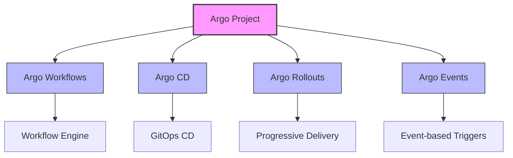
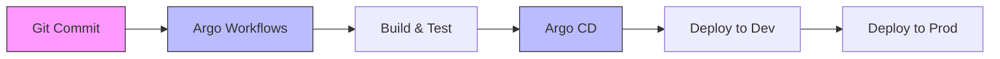

# Kubernetes Argo

## Introduction

Argo is a collection of open-source tools that enhance Kubernetes with powerful workflow automation, continuous delivery, and GitOps capabilities. Developed to address complex operational challenges in Kubernetes environments, Argo has become an essential part of the Kubernetes ecosystem for many organizations.

In this guide, we'll explore the Argo project family, understand its core components, and learn how to use them to streamline your Kubernetes operations.

## What is Argo?

Argo is not a single tool but a family of projects that work together to provide workflow automation and GitOps capabilities within Kubernetes. The Argo project was initially created by Applatix, which was later acquired by Intuit. Currently, it's a Cloud Native Computing Foundation (CNCF) incubating project, indicating its maturity and adoption in the industry.

## The Argo Project Family

The Argo project consists of four main components:



Let's explore each of these components in detail.

## Argo Workflows

Argo Workflows is a container-native workflow engine for orchestrating parallel jobs on Kubernetes. It allows you to define complex workflows as directed acyclic graphs (DAGs) where each step in the workflow is a container.

### Key Features of Argo Workflows

- **Container-native**: Each step in a workflow runs in its own container
- **DAG-based workflows**: Define complex dependencies between steps
- **Artifact passing**: Share data between workflow steps
- **Parameter substitution**: Dynamically configure workflows
- **Retry mechanisms**: Automatically retry failed steps
- **Web UI**: Visualize and manage workflows

### Basic Workflow Example

Let's create a simple workflow that demonstrates these concepts:

```yaml
apiVersion: argoproj.io/v1alpha1
kind: Workflow
metadata:
  generateName: hello-world-
spec:
  entrypoint: whalesay
  templates:
  - name: whalesay
    container:
      image: docker/whalesay:latest
      command: [cowsay]
      args: ["Hello Argo!"]
```

To run this workflow:

```bash
# Apply the workflow
kubectl apply -f hello-workflow.yaml

# Check the status
kubectl get workflows

# Get the logs
kubectl logs pod/hello-world-xxxx -c main
```

**Output:**
```
 _____________
< Hello Argo! >
 -------------
    \
     \
      \     
                    ##        .            
              ## ## ##       ==            
           ## ## ## ##      ===            
       /""""""""""""""""___/ ===        
  ~~~ {~~ ~~~~ ~~~ ~~~~ ~~ ~ /  ===- ~~~   
       \______ o          __/            
        \    \        __/             
          \____\______/   
```

### Advanced Workflow with DAG

For more complex workflows, you can use the DAG template to define dependencies:

```yaml
apiVersion: argoproj.io/v1alpha1
kind: Workflow
metadata:
  generateName: dag-diamond-
spec:
  entrypoint: diamond
  templates:
  - name: echo
    inputs:
      parameters:
      - name: message
    container:
      image: alpine:3.15
      command: [echo, "{{inputs.parameters.message}}"]
  
  - name: diamond
    dag:
      tasks:
      - name: A
        template: echo
        arguments:
          parameters: [{name: message, value: A}]
      
      - name: B
        dependencies: [A]
        template: echo
        arguments:
          parameters: [{name: message, value: B}]
      
      - name: C
        dependencies: [A]
        template: echo
        arguments:
          parameters: [{name: message, value: C}]
      
      - name: D
        dependencies: [B, C]
        template: echo
        arguments:
          parameters: [{name: message, value: D}]
```

This workflow creates a diamond pattern where B and C depend on A, and D depends on both B and C.

## Argo CD

Argo CD is a declarative, GitOps continuous delivery tool for Kubernetes. It automatically synchronizes and deploys applications when changes are detected in your Git repository.

### Key Features of Argo CD

- **GitOps-based**: Git is the source of truth for your application deployments
- **Automated sync**: Applications are automatically deployed when changes are detected
- **Multi-cluster deployments**: Deploy to multiple clusters from a single interface
- **Health assessment**: Monitor the health of your applications
- **Rollback capability**: Easily revert to previous versions
- **Web UI**: Visualize your application deployments

### Setting Up Argo CD

Here's how to install Argo CD on your Kubernetes cluster:

```bash
# Install Argo CD
kubectl create namespace argocd
kubectl apply -n argocd -f https://raw.githubusercontent.com/argoproj/argo-cd/stable/manifests/install.yaml

# Access the Argo CD API server
kubectl port-forward svc/argocd-server -n argocd 8080:443
```

### Creating an Application

Once Argo CD is installed, you can create an application:

```yaml
apiVersion: argoproj.io/v1alpha1
kind: Application
metadata:
  name: guestbook
  namespace: argocd
spec:
  project: default
  source:
    repoURL: https://github.com/argoproj/argocd-example-apps.git
    targetRevision: HEAD
    path: guestbook
  destination:
    server: https://kubernetes.default.svc
    namespace: default
  syncPolicy:
    automated:
      prune: true
      selfHeal: true
```

This application will deploy the guestbook application from the specified Git repository.

## Argo Rollouts

Argo Rollouts provides advanced deployment capabilities for Kubernetes, including progressive delivery strategies like canary, blue-green, and A/B testing.

### Key Features of Argo Rollouts

- **Progressive delivery**: Implement canary and blue-green deployments
- **Automated analysis**: Integrate with metrics providers to analyze deployments
- **Traffic management**: Control traffic splitting during deployments
- **Automated rollbacks**: Automatically rollback failed deployments

### Blue-Green Deployment Example

Here's an example of a blue-green deployment using Argo Rollouts:

```yaml
apiVersion: argoproj.io/v1alpha1
kind: Rollout
metadata:
  name: example-rollout
spec:
  replicas: 3
  selector:
    matchLabels:
      app: example-app
  template:
    metadata:
      labels:
        app: example-app
    spec:
      containers:
      - name: example-app
        image: nginx:1.19.0
        ports:
        - containerPort: 80
  strategy:
    blueGreen:
      activeService: example-active-service
      previewService: example-preview-service
      autoPromotionEnabled: false
```

This rollout will create a new "blue" version while keeping the "green" version active. Once the new version is ready, you can manually promote it.

## Argo Events

Argo Events is an event-driven workflow automation framework for Kubernetes. It allows you to trigger workflows, deployments, or any Kubernetes resource in response to events.

### Key Features of Argo Events

- **Event sources**: Connect to various event sources (e.g., webhooks, S3, calendar)
- **Event transformation**: Filter and transform events
- **Event sinks**: Send events to various destinations
- **Event triggers**: Trigger workflows or other actions in response to events

### Webhook Example

Here's an example of setting up a webhook trigger:

```yaml
apiVersion: argoproj.io/v1alpha1
kind: EventSource
metadata:
  name: webhook
spec:
  webhook:
    example:
      port: "12000"
      endpoint: /example
      method: POST
---
apiVersion: argoproj.io/v1alpha1
kind: Sensor
metadata:
  name: webhook
spec:
  triggers:
  - template:
      name: webhook-workflow-trigger
      argoWorkflow:
        operation: submit
        source:
          resource:
            apiVersion: argoproj.io/v1alpha1
            kind: Workflow
            metadata:
              generateName: webhook-
            spec:
              entrypoint: whalesay
              templates:
              - name: whalesay
                container:
                  image: docker/whalesay:latest
                  command: [cowsay]
                  args: ["Event received!"]
  dependencies:
  - name: webhook-dep
    eventSourceName: webhook
    eventName: example
```

This setup will trigger the "whalesay" workflow when a POST request is sent to the webhook endpoint.

## Real-World Applications

Argo tools are used in various real-world scenarios:

### 1. CI/CD Pipeline

Using Argo Workflows and Argo CD, you can create a complete CI/CD pipeline:



### 2. ML Training Pipeline

Argo Workflows can orchestrate complex machine learning pipelines:

```yaml
apiVersion: argoproj.io/v1alpha1
kind: Workflow
metadata:
  generateName: ml-pipeline-
spec:
  entrypoint: ml-pipeline
  templates:
  - name: ml-pipeline
    dag:
      tasks:
      - name: fetch-data
        template: fetch-data
      - name: preprocess
        dependencies: [fetch-data]
        template: preprocess
      - name: train-model
        dependencies: [preprocess]
        template: train-model
      - name: validate-model
        dependencies: [train-model]
        template: validate-model
      - name: deploy-model
        dependencies: [validate-model]
        template: deploy-model
  
  # Template definitions would follow...
```

### 3. Microservice Deployment

Argo CD enables GitOps-based deployment of microservice architectures:

```yaml
apiVersion: argoproj.io/v1alpha1
kind: Application
metadata:
  name: microservices
  namespace: argocd
spec:
  project: default
  source:
    repoURL: https://github.com/myorg/microservices.git
    targetRevision: HEAD
    path: kustomize
  destination:
    server: https://kubernetes.default.svc
    namespace: microservices
  syncPolicy:
    automated:
      prune: true
      selfHeal: true
```

## Practical Exercise: Creating Your First Argo Workflow

Let's walk through creating a simple workflow that processes data:

1. Create a file named `data-processing-workflow.yaml`:

```yaml
apiVersion: argoproj.io/v1alpha1
kind: Workflow
metadata:
  generateName: data-processing-
spec:
  entrypoint: data-processing
  templates:
  - name: data-processing
    dag:
      tasks:
      - name: generate-data
        template: generate
      - name: process-data
        dependencies: [generate-data]
        template: process
        arguments:
          artifacts:
          - name: data
            from: "{{tasks.generate-data.outputs.artifacts.generated-data}}"
      - name: analyze-data
        dependencies: [process-data]
        template: analyze
        arguments:
          artifacts:
          - name: data
            from: "{{tasks.process-data.outputs.artifacts.processed-data}}"
  
  - name: generate
    container:
      image: python:3.9
      command: [python, -c]
      args: ["import random; import json; print(json.dumps([random.randint(1, 100) for _ in range(20)]))"]
    outputs:
      artifacts:
      - name: generated-data
        path: /dev/stdout
  
  - name: process
    inputs:
      artifacts:
      - name: data
        path: /tmp/data.json
    container:
      image: python:3.9
      command: [python, -c]
      args: ["import json; with open('/tmp/data.json', 'r') as f: data = json.load(f); processed = [x * 2 for x in data]; print(json.dumps(processed))"]
    outputs:
      artifacts:
      - name: processed-data
        path: /dev/stdout
  
  - name: analyze
    inputs:
      artifacts:
      - name: data
        path: /tmp/data.json
    container:
      image: python:3.9
      command: [python, -c]
      args: ["import json; with open('/tmp/data.json', 'r') as f: data = json.load(f); print(f'Max: {max(data)}, Min: {min(data)}, Avg: {sum(data)/len(data)}')"]
```

2. Apply the workflow:

```bash
kubectl apply -f data-processing-workflow.yaml
```

3. Check the workflow status:

```bash
kubectl get workflows
```

4. View the results:

```bash
kubectl logs pod/data-processing-xxxxx -c analyze
```

You should see output similar to:

```
Max: 198, Min: 2, Avg: 100.0
```

## Summary

The Argo project provides a powerful set of tools that extend Kubernetes with workflow automation, continuous delivery, and event-driven capabilities. In this guide, we've explored:

- **Argo Workflows**: For orchestrating container-based workflows
- **Argo CD**: For GitOps-based continuous delivery
- **Argo Rollouts**: For advanced deployment strategies
- **Argo Events**: For event-driven workflow automation

These tools work together to help you build robust, scalable, and automated systems on Kubernetes.

## Additional Resources

- [Official Argo Project Documentation](https://argoproj.github.io/)
- [Argo Workflows GitHub Repository](https://github.com/argoproj/argo-workflows)
- [Argo CD GitHub Repository](https://github.com/argoproj/argo-cd)
- [Argo Rollouts GitHub Repository](https://github.com/argoproj/argo-rollouts)
- [Argo Events GitHub Repository](https://github.com/argoproj/argo-events)

## Exercise Challenges

1. **Basic Challenge**: Create a workflow that performs a series of data transformations on a JSON file.

2. **Intermediate Challenge**: Set up Argo CD to deploy an application from a Git repository and configure automatic synchronization.

3. **Advanced Challenge**: Implement a blue-green deployment strategy using Argo Rollouts for a web application.

By mastering the Argo toolset, you'll have powerful capabilities to automate and manage your Kubernetes applications in a GitOps-friendly way.