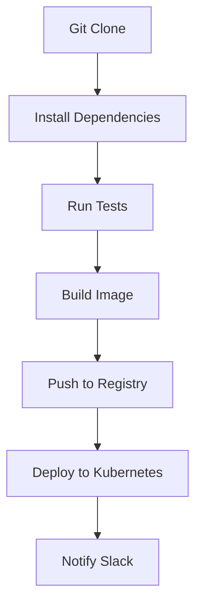

# Kubernetes Tekton

## Introduction

Tekton is a powerful, flexible, and Kubernetes-native framework for creating continuous integration and continuous delivery (CI/CD) systems. Developed as part of the CD Foundation (a Linux Foundation project), Tekton provides a set of shared, open-source components for building CI/CD pipelines that can be used across cloud providers and on-premises systems.

Unlike traditional CI/CD tools that run alongside Kubernetes, Tekton is built specifically to leverage Kubernetes' capabilities and runs entirely on a Kubernetes cluster. This native integration allows Tekton to take full advantage of Kubernetes' scaling, resource management, and extensibility features.

## Understanding Tekton Core Concepts

Tekton introduces several custom resources to Kubernetes that form the building blocks of a CI/CD pipeline:

### Task

A `Task` is the smallest building block in Tekton. It defines a series of steps that run sequentially in a pod to achieve a specific goal, such as compiling code, running tests, or building a container image.

```yaml
apiVersion: tekton.dev/v1beta1
kind: Task
metadata:
  name: hello-world
spec:
  steps:
    - name: say-hello
      image: ubuntu
      command:
        - echo
      args:
        - "Hello, Tekton!"
```

### TaskRun

A `TaskRun` is an instance of a Task execution. It defines the inputs, outputs, and execution parameters for a Task.

```yaml
apiVersion: tekton.dev/v1beta1
kind: TaskRun
metadata:
  name: hello-world-run
spec:
  taskRef:
    name: hello-world
```

**Output:**
```
TaskRun hello-world-run started
Step say-hello completed with output: Hello, Tekton!
TaskRun hello-world-run succeeded
```

### Pipeline

A `Pipeline` defines a collection of Tasks that should be executed in a specific order, with defined inputs, outputs, and parameters.

```yaml
apiVersion: tekton.dev/v1beta1
kind: Pipeline
metadata:
  name: build-test-deploy
spec:
  tasks:
    - name: build
      taskRef:
        name: build-app
    - name: test
      taskRef:
        name: test-app
      runAfter:
        - build
    - name: deploy
      taskRef:
        name: deploy-app
      runAfter:
        - test
```

### PipelineRun

A `PipelineRun` is an instance of Pipeline execution, defining the parameters, resources, and service accounts to use for the Pipeline.

```yaml
apiVersion: tekton.dev/v1beta1
kind: PipelineRun
metadata:
  name: build-test-deploy-run
spec:
  pipelineRef:
    name: build-test-deploy
```

### PipelineResource (Deprecated)

`PipelineResource` was a concept for defining input and output resources for Tasks and Pipelines. However, it's been deprecated in favor of using parameters and workspaces.

### Workspaces

Workspaces provide a mechanism for Tasks to share data. They can be backed by various volume types such as PersistentVolumeClaims, ConfigMaps, or Secrets.

```yaml
apiVersion: tekton.dev/v1beta1
kind: Task
metadata:
  name: task-with-workspace
spec:
  workspaces:
    - name: source-code
  steps:
    - name: list-files
      image: ubuntu
      command: ["ls"]
      args: ["-la", "$(workspaces.source-code.path)"]
```

## Setting Up Tekton

Let's walk through setting up Tekton on your Kubernetes cluster:

### Prerequisites

- A running Kubernetes cluster (v1.18 or newer)
- `kubectl` installed and configured
- Cluster admin permissions

### Installation Steps

1. Install Tekton Pipelines:

```bash
kubectl apply -f https://storage.googleapis.com/tekton-releases/pipeline/latest/release.yaml
```

2. Verify the installation:

```bash
kubectl get pods -n tekton-pipelines
```

You should see several Tekton controller pods running.

3. (Optional) Install Tekton Dashboard:

```bash
kubectl apply -f https://storage.googleapis.com/tekton-releases/dashboard/latest/release.yaml
```

4. (Optional) Install Tekton CLI (tkn):

```bash
# For macOS
brew tap tektoncd/tools
brew install tektoncd/tools/tektoncd-cli

# For Linux
curl -LO https://github.com/tektoncd/cli/releases/download/v0.30.0/tkn_0.30.0_Linux_x86_64.tar.gz
tar xvzf tkn_0.30.0_Linux_x86_64.tar.gz -C /usr/local/bin/ tkn
```

## Building Your First Tekton Pipeline

Let's create a simple CI pipeline for a Node.js application:

### 1. Create a Task for cloning a Git repository

```yaml
apiVersion: tekton.dev/v1beta1
kind: Task
metadata:
  name: git-clone
spec:
  workspaces:
    - name: output
  params:
    - name: url
      type: string
      description: Git repository URL
  steps:
    - name: clone
      image: alpine/git
      script: |
        git clone $(params.url) $(workspaces.output.path)/source
```

Save this as `git-clone-task.yaml` and apply:

```bash
kubectl apply -f git-clone-task.yaml
```

### 2. Create a Task for testing the Node.js application

```yaml
apiVersion: tekton.dev/v1beta1
kind: Task
metadata:
  name: npm-test
spec:
  workspaces:
    - name: source
  steps:
    - name: install-and-test
      image: node:16
      workingDir: $(workspaces.source.path)/source
      script: |
        npm install
        npm test
```

Save this as `npm-test-task.yaml` and apply:

```bash
kubectl apply -f npm-test-task.yaml
```

### 3. Create a Pipeline combining these Tasks

```yaml
apiVersion: tekton.dev/v1beta1
kind: Pipeline
metadata:
  name: nodejs-test-pipeline
spec:
  workspaces:
    - name: shared-workspace
  params:
    - name: repo-url
      type: string
  tasks:
    - name: fetch-source
      taskRef:
        name: git-clone
      workspaces:
        - name: output
          workspace: shared-workspace
      params:
        - name: url
          value: $(params.repo-url)
    - name: run-tests
      taskRef:
        name: npm-test
      runAfter:
        - fetch-source
      workspaces:
        - name: source
          workspace: shared-workspace
```

Save this as `nodejs-pipeline.yaml` and apply:

```bash
kubectl apply -f nodejs-pipeline.yaml
```

### 4. Create a PersistentVolumeClaim for the workspace

```yaml
apiVersion: v1
kind: PersistentVolumeClaim
metadata:
  name: pipeline-workspace
spec:
  accessModes:
    - ReadWriteOnce
  resources:
    requests:
      storage: 1Gi
```

Save this as `workspace-pvc.yaml` and apply:

```bash
kubectl apply -f workspace-pvc.yaml
```

### 5. Run the Pipeline

```yaml
apiVersion: tekton.dev/v1beta1
kind: PipelineRun
metadata:
  name: nodejs-test-run
spec:
  pipelineRef:
    name: nodejs-test-pipeline
  workspaces:
    - name: shared-workspace
      persistentVolumeClaim:
        claimName: pipeline-workspace
  params:
    - name: repo-url
      value: https://github.com/example/nodejs-sample-app
```

Save this as `pipeline-run.yaml` and apply:

```bash
kubectl apply -f pipeline-run.yaml
```

### 6. Monitor the Pipeline execution

```bash
kubectl get pipelineruns
kubectl describe pipelinerun nodejs-test-run
```

Or, if you installed the Tekton CLI:

```bash
tkn pipelinerun describe nodejs-test-run
tkn pipelinerun logs nodejs-test-run -f
```

## Advanced Tekton Features

### Triggers

Tekton Triggers allow you to automate pipeline execution in response to events like webhook calls from GitHub, GitLab, or other systems.

Here's a simple example of creating a Trigger for GitHub webhooks:

```yaml
apiVersion: triggers.tekton.dev/v1beta1
kind: TriggerTemplate
metadata:
  name: github-template
spec:
  params:
    - name: gitrepositoryurl
    - name: gitrevision
  resourcetemplates:
    - apiVersion: tekton.dev/v1beta1
      kind: PipelineRun
      metadata:
        generateName: nodejs-test-run-
      spec:
        pipelineRef:
          name: nodejs-test-pipeline
        workspaces:
          - name: shared-workspace
            persistentVolumeClaim:
              claimName: pipeline-workspace
        params:
          - name: repo-url
            value: $(tt.params.gitrepositoryurl)
---
apiVersion: triggers.tekton.dev/v1beta1
kind: TriggerBinding
metadata:
  name: github-binding
spec:
  params:
    - name: gitrepositoryurl
      value: $(body.repository.url)
    - name: gitrevision
      value: $(body.head_commit.id)
---
apiVersion: triggers.tekton.dev/v1beta1
kind: EventListener
metadata:
  name: github-listener
spec:
  triggers:
    - bindings:
        - ref: github-binding
      template:
        ref: github-template
```

### Conditions

Tekton Conditions allow you to specify criteria that must be met before a Task is executed:

```yaml
apiVersion: tekton.dev/v1alpha1
kind: Condition
metadata:
  name: file-exists
spec:
  params:
    - name: file-path
      type: string
  check:
    image: alpine
    script: |
      if [ -f $(params.file-path) ]; then
        exit 0
      else
        exit 1
      fi
```

Then in your Pipeline:

```yaml
tasks:
  - name: conditional-task
    conditions:
      - conditionRef: file-exists
        params:
          - name: file-path
            value: "$(workspaces.source.path)/package.json"
    taskRef:
      name: npm-test
    # ...
```

### When Expressions

When expressions provide a more powerful way to conditionally execute tasks:

```yaml
tasks:
  - name: build-on-main
    when:
      - input: "$(params.git-branch)"
        operator: in
        values: ["main", "master"]
    taskRef:
      name: build-app
    # ...
```

### Custom Tasks

Custom Tasks allow you to extend Tekton's functionality by implementing your own Task controllers:

```yaml
apiVersion: tekton.dev/v1beta1
kind: CustomTask
metadata:
  name: slack-notification
spec:
  params:
    - name: message
      value: "Pipeline completed successfully!"
```

## Real-World Application: Complete CI/CD Pipeline

Let's build a more complete example of a CI/CD pipeline for a containerized application:



Here's how this would look in Tekton:

```yaml
apiVersion: tekton.dev/v1beta1
kind: Pipeline
metadata:
  name: complete-cicd-pipeline
spec:
  workspaces:
    - name: shared-workspace
    - name: docker-credentials
  params:
    - name: repo-url
      type: string
    - name: image-name
      type: string
    - name: image-tag
      type: string
      default: latest
  tasks:
    - name: fetch-source
      taskRef:
        name: git-clone
      workspaces:
        - name: output
          workspace: shared-workspace
      params:
        - name: url
          value: $(params.repo-url)
        
    - name: run-tests
      taskRef:
        name: npm-test
      runAfter:
        - fetch-source
      workspaces:
        - name: source
          workspace: shared-workspace
          
    - name: build-image
      taskRef:
        name: kaniko-build
      runAfter:
        - run-tests
      workspaces:
        - name: source
          workspace: shared-workspace
        - name: docker-config
          workspace: docker-credentials
      params:
        - name: IMAGE
          value: $(params.image-name):$(params.image-tag)
        - name: DOCKERFILE
          value: ./Dockerfile
          
    - name: deploy-to-cluster
      taskRef:
        name: kubectl-deploy
      runAfter:
        - build-image
      workspaces:
        - name: manifests
          workspace: shared-workspace
      params:
        - name: image
          value: $(params.image-name):$(params.image-tag)
        - name: manifest_dir
          value: k8s/
          
    - name: notify
      taskRef:
        name: slack-notification
      runAfter:
        - deploy-to-cluster
      params:
        - name: message
          value: "Deployment of $(params.image-name):$(params.image-tag) completed successfully!"
```

## Best Practices for Tekton Pipelines

1. **Reuse Tasks**: Create general-purpose, reusable Tasks and share them across your organization.

2. **Use Workspaces Effectively**: Use workspaces to share data between Tasks rather than passing large amounts of data as parameters.

3. **Parameterize Everything**: Make your Pipelines and Tasks flexible by parameterizing values.

4. **Organize with Labels**: Use consistent labeling for all your Tekton resources to help with organization and querying.

5. **Implement Timeouts**: Set appropriate timeouts for your Tasks and Pipelines to prevent stuck runs.

6. **Handle Failures Gracefully**: Implement proper error handling and notifications for pipeline failures.

7. **Secure Your Pipelines**: Use Kubernetes secrets for sensitive information and implement proper RBAC.

8. **Monitor Pipeline Performance**: Set up monitoring and alerting for your Tekton pipelines.

## Debugging Tekton Pipelines

When your pipelines don't work as expected, here are some debugging strategies:

1. Check the status of your PipelineRun:
   ```bash
   kubectl describe pipelinerun <pipelinerun-name>
   ```

2. Examine the logs of a specific TaskRun:
   ```bash
   kubectl logs -l tekton.dev/taskRun=<taskrun-name> -c step-<step-name>
   ```

3. Use the Tekton CLI for more detailed information:
   ```bash
   tkn pipelinerun logs <pipelinerun-name> -f
   ```

4. Check events in the namespace:
   ```bash
   kubectl get events
   ```

## Integrating Tekton with Other Tools

Tekton works well with various other tools in the Kubernetes ecosystem:

- **Argo CD**: Use Tekton for CI and Argo CD for GitOps-based CD
- **Prometheus/Grafana**: Monitor your Tekton pipelines
- **Vault**: Securely manage secrets for your pipelines
- **Knative**: Deploy serverless applications from your Tekton pipelines
- **Kustomize/Helm**: Package and customize your Kubernetes manifests

## Summary

Tekton provides a powerful, Kubernetes-native way to build CI/CD pipelines. Its key advantages include:

- **Kubernetes-native**: Runs entirely on Kubernetes, leveraging its features
- **Declarative**: Pipelines and tasks are defined as Kubernetes custom resources
- **Modular**: Build reusable components that can be shared across teams
- **Scalable**: Automatically scales with your Kubernetes cluster
- **Extensible**: Create custom tasks and extend functionality
- **Vendor-neutral**: Works with any cloud provider or on-premises Kubernetes cluster

By mastering Tekton, you'll be able to create sophisticated CI/CD pipelines that integrate seamlessly with your Kubernetes environment.

## Additional Resources

- [Tekton Official Documentation](https://tekton.dev/docs/)
- [Tekton GitHub Repository](https://github.com/tektoncd/pipeline)
- [Tekton Hub](https://hub.tekton.dev/) - A collection of reusable Tekton Tasks
- [CD Foundation](https://cd.foundation/) - The organization behind Tekton

## Exercises

1. Create a simple Tekton pipeline that clones a GitHub repository and counts the lines of code.
2. Extend the pipeline to run unit tests and report results.
3. Build a complete CI/CD pipeline for a sample application that builds a container image and deploys it to your Kubernetes cluster.
4. Implement a webhook-triggered pipeline using Tekton Triggers.
5. Create a custom Task that sends pipeline results to your preferred messaging platform.