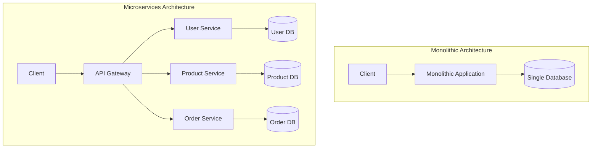

# Kubernetes Microservices

## Introduction

Microservices architecture has revolutionized how we build and deploy applications. Instead of building monolithic applications where all functionality is managed in a single codebase, microservices break down applications into small, independently deployable services that communicate through well-defined APIs. This approach offers benefits like better scalability, resilience, and team autonomy.

Kubernetes provides an ideal platform for running microservices, offering advanced orchestration capabilities to manage containerized applications at scale. In this guide, we'll explore how to deploy and manage microservices on Kubernetes, focusing on practical examples for beginners.

## What Are Microservices?

Microservices are an architectural approach where an application is composed of loosely coupled, independently deployable services. Each service:

- Focuses on a specific business capability
- Can be developed, deployed, and scaled independently
- Has its own database or storage when appropriate
- Communicates with other services through APIs (typically HTTP/REST or gRPC)

Let's visualize the difference between monolithic and microservices architectures:



## Why Use Kubernetes for Microservices?

Kubernetes is particularly well-suited for microservices deployments because it provides:

1. **Service Discovery** - Automatic service registration and discovery
2. **Load Balancing** - Built-in load balancing for service instances
3. **Self-healing** - Automatic replacement of failed instances
4. **Scaling** - Easy horizontal scaling of services
5. **Declarative Configuration** - Infrastructure-as-code approach
6. **Secret Management** - Secure handling of configuration and credentials
7. **Resource Isolation** - Clear resource boundaries between services

## Getting Started with Kubernetes Microservices

### Prerequisites

Before we begin, you should have:

- Basic understanding of containers and Docker
- Access to a Kubernetes cluster (you can use Minikube for local development)
- kubectl command-line tool installed
- Basic knowledge of YAML

### Our Example Application

We'll build a simple e-commerce application consisting of three microservices:

1. **Product Service** - Manages product information
2. **Cart Service** - Handles shopping cart functionality
3. **Frontend Service** - Serves the web UI

## Step 1: Creating Docker Images for Our Microservices

Let's start by creating Docker images for our services. Here's a simple Product Service implemented in Node.js:

```javascript
// product-service/app.js
const express = require('express');
const app = express();
const port = 3000;

// In-memory product database for demo
const products = [
  { id: 1, name: 'Laptop', price: 999.99 },
  { id: 2, name: 'Smartphone', price: 599.99 },
  { id: 3, name: 'Headphones', price: 99.99 }
];

app.use(express.json());

// GET all products
app.get('/products', (req, res) => {
  res.json(products);
});

// GET product by ID
app.get('/products/:id', (req, res) => {
  const product = products.find(p => p.id === parseInt(req.params.id));
  if (!product) return res.status(404).json({ error: 'Product not found' });
  res.json(product);
});

app.listen(port, () => {
  console.log(`Product service listening at http://localhost:${port}`);
});
```

Now let's create a Dockerfile for this service:

```dockerfile
# product-service/Dockerfile
FROM node:14-alpine

WORKDIR /usr/src/app

COPY package*.json ./
RUN npm install

COPY . .

EXPOSE 3000
CMD ["node", "app.js"]
```

You would build this Docker image with:

```bash
cd product-service
docker build -t product-service:v1 .
```

Similarly, you would create Docker images for the Cart Service and Frontend Service.

## Step 2: Defining Kubernetes Manifests

Let's create the Kubernetes manifests for our Product Service:

```yaml
# product-service-deployment.yaml
apiVersion: apps/v1
kind: Deployment
metadata:
  name: product-service
  labels:
    app: product-service
spec:
  replicas: 2
  selector:
    matchLabels:
      app: product-service
  template:
    metadata:
      labels:
        app: product-service
    spec:
      containers:
      - name: product-service
        image: product-service:v1
        ports:
        - containerPort: 3000
        resources:
          limits:
            cpu: "0.5"
            memory: "256Mi"
          requests:
            cpu: "0.2"
            memory: "128Mi"
---
apiVersion: v1
kind: Service
metadata:
  name: product-service
spec:
  selector:
    app: product-service
  ports:
  - port: 80
    targetPort: 3000
  type: ClusterIP
```

This manifest defines:
1. A **Deployment** that runs two replicas of our Product Service
2. A **Service** that exposes the deployment within the cluster

## Step 3: Deploying Our Microservices

Deploy the Product Service to your Kubernetes cluster:

```bash
kubectl apply -f product-service-deployment.yaml
```

Expected output:
```
deployment.apps/product-service created
service/product-service created
```

You can check the status of your deployment:

```bash
kubectl get deployments
```

Expected output:
```
NAME              READY   UP-TO-DATE   AVAILABLE   AGE
product-service   2/2     2            2           45s
```

And verify the service is created:

```bash
kubectl get services
```

Expected output:
```
NAME              TYPE        CLUSTER-IP       EXTERNAL-IP   PORT(S)   AGE
kubernetes        ClusterIP   10.96.0.1        <none>        443/TCP   24h
product-service   ClusterIP   10.110.235.142   <none>        80/TCP    1m
```

## Step 4: Service Communication

In a microservices architecture, services need to communicate with each other. In Kubernetes, services can communicate using the service name as the hostname.

For example, if our Cart Service needs to fetch product information from the Product Service, it might make an HTTP request to `http://product-service/products`.

Here's a simple example of how the Cart Service might fetch product information:

```javascript
// cart-service/app.js
const express = require('express');
const axios = require('axios');
const app = express();
const port = 3000;

app.use(express.json());

// In-memory cart storage
const carts = {};

// Add item to cart
app.post('/carts/:userId/items', async (req, res) => {
  const { userId } = req.params;
  const { productId, quantity } = req.body;
  
  // Initialize cart if it doesn't exist
  if (!carts[userId]) {
    carts[userId] = [];
  }
  
  try {
    // Fetch product details from the Product Service
    const productResponse = await axios.get(`http://product-service/products/${productId}`);
    const product = productResponse.data;
    
    // Add to cart
    carts[userId].push({
      productId,
      name: product.name,
      price: product.price,
      quantity
    });
    
    res.status(201).json(carts[userId]);
  } catch (error) {
    res.status(400).json({ error: 'Could not add item to cart' });
  }
});

// Get cart contents
app.get('/carts/:userId', (req, res) => {
  const { userId } = req.params;
  res.json(carts[userId] || []);
});

app.listen(port, () => {
  console.log(`Cart service listening at http://localhost:${port}`);
});
```

## Step 5: Creating an API Gateway

In a microservices architecture, it's common to have an API Gateway that acts as an entry point for all client requests. Let's create a simple API Gateway using NGINX:

```yaml
# api-gateway.yaml
apiVersion: apps/v1
kind: Deployment
metadata:
  name: api-gateway
  labels:
    app: api-gateway
spec:
  replicas: 1
  selector:
    matchLabels:
      app: api-gateway
  template:
    metadata:
      labels:
        app: api-gateway
    spec:
      containers:
      - name: nginx
        image: nginx:1.19
        ports:
        - containerPort: 80
        volumeMounts:
        - name: nginx-config
          mountPath: /etc/nginx/conf.d
      volumes:
      - name: nginx-config
        configMap:
          name: nginx-config
---
apiVersion: v1
kind: ConfigMap
metadata:
  name: nginx-config
data:
  default.conf: |
    server {
      listen 80;
      
      location /api/products {
        proxy_pass http://product-service/products;
      }
      
      location /api/carts {
        proxy_pass http://cart-service/carts;
      }
      
      location / {
        proxy_pass http://frontend-service;
      }
    }
---
apiVersion: v1
kind: Service
metadata:
  name: api-gateway
spec:
  selector:
    app: api-gateway
  ports:
  - port: 80
    targetPort: 80
  type: LoadBalancer
```

Deploy the API Gateway:

```bash
kubectl apply -f api-gateway.yaml
```

## Step 6: Scaling Our Microservices

One of the significant advantages of microservices is the ability to scale individual services independently. You can scale a service manually:

```bash
kubectl scale deployment product-service --replicas=5
```

Expected output:
```
deployment.apps/product-service scaled
```

This will increase the number of product-service pods to 5.

For automatic scaling based on CPU utilization, you can use a Horizontal Pod Autoscaler (HPA):

```yaml
# product-service-hpa.yaml
apiVersion: autoscaling/v2
kind: HorizontalPodAutoscaler
metadata:
  name: product-service
spec:
  scaleTargetRef:
    apiVersion: apps/v1
    kind: Deployment
    name: product-service
  minReplicas: 2
  maxReplicas: 10
  metrics:
  - type: Resource
    resource:
      name: cpu
      target:
        type: Utilization
        averageUtilization: 50
```

Deploy the HPA:

```bash
kubectl apply -f product-service-hpa.yaml
```

Now Kubernetes will automatically scale your Product Service based on CPU utilization.

## Advanced Microservices Patterns in Kubernetes

### 1. Service Mesh with Istio

For complex microservices architectures, consider implementing a service mesh like Istio. A service mesh provides:

- Advanced traffic management
- Detailed observability
- Enhanced security
- Circuit breaking and failure recovery

Here's a simple Istio VirtualService that implements a canary deployment:

```yaml
apiVersion: networking.istio.io/v1alpha3
kind: VirtualService
metadata:
  name: product-service
spec:
  hosts:
  - product-service
  http:
  - route:
    - destination:
        host: product-service
        subset: v1
      weight: 90
    - destination:
        host: product-service
        subset: v2
      weight: 10
```

This configuration routes 90% of the traffic to v1 and 10% to v2 of the product-service.

### 2. ConfigMaps and Secrets

Store configuration and sensitive information using Kubernetes ConfigMaps and Secrets:

```yaml
# product-service-config.yaml
apiVersion: v1
kind: ConfigMap
metadata:
  name: product-service-config
data:
  DATABASE_URL: "mongodb://mongo:27017/products"
  API_VERSION: "v1"
---
apiVersion: v1
kind: Secret
metadata:
  name: product-service-secrets
type: Opaque
data:
  # Base64 encoded "admin-password"
  DATABASE_PASSWORD: YWRtaW4tcGFzc3dvcmQ=
```

Then reference these in your deployment:

```yaml
# Updated deployment snippet
spec:
  containers:
  - name: product-service
    image: product-service:v1
    envFrom:
    - configMapRef:
        name: product-service-config
    - secretRef:
        name: product-service-secrets
```

### 3. Persistent Storage

For services that need persistent storage, use PersistentVolumes and PersistentVolumeClaims:

```yaml
# mongodb-storage.yaml
apiVersion: v1
kind: PersistentVolumeClaim
metadata:
  name: mongo-pvc
spec:
  accessModes:
    - ReadWriteOnce
  resources:
    requests:
      storage: 1Gi
---
apiVersion: apps/v1
kind: Deployment
metadata:
  name: mongodb
spec:
  selector:
    matchLabels:
      app: mongodb
  template:
    metadata:
      labels:
        app: mongodb
    spec:
      containers:
      - name: mongodb
        image: mongo:4.4
        ports:
        - containerPort: 27017
        volumeMounts:
        - name: mongo-storage
          mountPath: /data/db
      volumes:
      - name: mongo-storage
        persistentVolumeClaim:
          claimName: mongo-pvc
```

## Best Practices for Kubernetes Microservices

1. **Keep services small and focused** - Each service should do one thing well
2. **Design for failure** - Assume services will fail and design accordingly
3. **Use health checks** - Implement liveness and readiness probes
4. **Implement proper logging** - Centralize logs for better visibility
5. **Use resource limits** - Set appropriate CPU and memory limits
6. **Implement monitoring** - Use tools like Prometheus and Grafana
7. **Create a CI/CD pipeline** - Automate deployment of your microservices
8. **Use namespaces** - Organize services into logical groups
9. **Implement proper network policies** - Control traffic between services
10. **Use labels and annotations** - For better organization and filtering

## Example: Adding Health Checks

Let's improve our Product Service deployment by adding health checks:

```yaml
# Updated product-service-deployment.yaml snippet
spec:
  containers:
  - name: product-service
    image: product-service:v1
    ports:
    - containerPort: 3000
    livenessProbe:
      httpGet:
        path: /health
        port: 3000
      initialDelaySeconds: 30
      periodSeconds: 10
    readinessProbe:
      httpGet:
        path: /ready
        port: 3000
      initialDelaySeconds: 5
      periodSeconds: 5
```

You would need to implement the `/health` and `/ready` endpoints in your service:

```javascript
// Health check endpoint
app.get('/health', (req, res) => {
  res.status(200).send('OK');
});

// Readiness check endpoint
app.get('/ready', (req, res) => {
  // Can add logic to check database connections, etc.
  res.status(200).send('Ready');
});
```

## Summary

In this guide, we've explored how to deploy microservices on Kubernetes. We've covered:

- The basics of microservices architecture
- Creating Docker images for our services
- Defining Kubernetes manifests
- Deploying microservices to Kubernetes
- Service-to-service communication
- Setting up an API Gateway
- Scaling services manually and automatically
- Advanced patterns like service mesh, configuration management, and persistent storage
- Best practices for running microservices on Kubernetes

Kubernetes provides a robust platform for running microservices at scale, with features like automatic scaling, self-healing, and service discovery that are essential for managing complex microservices architectures.

## Additional Resources

- [Kubernetes Documentation](https://kubernetes.io/docs/)
- [Microservices Pattern Language](https://microservices.io/patterns/index.html)
- [Istio Service Mesh](https://istio.io/)
- [The Twelve-Factor App Methodology](https://12factor.net/)

## Exercises

1. Extend the e-commerce application by adding an Order Service that communicates with both the Product and Cart services.
2. Implement a database backend for the Product Service using a StatefulSet.
3. Set up a CI/CD pipeline to automatically build and deploy your microservices.
4. Implement circuit breaking using Istio to make your services more resilient.
5. Set up monitoring for your microservices using Prometheus and Grafana.

By following this guide and completing these exercises, you'll gain practical experience in designing, deploying, and managing microservices applications on Kubernetes.