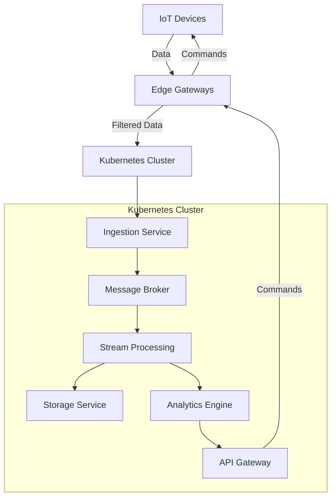
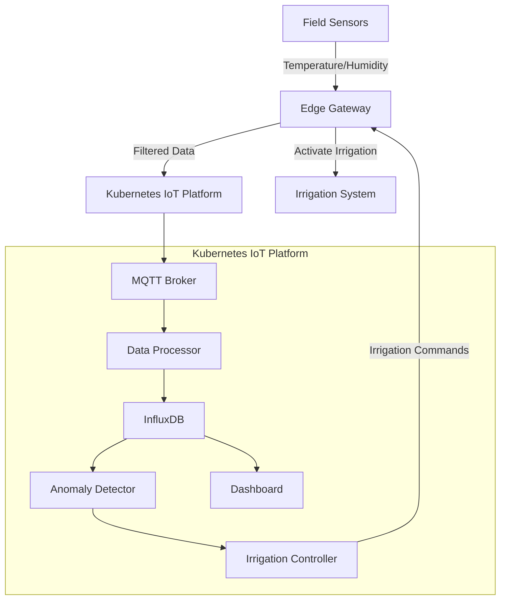

# Kubernetes IoT Platform

## Introduction

The Internet of Things (IoT) is revolutionizing how we interact with the world around us, connecting billions of devices that generate massive amounts of data. Managing this data efficiently requires a robust, scalable infrastructure - and that's where Kubernetes comes in.

A Kubernetes IoT Platform combines the power of container orchestration with IoT device management to create a flexible, resilient system for handling IoT workloads. In this guide, we'll explore how Kubernetes can help solve common IoT challenges and walk through building a basic IoT platform using Kubernetes.

## Why Kubernetes for IoT?

IoT applications face unique challenges:

- **Scale**: Managing thousands or millions of devices
- **Heterogeneity**: Diverse device types with different capabilities
- **Edge Computing**: Processing data closer to the source
- **Intermittent Connectivity**: Handling offline scenarios
- **Security**: Protecting vulnerable edge devices

Kubernetes addresses these challenges with:

- **Scalable Architecture**: Easily scale from tens to thousands of nodes
- **Declarative Configuration**: Consistent deployment across diverse environments
- **Self-healing**: Automatic recovery from failures
- **Resource Efficiency**: Optimal use of computing resources
- **Extensibility**: Rich ecosystem of add-ons and extensions

## Architecture Overview

Let's understand the key components of a Kubernetes IoT platform:



This architecture has three main layers:

1. **Device Layer**: Physical IoT devices and sensors
2. **Edge Layer**: Gateways that collect and filter data before sending to the cloud
3. **Platform Layer**: Kubernetes cluster handling processing, storage, and analytics

## Setting Up the Environment

Let's start by setting up a minimal Kubernetes environment. We'll use Minikube for local development:

```bash
# Install Minikube
curl -LO https://storage.googleapis.com/minikube/releases/latest/minikube-linux-amd64
sudo install minikube-linux-amd64 /usr/local/bin/minikube

# Start a Kubernetes cluster
minikube start --cpus 4 --memory 8192

# Verify installation
kubectl get nodes
```

Expected output:
```
NAME       STATUS   ROLES                  AGE     VERSION
minikube   Ready    control-plane,master   2m42s   v1.24.1
```

## Building the IoT Platform Components

### 1. MQTT Broker for Device Communication

MQTT (Message Queuing Telemetry Transport) is a lightweight protocol ideal for IoT communications. We'll deploy a Mosquitto MQTT broker:

```yaml
# mqtt-broker.yaml
apiVersion: apps/v1
kind: Deployment
metadata:
  name: mqtt-broker
spec:
  replicas: 1
  selector:
    matchLabels:
      app: mqtt-broker
  template:
    metadata:
      labels:
        app: mqtt-broker
    spec:
      containers:
      - name: mosquitto
        image: eclipse-mosquitto:2.0
        ports:
        - containerPort: 1883
        - containerPort: 9001
---
apiVersion: v1
kind: Service
metadata:
  name: mqtt-broker
spec:
  selector:
    app: mqtt-broker
  ports:
  - port: 1883
    targetPort: 1883
    name: mqtt
  - port: 9001
    targetPort: 9001
    name: websocket
```

Deploy with:

```bash
kubectl apply -f mqtt-broker.yaml
```

### 2. Data Ingestion Service

Next, let's create a service to receive and process incoming data from IoT devices:

```python
# ingestion-service.py
import paho.mqtt.client as mqtt
import json
import os
from kubernetes import client, config

# Connect to Kubernetes API (when running in a Pod)
try:
    config.load_incluster_config()
    v1 = client.CoreV1Api()
    print("Connected to Kubernetes API")
except:
    print("Not running in Kubernetes, skipping API connection")

# MQTT callbacks
def on_connect(client, userdata, flags, rc):
    print(f"Connected with result code {rc}")
    client.subscribe("iot/+/data")  # Subscribe to all device data topics

def on_message(client, userdata, msg):
    try:
        payload = json.loads(msg.payload.decode())
        device_id = msg.topic.split('/')[1]
        print(f"Received data from device {device_id}: {payload}")
        
        # Process data (in a real system, you might store in a database)
        # or send to a stream processing system
        process_data(device_id, payload)
    except Exception as e:
        print(f"Error processing message: {e}")

def process_data(device_id, data):
    # Example processing logic
    if "temperature" in data and data["temperature"] > 30:
        print(f"High temperature alert for device {device_id}: {data['temperature']}°C")
        # In a real system, you might trigger an alert or action

# Connect to MQTT broker
client = mqtt.Client()
client.on_connect = on_connect
client.on_message = on_message

mqtt_host = os.environ.get("MQTT_HOST", "mqtt-broker")
mqtt_port = int(os.environ.get("MQTT_PORT", "1883"))

client.connect(mqtt_host, mqtt_port, 60)
client.loop_forever()
```

Now create a Deployment for this service:

```yaml
# ingestion-deployment.yaml
apiVersion: apps/v1
kind: Deployment
metadata:
  name: ingestion-service
spec:
  replicas: 2
  selector:
    matchLabels:
      app: ingestion-service
  template:
    metadata:
      labels:
        app: ingestion-service
    spec:
      containers:
      - name: ingestion
        image: python:3.9-slim
        command: ["/bin/bash"]
        args: ["-c", "pip install paho-mqtt kubernetes && python /app/ingestion-service.py"]
        env:
        - name: MQTT_HOST
          value: "mqtt-broker"
        - name: MQTT_PORT
          value: "1883"
        volumeMounts:
        - name: app-code
          mountPath: /app
      volumes:
      - name: app-code
        configMap:
          name: ingestion-code
```

Create a ConfigMap for our Python code:

```bash
kubectl create configmap ingestion-code --from-file=ingestion-service.py
kubectl apply -f ingestion-deployment.yaml
```

### 3. Time Series Database for IoT Data

IoT applications typically generate time-series data. Let's deploy InfluxDB to store this data:

```yaml
# influxdb.yaml
apiVersion: apps/v1
kind: StatefulSet
metadata:
  name: influxdb
spec:
  serviceName: "influxdb"
  replicas: 1
  selector:
    matchLabels:
      app: influxdb
  template:
    metadata:
      labels:
        app: influxdb
    spec:
      containers:
      - name: influxdb
        image: influxdb:2.0
        ports:
        - containerPort: 8086
        env:
        - name: DOCKER_INFLUXDB_INIT_MODE
          value: "setup"
        - name: DOCKER_INFLUXDB_INIT_USERNAME
          value: "admin"
        - name: DOCKER_INFLUXDB_INIT_PASSWORD
          value: "password123"  # Use secrets in production!
        - name: DOCKER_INFLUXDB_INIT_ORG
          value: "iot-org"
        - name: DOCKER_INFLUXDB_INIT_BUCKET
          value: "iot-data"
        volumeMounts:
        - name: influxdb-storage
          mountPath: /var/lib/influxdb2
  volumeClaimTemplates:
  - metadata:
      name: influxdb-storage
    spec:
      accessModes: [ "ReadWriteOnce" ]
      resources:
        requests:
          storage: 5Gi
---
apiVersion: v1
kind: Service
metadata:
  name: influxdb
spec:
  selector:
    app: influxdb
  ports:
  - port: 8086
    targetPort: 8086
```

Apply this configuration:

```bash
kubectl apply -f influxdb.yaml
```

### 4. Data Processing with Kafka

For more complex IoT platforms, we need a robust message broker. Let's add Apache Kafka:

```yaml
# kafka.yaml
apiVersion: apps/v1
kind: StatefulSet
metadata:
  name: kafka
spec:
  serviceName: "kafka"
  replicas: 1
  selector:
    matchLabels:
      app: kafka
  template:
    metadata:
      labels:
        app: kafka
    spec:
      containers:
      - name: kafka
        image: bitnami/kafka:latest
        ports:
        - containerPort: 9092
        env:
        - name: KAFKA_CFG_ZOOKEEPER_CONNECT
          value: "zookeeper:2181"
        - name: KAFKA_CFG_ADVERTISED_LISTENERS
          value: "PLAINTEXT://kafka:9092"
---
apiVersion: v1
kind: Service
metadata:
  name: kafka
spec:
  selector:
    app: kafka
  ports:
  - port: 9092
    targetPort: 9092
---
apiVersion: apps/v1
kind: Deployment
metadata:
  name: zookeeper
spec:
  replicas: 1
  selector:
    matchLabels:
      app: zookeeper
  template:
    metadata:
      labels:
        app: zookeeper
    spec:
      containers:
      - name: zookeeper
        image: bitnami/zookeeper:latest
        ports:
        - containerPort: 2181
        env:
        - name: ALLOW_ANONYMOUS_LOGIN
          value: "yes"
---
apiVersion: v1
kind: Service
metadata:
  name: zookeeper
spec:
  selector:
    app: zookeeper
  ports:
  - port: 2181
    targetPort: 2181
```

Deploy with:

```bash
kubectl apply -f kafka.yaml
```

### 5. Device Simulator for Testing

Let's create a simulator to generate test data:

```python
# device-simulator.py
import paho.mqtt.client as mqtt
import json
import time
import random
import os
from datetime import datetime

# MQTT setup
client = mqtt.Client()
mqtt_host = os.environ.get("MQTT_HOST", "mqtt-broker")
mqtt_port = int(os.environ.get("MQTT_PORT", "1883"))

# Connect to the broker
client.connect(mqtt_host, mqtt_port, 60)

# Generate device IDs
device_count = 5
device_ids = [f"device-{i}" for i in range(1, device_count + 1)]

# Main simulation loop
try:
    while True:
        for device_id in device_ids:
            # Generate random sensor data
            temperature = round(random.uniform(20.0, 35.0), 1)
            humidity = round(random.uniform(30.0, 80.0), 1)
            battery = round(random.uniform(3.0, 4.2), 2)
            
            # Create payload
            payload = {
                "timestamp": datetime.utcnow().isoformat(),
                "device_id": device_id,
                "temperature": temperature,
                "humidity": humidity,
                "battery": battery
            }
            
            # Publish to MQTT topic
            topic = f"iot/{device_id}/data"
            client.publish(topic, json.dumps(payload))
            print(f"Published to {topic}: {payload}")
            
            # Wait a bit to avoid flooding
            time.sleep(1)
        
        # Wait between cycles
        time.sleep(5)
except KeyboardInterrupt:
    print("Simulation stopped")
    client.disconnect()
```

Create a Deployment for the simulator:

```yaml
# simulator-deployment.yaml
apiVersion: apps/v1
kind: Deployment
metadata:
  name: device-simulator
spec:
  replicas: 1
  selector:
    matchLabels:
      app: device-simulator
  template:
    metadata:
      labels:
        app: device-simulator
    spec:
      containers:
      - name: simulator
        image: python:3.9-slim
        command: ["/bin/bash"]
        args: ["-c", "pip install paho-mqtt && python /app/device-simulator.py"]
        env:
        - name: MQTT_HOST
          value: "mqtt-broker"
        - name: MQTT_PORT
          value: "1883"
        volumeMounts:
        - name: simulator-code
          mountPath: /app
      volumes:
      - name: simulator-code
        configMap:
          name: simulator-code
```

Create a ConfigMap for our Python code:

```bash
kubectl create configmap simulator-code --from-file=device-simulator.py
kubectl apply -f simulator-deployment.yaml
```

## Implementing Edge Computing

IoT architectures often benefit from edge computing - processing data closer to the source to reduce latency and bandwidth. Kubernetes supports this through edge solutions like K3s or KubeEdge.

Here's how you might deploy an edge component:

```yaml
# edge-processor.yaml
apiVersion: apps/v1
kind: DaemonSet
metadata:
  name: edge-processor
spec:
  selector:
    matchLabels:
      app: edge-processor
  template:
    metadata:
      labels:
        app: edge-processor
    spec:
      containers:
      - name: processor
        image: python:3.9-slim
        command: ["/bin/bash"]
        args: ["-c", "pip install paho-mqtt numpy && python /app/edge-processor.py"]
        env:
        - name: MQTT_HOST
          value: "mqtt-broker"
        volumeMounts:
        - name: processor-code
          mountPath: /app
      volumes:
      - name: processor-code
        configMap:
          name: processor-code
```

Create an edge processing script:

```python
# edge-processor.py
import paho.mqtt.client as mqtt
import json
import numpy as np
import os
import time

# Configuration
mqtt_host = os.environ.get("MQTT_HOST", "mqtt-broker")
mqtt_port = int(os.environ.get("MQTT_PORT", "1883"))
window_size = 10  # Rolling window size for averaging

# Data storage
device_data = {}

# Process data with simple anomaly detection
def process_data(device_id, data):
    if device_id not in device_data:
        device_data[device_id] = []
    
    # Add new data point
    device_data[device_id].append(data["temperature"])
    
    # Keep only the last window_size readings
    if len(device_data[device_id]) > window_size:
        device_data[device_id].pop(0)
    
    # Only process if we have enough data
    if len(device_data[device_id]) == window_size:
        # Calculate mean and standard deviation
        mean = np.mean(device_data[device_id])
        std = np.std(device_data[device_id])
        
        # Check for anomalies (outside 2 standard deviations)
        current = data["temperature"]
        lower_bound = mean - 2 * std
        upper_bound = mean + 2 * std
        
        if current < lower_bound or current > upper_bound:
            print(f"ANOMALY DETECTED for {device_id}: {current}°C (expected range: {lower_bound:.1f}°C - {upper_bound:.1f}°C)")
            
            # Publish anomaly alert
            alert = {
                "device_id": device_id,
                "timestamp": data["timestamp"],
                "type": "temperature_anomaly",
                "value": current,
                "expected_range": [lower_bound, upper_bound]
            }
            client.publish(f"alerts/{device_id}", json.dumps(alert))

# MQTT callbacks
def on_connect(client, userdata, flags, rc):
    print(f"Connected with result code {rc}")
    client.subscribe("iot/+/data")

def on_message(client, userdata, msg):
    try:
        payload = json.loads(msg.payload.decode())
        device_id = msg.topic.split('/')[1]
        process_data(device_id, payload)
    except Exception as e:
        print(f"Error processing message: {e}")

# Set up MQTT client
client = mqtt.Client()
client.on_connect = on_connect
client.on_message = on_message

# Connect and start loop
client.connect(mqtt_host, mqtt_port, 60)
client.loop_forever()
```

Deploy with:

```bash
kubectl create configmap processor-code --from-file=edge-processor.py
kubectl apply -f edge-processor.yaml
```

## Monitoring Your IoT Platform

Monitoring is crucial for IoT platforms. Let's deploy Prometheus and Grafana:

```yaml
# monitoring.yaml
apiVersion: apps/v1
kind: Deployment
metadata:
  name: prometheus
spec:
  replicas: 1
  selector:
    matchLabels:
      app: prometheus
  template:
    metadata:
      labels:
        app: prometheus
    spec:
      containers:
      - name: prometheus
        image: prom/prometheus:latest
        ports:
        - containerPort: 9090
---
apiVersion: v1
kind: Service
metadata:
  name: prometheus
spec:
  selector:
    app: prometheus
  ports:
  - port: 9090
    targetPort: 9090
---
apiVersion: apps/v1
kind: Deployment
metadata:
  name: grafana
spec:
  replicas: 1
  selector:
    matchLabels:
      app: grafana
  template:
    metadata:
      labels:
        app: grafana
    spec:
      containers:
      - name: grafana
        image: grafana/grafana:latest
        ports:
        - containerPort: 3000
---
apiVersion: v1
kind: Service
metadata:
  name: grafana
spec:
  selector:
    app: grafana
  ports:
  - port: 3000
    targetPort: 3000
```

Deploy with:

```bash
kubectl apply -f monitoring.yaml
```

To access Grafana, you can use port forwarding:

```bash
kubectl port-forward svc/grafana 3000:3000
```

Then open a browser and navigate to `http://localhost:3000` (default credentials: admin/admin).

## Securing Your IoT Platform

Security is critical for IoT platforms. Here are some Kubernetes features you should implement:

1. **Network Policies** to control traffic flow between services:

```yaml
# network-policy.yaml
apiVersion: networking.k8s.io/v1
kind: NetworkPolicy
metadata:
  name: mqtt-policy
spec:
  podSelector:
    matchLabels:
      app: mqtt-broker
  ingress:
  - from:
    - podSelector:
        matchLabels:
          role: device-connector
    ports:
    - protocol: TCP
      port: 1883
```

2. **Pod Security Contexts** to restrict privileges:

```yaml
securityContext:
  runAsNonRoot: true
  runAsUser: 1000
  capabilities:
    drop:
    - ALL
```

3. **Secret Management** for sensitive data:

```yaml
apiVersion: v1
kind: Secret
metadata:
  name: mqtt-credentials
type: Opaque
data:
  username: YWRtaW4=  # base64 encoded "admin"
  password: cGFzc3dvcmQxMjM=  # base64 encoded "password123"
```

## Real-World Application: Smart Agriculture

Let's explore how this platform could be used in a real-world smart agriculture scenario:



In this example:
1. Field sensors collect temperature, humidity, and soil moisture data
2. Edge gateways pre-process and filter data before sending to the platform
3. The platform analyzes conditions and automatically controls irrigation
4. Farmers can monitor conditions through dashboards and receive alerts

## Advanced Features to Explore

Once you're comfortable with the basic platform, you might want to explore:

1. **Custom Resource Definitions (CRDs)** for IoT devices:

```yaml
apiVersion: apiextensions.k8s.io/v1
kind: CustomResourceDefinition
metadata:
  name: iotdevices.iot.example.com
spec:
  group: iot.example.com
  versions:
    - name: v1
      served: true
      storage: true
      schema:
        openAPIV3Schema:
          type: object
          properties:
            spec:
              type: object
              properties:
                deviceId:
                  type: string
                deviceType:
                  type: string
                location:
                  type: string
  scope: Namespaced
  names:
    plural: iotdevices
    singular: iotdevice
    kind: IoTDevice
```

2. **Horizontal Pod Autoscaling** for handling traffic spikes:

```yaml
apiVersion: autoscaling/v2
kind: HorizontalPodAutoscaler
metadata:
  name: ingestion-scaler
spec:
  scaleTargetRef:
    apiVersion: apps/v1
    kind: Deployment
    name: ingestion-service
  minReplicas: 2
  maxReplicas: 10
  metrics:
  - type: Resource
    resource:
      name: cpu
      target:
        type: Utilization
        averageUtilization: 70
```

3. **Service Mesh** (like Istio) for advanced traffic management and security

## Troubleshooting Common Issues

When working with Kubernetes IoT platforms, you might encounter these common issues:

**High resource usage:**
```bash
# Check pod resource usage
kubectl top pods

# Check node resource usage
kubectl top nodes
```

**Communication issues between components:**
```bash
# Check if pods are running
kubectl get pods

# Check pod logs
kubectl logs -f <pod-name>

# Check service endpoints
kubectl get endpoints
```

**Data persistence issues:**
```bash
# Check PersistentVolumeClaims
kubectl get pvc

# Check PersistentVolumes
kubectl get pv
```

## Summary

In this guide, we've learned how to build a Kubernetes-based IoT platform that can:

1. Collect data from IoT devices using MQTT
2. Process and analyze data at the edge
3. Store time-series data efficiently
4. Handle complex event processing with Kafka
5. Monitor system health with Prometheus and Grafana
6. Secure the platform with Kubernetes security features

The architecture we've built is scalable from a few devices to thousands, and can be extended with additional components as needed.

## Additional Resources

To further expand your knowledge:

- [Kubernetes Documentation](https://kubernetes.io/docs/home/)
- [MQTT Protocol Specification](https://mqtt.org/mqtt-specification/)
- [InfluxDB Documentation](https://docs.influxdata.com/)
- [Prometheus Monitoring](https://prometheus.io/docs/introduction/overview/)
- [KubeEdge for Edge Computing](https://kubeedge.io/en/)

## Exercises

1. Extend the device simulator to generate more realistic data patterns
2. Add a visualization dashboard using Grafana
3. Implement a notification system for alerts (e.g., using Slack or email)
4. Create a custom operator for managing IoT devices in your cluster
5. Implement TLS security for MQTT communications