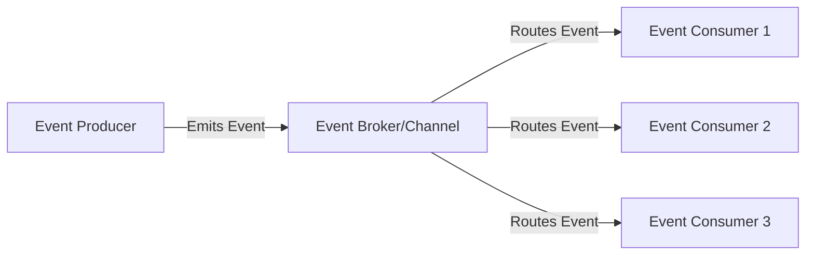
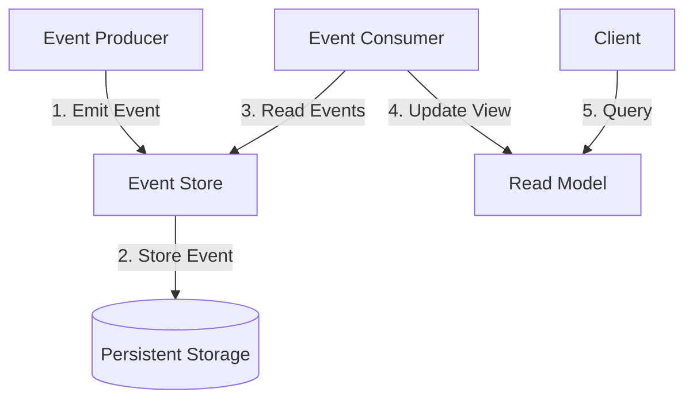
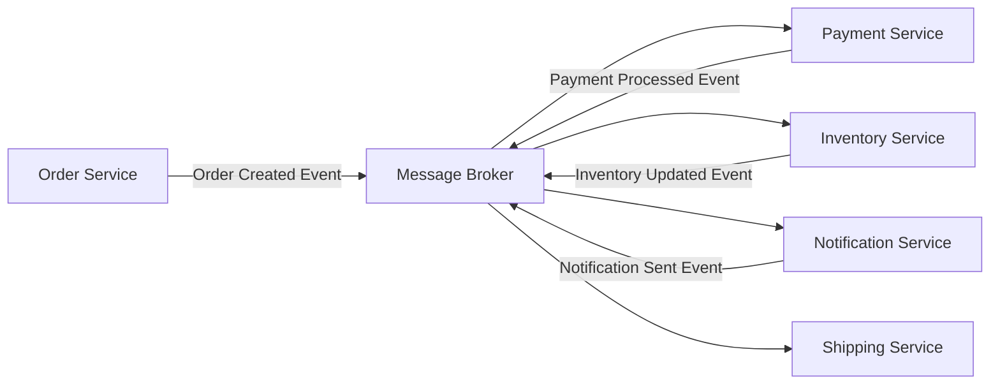

# Kubernetes Event-Driven Architecture

## Introduction

Event-Driven Architecture (EDA) is a software design pattern where the flow of the application is determined by events such as user actions, sensor outputs, or messages from other services. When combined with Kubernetes, it creates a powerful platform for building scalable, resilient, and loosely coupled systems.

In this guide, we'll explore how to implement event-driven architectures within Kubernetes environments, making your applications more responsive, scalable, and maintainable.

## What is Event-Driven Architecture?

Event-Driven Architecture is built around the production, detection, and consumption of events. An event is a significant change in state or an occurrence that is of interest to the system.

Let's break down the key components:

1. **Event Producers**: Components that generate events when something notable happens
2. **Event Consumers**: Components that listen for and react to events
3. **Event Broker/Channel**: The infrastructure that facilitates event transmission



## Why Use Event-Driven Architecture in Kubernetes?

Kubernetes already excels at container orchestration, but when paired with event-driven patterns, it offers several additional benefits:

- **Loose Coupling**: Services don't need to know about each other directly
- **Scalability**: Services can scale independently based on event load
- **Resilience**: Failure in one component doesn't necessarily affect others
- **Flexibility**: Easier to add, remove, or update services
- **Asynchronous Processing**: Operations don't have to wait for responses

## Implementing Event-Driven Architecture in Kubernetes

### 1. Choosing an Event Broker

Several event brokers work well with Kubernetes:

- **Apache Kafka**: High-throughput distributed event streaming platform
- **RabbitMQ**: Message broker that implements AMQP protocol
- **NATS**: Lightweight, high-performance messaging system
- **Cloud Provider Solutions**: AWS EventBridge, Google Pub/Sub, Azure Event Grid

Let's set up a simple RabbitMQ broker in Kubernetes:

```yaml
apiVersion: apps/v1
kind: Deployment
metadata:
  name: rabbitmq
spec:
  replicas: 1
  selector:
    matchLabels:
      app: rabbitmq
  template:
    metadata:
      labels:
        app: rabbitmq
    spec:
      containers:
      - name: rabbitmq
        image: rabbitmq:3.9-management
        ports:
        - containerPort: 5672
        - containerPort: 15672
---
apiVersion: v1
kind: Service
metadata:
  name: rabbitmq
spec:
  selector:
    app: rabbitmq
  ports:
  - name: amqp
    port: 5672
    targetPort: 5672
  - name: management
    port: 15672
    targetPort: 15672
```

Deploy this using:

```bash
kubectl apply -f rabbitmq.yaml
```

### 2. Creating an Event Producer

Here's a simple Python application that produces events:

```python
# producer.py
import pika
import json
import time
import os
import random

# Connect to RabbitMQ
connection = pika.BlockingConnection(
    pika.ConnectionParameters(host=os.getenv('RABBITMQ_HOST', 'rabbitmq'))
)
channel = connection.channel()

# Declare a queue
channel.queue_declare(queue='task_queue', durable=True)

# Generate events
while True:
    task_id = random.randint(1000, 9999)
    message = {
        'task_id': task_id,
        'type': 'process_data',
        'timestamp': time.time(),
        'data': {
            'value': random.randint(1, 100)
        }
    }
    
    # Publish message
    channel.basic_publish(
        exchange='',
        routing_key='task_queue',
        body=json.dumps(message),
        properties=pika.BasicProperties(
            delivery_mode=2,  # make message persistent
        )
    )
    print(f" [x] Sent task {task_id}")
    time.sleep(5)  # Send event every 5 seconds

connection.close()
```

Let's create a Dockerfile for this producer:

```dockerfile
FROM python:3.9-slim

WORKDIR /app

COPY requirements.txt .
RUN pip install --no-cache-dir -r requirements.txt

COPY producer.py .

CMD ["python", "producer.py"]
```

Create a requirements.txt file:

```
pika==1.2.0
```

Now, deploy it to Kubernetes:

```yaml
apiVersion: apps/v1
kind: Deployment
metadata:
  name: event-producer
spec:
  replicas: 1
  selector:
    matchLabels:
      app: event-producer
  template:
    metadata:
      labels:
        app: event-producer
    spec:
      containers:
      - name: producer
        image: event-producer:latest
        env:
        - name: RABBITMQ_HOST
          value: "rabbitmq"
```

### 3. Creating Event Consumers

Next, let's create a consumer service:

```python
# consumer.py
import pika
import json
import os
import time

# Connect to RabbitMQ
connection = pika.BlockingConnection(
    pika.ConnectionParameters(host=os.getenv('RABBITMQ_HOST', 'rabbitmq'))
)
channel = connection.channel()

# Declare queue
channel.queue_declare(queue='task_queue', durable=True)
print(' [*] Waiting for messages. To exit press CTRL+C')

def callback(ch, method, properties, body):
    message = json.loads(body)
    task_id = message['task_id']
    print(f" [x] Received task {task_id}")
    
    # Simulate processing time
    time.sleep(2)
    
    print(f" [x] Done processing task {task_id}")
    ch.basic_ack(delivery_tag=method.delivery_tag)

# Fair dispatch - don't give more than one message to a worker at a time
channel.basic_qos(prefetch_count=1)
channel.basic_consume(queue='task_queue', on_message_callback=callback)

channel.start_consuming()
```

Dockerfile for the consumer:

```dockerfile
FROM python:3.9-slim

WORKDIR /app

COPY requirements.txt .
RUN pip install --no-cache-dir -r requirements.txt

COPY consumer.py .

CMD ["python", "consumer.py"]
```

Deploy the consumer:

```yaml
apiVersion: apps/v1
kind: Deployment
metadata:
  name: event-consumer
spec:
  replicas: 3  # Multiple replicas for scalability
  selector:
    matchLabels:
      app: event-consumer
  template:
    metadata:
      labels:
        app: event-consumer
    spec:
      containers:
      - name: consumer
        image: event-consumer:latest
        env:
        - name: RABBITMQ_HOST
          value: "rabbitmq"
```

### 4. Scaling Based on Event Load

One of the key advantages of Kubernetes is automatic scaling. We can use the Horizontal Pod Autoscaler (HPA) to scale our consumer based on CPU usage or custom metrics:

```yaml
apiVersion: autoscaling/v2
kind: HorizontalPodAutoscaler
metadata:
  name: event-consumer-hpa
spec:
  scaleTargetRef:
    apiVersion: apps/v1
    kind: Deployment
    name: event-consumer
  minReplicas: 1
  maxReplicas: 10
  metrics:
  - type: Resource
    resource:
      name: cpu
      target:
        type: Utilization
        averageUtilization: 70
```

## Advanced Patterns in Kubernetes Event-Driven Architecture

### Event Sourcing

Event Sourcing is a pattern where the state of the application is determined by a sequence of events. In Kubernetes, you can implement this using:



### CQRS (Command Query Responsibility Segregation)

CQRS separates read and write operations, which works well with event-driven systems:

```yaml
apiVersion: apps/v1
kind: Deployment
metadata:
  name: command-service
spec:
  replicas: 2
  selector:
    matchLabels:
      app: command-service
  template:
    metadata:
      labels:
        app: command-service
    spec:
      containers:
      - name: command-service
        image: command-service:latest
---
apiVersion: apps/v1
kind: Deployment
metadata:
  name: query-service
spec:
  replicas: 3  # More replicas for read operations
  selector:
    matchLabels:
      app: query-service
  template:
    metadata:
      labels:
        app: query-service
    spec:
      containers:
      - name: query-service
        image: query-service:latest
```

### Serverless Event Processing with Knative

[Knative](https://knative.dev/) extends Kubernetes to provide a serverless event-driven platform:

```yaml
apiVersion: serving.knative.dev/v1
kind: Service
metadata:
  name: event-processor
spec:
  template:
    spec:
      containers:
      - image: event-processor:latest
---
apiVersion: eventing.knative.dev/v1
kind: Trigger
metadata:
  name: event-processor-trigger
spec:
  broker: default
  filter:
    attributes:
      type: process-data
  subscriber:
    ref:
      apiVersion: serving.knative.dev/v1
      kind: Service
      name: event-processor
```

## Real-World Use Case: Order Processing System

Let's implement a simple e-commerce order processing system:



### Kubernetes Deployments

Here's how to deploy this system in Kubernetes:

```yaml
apiVersion: apps/v1
kind: Deployment
metadata:
  name: order-service
spec:
  replicas: 2
  selector:
    matchLabels:
      app: order-service
  template:
    metadata:
      labels:
        app: order-service
    spec:
      containers:
      - name: order-service
        image: order-service:latest
---
apiVersion: apps/v1
kind: Deployment
metadata:
  name: payment-service
spec:
  replicas: 2
  selector:
    matchLabels:
      app: payment-service
  template:
    metadata:
      labels:
        app: payment-service
    spec:
      containers:
      - name: payment-service
        image: payment-service:latest
---
# Similar deployments for inventory, notification, and shipping services
```

## Best Practices for Event-Driven Architecture in Kubernetes

1. **Use Proper Error Handling**: Implement dead-letter queues for failed events
2. **Ensure Idempotent Consumers**: Consumers should handle duplicate events gracefully
3. **Monitor Your Event System**: Set up proper logging and monitoring
4. **Design for Failure**: Assume components will fail and design accordingly
5. **Consider Event Schema Evolution**: Version your events to allow for changes

Example Prometheus monitoring setup:

```yaml
apiVersion: v1
kind: ConfigMap
metadata:
  name: prometheus-config
data:
  prometheus.yml: |
    global:
      scrape_interval: 15s
    scrape_configs:
      - job_name: 'rabbitmq'
        static_configs:
          - targets: ['rabbitmq:15692']
---
apiVersion: apps/v1
kind: Deployment
metadata:
  name: prometheus
spec:
  replicas: 1
  selector:
    matchLabels:
      app: prometheus
  template:
    metadata:
      labels:
        app: prometheus
    spec:
      containers:
      - name: prometheus
        image: prom/prometheus
        ports:
        - containerPort: 9090
        volumeMounts:
        - name: config-volume
          mountPath: /etc/prometheus
      volumes:
      - name: config-volume
        configMap:
          name: prometheus-config
```

## Testing Event-Driven Systems

Testing event-driven systems requires special consideration:

1. **Unit Testing**: Test individual event producers and consumers
2. **Integration Testing**: Test the flow of events between components
3. **End-to-End Testing**: Test the entire system

Example test for an event consumer:

```python
# test_consumer.py
import unittest
from unittest.mock import patch, MagicMock
import json
from consumer import callback

class TestConsumer(unittest.TestCase):
    
    @patch('time.sleep')
    def test_callback(self, mock_sleep):
        # Setup
        ch = MagicMock()
        method = MagicMock()
        properties = MagicMock()
        body = json.dumps({
            'task_id': 1234,
            'type': 'process_data',
            'timestamp': 1625097600,
            'data': {'value': 42}
        })
        
        # Call the callback
        callback(ch, method, properties, body)
        
        # Assert
        ch.basic_ack.assert_called_once_with(delivery_tag=method.delivery_tag)
        mock_sleep.assert_called_once_with(2)

if __name__ == '__main__':
    unittest.main()
```

## Summary

Event-Driven Architecture in Kubernetes provides a powerful model for building scalable, loosely coupled systems. By combining the container orchestration capabilities of Kubernetes with event-driven patterns, you can create responsive applications that can easily scale with demand.

Key takeaways:

- Events provide loose coupling between services
- Kubernetes provides the perfect platform for scaling event-driven systems
- Various message brokers can be used as the event backbone
- Patterns like Event Sourcing and CQRS enhance event-driven systems
- Proper monitoring and testing are essential for reliability

## Further Resources

- Explore more advanced event patterns like Sagas for distributed transactions
- Dive deeper into specialized event brokers like Apache Kafka or NATS
- Learn about the CloudEvents specification for standardized event formats
- Explore Knative for serverless event-driven applications

## Exercises

1. Deploy the basic producer-consumer example shown in this guide
2. Modify the consumer to process different types of events
3. Implement a dead-letter queue for failed event processing
4. Use Horizontal Pod Autoscaler to scale consumers based on queue length
5. Extend the e-commerce example with additional services

Happy coding!