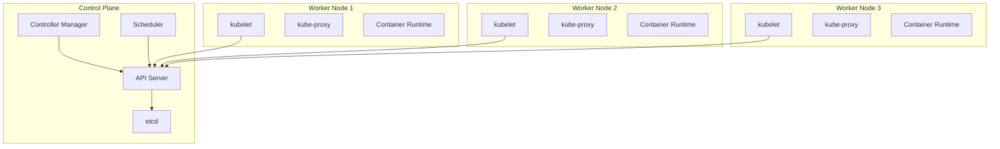

# Kubernetes Production Deployment

## Introduction

Deploying Kubernetes in a production environment requires careful planning, thorough understanding of best practices, and attention to security and scalability concerns. This guide walks you through the process of taking your Kubernetes cluster from development to a production-ready state, ensuring reliability, security, and maintainability.

Kubernetes has become the industry standard for container orchestration, but a production deployment introduces many complexities beyond what you might have encountered in development environments. In this guide, we'll explore how to properly set up, secure, and maintain a production-grade Kubernetes deployment.

## Prerequisites

Before starting a production deployment, you should have:

- Basic understanding of Kubernetes concepts (pods, services, deployments)
- Experience with kubectl command-line tool
- Familiarity with container concepts and Docker
- Access to a cloud provider (AWS, GCP, Azure) or bare metal servers
- Domain knowledge of your application requirements

## Architecture Planning

### Cluster Architecture

A production Kubernetes architecture typically includes:

1. **Control Plane** (formerly called master nodes)
   - API Server
   - Scheduler
   - Controller Manager
   - etcd (distributed key-value store)

2. **Worker Nodes**
   - kubelet
   - kube-proxy
   - Container runtime (Docker, containerd, CRI-O)

Let's visualize this architecture:



### High Availability Considerations

For production deployments, high availability is crucial:

- Deploy multiple control plane nodes (at least 3)
- Use an odd number of etcd instances (3, 5, 7) for quorum-based consensus
- Distribute nodes across availability zones/regions
- Implement proper backup and disaster recovery strategies

## Choosing a Deployment Method

Several options exist for deploying production Kubernetes:

### 1. Managed Kubernetes Services

Cloud providers offer managed Kubernetes services that handle control plane management:

- Amazon EKS (Elastic Kubernetes Service)
- Google GKE (Google Kubernetes Engine)
- Microsoft AKS (Azure Kubernetes Service)
- Digital Ocean Kubernetes

Managed services reduce operational overhead but may have limitations in customization.

### 2. Self-Managed Deployment Tools

For more control or on-premises deployments:

- kops (Kubernetes Operations)
- kubespray (based on Ansible)
- kubeadm (official Kubernetes bootstrapping tool)
- RKE (Rancher Kubernetes Engine)

## Environment Setup Example

Let's look at setting up a production cluster using kubeadm. This example demonstrates the core concepts, though your specific setup might vary.

### 1. Prepare Your Infrastructure

First, ensure your nodes meet the minimum requirements:

- Control plane: 2 CPUs, 2GB RAM
- Worker nodes: 1 CPU, 2GB RAM
- All nodes need proper networking and fully qualified domain names

### 2. Initialize the Control Plane

```bash
# Install required packages
apt-get update && apt-get install -y apt-transport-https ca-certificates curl

# Add Kubernetes repository
curl -s https://packages.cloud.google.com/apt/doc/apt-key.gpg | apt-key add -
cat <<EOF | tee /etc/apt/sources.list.d/kubernetes.list
deb https://apt.kubernetes.io/ kubernetes-xenial main
EOF

# Install kubelet, kubeadm, and kubectl
apt-get update
apt-get install -y kubelet kubeadm kubectl
apt-mark hold kubelet kubeadm kubectl

# Initialize the control plane
kubeadm init --control-plane-endpoint="k8s-control.example.com:6443" \
  --upload-certs \
  --pod-network-cidr=192.168.0.0/16
```

The output will include commands to:
1. Set up kubectl access for the admin user
2. Deploy a pod network
3. Join additional control plane nodes
4. Join worker nodes

### 3. Install a Container Network Interface (CNI)

```bash
# For Calico CNI
kubectl apply -f https://docs.projectcalico.org/manifests/calico.yaml
```

### 4. Join Worker Nodes

On each worker node, run the join command output from the kubeadm init:

```bash
kubeadm join k8s-control.example.com:6443 \
  --token abcdef.0123456789abcdef \
  --discovery-token-ca-cert-hash sha256:1234...cdef
```

## Production Deployment Best Practices

### Resource Management

Control resource allocation with requests and limits:

```yaml
apiVersion: apps/v1
kind: Deployment
metadata:
  name: example-app
spec:
  replicas: 3
  selector:
    matchLabels:
      app: example-app
  template:
    metadata:
      labels:
        app: example-app
    spec:
      containers:
      - name: app-container
        image: example/app:1.0.0
        resources:
          requests:
            memory: "128Mi"
            cpu: "100m"
          limits:
            memory: "256Mi"
            cpu: "500m"
```

### Use Namespaces for Logical Separation

Create separate namespaces for different environments or teams:

```bash
kubectl create namespace production
kubectl create namespace staging
kubectl create namespace monitoring
```

### Implement Health Checks

Add liveness and readiness probes to ensure proper application health:

```yaml
apiVersion: apps/v1
kind: Deployment
metadata:
  name: example-app
spec:
  replicas: 3
  selector:
    matchLabels:
      app: example-app
  template:
    metadata:
      labels:
        app: example-app
    spec:
      containers:
      - name: app-container
        image: example/app:1.0.0
        ports:
        - containerPort: 8080
        livenessProbe:
          httpGet:
            path: /healthz
            port: 8080
          initialDelaySeconds: 3
          periodSeconds: 3
        readinessProbe:
          httpGet:
            path: /ready
            port: 8080
          initialDelaySeconds: 5
          periodSeconds: 5
```

## Security Best Practices

### RBAC (Role-Based Access Control)

Implement proper RBAC to limit access to cluster resources:

```yaml
# Create a role
apiVersion: rbac.authorization.k8s.io/v1
kind: Role
metadata:
  namespace: production
  name: app-reader
rules:
- apiGroups: [""]
  resources: ["pods", "services"]
  verbs: ["get", "list", "watch"]

---
# Bind the role to a user or group
apiVersion: rbac.authorization.k8s.io/v1
kind: RoleBinding
metadata:
  name: read-pods
  namespace: production
subjects:
- kind: User
  name: jane
  apiGroup: rbac.authorization.k8s.io
roleRef:
  kind: Role
  name: app-reader
  apiGroup: rbac.authorization.k8s.io
```

### Network Policies

Restrict pod-to-pod communication:

```yaml
apiVersion: networking.k8s.io/v1
kind: NetworkPolicy
metadata:
  name: api-allow
  namespace: production
spec:
  podSelector:
    matchLabels:
      app: api
  ingress:
  - from:
    - podSelector:
        matchLabels:
          app: frontend
    ports:
    - protocol: TCP
      port: 8080
```

### Secret Management

Store sensitive information securely:

```yaml
apiVersion: v1
kind: Secret
metadata:
  name: app-secrets
type: Opaque
data:
  db-password: cGFzc3dvcmQxMjM=  # base64 encoded
  api-key: YWJjMTIzZGVmNDU2  # base64 encoded
```

And reference them in your deployments:

```yaml
apiVersion: apps/v1
kind: Deployment
metadata:
  name: example-app
spec:
  replicas: 3
  selector:
    matchLabels:
      app: example-app
  template:
    metadata:
      labels:
        app: example-app
    spec:
      containers:
      - name: app-container
        image: example/app:1.0.0
        env:
        - name: DB_PASSWORD
          valueFrom:
            secretKeyRef:
              name: app-secrets
              key: db-password
```

For production, consider using external secret management solutions like:
- HashiCorp Vault
- AWS Secrets Manager
- Azure Key Vault
- Google Secret Manager

## Monitoring and Logging

### Prometheus and Grafana Stack

Deploy Prometheus for metrics collection and Grafana for visualization:

```bash
# Using Helm to install Prometheus and Grafana
helm repo add prometheus-community https://prometheus-community.github.io/helm-charts
helm repo update
helm install prometheus prometheus-community/kube-prometheus-stack \
  --namespace monitoring \
  --create-namespace
```

### Centralized Logging

Set up an EFK (Elasticsearch, Fluentd, Kibana) or ELK (Elasticsearch, Logstash, Kibana) stack:

```bash
# Using Helm to install EFK stack
helm repo add elastic https://helm.elastic.co
helm repo update
helm install elasticsearch elastic/elasticsearch --namespace logging --create-namespace
helm install kibana elastic/kibana --namespace logging
helm install fluentd stable/fluentd-elasticsearch --namespace logging
```

## Scaling and Auto-Scaling

### Horizontal Pod Autoscaler (HPA)

Automatically scale based on CPU or custom metrics:

```yaml
apiVersion: autoscaling/v2
kind: HorizontalPodAutoscaler
metadata:
  name: example-app-hpa
spec:
  scaleTargetRef:
    apiVersion: apps/v1
    kind: Deployment
    name: example-app
  minReplicas: 3
  maxReplicas: 10
  metrics:
  - type: Resource
    resource:
      name: cpu
      target:
        type: Utilization
        averageUtilization: 80
```

### Cluster Autoscaler

For cloud-based deployments, implement cluster autoscaling to add/remove nodes:

```yaml
# Example for AWS EKS
apiVersion: apps/v1
kind: Deployment
metadata:
  name: cluster-autoscaler
  namespace: kube-system
  labels:
    app: cluster-autoscaler
spec:
  replicas: 1
  selector:
    matchLabels:
      app: cluster-autoscaler
  template:
    metadata:
      labels:
        app: cluster-autoscaler
    spec:
      containers:
      - image: k8s.gcr.io/autoscaling/cluster-autoscaler:v1.21.0
        name: cluster-autoscaler
        command:
        - ./cluster-autoscaler
        - --v=4
        - --stderrthreshold=info
        - --cloud-provider=aws
        - --skip-nodes-with-local-storage=false
        - --expander=least-waste
        - --node-group-auto-discovery=asg:tag=k8s.io/cluster-autoscaler/enabled,k8s.io/cluster-autoscaler/my-cluster
```

## CI/CD Integration

### GitOps with ArgoCD

ArgoCD provides declarative, GitOps continuous delivery for Kubernetes:

```yaml
apiVersion: argoproj.io/v1alpha1
kind: Application
metadata:
  name: example-app
  namespace: argocd
spec:
  project: default
  source:
    repoURL: https://github.com/yourorg/example-app.git
    targetRevision: HEAD
    path: kubernetes/manifests
  destination:
    server: https://kubernetes.default.svc
    namespace: production
  syncPolicy:
    automated:
      prune: true
      selfHeal: true
```

### Implementing Blue-Green Deployments

A deployment strategy that minimizes downtime by running two identical environments:

```yaml
apiVersion: apps/v1
kind: Deployment
metadata:
  name: example-app-blue
  labels:
    app: example-app
    version: blue
spec:
  replicas: 3
  selector:
    matchLabels:
      app: example-app
      version: blue
  template:
    metadata:
      labels:
        app: example-app
        version: blue
    spec:
      containers:
      - name: app-container
        image: example/app:1.0.0

---
apiVersion: apps/v1
kind: Deployment
metadata:
  name: example-app-green
  labels:
    app: example-app
    version: green
spec:
  replicas: 0  # Initially zero
  selector:
    matchLabels:
      app: example-app
      version: green
  template:
    metadata:
      labels:
        app: example-app
        version: green
    spec:
      containers:
      - name: app-container
        image: example/app:2.0.0

---
apiVersion: v1
kind: Service
metadata:
  name: example-app
spec:
  selector:
    app: example-app
    version: blue  # Initially pointing to blue
  ports:
  - port: 80
    targetPort: 8080
```

## Disaster Recovery

### Backup with Velero

Velero is an open-source tool to backup and restore Kubernetes resources and persistent volumes:

```bash
# Install Velero on an AWS cluster
velero install \
  --provider aws \
  --plugins velero/velero-plugin-for-aws:v1.2.0 \
  --bucket velero-backups \
  --backup-location-config region=us-west-2 \
  --snapshot-location-config region=us-west-2 \
  --secret-file ./credentials-velero
```

Create scheduled backups:

```bash
# Create a daily backup of the production namespace
velero schedule create production-daily \
  --schedule="0 1 * * *" \
  --include-namespaces production
```

### Testing Restoration

Regularly test your backup and restoration process:

```bash
# Create a restore from the latest backup
velero restore create --from-backup production-daily-20221201 \
  --namespace-mappings production:production-test
```

## Real-World Example: E-commerce Application Deployment

Let's walk through a complete example of deploying a microservices-based e-commerce application to production Kubernetes.

### Infrastructure Setup

1. Create a production namespace:

```bash
kubectl create namespace ecommerce-prod
```

2. Create a ConfigMap for environment-specific settings:

```yaml
apiVersion: v1
kind: ConfigMap
metadata:
  name: ecommerce-config
  namespace: ecommerce-prod
data:
  API_URL: "https://api.example.com"
  CACHE_TTL: "3600"
  PAYMENT_GATEWAY: "production"
```

3. Deploy database with StatefulSet:

```yaml
apiVersion: apps/v1
kind: StatefulSet
metadata:
  name: postgresql
  namespace: ecommerce-prod
spec:
  serviceName: "postgresql"
  replicas: 1
  selector:
    matchLabels:
      app: postgresql
  template:
    metadata:
      labels:
        app: postgresql
    spec:
      containers:
      - name: postgresql
        image: postgres:13
        ports:
        - containerPort: 5432
        env:
        - name: POSTGRES_USER
          valueFrom:
            secretKeyRef:
              name: db-secrets
              key: username
        - name: POSTGRES_PASSWORD
          valueFrom:
            secretKeyRef:
              name: db-secrets
              key: password
        volumeMounts:
        - name: postgresql-data
          mountPath: /var/lib/postgresql/data
  volumeClaimTemplates:
  - metadata:
      name: postgresql-data
    spec:
      accessModes: [ "ReadWriteOnce" ]
      storageClassName: "standard"
      resources:
        requests:
          storage: 10Gi
```

4. Deploy microservices:

```yaml
# Frontend deployment
apiVersion: apps/v1
kind: Deployment
metadata:
  name: frontend
  namespace: ecommerce-prod
spec:
  replicas: 3
  selector:
    matchLabels:
      app: frontend
  template:
    metadata:
      labels:
        app: frontend
    spec:
      containers:
      - name: frontend
        image: example/ecommerce-frontend:1.2.0
        ports:
        - containerPort: 80
        resources:
          requests:
            memory: "128Mi"
            cpu: "100m"
          limits:
            memory: "256Mi"
            cpu: "300m"
        readinessProbe:
          httpGet:
            path: /health
            port: 80
          initialDelaySeconds: 10
          periodSeconds: 5

---
# API service deployment
apiVersion: apps/v1
kind: Deployment
metadata:
  name: api-service
  namespace: ecommerce-prod
spec:
  replicas: 5
  selector:
    matchLabels:
      app: api-service
  template:
    metadata:
      labels:
        app: api-service
    spec:
      containers:
      - name: api
        image: example/ecommerce-api:1.1.0
        ports:
        - containerPort: 8080
        env:
        - name: DB_HOST
          value: postgresql.ecommerce-prod.svc.cluster.local
        - name: DB_USER
          valueFrom:
            secretKeyRef:
              name: db-secrets
              key: username
        - name: DB_PASSWORD
          valueFrom:
            secretKeyRef:
              name: db-secrets
              key: password
        - name: DB_NAME
          value: ecommerce
        envFrom:
        - configMapRef:
            name: ecommerce-config
```

5. Create services:

```yaml
# Frontend service with LoadBalancer
apiVersion: v1
kind: Service
metadata:
  name: frontend
  namespace: ecommerce-prod
spec:
  type: LoadBalancer
  ports:
  - port: 80
    targetPort: 80
  selector:
    app: frontend

---
# API service (internal)
apiVersion: v1
kind: Service
metadata:
  name: api-service
  namespace: ecommerce-prod
spec:
  type: ClusterIP
  ports:
  - port: 8080
    targetPort: 8080
  selector:
    app: api-service

---
# Database service
apiVersion: v1
kind: Service
metadata:
  name: postgresql
  namespace: ecommerce-prod
spec:
  type: ClusterIP
  ports:
  - port: 5432
    targetPort: 5432
  selector:
    app: postgresql
```

6. Set up an ingress controller for TLS termination:

```yaml
apiVersion: networking.k8s.io/v1
kind: Ingress
metadata:
  name: ecommerce-ingress
  namespace: ecommerce-prod
  annotations:
    kubernetes.io/ingress.class: nginx
    cert-manager.io/cluster-issuer: letsencrypt-prod
spec:
  tls:
  - hosts:
    - shop.example.com
    secretName: shop-tls
  rules:
  - host: shop.example.com
    http:
      paths:
      - path: /
        pathType: Prefix
        backend:
          service:
            name: frontend
            port:
              number: 80
      - path: /api
        pathType: Prefix
        backend:
          service:
            name: api-service
            port:
              number: 8080
```

### Performance Testing

Before full production deployment, perform thorough load testing using tools like k6, JMeter, or Locust:

```bash
# Example k6 load test
k6 run --vus 100 --duration 5m loadtest.js
```

## Maintenance and Updates

### Rolling Updates

Kubernetes supports rolling updates by default:

```bash
# Update the API service to a new version
kubectl set image deployment/api-service api=example/ecommerce-api:1.2.0 -n ecommerce-prod
```

### Handling Stateful Components

For database schema updates, you might need a more careful approach:

1. Take a backup
2. Apply schema migrations using jobs:

```yaml
apiVersion: batch/v1
kind: Job
metadata:
  name: db-migration
  namespace: ecommerce-prod
spec:
  template:
    spec:
      containers:
      - name: migration
        image: example/db-migration:1.0.0
        env:
        - name: DB_HOST
          value: postgresql.ecommerce-prod.svc.cluster.local
        # Add other environment variables as needed
      restartPolicy: Never
  backoffLimit: 4
```

## Summary

Deploying Kubernetes in production involves careful planning, proper resource management, security hardening, and implementing monitoring and scaling strategies. The key takeaways from this guide include:

1. **Plan your architecture** with high availability in mind
2. **Choose the right deployment method** based on your needs and resources
3. **Implement security best practices** including RBAC, network policies, and secure secret management
4. **Set up comprehensive monitoring and logging** to detect and troubleshoot issues
5. **Configure auto-scaling** to handle varying loads
6. **Establish a CI/CD pipeline** for reliable deployments
7. **Implement disaster recovery procedures** and test them regularly

By following these guidelines, you'll be well on your way to running a production-grade Kubernetes environment that is reliable, secure, and maintainable.

## Additional Resources

Here are some resources to deepen your understanding:

- [Kubernetes Documentation](https://kubernetes.io/docs/home/)
- [Kubernetes the Hard Way](https://github.com/kelseyhightower/kubernetes-the-hard-way)
- [CNCF Landscape](https://landscape.cncf.io/)
- Books:
  - "Kubernetes in Action" by Marko Lukša
  - "Kubernetes Patterns" by Bilgin Ibryam and Roland Huß
  - "Production Kubernetes" by Josh Rosso, Rich Lander, Alex Brand, and John Harris

## Practice Exercises

1. Set up a local multi-node Kubernetes cluster using minikube or kind
2. Create a deployment strategy for a stateful application
3. Implement a complete monitoring solution with Prometheus and Grafana
4. Design and implement a disaster recovery plan
5. Create a GitOps workflow using tools like ArgoCD or Flux