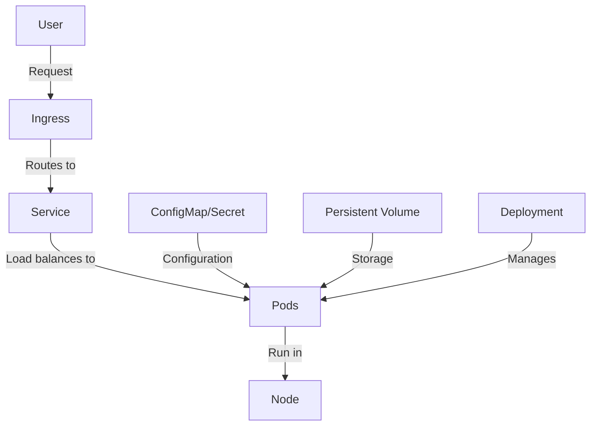

# Kubernetes Web Application

## Introduction

Deploying web applications has evolved significantly over the years. From traditional server deployments to containerization, the journey has been about making applications more scalable, maintainable, and resilient. Kubernetes takes this evolution to the next level by providing a robust platform for orchestrating containerized applications.

In this tutorial, we'll explore how to deploy a web application on Kubernetes. We'll cover everything from basic concepts to practical implementation steps, making it accessible even if you're new to container orchestration.

## Prerequisites

Before we begin, you should have:

- Basic understanding of Docker containers
- A Kubernetes cluster (local like Minikube or cloud-based)
- `kubectl` command-line tool installed
- A simple web application (we'll use a Node.js application as an example)

## Understanding the Architecture

Let's first understand how a web application typically runs on Kubernetes:



The key components include:

- **Pods**: The smallest deployable units that contain your application containers
- **Deployments**: Manage the lifecycle of pods and provide scaling and updates
- **Services**: Provide networking and load balancing for pods
- **Ingress**: Manages external access to services
- **ConfigMaps/Secrets**: Store configuration and sensitive data
- **Persistent Volumes**: Provide storage that persists beyond pod lifecycles

## Creating Your First Web Application Deployment

Let's start by creating a simple deployment for a Node.js web application.

### Step 1: Create a Deployment YAML

Create a file named `web-app-deployment.yaml`:

```yaml
apiVersion: apps/v1
kind: Deployment
metadata:
  name: web-app
  labels:
    app: web-app
spec:
  replicas: 3
  selector:
    matchLabels:
      app: web-app
  template:
    metadata:
      labels:
        app: web-app
    spec:
      containers:
      - name: web-app
        image: nodejs-web-app:1.0
        ports:
        - containerPort: 3000
        resources:
          limits:
            cpu: "0.5"
            memory: "512Mi"
          requests:
            cpu: "0.2"
            memory: "256Mi"
```

This YAML defines:
- A deployment named `web-app`
- 3 replica pods for high availability
- Using a container image called `nodejs-web-app:1.0`
- Exposing port 3000
- Setting resource constraints

### Step 2: Create a Service

Create a file named `web-app-service.yaml`:

```yaml
apiVersion: v1
kind: Service
metadata:
  name: web-app-service
spec:
  selector:
    app: web-app
  ports:
  - port: 80
    targetPort: 3000
  type: ClusterIP
```

This creates a service that routes traffic from port 80 to port 3000 of your web application pods.

### Step 3: Apply the Configuration

Apply these configurations to your Kubernetes cluster:

```bash
kubectl apply -f web-app-deployment.yaml
kubectl apply -f web-app-service.yaml
```

You should see output similar to:

```
deployment.apps/web-app created
service/web-app-service created
```

### Step 4: Verify the Deployment

Check if your pods are running:

```bash
kubectl get pods
```

Output:

```
NAME                      READY   STATUS    RESTARTS   AGE
web-app-58b7c7b966-2h2s9   1/1     Running   0          45s
web-app-58b7c7b966-7lc58   1/1     Running   0          45s
web-app-58b7c7b966-wt7zr   1/1     Running   0          45s
```

Check the service:

```bash
kubectl get services
```

Output:

```
NAME              TYPE        CLUSTER-IP       EXTERNAL-IP   PORT(S)   AGE
web-app-service   ClusterIP   10.109.102.115   <none>        80/TCP    1m
```

## Exposing Your Web Application

Now that your application is deployed within the cluster, you need to make it accessible from outside. Let's create an Ingress resource.

### Step 1: Create an Ingress YAML

Create a file named `web-app-ingress.yaml`:

```yaml
apiVersion: networking.k8s.io/v1
kind: Ingress
metadata:
  name: web-app-ingress
  annotations:
    nginx.ingress.kubernetes.io/rewrite-target: /
spec:
  rules:
  - host: webapp.example.com
    http:
      paths:
      - path: /
        pathType: Prefix
        backend:
          service:
            name: web-app-service
            port:
              number: 80
```

This Ingress resource routes traffic from `webapp.example.com` to your service.

### Step 2: Apply the Ingress

```bash
kubectl apply -f web-app-ingress.yaml
```

Output:

```
ingress.networking.k8s.io/web-app-ingress created
```

## Adding Configuration to Your Web Application

Web applications often need configuration. Let's see how to use ConfigMaps for this purpose.

### Step 1: Create a ConfigMap

Create a file named `web-app-config.yaml`:

```yaml
apiVersion: v1
kind: ConfigMap
metadata:
  name: web-app-config
data:
  DATABASE_URL: "mongodb://db-service:27017/webappdb"
  NODE_ENV: "production"
  LOG_LEVEL: "info"
```

### Step 2: Update the Deployment to Use the ConfigMap

Update your deployment YAML to include the ConfigMap:

```yaml
apiVersion: apps/v1
kind: Deployment
metadata:
  name: web-app
  labels:
    app: web-app
spec:
  replicas: 3
  selector:
    matchLabels:
      app: web-app
  template:
    metadata:
      labels:
        app: web-app
    spec:
      containers:
      - name: web-app
        image: nodejs-web-app:1.0
        ports:
        - containerPort: 3000
        envFrom:
        - configMapRef:
            name: web-app-config
        resources:
          limits:
            cpu: "0.5"
            memory: "512Mi"
          requests:
            cpu: "0.2"
            memory: "256Mi"
```

The key addition is the `envFrom` section, which loads all key-value pairs from the ConfigMap as environment variables in the container.

### Step 3: Apply the Updated Configuration

```bash
kubectl apply -f web-app-config.yaml
kubectl apply -f web-app-deployment.yaml
```

## Adding Persistent Storage

If your web application needs to store data persistently, you can add a Persistent Volume.

### Step 1: Create a PersistentVolumeClaim

Create a file named `web-app-pvc.yaml`:

```yaml
apiVersion: v1
kind: PersistentVolumeClaim
metadata:
  name: web-app-data
spec:
  accessModes:
    - ReadWriteOnce
  resources:
    requests:
      storage: 1Gi
```

### Step 2: Update the Deployment to Use the PVC

Update your deployment YAML again:

```yaml
apiVersion: apps/v1
kind: Deployment
metadata:
  name: web-app
  labels:
    app: web-app
spec:
  replicas: 3
  selector:
    matchLabels:
      app: web-app
  template:
    metadata:
      labels:
        app: web-app
    spec:
      containers:
      - name: web-app
        image: nodejs-web-app:1.0
        ports:
        - containerPort: 3000
        envFrom:
        - configMapRef:
            name: web-app-config
        volumeMounts:
        - name: web-app-data
          mountPath: /app/data
        resources:
          limits:
            cpu: "0.5"
            memory: "512Mi"
          requests:
            cpu: "0.2"
            memory: "256Mi"
      volumes:
      - name: web-app-data
        persistentVolumeClaim:
          claimName: web-app-data
```

The key additions are the `volumeMounts` section in the container spec and the `volumes` section at the pod level.

### Step 3: Apply the Updated Configuration

```bash
kubectl apply -f web-app-pvc.yaml
kubectl apply -f web-app-deployment.yaml
```

## Scaling Your Web Application

One of the key benefits of Kubernetes is easy scaling. Let's scale our application:

```bash
kubectl scale deployment web-app --replicas=5
```

Output:

```
deployment.apps/web-app scaled
```

Verify the scaling:

```bash
kubectl get pods
```

You should now see 5 pods running.

## Updating Your Web Application

When you need to update your application, Kubernetes makes it easy with rolling updates.

### Step 1: Update the Image Version

Modify your deployment YAML to use a new image version:

```yaml
apiVersion: apps/v1
kind: Deployment
metadata:
  name: web-app
  labels:
    app: web-app
spec:
  replicas: 5
  selector:
    matchLabels:
      app: web-app
  template:
    metadata:
      labels:
        app: web-app
    spec:
      containers:
      - name: web-app
        image: nodejs-web-app:1.1  # Changed from 1.0 to 1.1
        ports:
        - containerPort: 3000
        envFrom:
        - configMapRef:
            name: web-app-config
        volumeMounts:
        - name: web-app-data
          mountPath: /app/data
        resources:
          limits:
            cpu: "0.5"
            memory: "512Mi"
          requests:
            cpu: "0.2"
            memory: "256Mi"
      volumes:
      - name: web-app-data
        persistentVolumeClaim:
          claimName: web-app-data
```

### Step 2: Apply the Update

```bash
kubectl apply -f web-app-deployment.yaml
```

### Step 3: Monitor the Update

Watch the rollout status:

```bash
kubectl rollout status deployment/web-app
```

Output:

```
Waiting for rollout to finish: 2 out of 5 new replicas have been updated...
Waiting for rollout to finish: 3 out of 5 new replicas have been updated...
Waiting for rollout to finish: 4 out of 5 new replicas have been updated...
Waiting for rollout to finish: 5 out of 5 new replicas have been updated...
Waiting for rollout to finish: 3 old replicas are pending termination...
Waiting for rollout to finish: 2 old replicas are pending termination...
Waiting for rollout to finish: 1 old replicas are pending termination...
deployment "web-app" successfully rolled out
```

If there's an issue with the new version, you can easily roll back:

```bash
kubectl rollout undo deployment/web-app
```

## Monitoring Your Web Application

Kubernetes provides several ways to monitor your application.

### View Pod Logs

```bash
kubectl logs deploy/web-app
```

This will show logs from one of the pods. To see logs from a specific pod:

```bash
kubectl logs web-app-58b7c7b966-2h2s9
```

### View Pod Details

```bash
kubectl describe pod web-app-58b7c7b966-2h2s9
```

This provides detailed information about the pod, including its status, events, and configuration.

## A Complete Example: Node.js Web Application

Let's put everything together with a simple Node.js web application example.

### Step 1: Create a Dockerfile for Your Application

```dockerfile
FROM node:14-alpine

WORKDIR /app

COPY package*.json ./
RUN npm install

COPY . .

EXPOSE 3000

CMD ["node", "server.js"]
```

### Step 2: Create a Simple Express.js Server

```javascript
const express = require('express');
const app = express();
const fs = require('fs');
const path = require('path');

// Get configuration from environment variables
const logLevel = process.env.LOG_LEVEL || 'info';
const nodeEnv = process.env.NODE_ENV || 'development';
const dbUrl = process.env.DATABASE_URL || 'mongodb://localhost:27017/webappdb';

// Create data directory if using persistent storage
const dataDir = path.join(__dirname, 'data');
if (!fs.existsSync(dataDir)) {
  fs.mkdirSync(dataDir);
}

// Simple in-memory counter
let visitCount = 0;

// Route for the homepage
app.get('/', (req, res) => {
  visitCount++;
  
  // Save visit count to persistent storage
  fs.writeFileSync(path.join(dataDir, 'visits.txt'), visitCount.toString());
  
  res.send(`
    <h1>Welcome to our Kubernetes Web App!</h1>
    <p>This page has been visited ${visitCount} times.</p>
    <p>Environment: ${nodeEnv}</p>
    <p>Log Level: ${logLevel}</p>
    <p>Database URL: ${dbUrl}</p>
  `);
});

// Start the server
const PORT = process.env.PORT || 3000;
app.listen(PORT, () => {
  console.log(`Server running on port ${PORT}`);
  console.log(`Environment: ${nodeEnv}`);
  console.log(`Log Level: ${logLevel}`);
  console.log(`Database URL: ${dbUrl}`);
});
```

### Step 3: Build and Push the Docker Image

```bash
docker build -t your-registry/nodejs-web-app:1.0 .
docker push your-registry/nodejs-web-app:1.0
```

### Step 4: Update Your Deployment YAML to Use This Image

Update the image in your deployment YAML:

```yaml
image: your-registry/nodejs-web-app:1.0
```

### Step 5: Apply All the Kubernetes Resources

```bash
kubectl apply -f web-app-config.yaml
kubectl apply -f web-app-pvc.yaml
kubectl apply -f web-app-deployment.yaml
kubectl apply -f web-app-service.yaml
kubectl apply -f web-app-ingress.yaml
```

## Best Practices for Kubernetes Web Applications

1. **Health Checks**: Add liveness and readiness probes to your pods to ensure proper handling of failures.

```yaml
livenessProbe:
  httpGet:
    path: /health
    port: 3000
  initialDelaySeconds: 15
  periodSeconds: 10
readinessProbe:
  httpGet:
    path: /ready
    port: 3000
  initialDelaySeconds: 5
  periodSeconds: 5
```

2. **Resource Management**: Always set resource requests and limits for your containers.

3. **Fault Tolerance**: Use multiple replicas and anti-affinity rules to spread pods across nodes.

```yaml
affinity:
  podAntiAffinity:
    preferredDuringSchedulingIgnoredDuringExecution:
    - weight: 100
      podAffinityTerm:
        labelSelector:
          matchExpressions:
          - key: app
            operator: In
            values:
            - web-app
        topologyKey: kubernetes.io/hostname
```

4. **Security**: Use NetworkPolicies to restrict traffic and SecurityContexts to run containers with minimal privileges.

5. **Configuration Management**: Use ConfigMaps and Secrets for configuration, and consider using tools like Helm for deployment management.

## Troubleshooting Common Issues

### Pod Not Starting

Check the pod status:

```bash
kubectl get pods
kubectl describe pod [pod-name]
```

Common issues include:
- Image pull errors (incorrect image name or registry authentication issues)
- Resource constraints (not enough CPU or memory available)
- ConfigMap or Secret not found

### Service Not Accessible

Check the service and endpoints:

```bash
kubectl get svc web-app-service
kubectl get endpoints web-app-service
```

Make sure the endpoints match your pod IPs:

```bash
kubectl get pods -o wide
```

### Ingress Not Working

Check the Ingress controller and resource:

```bash
kubectl get ingress
kubectl describe ingress web-app-ingress
```

Make sure your DNS is configured to point to the Ingress controller's IP.

## Summary

In this tutorial, we've covered how to deploy a web application on Kubernetes, including:

1. Creating deployments, services, and ingress resources
2. Managing configuration with ConfigMaps
3. Adding persistent storage with PVCs
4. Scaling and updating applications
5. Monitoring and troubleshooting

Kubernetes provides a powerful platform for running web applications at scale. By abstracting away the infrastructure details, it lets you focus on your application while still giving you the tools you need to ensure reliability, scalability, and security.

## Additional Resources

- **Kubernetes Documentation**: [kubernetes.io/docs](https://kubernetes.io/docs/home/)
- **Helm Charts**: For easier application packaging and deployment
- **Kubernetes Patterns**: Book by Bilgin Ibryam and Roland Huß
- **Kustomize**: For managing Kubernetes configuration variations

## Exercises

1. Deploy the sample Node.js application with three replicas
2. Update the application to version 1.1 with a new feature
3. Add a liveness probe to the deployment
4. Create a NetworkPolicy that only allows traffic from the Ingress to your service
5. Set up a Horizontal Pod Autoscaler to scale based on CPU usage