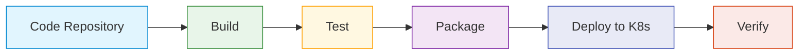

# Kubernetes CI/CD Pipeline

## Introduction

A Continuous Integration and Continuous Deployment (CI/CD) pipeline for Kubernetes automates the process of building, testing, and deploying applications to a Kubernetes cluster. This automation streamlines development workflows, ensures consistent deployments, and enables rapid iteration of your applications.

In this tutorial, we'll explore how to create a CI/CD pipeline for Kubernetes applications, understand the key components involved, and implement a practical example to deploy a sample application to a Kubernetes cluster.

## Understanding CI/CD in Kubernetes

### What is CI/CD?

**Continuous Integration (CI)** is the practice of frequently merging code changes into a shared repository, where automated builds and tests verify each integration.

**Continuous Deployment (CD)** automatically deploys all code changes to a testing or production environment after the build stage.

### Why Use CI/CD with Kubernetes?

- **Automation**: Eliminates manual deployment steps and human error
- **Consistency**: Ensures applications are deployed the same way every time
- **Speed**: Accelerates the delivery of new features and bug fixes
- **Scalability**: Makes it easier to manage deployments across multiple environments

## CI/CD Pipeline Components

A typical Kubernetes CI/CD pipeline consists of the following stages:



Let's look at each stage in detail:

1. **Code Repository**: Source code is stored in a version control system like Git
2. **Build**: The application is compiled and built
3. **Test**: Automated tests verify the application works correctly
4. **Package**: The application is packaged into a container image
5. **Deploy**: The container image is deployed to a Kubernetes cluster
6. **Verify**: The deployment is validated to ensure it's working correctly

## Setting Up Your CI/CD Environment

Before we create our pipeline, we need to set up the necessary tools and components:

### Prerequisites

- A Kubernetes cluster (like Minikube, kind, or a cloud-based cluster)
- kubectl command-line tool
- A container registry (Docker Hub, Google Container Registry, etc.)
- A CI/CD tool (we'll use GitHub Actions in this tutorial)
- A sample application (we'll use a simple Node.js app)

### Sample Application

Let's start with a simple Node.js application that we'll deploy to Kubernetes. Create a file named `app.js`:

```javascript
const http = require('http');

const server = http.createServer((req, res) => {
  res.statusCode = 200;
  res.setHeader('Content-Type', 'text/plain');
  res.end('Hello from Kubernetes CI/CD Pipeline!');
});

const PORT = process.env.PORT || 3000;
server.listen(PORT, () => {
  console.log(`Server running on port ${PORT}`);
});
```

Create a `package.json` file:

```json
{
  "name": "k8s-cicd-demo",
  "version": "1.0.0",
  "description": "Demo app for Kubernetes CI/CD pipeline",
  "main": "app.js",
  "scripts": {
    "start": "node app.js",
    "test": "echo \"Running tests...\" && exit 0"
  },
  "dependencies": {}
}
```

### Containerizing the Application

Create a `Dockerfile` to containerize the application:

```dockerfile
FROM node:14-alpine

WORKDIR /app

COPY package*.json ./
RUN npm install

COPY . .

EXPOSE 3000
CMD ["npm", "start"]
```

### Kubernetes Manifests

Create a `kubernetes` directory with the following deployment manifest (`deployment.yaml`):

```yaml
apiVersion: apps/v1
kind: Deployment
metadata:
  name: k8s-cicd-demo
spec:
  replicas: 3
  selector:
    matchLabels:
      app: k8s-cicd-demo
  template:
    metadata:
      labels:
        app: k8s-cicd-demo
    spec:
      containers:
      - name: k8s-cicd-demo
        image: ${IMAGE_NAME}
        ports:
        - containerPort: 3000
        resources:
          limits:
            cpu: "0.5"
            memory: "512Mi"
          requests:
            cpu: "0.2"
            memory: "256Mi"
```

And a service manifest (`service.yaml`):

```yaml
apiVersion: v1
kind: Service
metadata:
  name: k8s-cicd-demo
spec:
  selector:
    app: k8s-cicd-demo
  ports:
  - port: 80
    targetPort: 3000
  type: LoadBalancer
```

## Building the CI/CD Pipeline with GitHub Actions

We'll use GitHub Actions to create our CI/CD pipeline. Create a `.github/workflows` directory in your project and add a file named `kubernetes-cicd.yaml`:

```yaml
name: Kubernetes CI/CD

on:
  push:
    branches: [ main ]
  pull_request:
    branches: [ main ]

env:
  IMAGE_NAME: ghcr.io/${{ github.repository_owner }}/k8s-cicd-demo
  IMAGE_TAG: ${{ github.sha }}

jobs:
  build-and-test:
    runs-on: ubuntu-latest
    steps:
    - uses: actions/checkout@v2
    
    - name: Set up Node.js
      uses: actions/setup-node@v2
      with:
        node-version: '14'
    
    - name: Install Dependencies
      run: npm install
    
    - name: Run Tests
      run: npm test
    
    - name: Build and Push Docker Image
      uses: docker/build-push-action@v2
      with:
        context: .
        push: ${{ github.event_name != 'pull_request' }}
        tags: ${{ env.IMAGE_NAME }}:${{ env.IMAGE_TAG }}, ${{ env.IMAGE_NAME }}:latest
        
  deploy:
    needs: build-and-test
    if: github.event_name != 'pull_request'
    runs-on: ubuntu-latest
    steps:
    - uses: actions/checkout@v2
    
    - name: Set up kubectl
      uses: azure/setup-kubectl@v1
      
    - name: Configure Kubernetes Context
      uses: azure/k8s-set-context@v1
      with:
        kubeconfig: ${{ secrets.KUBECONFIG }}
    
    - name: Update Image in Deployment
      run: |
        sed -i "s|\${IMAGE_NAME}|${{ env.IMAGE_NAME }}:${{ env.IMAGE_TAG }}|g" kubernetes/deployment.yaml
        
    - name: Deploy to Kubernetes
      run: |
        kubectl apply -f kubernetes/deployment.yaml
        kubectl apply -f kubernetes/service.yaml
        
    - name: Verify Deployment
      run: |
        kubectl rollout status deployment/k8s-cicd-demo
```

## Understanding the Pipeline

Let's break down how this pipeline works:

### 1. Triggers

The pipeline is triggered when code is pushed to the main branch or when a pull request is created:

```yaml
on:
  push:
    branches: [ main ]
  pull_request:
    branches: [ main ]
```

### 2. Environment Variables

We define variables for the image name and tag:

```yaml
env:
  IMAGE_NAME: ghcr.io/${{ github.repository_owner }}/k8s-cicd-demo
  IMAGE_TAG: ${{ github.sha }}
```

### 3. Build and Test Job

The first job builds and tests the application:

- Checks out the code
- Sets up Node.js
- Installs dependencies
- Runs tests
- Builds and pushes a Docker image (only on pushes to main, not on pull requests)

### 4. Deploy Job

The second job deploys the application to Kubernetes:

- Depends on the build-and-test job
- Only runs on pushes to main
- Sets up kubectl
- Configures the Kubernetes context using a stored secret
- Updates the image name in the deployment manifest
- Applies the Kubernetes manifests
- Verifies the deployment succeeded

## Setting Up Secrets

For this pipeline to work, you need to add your Kubernetes configuration as a secret in your GitHub repository:

1. Navigate to your GitHub repository
2. Go to Settings > Secrets
3. Add a new secret named `KUBECONFIG` containing your Kubernetes configuration file

Your kubeconfig file typically looks like this:

```yaml
apiVersion: v1
kind: Config
clusters:
- name: my-cluster
  cluster:
    server: https://kubernetes-api-server-url
    certificate-authority-data: BASE64_ENCODED_CA_CERT
contexts:
- name: my-context
  context:
    cluster: my-cluster
    user: my-user
current-context: my-context
users:
- name: my-user
  user:
    client-certificate-data: BASE64_ENCODED_CLIENT_CERT
    client-key-data: BASE64_ENCODED_CLIENT_KEY
```

## Testing the Pipeline

Now that we have our pipeline set up, let's test it:

1. Push your code to GitHub
2. Go to the "Actions" tab in your repository
3. Watch as the pipeline runs
4. If successful, your application should be deployed to your Kubernetes cluster

After deployment, you can verify your application is running with:

```bash
kubectl get pods
kubectl get services
```

You should see your pods running and the service exposing your application.

## Best Practices for Kubernetes CI/CD

To create robust CI/CD pipelines for Kubernetes, follow these best practices:

### 1. Use Infrastructure as Code (IaC)

Store all your Kubernetes manifests in your repository alongside your application code. This ensures that your infrastructure configuration is versioned and can be reviewed just like application code.

### 2. Implement Environment-Specific Configurations

Create separate configurations for different environments (development, staging, production):

```
kubernetes/
  ├── base/
  │   ├── deployment.yaml
  │   └── service.yaml
  ├── dev/
  │   └── kustomization.yaml
  ├── staging/
  │   └── kustomization.yaml
  └── prod/
      └── kustomization.yaml
```

Use tools like Kustomize or Helm to manage these environment-specific configurations.

### 3. Implement Proper Testing

Include various types of tests in your pipeline:

- Unit tests
- Integration tests
- End-to-end tests
- Security scans
- Performance tests

### 4. Use Semantic Versioning

Tag your container images with semantic versions (e.g., v1.2.3) rather than just using commit hashes.

### 5. Implement Rollback Strategies

Plan for failures by implementing automated rollback mechanisms in your pipeline.

## Advanced CI/CD Pipeline Features

### Canary Deployments

Canary deployments gradually roll out changes to a small subset of users before making them available to everyone:

```yaml
apiVersion: networking.k8s.io/v1
kind: Ingress
metadata:
  name: k8s-cicd-demo
  annotations:
    nginx.ingress.kubernetes.io/canary: "true"
    nginx.ingress.kubernetes.io/canary-weight: "20"
spec:
  rules:
  - host: example.com
    http:
      paths:
      - path: /
        pathType: Prefix
        backend:
          service:
            name: k8s-cicd-demo-canary
            port:
              number: 80
```

### Blue-Green Deployments

Blue-green deployments run two identical environments, switching traffic from the old (blue) to the new (green) version once the new version is verified:

```yaml
apiVersion: v1
kind: Service
metadata:
  name: k8s-cicd-demo
spec:
  selector:
    app: k8s-cicd-demo
    version: green
  ports:
  - port: 80
    targetPort: 3000
  type: LoadBalancer
```

### GitOps

GitOps uses Git repositories as the source of truth for declarative infrastructure and applications:

1. Install a GitOps operator like Flux or ArgoCD in your cluster
2. Configure it to watch your Git repository
3. The operator automatically synchronizes your cluster state with the desired state defined in your repository

## Practical Example: Complete CI/CD Workflow

Let's walk through a complete CI/CD workflow using our pipeline:

### 1. Developer Makes Changes

A developer creates a new feature branch, makes changes, and pushes to GitHub:

```bash
git checkout -b feature/new-endpoint
# Make changes
git add .
git commit -m "Add new endpoint"
git push origin feature/new-endpoint
```

### 2. Create Pull Request

The developer creates a pull request on GitHub. This triggers the CI/CD pipeline to:
- Build the application
- Run tests
- Build the container image (but not push it)

### 3. Review and Merge

Team members review the code. Once approved, the pull request is merged to the main branch.

### 4. Automatic Deployment

The merge to main triggers the full CI/CD pipeline:
- Build the application
- Run tests
- Build and push the container image
- Deploy to Kubernetes
- Verify the deployment

### 5. Monitor and Validate

After deployment, monitor the application to ensure it's functioning correctly:

```bash
# Check pod status
kubectl get pods

# View pod logs
kubectl logs deployment/k8s-cicd-demo

# Check the service
kubectl get svc k8s-cicd-demo
```

## Summary

In this tutorial, we've learned how to create a CI/CD pipeline for Kubernetes applications using GitHub Actions. We've covered:

- The fundamentals of CI/CD for Kubernetes
- Setting up a sample application
- Creating Kubernetes deployment manifests
- Building a CI/CD pipeline with GitHub Actions
- Best practices for Kubernetes CI/CD
- Advanced deployment strategies like canary and blue-green deployments

By implementing a CI/CD pipeline for your Kubernetes applications, you can automate deployments, reduce errors, and deliver changes to users more quickly and reliably.

## Additional Resources

- [Kubernetes Documentation](https://kubernetes.io/docs/)
- [GitHub Actions Documentation](https://docs.github.com/en/actions)
- [Docker Documentation](https://docs.docker.com/)
- [ArgoCD - GitOps Continuous Delivery Tool](https://argoproj.github.io/argo-cd/)
- [Flux - GitOps for Kubernetes](https://fluxcd.io/)

## Exercises

1. Modify the CI/CD pipeline to include a security scanning step using a tool like Trivy or Clair.
2. Implement a blue-green deployment strategy in your Kubernetes manifests.
3. Create a canary deployment configuration for your application.
4. Set up a GitOps workflow using ArgoCD or Flux.
5. Implement environment-specific configurations using Kustomize or Helm.