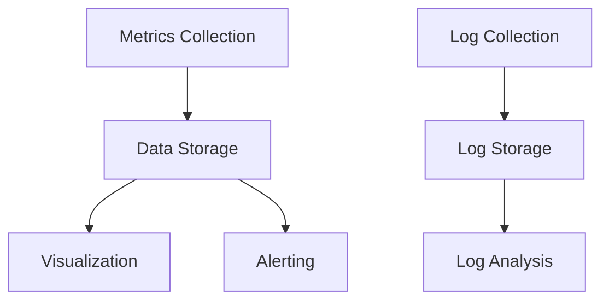

# Kubernetes Monitoring Stack

## Introduction

When managing Kubernetes clusters, having visibility into what's happening inside is crucial. A monitoring stack allows you to collect metrics, visualize data, and set up alerts for your Kubernetes infrastructure. This guide will walk you through building a comprehensive monitoring solution for your Kubernetes clusters using popular open-source tools.

Think of a monitoring stack as the dashboard of a car - it shows you important information about what's happening "under the hood" of your Kubernetes environment, helping you detect issues before they become problems.

## Why Monitoring Matters in Kubernetes

Kubernetes environments are dynamic and complex. Without proper monitoring:

- You won't know if your applications are healthy
- Resource bottlenecks may go undetected
- Troubleshooting becomes difficult
- Scaling decisions lack data

## Core Components of a Kubernetes Monitoring Stack

A typical Kubernetes monitoring stack consists of these primary components:



Let's break down each component and how they work together.

## Setting Up Prometheus for Metrics Collection

[Prometheus](https://prometheus.io/) is the de-facto standard for Kubernetes metrics collection.

### Installing Prometheus with Helm

Helm makes it easy to install Prometheus on your Kubernetes cluster:

```bash
# Add the Prometheus community Helm repository
helm repo add prometheus-community https://prometheus-community.github.io/helm-charts
helm repo update

# Install Prometheus
helm install prometheus prometheus-community/prometheus -n monitoring --create-namespace
```

### Understanding Prometheus Configuration

Prometheus uses a YAML configuration file. Here's a simplified example:

```yaml
global:
  scrape_interval: 15s

scrape_configs:
  - job_name: 'kubernetes-pods'
    kubernetes_sd_configs:
      - role: pod
    relabel_configs:
      - source_labels: [__meta_kubernetes_pod_annotation_prometheus_io_scrape]
        action: keep
        regex: true
```

### How Prometheus Works

Prometheus works by "scraping" metrics from HTTP endpoints exposed by your applications and Kubernetes components. It stores these metrics in a time-series database.

To make your application scrape-able by Prometheus, you need to:

1. Expose metrics on an HTTP endpoint (commonly `/metrics`)
2. Format the metrics in the Prometheus format
3. Add the right annotations to your Kubernetes resources

Here's an example of a Pod with Prometheus annotations:

```yaml
apiVersion: v1
kind: Pod
metadata:
  name: example-app
  annotations:
    prometheus.io/scrape: "true"
    prometheus.io/port: "8080"
    prometheus.io/path: "/metrics"
spec:
  containers:
    - name: example-app
      image: example-app:latest
      ports:
        - containerPort: 8080
```

## Setting Up Grafana for Visualization

[Grafana](https://grafana.com/) turns your metrics into visual dashboards.

### Installing Grafana

```bash
# Add Grafana Helm repository
helm repo add grafana https://grafana.github.io/helm-charts
helm repo update

# Install Grafana
helm install grafana grafana/grafana -n monitoring
```

### Getting the Grafana Password

```bash
kubectl get secret --namespace monitoring grafana -o jsonpath="{.data.admin-password}" | base64 --decode ; echo
```

### Connecting Grafana to Prometheus

Once installed, you'll need to:

1. Log in to Grafana UI
2. Go to Configuration > Data Sources
3. Add a new Prometheus data source with URL: `http://prometheus-server.monitoring.svc.cluster.local`

### Creating Your First Dashboard

Let's create a simple dashboard to monitor CPU and memory usage:

1. In Grafana, click "Create Dashboard"
2. Add a new panel
3. Use this PromQL query for CPU usage:

```
sum(rate(container_cpu_usage_seconds_total{pod=~"$pod"}[5m])) by (pod)
```

4. Add another panel with this query for memory usage:

```
sum(container_memory_usage_bytes{pod=~"$pod"}) by (pod)
```

## Adding Alerting with AlertManager

AlertManager handles alerts sent by Prometheus and routes them to the right receiver (email, Slack, etc.).

### Configuring AlertManager

Create an `alertmanager.yaml` configuration file:

```yaml
global:
  resolve_timeout: 5m

route:
  group_by: ['alertname', 'job']
  group_wait: 30s
  group_interval: 5m
  repeat_interval: 12h
  receiver: 'email-notifications'

receivers:
- name: 'email-notifications'
  email_configs:
  - to: 'admin@example.com'
    from: 'alertmanager@example.com'
    smarthost: 'smtp.example.com:587'
    auth_username: 'alertmanager'
    auth_password: 'password'
```

### Creating Alert Rules in Prometheus

Alert rules tell Prometheus when to fire alerts. Here's an example rule:

```yaml
groups:
- name: example
  rules:
  - alert: HighCPUUsage
    expr: sum(rate(container_cpu_usage_seconds_total{namespace!="kube-system"}[5m])) by (pod) > 0.8
    for: 5m
    labels:
      severity: warning
    annotations:
      summary: "High CPU usage detected"
      description: "Pod {{ $labels.pod }} has high CPU usage for more than 5 minutes."
```

## Collecting and Analyzing Logs with the EFK Stack

While metrics show you what is happening, logs tell you why. The EFK stack (Elasticsearch, Fluentd, Kibana) is commonly used for log management in Kubernetes.

### Installing Fluentd

```bash
# Create a namespace for logging
kubectl create namespace logging

# Apply Fluentd configuration
kubectl apply -f - <<EOF
apiVersion: v1
kind: ServiceAccount
metadata:
  name: fluentd
  namespace: logging
---
apiVersion: rbac.authorization.k8s.io/v1
kind: ClusterRole
metadata:
  name: fluentd
rules:
- apiGroups:
  - ""
  resources:
  - pods
  - namespaces
  verbs:
  - get
  - list
  - watch
---
apiVersion: rbac.authorization.k8s.io/v1
kind: ClusterRoleBinding
metadata:
  name: fluentd
roleRef:
  apiGroup: rbac.authorization.k8s.io
  kind: ClusterRole
  name: fluentd
subjects:
- kind: ServiceAccount
  name: fluentd
  namespace: logging
EOF
```

### Installing Elasticsearch and Kibana

```bash
# Add Elastic Helm repository
helm repo add elastic https://helm.elastic.co
helm repo update

# Install Elasticsearch
helm install elasticsearch elastic/elasticsearch -n logging

# Install Kibana
helm install kibana elastic/kibana -n logging
```

## Integrating kube-state-metrics

To get additional metrics about the state of Kubernetes objects, you can use kube-state-metrics:

```bash
# Install kube-state-metrics
helm install kube-state-metrics prometheus-community/kube-state-metrics -n monitoring
```

This provides metrics like:
- Pod status (running, pending, failed)
- Deployment status (desired vs available replicas)
- Node capacity and allocatable resources

## Creating a Custom All-in-One Monitoring Stack

For beginners, setting up each component individually can be complex. Let's create a simple all-in-one setup:

```bash
# Create a values.yaml file for the Prometheus Stack
cat > monitoring-values.yaml <<EOF
grafana:
  enabled: true
  adminPassword: admin-password
  
prometheus:
  prometheusSpec:
    retention: 15d
    resources:
      requests:
        memory: 512Mi
        cpu: 500m
      limits:
        memory: 2Gi
        cpu: 2000m

alertmanager:
  enabled: true
  config:
    global:
      resolve_timeout: 5m
    route:
      group_by: ['alertname', 'job']
      group_wait: 30s
      group_interval: 5m
      repeat_interval: 12h
      receiver: 'null'
    receivers:
    - name: 'null'

nodeExporter:
  enabled: true

kube-state-metrics:
  enabled: true
EOF

# Install the Prometheus Stack with our custom values
helm install monitoring prometheus-community/kube-prometheus-stack \
  -f monitoring-values.yaml \
  -n monitoring \
  --create-namespace
```

## Practical Exercise: Monitor a Sample Application

Let's put everything together by deploying and monitoring a sample application:

1. Deploy a sample application:

```bash
kubectl apply -f - <<EOF
apiVersion: apps/v1
kind: Deployment
metadata:
  name: sample-app
  labels:
    app: sample-app
spec:
  replicas: 3
  selector:
    matchLabels:
      app: sample-app
  template:
    metadata:
      labels:
        app: sample-app
      annotations:
        prometheus.io/scrape: "true"
        prometheus.io/port: "8080"
    spec:
      containers:
      - name: sample-app
        image: nginx:latest
        ports:
        - containerPort: 80
---
apiVersion: v1
kind: Service
metadata:
  name: sample-app
spec:
  selector:
    app: sample-app
  ports:
  - port: 80
    targetPort: 80
EOF
```

2. Port-forward to access Grafana:

```bash
kubectl port-forward svc/monitoring-grafana 3000:80 -n monitoring
```

3. Import a Kubernetes dashboard in Grafana (Dashboard ID: 10000)

4. Create an alert if the sample app's pod count drops below 3:

```yaml
groups:
- name: sample-app
  rules:
  - alert: SampleAppPodCount
    expr: count(kube_pod_info{namespace="default", pod=~"sample-app.*"}) < 3
    for: 1m
    labels:
      severity: critical
    annotations:
      summary: "Sample App pod count is below desired"
      description: "The number of running pods for the Sample App is below 3."
```

## Best Practices for Kubernetes Monitoring

1. **Monitor the Four Golden Signals**:
   - Latency
   - Traffic
   - Errors
   - Saturation

2. **Implement Proper Resource Requests and Limits**:
   This helps the monitoring system identify when containers are approaching their limits.

3. **Use Labels Consistently**:
   Labels like `app`, `environment`, and `team` make it easier to filter and group metrics.

4. **Set Up Relevant Alerts**:
   Only alert on actionable issues to avoid alert fatigue.

5. **Keep History in Mind**:
   Configure appropriate retention periods for metrics and logs.

## Troubleshooting Common Issues

### "No Data Points" in Grafana
- Check if Prometheus is correctly scraping metrics
- Verify the PromQL query syntax
- Ensure time ranges are set correctly

### High Cardinality Issues
- Avoid using high-cardinality labels
- Use recording rules for common queries

### Memory Usage Problems in Prometheus
- Increase memory limits
- Reduce retention period
- Limit the number of time series with better relabeling

## Summary

Setting up a monitoring stack for Kubernetes is essential for maintaining a healthy and efficient cluster. In this guide, we've covered:

- Setting up Prometheus for metrics collection
- Visualizing data with Grafana
- Configuring alerts with AlertManager
- Collecting logs with the EFK stack
- Integrating kube-state-metrics for detailed Kubernetes object metrics
- Creating an all-in-one monitoring solution

By implementing this monitoring stack, you'll gain visibility into your Kubernetes environment, helping you identify and resolve issues before they affect your applications.

## Additional Resources

- [Prometheus Documentation](https://prometheus.io/docs/introduction/overview/)
- [Grafana Documentation](https://grafana.com/docs/)
- [Kubernetes Monitoring with Prometheus](https://kubernetes.io/docs/tasks/debug/debug-cluster/resource-usage-monitoring/)
- [Helm Chart Repository for Prometheus Stack](https://github.com/prometheus-community/helm-charts)

## Exercises for Practice

1. Deploy the monitoring stack on a local Kubernetes cluster (like Minikube or Docker Desktop).
2. Create a custom dashboard in Grafana for a specific application.
3. Set up an alert that notifies you when pod restarts exceed a threshold.
4. Configure log collection for a specific namespace.
5. Create a recording rule in Prometheus to optimize a frequently used query.