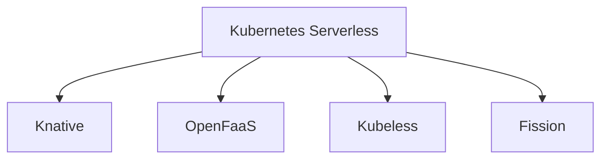

# Kubernetes Serverless

## Introduction

Serverless computing represents a cloud execution model where the cloud provider dynamically manages the allocation and provisioning of servers. A serverless architecture lets developers build and run applications without thinking about servers, focusing solely on individual functions in their application code.

Kubernetes, being the leading container orchestration platform, also offers serverless capabilities through various projects and frameworks. This guide introduces you to the concept of Kubernetes Serverless and shows you how to implement serverless architectures on your Kubernetes clusters.

## What is Kubernetes Serverless?

Serverless on Kubernetes combines the benefits of container orchestration with the simplicity of serverless computing:

- **Event-driven execution**: Functions run only in response to events
- **Auto-scaling**: Automatic scaling from zero to meet demand
- **Reduced operational overhead**: No need to manage servers
- **Pay-for-use**: Resources are consumed only when code executes

## Serverless Frameworks for Kubernetes

Let's explore the most popular frameworks that enable serverless capabilities on Kubernetes:



### Knative

Knative is Google's serverless computing implementation for Kubernetes. It consists of two main components:

1. **Knative Serving**: Deploys and automatically scales your serverless workloads
2. **Knative Eventing**: Connects event sources with services

#### Installing Knative Serving

```bash
# Install Knative CRDs
kubectl apply -f https://github.com/knative/serving/releases/download/knative-v1.10.0/serving-crds.yaml

# Install Knative Serving core components
kubectl apply -f https://github.com/knative/serving/releases/download/knative-v1.10.0/serving-core.yaml

# Install a networking layer (Kourier is the simplest)
kubectl apply -f https://github.com/knative/net-kourier/releases/download/knative-v1.10.0/kourier.yaml

# Configure Knative to use Kourier
kubectl patch configmap/config-network \
  --namespace knative-serving \
  --type merge \
  --patch '{"data":{"ingress.class":"kourier.ingress.networking.knative.dev"}}'
```

#### Creating Your First Knative Service

Save the following YAML to a file named `hello-world.yaml`:

```yaml
apiVersion: serving.knative.dev/v1
kind: Service
metadata:
  name: hello-world
  namespace: default
spec:
  template:
    spec:
      containers:
        - image: gcr.io/knative-samples/helloworld-go
          env:
            - name: TARGET
              value: "Kubernetes Serverless Beginner"
```

Apply it to your cluster:

```bash
kubectl apply -f hello-world.yaml
```

After a few moments, check your service:

```bash
kubectl get ksvc hello-world
```

Output:
```
NAME          URL                                         LATESTCREATED       LATESTREADY         READY   REASON
hello-world   http://hello-world.default.example.com      hello-world-00001   hello-world-00001   True
```

### OpenFaaS

OpenFaaS is a framework for building serverless functions with Docker and Kubernetes, featuring auto-scaling, metrics, and a user-friendly UI.

#### Installing OpenFaaS

```bash
# Add the OpenFaaS helm repository
helm repo add openfaas https://openfaas.github.io/faas-netes/

# Create the namespaces
kubectl apply -f https://raw.githubusercontent.com/openfaas/faas-netes/master/namespaces.yml

# Install OpenFaaS
helm upgrade --install openfaas openfaas/openfaas \
    --namespace openfaas \
    --set functionNamespace=openfaas-fn \
    --set serviceType=LoadBalancer
```

#### Creating a Function with OpenFaaS

First, install the OpenFaaS CLI:

```bash
# On macOS
brew install faas-cli

# On Linux
curl -sL https://cli.openfaas.com | sudo sh
```

Log in to your OpenFaaS gateway:

```bash
export OPENFAAS_URL=http://127.0.0.1:8080  # Adjust as needed
password=$(kubectl get secret -n openfaas basic-auth -o jsonpath="{.data.basic-auth-password}" | base64 --decode)
echo $password | faas-cli login --username admin --password-stdin
```

Create a new function:

```bash
faas-cli new --lang python3 hello-openfaas
```

This creates a directory structure:

```
└── hello-openfaas
    ├── hello-openfaas.yml
    └── handler.py
```

Edit the `handler.py` file:

```python
def handle(req):
    """handle a request to the function
    Args:
        req (str): request body
    """
    return f"Hello from OpenFaaS! You said: {req}"
```

Build, push, and deploy the function:

```bash
faas-cli up -f hello-openfaas.yml
```

Once deployed, test the function:

```bash
echo "Kubernetes Serverless" | faas-cli invoke hello-openfaas
```

Output:
```
Hello from OpenFaaS! You said: Kubernetes Serverless
```

### Kubeless

Kubeless is a Kubernetes-native serverless framework that leverages Custom Resource Definitions to create functions.

#### Installing Kubeless

```bash
# Create kubeless namespace
kubectl create namespace kubeless

# Install Kubeless
export RELEASE=$(curl -s https://api.github.com/repos/kubeless/kubeless/releases/latest | grep tag_name | cut -d '"' -f 4)
kubectl create -f https://github.com/kubeless/kubeless/releases/download/$RELEASE/kubeless-$RELEASE.yaml
```

#### Creating a Python Function with Kubeless

Save the following code to a file named `hello.py`:

```python
def hello(event, context):
    print(event)
    return "Hello " + event['data']
```

Deploy the function:

```bash
# Install Kubeless CLI
# On macOS
brew install kubeless

# On Linux
export OS=$(uname -s| tr '[:upper:]' '[:lower:]')
curl -OL https://github.com/kubeless/kubeless/releases/download/$RELEASE/kubeless_$OS-amd64.zip
unzip kubeless_$OS-amd64.zip
sudo mv bundles/kubeless_$OS-amd64/kubeless /usr/local/bin/

# Deploy the function
kubeless function deploy hello --runtime python3.9 \
                              --from-file hello.py \
                              --handler hello.hello
```

Call the function:

```bash
kubeless function call hello --data "Kubeless on Kubernetes"
```

Output:
```
Hello Kubeless on Kubernetes
```

## Practical Example: Building a Serverless Image Processing Pipeline

Let's create a practical example using Knative to build an image processing service that resizes uploaded images.

### Step 1: Create the Image Processing Service

Create a file named `image-processor.yaml`:

```yaml
apiVersion: serving.knative.dev/v1
kind: Service
metadata:
  name: image-processor
spec:
  template:
    spec:
      containers:
      - image: docker.io/javaexpert/image-processor:v1
        ports:
        - containerPort: 8080
        env:
        - name: STORAGE_BUCKET
          value: "images-bucket"
```

Apply the configuration:

```bash
kubectl apply -f image-processor.yaml
```

### Step 2: Set up an Event Source

Create a file named `image-event-source.yaml`:

```yaml
apiVersion: sources.knative.dev/v1
kind: SinkBinding
metadata:
  name: image-upload-event
spec:
  subject:
    apiVersion: apps/v1
    kind: Deployment
    name: image-upload-monitor
  sink:
    ref:
      apiVersion: serving.knative.dev/v1
      kind: Service
      name: image-processor
```

Apply the configuration:

```bash
kubectl apply -f image-event-source.yaml
```

### Step 3: Test the Pipeline

Upload an image to your storage bucket, and the serverless function will automatically process it, scaling up as needed and scaling down to zero when idle.

## Benefits of Kubernetes Serverless

1. **Efficient Resource Utilization**: Applications scale to zero when not in use
2. **Developer Productivity**: Focus on code, not infrastructure
3. **Cost Optimization**: Pay only for compute resources used during execution
4. **Scalability**: Automatic scaling based on demand
5. **Consistency**: Same Kubernetes environment for all workloads

## Challenges and Considerations

1. **Cold Start Delays**: Initial request may experience latency
2. **Stateless Design**: Functions should be designed to be stateless
3. **Monitoring Complexity**: Observability can be more complex
4. **Resource Limits**: Need proper configuration to avoid resource exhaustion
5. **Learning Curve**: Requires understanding Kubernetes concepts

## Summary

Kubernetes Serverless combines the powerful orchestration capabilities of Kubernetes with the simplicity and efficiency of the serverless paradigm. We've explored several frameworks (Knative, OpenFaaS, and Kubeless) that enable serverless functionality in Kubernetes environments.

For beginners, starting with a managed serverless Kubernetes offering like Google Cloud Run (based on Knative) or using OpenFaaS for its simplicity is recommended. As you grow more comfortable, you can explore more complex configurations and advanced use cases.

## Additional Resources

- [Knative Official Documentation](https://knative.dev/docs/)
- [OpenFaaS Workshop](https://github.com/openfaas/workshop)
- [Kubeless Documentation](https://kubeless.io/docs/)
- [CNCF Serverless Landscape](https://landscape.cncf.io/serverless)

## Exercises

1. Install Knative on a local Kubernetes cluster using Minikube or Kind
2. Create a simple "Hello World" function using one of the frameworks
3. Build a webhook handler that processes GitHub events
4. Implement a serverless API with multiple endpoints
5. Create a function that connects to a database for a complete backend service