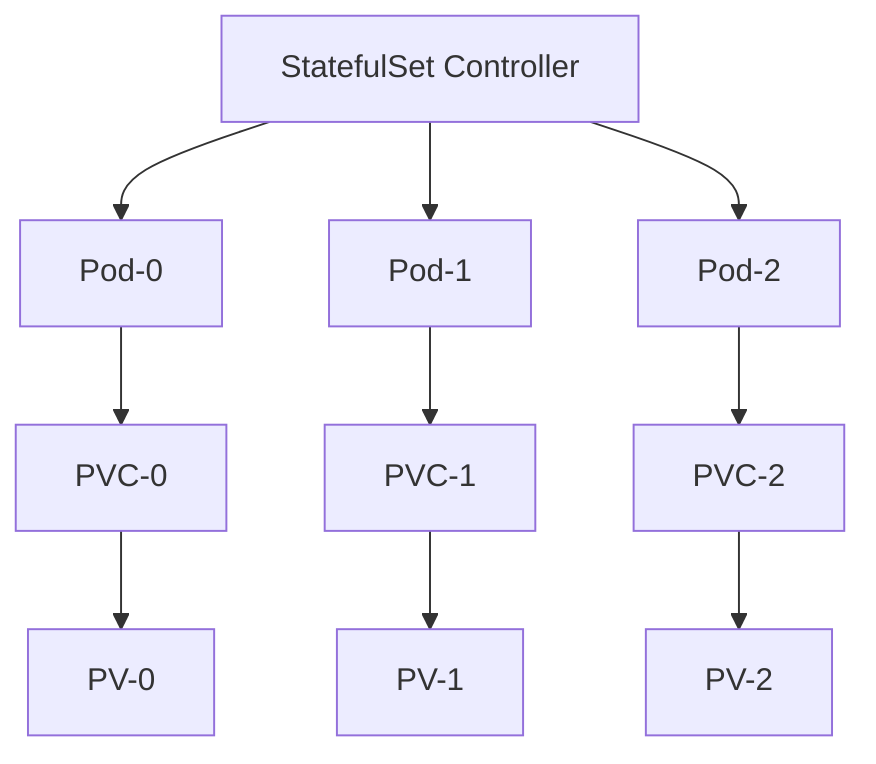
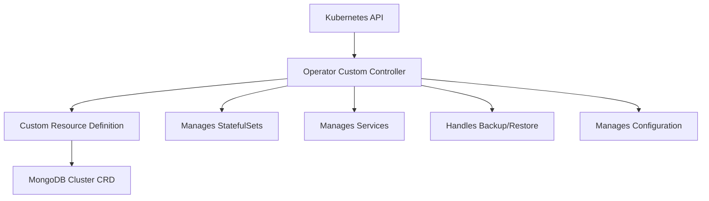

# Kubernetes Stateful Applications

## Introduction

When working with Kubernetes, you'll encounter two main types of applications: stateless and stateful. While stateless applications can be easily scaled (think web servers where each request is independent), stateful applications present unique challenges because they maintain data that must persist across restarts, scaling events, and even node failures.

In this tutorial, we'll explore how Kubernetes handles stateful applications using specialized resources like StatefulSets, PersistentVolumes, and more. We'll build a practical example that helps you understand the concepts thoroughly.

## Prerequisites

Before diving in, you should have:
- Basic knowledge of Kubernetes concepts (Pods, Deployments, Services)
- A running Kubernetes cluster (local like Minikube or remote)
- `kubectl` command-line tool installed and configured

## Understanding Stateful vs. Stateless Applications

Let's clarify the fundamental difference:

| Stateless Applications             | Stateful Applications            |
|------------------------------------|----------------------------------|
| No persistent data needed          | Maintain critical data           |
| Any replica can handle any request | Replicas are not interchangeable |
| Easy to scale horizontally         | Require careful orchestration    |
| Example: Web frontend              | Example: Databases, queues       |

## Why Standard Deployments Aren't Enough

A standard Kubernetes Deployment treats all pods as identical and interchangeable. For stateful applications, this approach falls short because:

1. Pods need stable, persistent storage
2. Pods need stable, predictable network identities
3. Ordered deployment and scaling is often required
4. Graceful deletion and termination is essential

This is where **StatefulSets** come into play.

## StatefulSets: The Backbone of Stateful Applications

StatefulSets are a Kubernetes workload API object used to manage stateful applications. They provide:

- Stable, unique network identifiers
- Stable, persistent storage
- Ordered, graceful deployment and scaling
- Ordered, automated rolling updates

### How StatefulSets Work



Each pod in a StatefulSet receives:
- A predictable name (`app-0`, `app-1`, `app-2`, etc.)
- A stable hostname with the same pattern
- Dedicated persistent storage that survives pod restarts

## Building a Stateful Application: MongoDB Replica Set

Let's create a MongoDB replica set using StatefulSets to demonstrate these concepts in action.

### Step 1: Create a Headless Service

First, we need a headless service to provide network identity to our StatefulSet pods:

```yaml
apiVersion: v1
kind: Service
metadata:
  name: mongodb-service
  labels:
    app: mongodb
spec:
  ports:
  - port: 27017
    targetPort: 27017
  clusterIP: None # This makes it a headless service
  selector:
    app: mongodb
```

Notice the `clusterIP: None` - this creates a headless service that allows direct DNS addressing of each pod.

### Step 2: Create a StatefulSet for MongoDB

```yaml
apiVersion: apps/v1
kind: StatefulSet
metadata:
  name: mongodb
spec:
  serviceName: "mongodb-service"
  replicas: 3
  selector:
    matchLabels:
      app: mongodb
  template:
    metadata:
      labels:
        app: mongodb
    spec:
      containers:
      - name: mongodb
        image: mongo:4.4
        ports:
        - containerPort: 27017
          name: mongodb
        volumeMounts:
        - name: mongodb-data
          mountPath: /data/db
        env:
        - name: MONGO_INITDB_ROOT_USERNAME
          value: admin
        - name: MONGO_INITDB_ROOT_PASSWORD
          value: password
  volumeClaimTemplates:
  - metadata:
      name: mongodb-data
    spec:
      accessModes: [ "ReadWriteOnce" ]
      resources:
        requests:
          storage: 1Gi
```

Key components to note:
- **serviceName**: References our headless service
- **replicas**: Defines how many pods to create (3 for a proper MongoDB replica set)
- **volumeClaimTemplates**: Automatically creates persistent volume claims for each pod

### Step 3: Apply the Configuration

Run these commands to apply your configuration:

```bash
kubectl apply -f mongodb-service.yaml
kubectl apply -f mongodb-statefulset.yaml
```

After applying, you'll see three pods created in sequence:
- `mongodb-0`
- `mongodb-1`
- `mongodb-2`

Each with its own dedicated PVC named `mongodb-data-mongodb-0`, `mongodb-data-mongodb-1`, etc.

### Step 4: Configure the MongoDB Replica Set

Let's connect to the first pod and initialize the replica set:

```bash
kubectl exec -it mongodb-0 -- mongosh --username admin --password password
```

Inside the mongo shell, initialize the replica set:

```javascript
rs.initiate({
  _id: "rs0",
  members: [
    { _id: 0, host: "mongodb-0.mongodb-service:27017" },
    { _id: 1, host: "mongodb-1.mongodb-service:27017" },
    { _id: 2, host: "mongodb-2.mongodb-service:27017" }
  ]
})
```

Notice how we're using the pod's stable network identity: `podname.servicename`.

### Step 5: Test Persistence and Failover

Let's insert some data and then delete a pod to see if the data persists:

```javascript
// Inside mongodb-0
use testdb
db.testcollection.insertOne({ message: "This is a persistent message" })
db.testcollection.find()
```

Now let's delete a pod and see what happens:

```bash
kubectl delete pod mongodb-0
```

Kubernetes will recreate the pod with the same name and reattach the same persistent storage. When the pod is back:

```bash
kubectl exec -it mongodb-0 -- mongosh --username admin --password password
```

```javascript
use testdb
db.testcollection.find()
```

You should see your data is still there!

## Understanding Scaling Behavior in StatefulSets

StatefulSets scale differently than Deployments:

1. When scaling up, pods are created sequentially, from 0 to N-1
2. When scaling down, pods are removed in reverse order, from N-1 to 0

This predictable behavior is crucial for applications like databases where initialization order matters.

## Updating a StatefulSet

StatefulSets support different update strategies:

```yaml
spec:
  updateStrategy:
    type: RollingUpdate  # or OnDelete
    rollingUpdate:
      partition: 0
```

- **RollingUpdate**: Updates pods one at a time, in reverse order
- **OnDelete**: Updates only when pods are manually deleted
- **partition**: Only updates pods with an ordinal >= partition value

## Advanced StatefulSet Patterns

### Persistent Volumes with Different Storage Classes

For production environments, you might want different storage class options:

```yaml
volumeClaimTemplates:
- metadata:
    name: mongodb-data
  spec:
    accessModes: [ "ReadWriteOnce" ]
    storageClassName: "fast-ssd"  # Specify storage class
    resources:
      requests:
        storage: 10Gi
```

### Pod Disruption Budgets

To ensure high availability during voluntary disruptions:

```yaml
apiVersion: policy/v1
kind: PodDisruptionBudget
metadata:
  name: mongodb-pdb
spec:
  minAvailable: 2
  selector:
    matchLabels:
      app: mongodb
```

This ensures at least 2 pods remain available during operations like node drains.

## Common Challenges with Stateful Applications

### 1. Backup and Restore

For stateful applications, you'll need a backup strategy. For MongoDB, you might use:

```bash
# Backup
kubectl exec mongodb-0 -- sh -c 'mongodump --username admin --password password --archive=/tmp/backup.gz --gzip' 
kubectl cp mongodb-0:/tmp/backup.gz ./backup.gz

# Restore
kubectl cp ./backup.gz mongodb-0:/tmp/backup.gz
kubectl exec mongodb-0 -- sh -c 'mongorestore --username admin --password password --archive=/tmp/backup.gz --gzip'
```

### 2. Handling Node Failures

When a node fails:
- The StatefulSet controller ensures the pod is rescheduled on another node
- The same PVC is reattached
- If using network storage, the pod can access its data immediately
- If using local storage, you may need to implement replication at the application level

### 3. Scaling Limitations

Some stateful applications have inherent scaling limitations:
- Adding/removing database replicas often requires reconfiguration
- Some databases have a maximum number of recommended replicas

## Real-World Use Case: Deploying a WordPress Blog with MySQL

Let's implement a complete example with WordPress (stateless frontend) and MySQL (stateful database):

### MySQL StatefulSet

```yaml
apiVersion: v1
kind: Service
metadata:
  name: mysql
spec:
  ports:
  - port: 3306
  clusterIP: None
  selector:
    app: mysql
---
apiVersion: apps/v1
kind: StatefulSet
metadata:
  name: mysql
spec:
  selector:
    matchLabels:
      app: mysql
  serviceName: mysql
  replicas: 1
  template:
    metadata:
      labels:
        app: mysql
    spec:
      containers:
      - name: mysql
        image: mysql:5.7
        env:
        - name: MYSQL_ROOT_PASSWORD
          value: rootpassword
        - name: MYSQL_DATABASE
          value: wordpress
        - name: MYSQL_USER
          value: wordpress
        - name: MYSQL_PASSWORD
          value: wordpress
        ports:
        - containerPort: 3306
          name: mysql
        volumeMounts:
        - name: mysql-data
          mountPath: /var/lib/mysql
  volumeClaimTemplates:
  - metadata:
      name: mysql-data
    spec:
      accessModes: [ "ReadWriteOnce" ]
      resources:
        requests:
          storage: 1Gi
```

### WordPress Deployment (Stateless)

```yaml
apiVersion: v1
kind: Service
metadata:
  name: wordpress
spec:
  ports:
  - port: 80
  selector:
    app: wordpress
  type: LoadBalancer
---
apiVersion: apps/v1
kind: Deployment
metadata:
  name: wordpress
spec:
  selector:
    matchLabels:
      app: wordpress
  strategy:
    type: Recreate
  template:
    metadata:
      labels:
        app: wordpress
    spec:
      containers:
      - name: wordpress
        image: wordpress:latest
        env:
        - name: WORDPRESS_DB_HOST
          value: mysql-0.mysql
        - name: WORDPRESS_DB_USER
          value: wordpress
        - name: WORDPRESS_DB_PASSWORD
          value: wordpress
        - name: WORDPRESS_DB_NAME
          value: wordpress
        ports:
        - containerPort: 80
          name: wordpress
```

Apply these files and you'll have a WordPress site with persistent MySQL storage.

## Best Practices for Stateful Applications

1. **Use anti-affinity rules** to spread replicas across nodes:
   ```yaml
   affinity:
     podAntiAffinity:
       requiredDuringSchedulingIgnoredDuringExecution:
       - labelSelector:
           matchExpressions:
           - key: app
             operator: In
             values:
             - mongodb
         topologyKey: "kubernetes.io/hostname"
   ```

2. **Implement proper health checks** specific to your application:
   ```yaml
   livenessProbe:
     exec:
       command:
       - mongo
       - --eval
       - "db.adminCommand('ping')"
     initialDelaySeconds: 30
     periodSeconds: 10
   readinessProbe:
     exec:
       command:
       - mongo
       - --eval
       - "db.adminCommand('ping')"
     initialDelaySeconds: 5
     periodSeconds: 10
   ```

3. **Plan for disaster recovery** with regular backups

4. **Consider using operators** for complex stateful applications:
   - Many databases have specialized Kubernetes operators
   - Examples include MongoDB Operator, MySQL Operator, etc.
   - These handle complex operations like backup, scaling, and failover

## Operator Pattern for Stateful Applications

For complex stateful applications, the Operator pattern extends Kubernetes with custom controllers that understand application-specific operational tasks.



For example, instead of directly managing StatefulSets, you might use:

```yaml
apiVersion: mongodb.com/v1
kind: MongoDBCluster
metadata:
  name: my-mongodb
spec:
  members: 3
  version: 4.4.0
  storage:
    size: 10Gi
    storageClass: standard
```

## Summary

In this tutorial, we've covered:

1. The fundamental differences between stateless and stateful applications
2. How StatefulSets provide stable identities and storage for stateful workloads
3. Implementing a MongoDB replica set using StatefulSets
4. Handling common challenges with stateful applications
5. A real-world example with WordPress and MySQL
6. Best practices for running stateful applications in production
7. The Operator pattern for complex stateful applications

Kubernetes provides powerful primitives for running stateful applications, but they require more careful planning than stateless workloads. By understanding the concepts in this tutorial, you'll be well-prepared to run your own stateful applications in production.

## Exercises

1. Deploy the MongoDB replica set described in this tutorial and practice scaling it up and down.
2. Implement a backup and restore process for your MongoDB deployment.
3. Convert the WordPress example to use a StatefulSet instead of a Deployment. What changes would you need to make?
4. Research and deploy a database operator (e.g., MongoDB Enterprise Operator) and compare the experience with managing StatefulSets directly.
5. Create a StatefulSet for a different database of your choice (PostgreSQL, Redis, etc.)

## Additional Resources

- [Kubernetes Documentation on StatefulSets](https://kubernetes.io/docs/concepts/workloads/controllers/statefulset/)
- [Kubernetes Storage Documentation](https://kubernetes.io/docs/concepts/storage/persistent-volumes/)
- [Database Operators on OperatorHub.io](https://operatorhub.io/)
- [Kubernetes Patterns: The Operator Pattern](https://kubernetes.io/docs/concepts/extend-kubernetes/operator/)
- [StatefulSet Tutorials in the Kubernetes Blog](https://kubernetes.io/blog/)