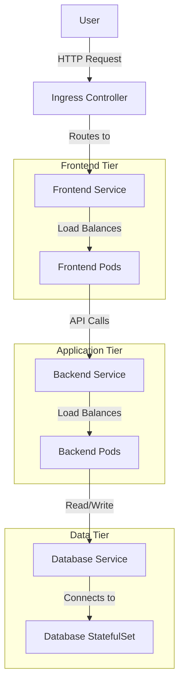

# Kubernetes Multi-Tier Application

## Introduction

A multi-tier application divides functionality into separate layers (tiers), each with its own responsibilities. In traditional application development, you might have heard of the three-tier architecture: presentation layer (UI), application layer (business logic), and data layer (database). 

Kubernetes excels at orchestrating these complex, multi-component applications. By leveraging Kubernetes' ability to manage containerized workloads, you can deploy, scale, and maintain each tier independently while ensuring they work together seamlessly.

In this tutorial, we'll build a practical multi-tier application on Kubernetes consisting of:
- A frontend web application
- A backend API service
- A database for persistence

## Why Use Multi-Tier Architecture in Kubernetes?

Multi-tier applications in Kubernetes offer several advantages:

1. **Scalability**: Scale each tier independently based on its resource needs
2. **Maintainability**: Update components without affecting the entire application
3. **Resilience**: Isolate failures to prevent system-wide outages
4. **Resource Optimization**: Allocate resources according to each tier's requirements

## Architecture Overview

Here's a diagram showing the architecture of our multi-tier application:



## Prerequisites

Before we start, make sure you have:
- A running Kubernetes cluster (local like Minikube or remote)
- `kubectl` CLI tool installed and configured
- Basic understanding of Kubernetes objects (Pods, Services, Deployments)
- Docker installed (for building container images)

## Part 1: Setting Up the Database Tier

Let's start with the database tier. We'll use MongoDB as our database and deploy it using a StatefulSet for data persistence.

### Step 1: Create a Persistent Volume Claim

First, we need to create storage for our database:

```yaml
apiVersion: v1
kind: PersistentVolumeClaim
metadata:
  name: mongo-pvc
spec:
  accessModes:
    - ReadWriteOnce
  resources:
    requests:
      storage: 1Gi
```

Save this as `mongo-pvc.yaml` and apply it:

```bash
kubectl apply -f mongo-pvc.yaml
```

### Step 2: Create a ConfigMap for MongoDB Configuration

```yaml
apiVersion: v1
kind: ConfigMap
metadata:
  name: mongo-config
data:
  mongo.conf: |
    storage:
      dbPath: /data/db
```

Save as `mongo-config.yaml` and apply:

```bash
kubectl apply -f mongo-config.yaml
```

### Step 3: Deploy MongoDB using a StatefulSet

```yaml
apiVersion: apps/v1
kind: StatefulSet
metadata:
  name: mongo
spec:
  serviceName: "mongo"
  replicas: 1
  selector:
    matchLabels:
      app: mongo
  template:
    metadata:
      labels:
        app: mongo
    spec:
      containers:
      - name: mongo
        image: mongo:5.0
        ports:
        - containerPort: 27017
          name: mongo
        volumeMounts:
        - name: mongo-data
          mountPath: /data/db
        - name: mongo-config
          mountPath: /config
        env:
        - name: MONGO_INITDB_ROOT_USERNAME
          valueFrom:
            secretKeyRef:
              name: mongo-secret
              key: username
        - name: MONGO_INITDB_ROOT_PASSWORD
          valueFrom:
            secretKeyRef:
              name: mongo-secret
              key: password
      volumes:
      - name: mongo-config
        configMap:
          name: mongo-config
  volumeClaimTemplates:
  - metadata:
      name: mongo-data
    spec:
      accessModes: [ "ReadWriteOnce" ]
      resources:
        requests:
          storage: 1Gi
```

### Step 4: Create a Secret for MongoDB Credentials

```yaml
apiVersion: v1
kind: Secret
metadata:
  name: mongo-secret
type: Opaque
data:
  username: YWRtaW4=  # 'admin' in base64
  password: cGFzc3dvcmQxMjM=  # 'password123' in base64
```

Save as `mongo-secret.yaml` and apply:

```bash
kubectl apply -f mongo-secret.yaml
```

**Note:** In a production environment, never commit secrets to version control. Use a secret management solution like Kubernetes Secrets, HashiCorp Vault, or cloud provider secret managers.

### Step 5: Create a Service for MongoDB

```yaml
apiVersion: v1
kind: Service
metadata:
  name: mongo
spec:
  selector:
    app: mongo
  ports:
  - port: 27017
    targetPort: 27017
  clusterIP: None  # Headless service for StatefulSet
```

Save as `mongo-service.yaml` and apply:

```bash
kubectl apply -f mongo-service.yaml
```

## Part 2: Creating the Backend API Tier

Now let's create our backend API service using Node.js. This service will handle business logic and database interactions.

### Step 1: Create a Simple Node.js Backend

Here's a simple Express.js application that connects to MongoDB and provides API endpoints:

```javascript
// app.js
const express = require('express');
const mongoose = require('mongoose');
const cors = require('cors');

const app = express();
const port = process.env.PORT || 3000;

// Middleware
app.use(cors());
app.use(express.json());

// MongoDB connection
const mongoURI = `mongodb://${process.env.MONGO_USERNAME}:${process.env.MONGO_PASSWORD}@${process.env.MONGO_HOST}:${process.env.MONGO_PORT}/taskdb?authSource=admin`;

mongoose.connect(mongoURI)
  .then(() => console.log('Connected to MongoDB'))
  .catch(err => console.error('MongoDB connection error:', err));

// Define Task schema
const taskSchema = new mongoose.Schema({
  title: String,
  description: String,
  completed: Boolean,
  createdAt: { type: Date, default: Date.now }
});

const Task = mongoose.model('Task', taskSchema);

// API Routes
app.get('/api/tasks', async (req, res) => {
  try {
    const tasks = await Task.find();
    res.json(tasks);
  } catch (err) {
    res.status(500).json({ error: err.message });
  }
});

app.post('/api/tasks', async (req, res) => {
  try {
    const task = new Task(req.body);
    await task.save();
    res.status(201).json(task);
  } catch (err) {
    res.status(400).json({ error: err.message });
  }
});

app.get('/api/health', (req, res) => {
  res.status(200).json({ status: 'ok' });
});

// Start server
app.listen(port, () => {
  console.log(`Backend API running on port ${port}`);
});
```

### Step 2: Create a Dockerfile for the Backend

```dockerfile
FROM node:16-alpine

WORKDIR /app

COPY package*.json ./
RUN npm install

COPY . .

EXPOSE 3000

CMD ["node", "app.js"]
```

### Step 3: Build and Push the Backend Image

```bash
docker build -t your-registry/task-backend:v1 .
docker push your-registry/task-backend:v1
```

### Step 4: Create a Deployment for the Backend

```yaml
apiVersion: apps/v1
kind: Deployment
metadata:
  name: backend
spec:
  replicas: 2
  selector:
    matchLabels:
      app: backend
  template:
    metadata:
      labels:
        app: backend
    spec:
      containers:
      - name: backend
        image: your-registry/task-backend:v1
        ports:
        - containerPort: 3000
        env:
        - name: MONGO_USERNAME
          valueFrom:
            secretKeyRef:
              name: mongo-secret
              key: username
        - name: MONGO_PASSWORD
          valueFrom:
            secretKeyRef:
              name: mongo-secret
              key: password
        - name: MONGO_HOST
          value: "mongo"
        - name: MONGO_PORT
          value: "27017"
        readinessProbe:
          httpGet:
            path: /api/health
            port: 3000
          initialDelaySeconds: 5
          periodSeconds: 10
        resources:
          limits:
            cpu: "0.5"
            memory: "512Mi"
          requests:
            cpu: "0.2"
            memory: "256Mi"
```

Save as `backend-deployment.yaml` and apply:

```bash
kubectl apply -f backend-deployment.yaml
```

### Step 5: Create a Service for the Backend

```yaml
apiVersion: v1
kind: Service
metadata:
  name: backend
spec:
  selector:
    app: backend
  ports:
  - port: 80
    targetPort: 3000
  type: ClusterIP
```

Save as `backend-service.yaml` and apply:

```bash
kubectl apply -f backend-service.yaml
```

## Part 3: Building the Frontend Tier

Finally, let's create a React frontend that connects to our backend API.

### Step 1: Create a Simple React Frontend

Here's a basic React application that interacts with our backend:

```jsx
// src/App.js
import React, { useState, useEffect } from 'react';
import './App.css';

function App() {
  const [tasks, setTasks] = useState([]);
  const [newTask, setNewTask] = useState({ title: '', description: '' });
  
  const API_URL = process.env.REACT_APP_API_URL || 'http://localhost:80';

  useEffect(() => {
    fetchTasks();
  }, []);

  const fetchTasks = async () => {
    try {
      const response = await fetch(`${API_URL}/api/tasks`);
      const data = await response.json();
      setTasks(data);
    } catch (error) {
      console.error('Error fetching tasks:', error);
    }
  };

  const handleSubmit = async (e) => {
    e.preventDefault();
    try {
      await fetch(`${API_URL}/api/tasks`, {
        method: 'POST',
        headers: {
          'Content-Type': 'application/json',
        },
        body: JSON.stringify(newTask),
      });
      setNewTask({ title: '', description: '' });
      fetchTasks();
    } catch (error) {
      console.error('Error creating task:', error);
    }
  };

  return (
    <div className="App">
      <header className="App-header">
        <h1>Task Manager</h1>
      </header>
      <main>
        <form onSubmit={handleSubmit}>
          <h2>Add New Task</h2>
          <div>
            <input
              type="text"
              placeholder="Task title"
              value={newTask.title}
              onChange={(e) => setNewTask({ ...newTask, title: e.target.value })}
              required
            />
          </div>
          <div>
            <textarea
              placeholder="Task description"
              value={newTask.description}
              onChange={(e) => setNewTask({ ...newTask, description: e.target.value })}
            />
          </div>
          <button type="submit">Add Task</button>
        </form>

        <div className="tasks">
          <h2>Task List</h2>
          {tasks.length === 0 ? (
            <p>No tasks found</p>
          ) : (
            <ul>
              {tasks.map((task) => (
                <li key={task._id}>
                  <h3>{task.title}</h3>
                  <p>{task.description}</p>
                  <small>Created: {new Date(task.createdAt).toLocaleString()}</small>
                </li>
              ))}
            </ul>
          )}
        </div>
      </main>
    </div>
  );
}

export default App;
```

### Step 2: Create a Dockerfile for the Frontend

```dockerfile
FROM node:16-alpine as build

WORKDIR /app

COPY package*.json ./
RUN npm install

COPY . .
RUN npm run build

FROM nginx:alpine
COPY --from=build /app/build /usr/share/nginx/html
COPY nginx.conf /etc/nginx/conf.d/default.conf

EXPOSE 80

CMD ["nginx", "-g", "daemon off;"]
```

### Step 3: Create an nginx.conf for the Frontend

```nginx
server {
    listen 80;
    server_name _;

    root /usr/share/nginx/html;
    index index.html;

    location / {
        try_files $uri $uri/ /index.html;
    }
}
```

### Step 4: Build and Push the Frontend Image

```bash
docker build -t your-registry/task-frontend:v1 .
docker push your-registry/task-frontend:v1
```

### Step 5: Create a ConfigMap for Environment Variables

```yaml
apiVersion: v1
kind: ConfigMap
metadata:
  name: frontend-config
data:
  REACT_APP_API_URL: "http://backend"
```

Save as `frontend-config.yaml` and apply:

```bash
kubectl apply -f frontend-config.yaml
```

### Step 6: Create a Deployment for the Frontend

```yaml
apiVersion: apps/v1
kind: Deployment
metadata:
  name: frontend
spec:
  replicas: 2
  selector:
    matchLabels:
      app: frontend
  template:
    metadata:
      labels:
        app: frontend
    spec:
      containers:
      - name: frontend
        image: your-registry/task-frontend:v1
        ports:
        - containerPort: 80
        envFrom:
        - configMapRef:
            name: frontend-config
        readinessProbe:
          httpGet:
            path: /
            port: 80
          initialDelaySeconds: 10
          periodSeconds: 5
        resources:
          limits:
            cpu: "0.3"
            memory: "256Mi"
          requests:
            cpu: "0.1"
            memory: "128Mi"
```

Save as `frontend-deployment.yaml` and apply:

```bash
kubectl apply -f frontend-deployment.yaml
```

### Step 7: Create a Service for the Frontend

```yaml
apiVersion: v1
kind: Service
metadata:
  name: frontend
spec:
  selector:
    app: frontend
  ports:
  - port: 80
    targetPort: 80
  type: LoadBalancer  # Use NodePort for local development
```

Save as `frontend-service.yaml` and apply:

```bash
kubectl apply -f frontend-service.yaml
```

## Part 4: Creating an Ingress for External Access

If your cluster has an Ingress controller, you can set up an Ingress resource to manage external access:

```yaml
apiVersion: networking.k8s.io/v1
kind: Ingress
metadata:
  name: task-app-ingress
  annotations:
    nginx.ingress.kubernetes.io/rewrite-target: /
spec:
  rules:
  - host: taskapp.example.com  # Replace with your domain
    http:
      paths:
      - path: /
        pathType: Prefix
        backend:
          service:
            name: frontend
            port:
              number: 80
      - path: /api
        pathType: Prefix
        backend:
          service:
            name: backend
            port:
              number: 80
```

Save as `ingress.yaml` and apply:

```bash
kubectl apply -f ingress.yaml
```

## Verification and Monitoring

Let's verify our application is running correctly:

### Check Pod Status

```bash
kubectl get pods
```

Example output:
```
NAME                        READY   STATUS    RESTARTS   AGE
mongo-0                     1/1     Running   0          15m
backend-7c7b59f5c9-2hzxw    1/1     Running   0          10m
backend-7c7b59f5c9-p8t6k    1/1     Running   0          10m
frontend-6d9f8c8d77-xg5tq   1/1     Running   0          5m
frontend-6d9f8c8d77-zk7v2   1/1     Running   0          5m
```

### Check Services

```bash
kubectl get services
```

Example output:
```
NAME       TYPE           CLUSTER-IP       EXTERNAL-IP    PORT(S)        AGE
kubernetes ClusterIP      10.96.0.1        <none>         443/TCP        1h
mongo      ClusterIP      None             <none>         27017/TCP      15m
backend    ClusterIP      10.96.45.12      <none>         80/TCP         10m
frontend   LoadBalancer   10.96.101.56     192.168.49.2   80:30001/TCP   5m
```

### Check Logs

```bash
kubectl logs deployment/backend
kubectl logs deployment/frontend
```

## Best Practices for Multi-Tier Applications

When designing multi-tier applications in Kubernetes, consider these best practices:

1. **Use Namespaces**: Organize your application tiers into namespaces for better resource management.

```bash
kubectl create namespace taskapp
kubectl config set-context --current --namespace=taskapp
```

2. **Resource Limits**: Always define resource requests and limits for your containers.

3. **Health Checks**: Implement readiness and liveness probes for all containers.

4. **Horizontal Pod Autoscaler (HPA)**: Set up autoscaling for dynamic workloads:

```yaml
apiVersion: autoscaling/v2
kind: HorizontalPodAutoscaler
metadata:
  name: backend-hpa
spec:
  scaleTargetRef:
    apiVersion: apps/v1
    kind: Deployment
    name: backend
  minReplicas: 2
  maxReplicas: 10
  metrics:
  - type: Resource
    resource:
      name: cpu
      target:
        type: Utilization
        averageUtilization: 70
```

5. **ConfigMaps and Secrets**: Externalize configuration and sensitive data.

6. **Network Policies**: Restrict network traffic between tiers for security:

```yaml
apiVersion: networking.k8s.io/v1
kind: NetworkPolicy
metadata:
  name: backend-network-policy
spec:
  podSelector:
    matchLabels:
      app: backend
  ingress:
  - from:
    - podSelector:
        matchLabels:
          app: frontend
    ports:
    - protocol: TCP
      port: 3000
```

7. **Persistent Storage**: Use StatefulSets with PVCs for databases and stateful components.

8. **Service Mesh**: Consider a service mesh like Istio for complex microservice architectures.

## Troubleshooting Common Issues

### Connectivity Issues Between Tiers

If services can't communicate:

1. Check service DNS resolution:
```bash
kubectl exec -it <pod-name> -- nslookup backend
```

2. Verify network policies aren't blocking traffic:
```bash
kubectl describe networkpolicy
```

3. Check for service endpoint issues:
```bash
kubectl get endpoints
```

### Database Connection Problems

If the backend can't connect to MongoDB:

1. Verify MongoDB is running:
```bash
kubectl exec -it mongo-0 -- mongo --eval "db.adminCommand('ping')"
```

2. Check backend logs for connection errors:
```bash
kubectl logs deployment/backend | grep MongoDB
```

3. Ensure secrets are correctly mounted:
```bash
kubectl describe pod <backend-pod-name> | grep Environment
```

## Summary

In this tutorial, we've learned how to:

1. Design and implement a multi-tier application architecture in Kubernetes
2. Deploy a persistent database using StatefulSets
3. Create a scalable backend API service using Deployments
4. Build a frontend tier that communicates with the backend
5. Configure networking between tiers with Services and Ingress
6. Apply best practices for production-ready applications

By separating our application into distinct tiers, we've created a more maintainable, scalable, and resilient system. Each component can be updated, scaled, and managed independently while working together as a cohesive application.

## Exercises

1. Add a Redis cache tier between the backend and database to improve performance.
2. Implement CI/CD pipelines to automate the deployment of each tier.
3. Set up monitoring with Prometheus and Grafana to track the health and performance of each tier.
4. Add HTTPS support to the Ingress controller using cert-manager.
5. Create development, staging, and production namespaces with different resource allocations.

## Additional Resources

- [Kubernetes Documentation](https://kubernetes.io/docs/)
- [Microservices Patterns](https://microservices.io/patterns/microservices.html)
- [Twelve-Factor App Methodology](https://12factor.net/)
- [Kubernetes Patterns Book](https://www.oreilly.com/library/view/kubernetes-patterns/9781492050278/)
- [Container Security Best Practices](https://kubernetes.io/docs/concepts/security/overview/)