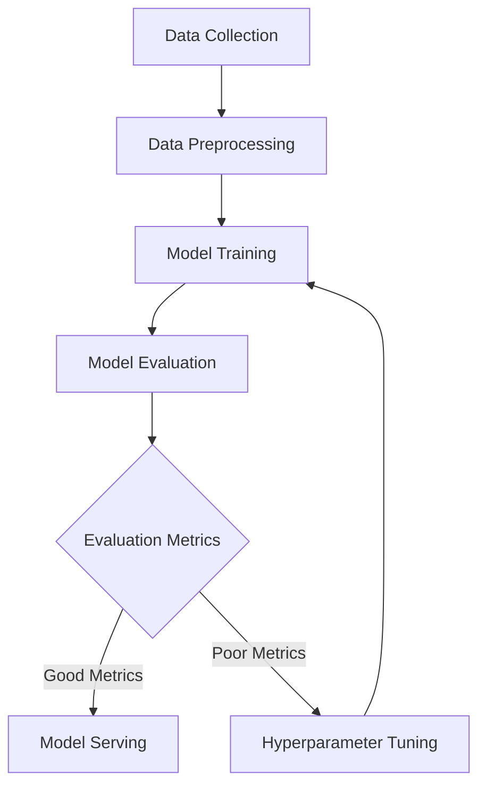

# Kubernetes Machine Learning

## Introduction

Machine Learning (ML) workloads present unique challenges for deployment and scaling. They often require specialized hardware like GPUs, have complex dependencies, and need efficient resource management. Kubernetes, a powerful container orchestration platform, provides excellent solutions for deploying and managing ML workloads at scale.

In this tutorial, we'll explore how to leverage Kubernetes for machine learning applications. You'll learn how to deploy ML models, manage GPU resources, scale training jobs, and implement end-to-end ML pipelines on Kubernetes.

## Why Kubernetes for Machine Learning?

Kubernetes offers several benefits for ML workloads:

1. **Resource Optimization** - Efficiently allocate CPUs, memory, and GPUs across your cluster
2. **Scalability** - Scale training jobs up or down based on demand
3. **Reproducibility** - Ensure consistent environments for training and inference
4. **Portability** - Run ML workloads across different environments (cloud, on-premise)
5. **Orchestration** - Manage the entire ML lifecycle from data preparation to model serving

## Prerequisites

Before we begin, you should have:
- Basic understanding of Kubernetes concepts (pods, deployments, services)
- Familiarity with machine learning concepts
- A Kubernetes cluster (local like Minikube or cloud-based)
- `kubectl` command-line tool installed

## Setting Up Your Environment

Let's start by creating a namespace for our ML workloads:

```bash
kubectl create namespace ml-workloads
kubectl config set-context --current --namespace=ml-workloads
```

## Deploying a Simple ML Model Server

First, let's deploy a simple ML model server using TensorFlow Serving. We'll create a deployment YAML file:

```yaml
apiVersion: apps/v1
kind: Deployment
metadata:
  name: tensorflow-serving
spec:
  replicas: 1
  selector:
    matchLabels:
      app: tensorflow-serving
  template:
    metadata:
      labels:
        app: tensorflow-serving
    spec:
      containers:
      - name: tensorflow-serving
        image: tensorflow/serving:latest
        ports:
        - containerPort: 8501
        env:
        - name: MODEL_NAME
          value: "mnist"
        volumeMounts:
        - name: model-storage
          mountPath: /models/mnist
      volumes:
      - name: model-storage
        emptyDir: {}
```

Apply this configuration:

```bash
kubectl apply -f tensorflow-serving.yaml
```

Now let's expose the service:

```yaml
apiVersion: v1
kind: Service
metadata:
  name: tensorflow-serving
spec:
  selector:
    app: tensorflow-serving
  ports:
  - port: 8501
    targetPort: 8501
  type: ClusterIP
```

Apply the service configuration:

```bash
kubectl apply -f tensorflow-serving-service.yaml
```

## GPU Support in Kubernetes

For ML workloads that require GPUs, Kubernetes offers GPU scheduling capabilities.

First, you need to install the NVIDIA device plugin (if using NVIDIA GPUs):

```bash
kubectl create -f https://raw.githubusercontent.com/NVIDIA/k8s-device-plugin/master/nvidia-device-plugin.yml
```

Now you can request GPU resources in your pod specifications:

```yaml
apiVersion: v1
kind: Pod
metadata:
  name: gpu-training-job
spec:
  containers:
  - name: tensorflow-gpu
    image: tensorflow/tensorflow:latest-gpu
    command: ["python", "/app/train.py"]
    resources:
      limits:
        nvidia.com/gpu: 1  # Request 1 GPU
    volumeMounts:
    - name: training-code
      mountPath: /app
  volumes:
  - name: training-code
    configMap:
      name: training-code
```

You would need to create a ConfigMap containing your training code:

```bash
kubectl create configmap training-code --from-file=train.py
```

Here's an example `train.py` file that uses TensorFlow with GPU:

```python
import tensorflow as tf
import time

print("TensorFlow version:", tf.__version__)
print("GPU available:", tf.config.list_physical_devices('GPU'))

# A simple model
model = tf.keras.Sequential([
    tf.keras.layers.Dense(128, activation='relu'),
    tf.keras.layers.Dense(10, activation='softmax')
])

# Train on MNIST dataset
mnist = tf.keras.datasets.mnist
(x_train, y_train), (x_test, y_test) = mnist.load_data()
x_train, x_test = x_train / 255.0, x_test / 255.0

start_time = time.time()
model.compile(optimizer='adam',
              loss='sparse_categorical_crossentropy',
              metrics=['accuracy'])
model.fit(x_train, y_train, epochs=5)
end_time = time.time()

print(f"Training completed in {end_time - start_time} seconds")
```

## Distributed Training with Kubernetes

Kubernetes makes it easy to run distributed training jobs. Let's look at an example using TensorFlow's distributed training:

```yaml
apiVersion: batch/v1
kind: Job
metadata:
  name: distributed-training
spec:
  completions: 1
  parallelism: 1
  template:
    spec:
      restartPolicy: Never
      containers:
      - name: tensorflow
        image: tensorflow/tensorflow:latest
        command:
        - "python"
        - "/app/distributed_train.py"
        env:
        - name: TF_CONFIG
          value: '{"cluster": {"worker": ["distributed-training-worker-0:2222", "distributed-training-worker-1:2222"]}, "task": {"type": "worker", "index": 0}}'
```

The key here is properly configuring the `TF_CONFIG` environment variable, which tells TensorFlow how to set up the distributed training cluster.

## Kubeflow: Machine Learning Toolkit for Kubernetes

For more complex ML workflows, Kubeflow is a dedicated project that makes deploying ML workflows on Kubernetes simple and scalable.

To deploy Kubeflow, you would typically use:

```bash
kfctl apply -f kfctl_k8s_istio.yaml
```

Kubeflow provides several components for ML workflows:

1. **Jupyter Notebooks** - Interactive development environments
2. **TensorFlow Training (TFJob)** - Custom resource for TensorFlow training
3. **PyTorch Training (PyTorchJob)** - Custom resource for PyTorch training
4. **Model Serving** - Deploy models with TensorFlow Serving, KFServing
5. **Pipelines** - Build and deploy ML workflows

Here's an example of a TFJob in Kubeflow:

```yaml
apiVersion: kubeflow.org/v1
kind: TFJob
metadata:
  name: mnist-training
spec:
  cleanPodPolicy: Running
  tfReplicaSpecs:
    Worker:
      replicas: 2
      restartPolicy: Never
      template:
        spec:
          containers:
          - name: tensorflow
            image: tensorflow/tensorflow:latest
            command:
            - "python"
            - "/app/distributed_train.py"
```

## Building an ML Pipeline with Kubernetes

Let's create a simple ML pipeline using Kubernetes native resources. Our pipeline will have:

1. Data preprocessing
2. Model training
3. Model evaluation
4. Model serving

We can implement this using Kubernetes Jobs in sequence:

```yaml
apiVersion: batch/v1
kind: Job
metadata:
  name: data-preprocessing
spec:
  template:
    spec:
      containers:
      - name: data-processor
        image: python:3.8
        command: ["python", "/scripts/preprocess.py"]
        volumeMounts:
        - name: ml-pipeline-scripts
          mountPath: /scripts
        - name: data-volume
          mountPath: /data
      restartPolicy: Never
      volumes:
      - name: ml-pipeline-scripts
        configMap:
          name: ml-pipeline-scripts
      - name: data-volume
        persistentVolumeClaim:
          claimName: ml-data-pvc
```

We would create similar jobs for training and evaluation, with dependencies managed through Job completion.

Let's visualize our ML pipeline:



## Advanced: Horizontal Pod Autoscaling for ML Inference

For ML inference services that need to scale based on traffic, we can use Horizontal Pod Autoscaling:

```yaml
apiVersion: autoscaling/v2
kind: HorizontalPodAutoscaler
metadata:
  name: model-server-hpa
spec:
  scaleTargetRef:
    apiVersion: apps/v1
    kind: Deployment
    name: tensorflow-serving
  minReplicas: 1
  maxReplicas: 10
  metrics:
  - type: Resource
    resource:
      name: cpu
      target:
        type: Utilization
        averageUtilization: 70
```

This HPA will scale our model server based on CPU utilization, ensuring it handles varying loads efficiently.

## Real-World Example: Image Classification API

Let's put everything together into a real-world example - an image classification API with:
- TensorFlow Serving for model serving
- Flask API for handling requests
- Horizontal Pod Autoscaling for handling load

First, the TensorFlow Serving deployment:

```yaml
apiVersion: apps/v1
kind: Deployment
metadata:
  name: image-classifier
spec:
  replicas: 2
  selector:
    matchLabels:
      app: image-classifier
  template:
    metadata:
      labels:
        app: image-classifier
    spec:
      containers:
      - name: tensorflow-serving
        image: tensorflow/serving:latest
        ports:
        - containerPort: 8501
        env:
        - name: MODEL_NAME
          value: "resnet"
        volumeMounts:
        - name: model-storage
          mountPath: /models/resnet
        resources:
          limits:
            memory: "2Gi"
            cpu: "1"
      - name: api-server
        image: flask-classifier:latest
        ports:
        - containerPort: 5000
        env:
        - name: TF_SERVING_HOST
          value: "localhost:8501"
        resources:
          limits:
            memory: "512Mi"
            cpu: "500m"
      volumes:
      - name: model-storage
        persistentVolumeClaim:
          claimName: model-storage-pvc
```

Now our service:

```yaml
apiVersion: v1
kind: Service
metadata:
  name: image-classifier
spec:
  selector:
    app: image-classifier
  ports:
  - port: 80
    targetPort: 5000
  type: LoadBalancer
```

And finally, our HPA:

```yaml
apiVersion: autoscaling/v2
kind: HorizontalPodAutoscaler
metadata:
  name: image-classifier-hpa
spec:
  scaleTargetRef:
    apiVersion: apps/v1
    kind: Deployment
    name: image-classifier
  minReplicas: 2
  maxReplicas: 10
  metrics:
  - type: Resource
    resource:
      name: cpu
      target:
        type: Utilization
        averageUtilization: 70
```

## Debugging and Monitoring ML Workloads

Monitoring ML workloads is crucial. Let's set up Prometheus and Grafana for monitoring:

```yaml
apiVersion: monitoring.coreos.com/v1
kind: ServiceMonitor
metadata:
  name: ml-workloads
spec:
  selector:
    matchLabels:
      app: tensorflow-serving
  endpoints:
  - port: metrics
    interval: 15s
```

## Summary

In this tutorial, we've explored how to use Kubernetes for machine learning workloads. We've covered:

1. Deploying simple ML model servers
2. Managing GPU resources in Kubernetes
3. Running distributed training jobs
4. Using Kubeflow for ML workflows
5. Building end-to-end ML pipelines
6. Scaling and monitoring ML applications

Kubernetes provides powerful tools for managing the complex requirements of machine learning applications, enabling you to build scalable, efficient ML systems.

## Further Resources

- [Kubeflow Documentation](https://www.kubeflow.org/docs/)
- [TensorFlow on Kubernetes Guide](https://www.tensorflow.org/tfx/guide/kubernetes)
- [NVIDIA GPU Operator](https://github.com/NVIDIA/gpu-operator)

## Practice Exercises

1. Deploy a pre-trained image classification model using TensorFlow Serving on Kubernetes
2. Create a distributed training job that trains a simple neural network across multiple pods
3. Build a complete ML pipeline that processes data, trains a model, and deploys it for inference
4. Set up monitoring for your ML workloads to track resource usage and model performance
5. Experiment with autoscaling for your model serving deployment based on custom metrics