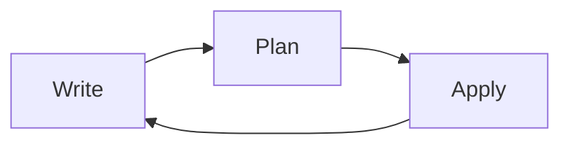

# Terraform Introduction

## What is Terraform?

Terraform is an open-source Infrastructure as Code (IaC) tool created by HashiCorp that allows you to define and provision infrastructure using a declarative configuration language. With Terraform, you can build, change, and version your infrastructure safely and efficiently across various cloud providers and services.

Rather than manually configuring resources through a user interface or writing custom scripts, Terraform enables you to define your infrastructure in simple, human-readable configuration files. These configurations can then be shared, version-controlled, and reused.

## Why Use Terraform?

Imagine you need to set up a complex cloud environment with virtual machines, databases, networks, and security rules. Traditionally, you might:

1. Log into your cloud provider's console
2. Navigate through various menus 
3. Manually configure each resource
4. Document everything so you can recreate it later

This approach is time-consuming, error-prone, and difficult to replicate consistently. With Terraform, you can:

- **Define infrastructure as code**: Write configuration files that describe your desired infrastructure
- **Plan changes before applying**: See exactly what will change before making any modifications
- **Version control your infrastructure**: Track changes to your infrastructure just like application code
- **Automate deployments**: Integrate with CI/CD pipelines for reliable deployments
- **Manage dependencies**: Terraform handles the order of resource creation and modification
- **Work across multiple providers**: Use a single tool for AWS, Azure, Google Cloud, and many others

## Core Concepts of Terraform

### 1. Providers

Providers are plugins that allow Terraform to interact with cloud providers, SaaS providers, and other APIs. Examples include AWS, Azure, Google Cloud, GitHub, and Kubernetes.

```hcl
provider "aws" {
  region = "us-west-2"
}
```

### 2. Resources

Resources are the infrastructure objects that Terraform manages, such as virtual machines, networks, or DNS records.

```hcl
resource "aws_instance" "web_server" {
  ami           = "ami-0c55b159cbfafe1f0"
  instance_type = "t2.micro"
  
  tags = {
    Name = "WebServer"
  }
}
```

### 3. Variables

Variables make your Terraform configurations more flexible and reusable.

```hcl
variable "region" {
  description = "AWS region to deploy resources"
  type        = string
  default     = "us-west-2"
}

provider "aws" {
  region = var.region
}
```

### 4. State

Terraform keeps track of all resources it manages in a state file. This state file maps the resources defined in your configurations to real-world resources.

## The Terraform Workflow

The typical Terraform workflow consists of three main steps:



### 1. Write

Define your infrastructure in `.tf` files using HashiCorp Configuration Language (HCL).

### 2. Plan

Run `terraform plan` to preview changes that will be made to your infrastructure.

```bash
$ terraform plan

Terraform will perform the following actions:

  # aws_instance.web_server will be created
  + resource "aws_instance" "web_server" {
      + ami                          = "ami-0c55b159cbfafe1f0"
      + instance_type                = "t2.micro"
      + tags                         = {
          + "Name" = "WebServer"
        }
      # ... other attributes
    }

Plan: 1 to add, 0 to change, 0 to destroy.
```

### 3. Apply

Run `terraform apply` to create or modify your infrastructure based on the plan.

```bash
$ terraform apply

# ... plan output as above ...

Do you want to perform these actions?
  Terraform will perform the actions described above.
  Only 'yes' will be accepted to approve.

  Enter a value: yes

aws_instance.web_server: Creating...
aws_instance.web_server: Creation complete after 45s [id=i-0123456789abcdef0]

Apply complete! Resources: 1 added, 0 changed, 0 destroyed.
```

## Getting Started with Terraform

Let's go through a simple example of using Terraform to provision an AWS S3 bucket.

### Step 1: Install Terraform

First, you'll need to install Terraform on your machine. You can download it from the [official website](https://www.terraform.io/downloads.html) or use a package manager:

```bash
# On macOS with Homebrew
$ brew install terraform

# On Windows with Chocolatey
$ choco install terraform

# Verify installation
$ terraform version
Terraform v1.5.4
```

### Step 2: Create a Configuration File

Create a new directory for your project and add a file named `main.tf`:

```hcl
# main.tf

provider "aws" {
  region = "us-east-1"
}

resource "aws_s3_bucket" "example" {
  bucket = "my-terraform-example-bucket"
  
  tags = {
    Name        = "My Example Bucket"
    Environment = "Dev"
  }
}
```

### Step 3: Initialize Terraform

In your project directory, run:

```bash
$ terraform init

Initializing the backend...

Initializing provider plugins...
- Finding latest version of hashicorp/aws...
- Installing hashicorp/aws v4.67.0...
- Installed hashicorp/aws v4.67.0 (signed by HashiCorp)

Terraform has been successfully initialized!
```

This command downloads the necessary provider plugins and sets up the working directory.

### Step 4: Plan the Changes

```bash
$ terraform plan

Terraform will perform the following actions:

  # aws_s3_bucket.example will be created
  + resource "aws_s3_bucket" "example" {
      + bucket              = "my-terraform-example-bucket"
      + id                  = (known after apply)
      + tags                = {
          + "Environment" = "Dev"
          + "Name"        = "My Example Bucket"
        }
      # ... other attributes
    }

Plan: 1 to add, 0 to change, 0 to destroy.
```

### Step 5: Apply the Changes

```bash
$ terraform apply

# ... plan output as above ...

Do you want to perform these actions?
  Terraform will perform the actions described above.
  Only 'yes' will be accepted to approve.

  Enter a value: yes

aws_s3_bucket.example: Creating...
aws_s3_bucket.example: Creation complete after 3s [id=my-terraform-example-bucket]

Apply complete! Resources: 1 added, 0 changed, 0 destroyed.
```

### Step 6: Verify the Resources

You can now check your AWS console to confirm that the S3 bucket has been created.

### Step 7: Clean Up (Optional)

When you're done, you can destroy the created resources:

```bash
$ terraform destroy

# ... plan showing what will be destroyed ...

Do you really want to destroy all resources?
  Terraform will destroy all your managed infrastructure, as shown above.
  There is no undo. Only 'yes' will be accepted to confirm.

  Enter a value: yes

aws_s3_bucket.example: Destroying...
aws_s3_bucket.example: Destruction complete after 2s

Destroy complete! Resources: 1 destroyed.
```

## Real-World Example: Setting Up a Web Server

Let's create a more practical example by setting up an AWS EC2 instance to serve as a web server.

```hcl
# main.tf

provider "aws" {
  region = "us-west-2"
}

# Create a VPC
resource "aws_vpc" "main" {
  cidr_block = "10.0.0.0/16"
  
  tags = {
    Name = "MainVPC"
  }
}

# Create a subnet
resource "aws_subnet" "public" {
  vpc_id            = aws_vpc.main.id
  cidr_block        = "10.0.1.0/24"
  availability_zone = "us-west-2a"
  
  tags = {
    Name = "PublicSubnet"
  }
}

# Create an internet gateway
resource "aws_internet_gateway" "main" {
  vpc_id = aws_vpc.main.id
  
  tags = {
    Name = "MainIGW"
  }
}

# Create a route table
resource "aws_route_table" "public" {
  vpc_id = aws_vpc.main.id
  
  route {
    cidr_block = "0.0.0.0/0"
    gateway_id = aws_internet_gateway.main.id
  }
  
  tags = {
    Name = "PublicRouteTable"
  }
}

# Associate route table with subnet
resource "aws_route_table_association" "public" {
  subnet_id      = aws_subnet.public.id
  route_table_id = aws_route_table.public.id
}

# Create a security group
resource "aws_security_group" "web" {
  name        = "web_server_sg"
  description = "Allow web traffic"
  vpc_id      = aws_vpc.main.id
  
  ingress {
    from_port   = 80
    to_port     = 80
    protocol    = "tcp"
    cidr_blocks = ["0.0.0.0/0"]
  }
  
  ingress {
    from_port   = 22
    to_port     = 22
    protocol    = "tcp"
    cidr_blocks = ["0.0.0.0/0"]
  }
  
  egress {
    from_port   = 0
    to_port     = 0
    protocol    = "-1"
    cidr_blocks = ["0.0.0.0/0"]
  }
  
  tags = {
    Name = "WebServerSG"
  }
}

# Launch an EC2 instance
resource "aws_instance" "web" {
  ami                         = "ami-0c55b159cbfafe1f0"  # Ubuntu 20.04 LTS in us-west-2
  instance_type               = "t2.micro"
  subnet_id                   = aws_subnet.public.id
  vpc_security_group_ids      = [aws_security_group.web.id]
  associate_public_ip_address = true
  
  user_data = <<-EOF
              #!/bin/bash
              apt-get update -y
              apt-get install -y apache2
              systemctl start apache2
              systemctl enable apache2
              echo "<h1>Hello World from Terraform</h1>" > /var/www/html/index.html
              EOF
  
  tags = {
    Name = "WebServer"
  }
}

# Output the public IP address
output "web_server_ip" {
  value = aws_instance.web.public_ip
}
```

After applying this configuration, Terraform will output the public IP address of your web server. You can navigate to this IP address in a web browser to see the "Hello World from Terraform" message.

## Best Practices for Using Terraform

1. **Use version control**: Store your Terraform configurations in a version control system like Git.
2. **Organize your code**: Split your configurations into multiple files based on resource types or components.
3. **Use modules**: Create reusable modules for common infrastructure patterns.
4. **Use variables and outputs**: Make your configurations flexible and shareable.
5. **Lock provider versions**: Ensure consistent behavior across different environments.
6. **Store state remotely**: Use remote backends like S3, Azure Blob Storage, or Terraform Cloud to store and share state.
7. **Plan before applying**: Always review changes before applying them.
8. **Use workspaces**: Manage multiple environments (dev, staging, production) from the same configuration.

## Summary

Terraform is a powerful Infrastructure as Code tool that enables you to:

- Define your infrastructure in code
- Plan and apply changes safely
- Version control your infrastructure
- Work with multiple cloud providers
- Automate infrastructure deployments

By using Terraform, you can make your infrastructure provisioning more efficient, reliable, and reproducible, which is essential for modern DevOps practices.

## Additional Resources

To continue learning Terraform:

1. **Official Documentation**: The [Terraform documentation](https://www.terraform.io/docs) is comprehensive and well-organized.
2. **Registry**: Explore the [Terraform Registry](https://registry.terraform.io/) for providers and modules.
3. **HashiCorp Learn**: The [official learning platform](https://learn.hashicorp.com/terraform) offers tutorials and guides.

## Practice Exercises

1. Create a Terraform configuration to deploy a static website on S3 with CloudFront.
2. Build a configuration that sets up a multi-tier architecture with a load balancer, web servers, and a database.
3. Create a module that can be reused to deploy similar infrastructure across different environments.
4. Use Terraform's data sources to fetch information about existing infrastructure.
5. Set up a remote backend for your Terraform state using S3 or Terraform Cloud.