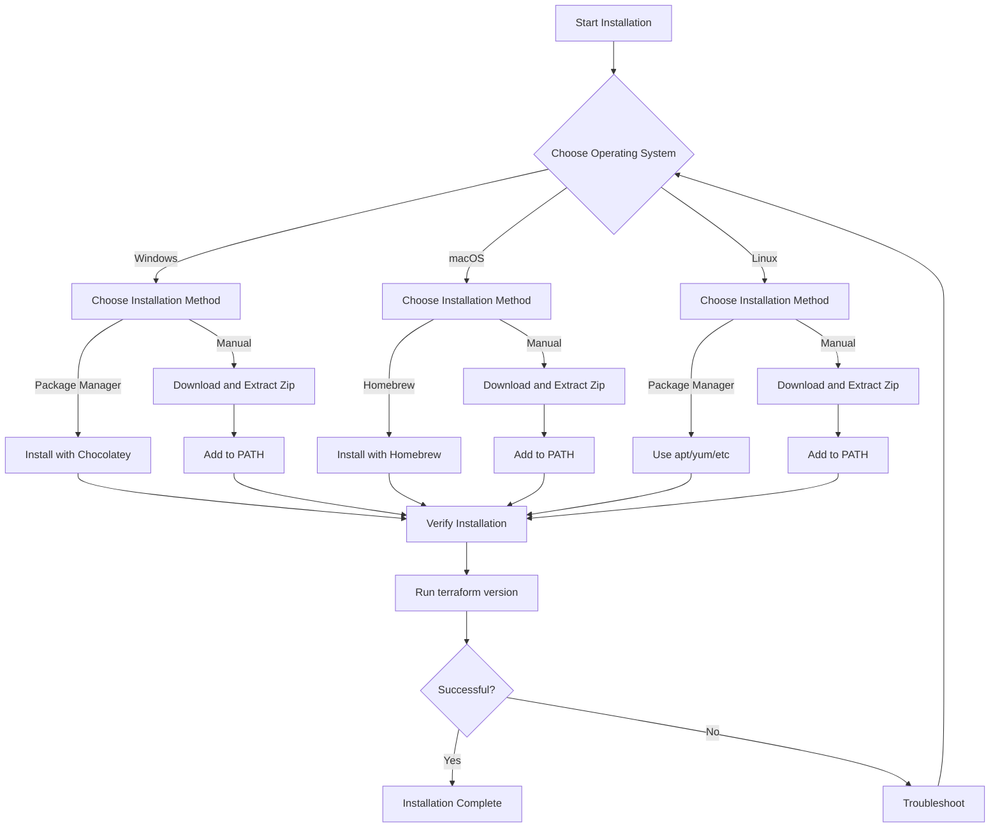

# Terraform Installation

## Introduction

Terraform is an open-source Infrastructure as Code (IaC) tool created by HashiCorp that allows you to define and provision infrastructure resources using a declarative configuration language. Before you can start using Terraform to manage your infrastructure, you need to install it on your system.

This guide will walk you through the installation process on various operating systems, verify your installation, and help you set up your environment for using Terraform effectively.

## Prerequisites

Before installing Terraform, ensure you have:

- A computer with Windows, macOS, or Linux
- Administrative privileges (for Windows) or sudo access (for macOS/Linux)
- Internet connection to download the installation packages
- A terminal or command prompt application

## Installation Methods

There are several ways to install Terraform depending on your operating system and preferences. We'll cover the most common methods below.

### Installing on Windows

#### Using Chocolatey Package Manager

[Chocolatey](https://chocolatey.org/) is a package manager for Windows that makes installing software easier.

1. First, install Chocolatey if you don't have it already.
2. Open PowerShell as Administrator and run:

```powershell
choco install terraform
```

#### Manual Installation

1. Visit the [Terraform downloads page](https://www.terraform.io/downloads.html).
2. Download the Windows 64-bit zip file.
3. Extract the zip file to a directory of your choice (e.g., `C:\terraform`).
4. Add this directory to your system PATH:
   - Right-click on "This PC" or "My Computer" and select "Properties"
   - Click on "Advanced system settings"
   - Click on "Environment Variables"
   - Under "System variables", find the "Path" variable and click "Edit"
   - Click "New" and add the directory where you extracted Terraform
   - Click "OK" on all dialog boxes to save the changes

### Installing on macOS

#### Using Homebrew

[Homebrew](https://brew.sh/) is a popular package manager for macOS.

1. Install Homebrew if you don't have it already.
2. Open Terminal and run:

```bash
brew tap hashicorp/tap
brew install hashicorp/tap/terraform
```

#### Manual Installation

1. Visit the [Terraform downloads page](https://www.terraform.io/downloads.html).
2. Download the macOS zip file.
3. Extract the zip file to a directory of your choice.
4. Add the directory to your PATH by adding the following line to your `~/.bash_profile` or `~/.zshrc` file:

```bash
export PATH=$PATH:/path/to/terraform/directory
```

5. Reload your shell configuration:

```bash
source ~/.bash_profile
# or
source ~/.zshrc
```

### Installing on Linux

#### Using Package Managers

For Ubuntu/Debian:

```bash
wget -O- https://apt.releases.hashicorp.com/gpg | gpg --dearmor | sudo tee /usr/share/keyrings/hashicorp-archive-keyring.gpg
echo "deb [signed-by=/usr/share/keyrings/hashicorp-archive-keyring.gpg] https://apt.releases.hashicorp.com $(lsb_release -cs) main" | sudo tee /etc/apt/sources.list.d/hashicorp.list
sudo apt update && sudo apt install terraform
```

For CentOS/RHEL/Fedora:

```bash
sudo yum install -y yum-utils
sudo yum-config-manager --add-repo https://rpm.releases.hashicorp.com/RHEL/hashicorp.repo
sudo yum -y install terraform
```

#### Manual Installation

1. Visit the [Terraform downloads page](https://www.terraform.io/downloads.html).
2. Download the appropriate Linux zip file for your architecture.
3. Extract the zip file to a directory of your choice:

```bash
unzip terraform_*.zip -d /usr/local/bin/
```

4. Ensure the directory is in your PATH.

## Verifying Your Installation

After installing Terraform, verify that it's working correctly by running:

```bash
terraform version
```

You should see output similar to this:

```
Terraform v1.5.7
on linux_amd64
```

If you see the version information, congratulations! Terraform is installed correctly.

## Setting Up Terraform Environment

Now that Terraform is installed, let's set up your environment for better productivity:

### Configuring Tab Completion

Terraform supports tab completion for commands in your shell. To enable it:

For Bash:

```bash
terraform -install-autocomplete
```

For Zsh, add this to your `~/.zshrc` file:

```bash
autoload -U +X bashcompinit && bashcompinit
complete -o nospace -C /usr/local/bin/terraform terraform
```

### Environment Variables

Terraform uses various environment variables to customize its behavior. Here are some useful ones:

- `TF_LOG`: Set to DEBUG, TRACE, INFO, WARN, or ERROR to enable logging
- `TF_LOG_PATH`: Set to a file path to save logs to a file
- `TF_VAR_name`: Set variables for your Terraform configurations

Example:

```bash
export TF_LOG=INFO
export TF_LOG_PATH=./terraform.log
```

### Directory Structure

It's a good practice to organize your Terraform projects. A typical structure might look like:

```
project/
├── main.tf         # Main configuration file
├── variables.tf    # Variable declarations
├── outputs.tf      # Output declarations
├── terraform.tfvars # Variable values
└── modules/        # Reusable modules
```

## Practical Example: Your First Terraform Command

Let's create a simple Terraform configuration to ensure everything is working:

1. Create a new directory for your project:

```bash
mkdir terraform-test
cd terraform-test
```

2. Create a file named `main.tf` with the following content:

```hcl
# main.tf
provider "local" {
}

resource "local_file" "hello" {
  content  = "Hello, Terraform!"
  filename = "${path.module}/hello.txt"
}
```

3. Initialize the Terraform working directory:

```bash
terraform init
```

Expected output:
```
Initializing the backend...

Initializing provider plugins...
- Finding latest version of hashicorp/local...
- Installing hashicorp/local v2.4.0...
- Installed hashicorp/local v2.4.0 (signed by HashiCorp)

Terraform has been successfully initialized!
```

4. Apply the configuration:

```bash
terraform apply
```

Expected output:
```
Terraform used the selected providers to generate the following execution plan. Resource actions are indicated with the following symbols:
  + create

Terraform will perform the following actions:

  # local_file.hello will be created
  + resource "local_file" "hello" {
      + content              = "Hello, Terraform!"
      + filename             = "./hello.txt"
      + id                   = (known after apply)
    }

Plan: 1 to add, 0 to change, 0 to destroy.

Do you want to perform these actions?
  Terraform will perform the actions described above.
  Only 'yes' will be accepted to approve.

  Enter a value: yes

local_file.hello: Creating...
local_file.hello: Creation complete after 0s [id=bcc278b3f42482f9bda0be6e189bfb8c4908a3b0]

Apply complete! Resources: 1 added, 0 changed, 0 destroyed.
```

5. Verify that the file was created:

```bash
cat hello.txt
```

Expected output:
```
Hello, Terraform!
```

6. Clean up by destroying the resources:

```bash
terraform destroy
```

## Installation Flow Diagram

Here's a visual representation of the Terraform installation process:



## Troubleshooting Common Installation Issues

### "Command not found" error

If you receive a "command not found" error when trying to run Terraform:

1. Verify that Terraform is in your PATH:
   - Windows: `echo %PATH%`
   - macOS/Linux: `echo $PATH`

2. Ensure the Terraform binary is executable (Linux/macOS):
   ```bash
   chmod +x /path/to/terraform
   ```

### Version Mismatch

If you need a specific version of Terraform:

1. Visit the [Terraform releases page](https://releases.hashicorp.com/terraform/).
2. Download the specific version you need.
3. Replace your existing Terraform binary with the new one.

### Multiple Terraform Versions

If you need to work with multiple Terraform versions, consider using:

- [tfenv](https://github.com/tfutils/tfenv) for macOS/Linux
- [Terraform Switcher (tfswitch)](https://github.com/warrensbox/terraform-switcher) for Windows/macOS/Linux

## Summary

In this guide, we've covered:

1. Installing Terraform on Windows, macOS, and Linux
2. Verifying your installation
3. Setting up your Terraform environment with tab completion and environment variables
4. Creating and running a simple Terraform configuration
5. Troubleshooting common installation issues

With Terraform installed, you're now ready to start defining and managing your infrastructure as code. The next steps would be to learn about Terraform's basic concepts, such as providers, resources, and state management.

## Additional Resources

- [Official Terraform Documentation](https://www.terraform.io/docs/index.html)
- [Terraform Registry](https://registry.terraform.io/) - Find providers and modules
- [Terraform Best Practices](https://www.terraform-best-practices.com/)

## Exercises

1. Install Terraform on your preferred operating system.
2. Create a new Terraform project and initialize it.
3. Write a configuration to create multiple local files with different content.
4. Apply your configuration and verify the files were created.
5. Destroy the resources and verify the files were removed.
6. Explore the Terraform Registry and find a provider that interests you.