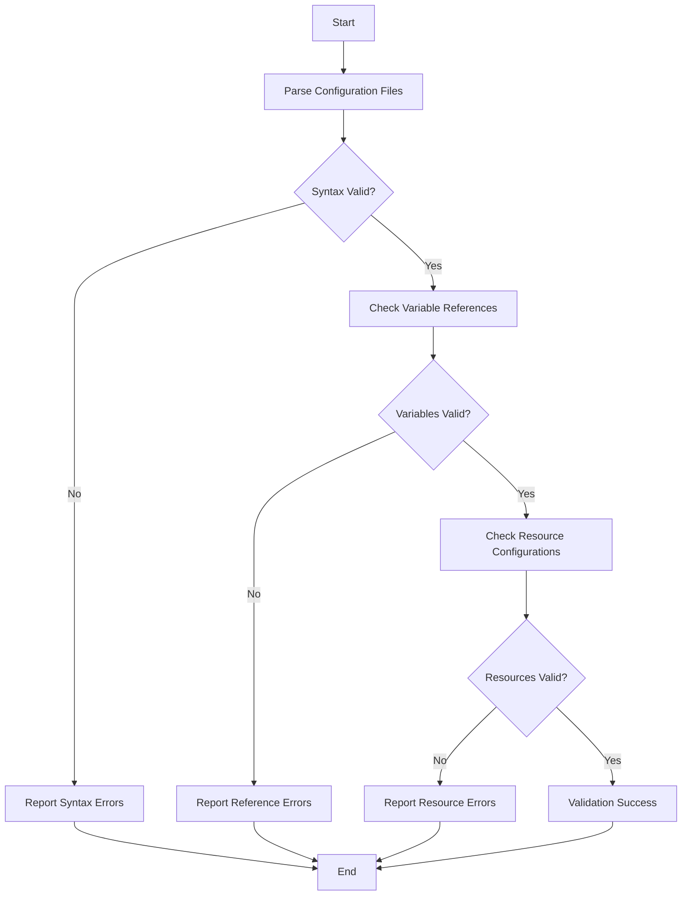

# Terraform Validate

## Introduction

Terraform is a powerful Infrastructure as Code (IaC) tool that enables you to define and provision infrastructure resources in a declarative way. When working with Terraform configurations, it's crucial to ensure they are valid and error-free before applying them to your actual infrastructure. This is where `terraform validate` comes in - a command that checks your configuration files for syntax errors, references to undefined variables, and other common issues.

This guide will walk you through the process of validating your Terraform configurations, helping you catch errors early in your development cycle and ensuring your infrastructure deployments are reliable and consistent.

## Understanding Terraform Validate

The `terraform validate` command checks your Terraform configuration files for:

1. **Syntax validity**: Ensuring your HCL (HashiCorp Configuration Language) syntax is correct
2. **Resource configuration**: Confirming that resources are properly configured
3. **Reference integrity**: Checking that all referenced variables, outputs, and modules exist
4. **Provider constraints**: Verifying that provider requirements are met

Unlike `terraform plan` which requires provider initialization and potentially remote state access, `terraform validate` is a quick local check that doesn't require connecting to any remote systems.

## Basic Usage

Let's start with the simplest form of validation:

```bash
terraform validate
```

When run in a directory containing valid Terraform configuration files, you'll see output like this:

```
Success! The configuration is valid.
```

If there are errors in your configuration, you'll receive detailed information about what's wrong and where the issues are located.

## Validating with Variables

When your configuration uses variables, `terraform validate` can check for correct variable usage without needing actual values:

```bash
terraform validate
```

Consider this example configuration:

```hcl
variable "instance_type" {
  description = "The AWS instance type"
  type        = string
}

resource "aws_instance" "example" {
  ami           = "ami-0c55b159cbfafe1f0"
  instance_type = var.instance_type
}
```

Even without providing a value for `instance_type`, validation will succeed because the variable is correctly defined and referenced.

## Validating with Different Configurations

Sometimes you might have multiple configuration files for different environments. You can validate a specific configuration by specifying the directory:

```bash
terraform validate -directory=./environments/prod
```

## Common Validation Errors and How to Fix Them

### 1. Syntax Errors

**Error example:**
```
Error: Invalid block definition

  on main.tf line 3, in resource "aws_instance" "example":
   3:   ami           = "ami-0c55b159cbfafe1f0"

Block definition is missing an open curly brace.
```

**Fix:**
Check your curly braces, commas, and general syntax. In this case, you'd need to add an opening curly brace after the resource declaration.

### 2. Undefined Variable References

**Error example:**
```
Error: Reference to undeclared input variable

  on main.tf line 5, in resource "aws_instance" "example":
   5:   instance_type = var.instance_size

An input variable with the name "instance_size" has not been declared.
```

**Fix:**
Ensure all variables are properly declared. In this case, either declare the variable `instance_size` or correct the reference to use an existing variable (perhaps `instance_type`).

### 3. Invalid Resource Configuration

**Error example:**
```
Error: Unsupported argument

  on main.tf line 6, in resource "aws_instance" "example":
   6:   cpu_cores = 2

An argument named "cpu_cores" is not expected here.
```

**Fix:**
Check the resource documentation to use the correct attribute names. In this case, AWS instances use `cpu_core_count` instead of `cpu_cores`.

## Practical Example: Multi-Resource Validation

Let's look at a more complex example with multiple resources:

```hcl
# main.tf
provider "aws" {
  region = var.aws_region
}

resource "aws_vpc" "main" {
  cidr_block = var.vpc_cidr
  
  tags = {
    Name = "main-vpc"
  }
}

resource "aws_subnet" "public" {
  vpc_id     = aws_vpc.main.id
  cidr_block = var.public_subnet_cidr
  
  tags = {
    Name = "public-subnet"
  }
}

resource "aws_instance" "web" {
  ami           = var.ami_id
  instance_type = var.instance_type
  subnet_id     = aws_subnet.public.id
  
  tags = {
    Name = "web-server"
  }
}
```

```hcl
# variables.tf
variable "aws_region" {
  description = "AWS region to deploy resources"
  type        = string
  default     = "us-west-2"
}

variable "vpc_cidr" {
  description = "CIDR block for the VPC"
  type        = string
  default     = "10.0.0.0/16"
}

variable "public_subnet_cidr" {
  description = "CIDR block for the public subnet"
  type        = string
  default     = "10.0.1.0/24"
}

variable "ami_id" {
  description = "AMI ID for the EC2 instance"
  type        = string
}

variable "instance_type" {
  description = "Instance type for the EC2 instance"
  type        = string
  default     = "t2.micro"
}
```

Running `terraform validate` on this configuration would check:
1. The syntax of both files
2. That all variables are properly defined
3. That the references between resources are valid (e.g., `aws_vpc.main.id` exists)
4. That the resource attributes are correct for each resource type

## Integrating Validation into Your Workflow

To get the most out of `terraform validate`, consider these best practices:

### 1. Pre-commit Validation

Set up a pre-commit hook that runs `terraform validate` before committing changes:

```bash
#!/bin/sh
# .git/hooks/pre-commit

# Run terraform validate in each directory containing .tf files
for dir in $(find . -type f -name "*.tf" -not -path "*/\.*" | xargs -I{} dirname {} | sort -u); do
  echo "Validating Terraform files in $dir"
  (cd "$dir" && terraform validate) || exit 1
done
```

### 2. CI/CD Pipeline Integration

Add validation to your CI/CD pipeline to catch errors before deployment:

```yaml
# Example GitHub Actions workflow
name: Terraform Validation

on:
  push:
    branches: [ main ]
  pull_request:
    branches: [ main ]

jobs:
  validate:
    runs-on: ubuntu-latest
    steps:
    - uses: actions/checkout@v2
    - uses: hashicorp/setup-terraform@v1
    
    - name: Terraform Init
      run: terraform init -backend=false
    
    - name: Terraform Validate
      run: terraform validate
```

### 3. Validation Before Planning

Always run `terraform validate` before running `terraform plan` to catch basic errors quickly:

```bash
terraform validate && terraform plan
```

## Validating Modules

Modules are reusable packages of Terraform configurations. When validating a module directory directly, you need to ensure all required variables are defined:

```hcl
# modules/web_server/main.tf
variable "instance_type" {
  description = "EC2 instance type"
  type        = string
}

resource "aws_instance" "web" {
  ami           = "ami-0c55b159cbfafe1f0"
  instance_type = var.instance_type
}
```

If you run `terraform validate` in the module directory, it will check the module's syntax and structure, even without values for the variables.

## Visualization of Terraform Validation Process



## Automating Validation with Terraform Cloud

If you're using Terraform Cloud, you can configure automatic validation of your configurations:

1. Set up a workspace in Terraform Cloud
2. Enable the "Speculative Plans" feature
3. Connect your VCS repository
4. Configure automatic runs on pull requests

This will run validation automatically every time changes are pushed to your repository.

## Advanced Validation with Custom Rules

For more advanced validation, you can use the `terraform-plugin-sdk` to create custom validation rules:

```hcl
variable "instance_type" {
  description = "EC2 instance type"
  type        = string
  
  validation {
    condition     = contains(["t2.micro", "t2.small", "t3.micro"], var.instance_type)
    error_message = "The instance type must be t2.micro, t2.small, or t3.micro."
  }
}
```

Running `terraform validate` will now check that the instance type matches one of the approved values.

## Summary

`terraform validate` is an essential tool in your Terraform workflow that helps ensure your infrastructure configurations are error-free before deployment. By validating your Terraform code early and often, you can:

1. Catch syntax errors before they cause deployment issues
2. Verify that all resource references are valid
3. Ensure your configurations follow best practices
4. Reduce the risk of unexpected behavior when applying changes

Integrating validation into your development workflow, CI/CD pipelines, and pre-commit hooks will help you maintain high-quality, reliable infrastructure code.

## Additional Resources

- [Terraform Validate Command Documentation](https://www.terraform.io/docs/commands/validate.html)
- [Terraform Best Practices](https://www.terraform-best-practices.com/)
- [HashiCorp Learn: Terraform](https://learn.hashicorp.com/terraform)

## Exercises

1. Create a simple Terraform configuration with a syntax error, then use `terraform validate` to identify and fix the issue.
2. Write a configuration that references an undefined variable, then use the validation error to correct the problem.
3. Set up a pre-commit hook that runs `terraform validate` before each commit.
4. Create a variable with custom validation rules, then test the validation by providing valid and invalid values.
5. Configure a CI/CD pipeline for one of your Terraform projects that includes validation as a step.