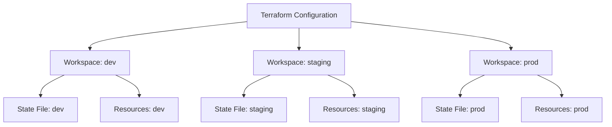

# Terraform Workspaces

When working with infrastructure as code, you'll often need to manage multiple environments like development, staging, and production. Terraform workspaces provide a built-in mechanism to manage these different environments using the same configuration files.

## What are Terraform Workspaces?

Terraform workspaces allow you to create multiple instances of your infrastructure from the same configuration files. Each workspace has its own state file, which means you can have different resource configurations for different environments without duplicating your code.

Think of workspaces as different "profiles" for your infrastructure. The code remains the same, but the state (and potentially the variables) can be different for each workspace.

## Why Use Workspaces?

Here are some benefits of using Terraform workspaces:

- **Code Reuse**: Maintain a single set of configuration files for multiple environments
- **Simplified Management**: Easily switch between different environments
- **Isolation**: Changes in one workspace don't affect others
- **Organized State**: Each workspace has its own separate state file

## Getting Started with Workspaces

### Workspace Commands

Terraform provides several commands to work with workspaces:

```bash
# List all workspaces
terraform workspace list

# Create a new workspace
terraform workspace new dev

# Select a workspace
terraform workspace select prod

# Show the current workspace
terraform workspace show

# Delete a workspace
terraform workspace delete staging
```

### Creating and Using Workspaces

Let's create a basic example to demonstrate workspaces:

1. First, create a new directory for your Terraform configuration:

```bash
mkdir terraform-workspaces-demo
cd terraform-workspaces-demo
```

2. Create a `main.tf` file with the following content:

```hcl
provider "aws" {
  region = "us-west-2"
}

resource "aws_instance" "example" {
  ami           = "ami-0c55b159cbfafe1f0"
  instance_type = lookup(var.instance_type, terraform.workspace)

  tags = {
    Name = "example-${terraform.workspace}"
    Environment = terraform.workspace
  }
}

variable "instance_type" {
  type = map(string)
  default = {
    default = "t2.micro"
    dev     = "t2.micro"
    staging = "t2.medium"
    prod    = "t2.large"
  }
}
```

3. Initialize Terraform:

```bash
terraform init
```

4. Create workspaces for different environments:

```bash
terraform workspace new dev
terraform workspace new staging
terraform workspace new prod
```

5. Now when you run `terraform plan` or `terraform apply`, Terraform will use the appropriate settings for each workspace:

```bash
# Switch to dev workspace
terraform workspace select dev
terraform apply

# Switch to staging workspace
terraform workspace select staging
terraform apply

# Switch to production workspace
terraform workspace select prod
terraform apply
```

## How Workspaces Work

### State Isolation

Each workspace has its own state file. When using local state, workspace states are stored in the `terraform.tfstate.d` directory:

```
terraform.tfstate.d/
├── dev
│   └── terraform.tfstate
├── staging
│   └── terraform.tfstate
└── prod
    └── terraform.tfstate
```

When using remote state (like S3 or Terraform Cloud), the workspace name is included in the state key.

### The Default Workspace

Terraform automatically creates a workspace named "default" when you initialize a configuration. If you don't explicitly create or select a workspace, Terraform uses this default workspace.

### Accessing the Current Workspace

You can access the current workspace name using the `terraform.workspace` expression:

```hcl
resource "aws_instance" "example" {
  # ...
  tags = {
    Name = "example-${terraform.workspace}"
  }
}
```

## Real-World Example: Multi-Environment Infrastructure

Let's create a more comprehensive example that demonstrates managing multiple environments:

```hcl
provider "aws" {
  region = "us-west-2"
}

locals {
  # Common tags to be assigned to all resources
  common_tags = {
    Project     = "TerraformDemo"
    Environment = terraform.workspace
    ManagedBy   = "Terraform"
  }
  
  # Environment-specific configuration
  env_config = {
    default = {
      instance_count = 1
      instance_type  = "t2.micro"
    }
    dev = {
      instance_count = 1
      instance_type  = "t2.micro"
    }
    staging = {
      instance_count = 2
      instance_type  = "t2.medium"
    }
    prod = {
      instance_count = 3
      instance_type  = "t2.large"
    }
  }
  
  # Use the current workspace to look up the config
  config = lookup(local.env_config, terraform.workspace, local.env_config["default"])
}

resource "aws_instance" "app_server" {
  count         = local.config.instance_count
  ami           = "ami-0c55b159cbfafe1f0"
  instance_type = local.config.instance_type
  
  tags = merge(
    local.common_tags,
    {
      Name = "app-server-${terraform.workspace}-${count.index + 1}"
    }
  )
}

resource "aws_s3_bucket" "app_data" {
  bucket = "app-data-${terraform.workspace}"
  
  tags = local.common_tags
}

output "instance_ips" {
  value = aws_instance.app_server[*].public_ip
}
```

Let's break down this example:

1. We define `common_tags` to apply to all resources.
2. We create an `env_config` map that contains environment-specific configurations.
3. We use `lookup()` to get the right configuration based on the current workspace.
4. We create EC2 instances with a count that varies by environment.
5. We create an S3 bucket with a name that includes the workspace name.

## When to Use Workspaces vs. Separate Configurations

While workspaces are convenient, they have limitations:

### Good for Workspaces:
- Simple environment differences
- Small to medium-sized projects
- When environments share most configuration

### Consider Separate Configurations When:
- Environments have significant differences
- Different teams manage different environments
- You need different authentication or provider configurations
- You need stricter separation for compliance reasons

## Best Practices

1. **Name Workspaces Consistently**: Use standardized names like "dev", "staging", and "prod".

2. **Consider Using Workspace-Specific Variables**:

```hcl
variable "environment_configs" {
  type = map(object({
    instance_type = string
    vpc_cidr      = string
  }))
  default = {
    dev = {
      instance_type = "t2.micro"
      vpc_cidr      = "10.0.0.0/16"
    }
    prod = {
      instance_type = "t2.large"
      vpc_cidr      = "10.1.0.0/16"
    }
  }
}

locals {
  config = var.environment_configs[terraform.workspace]
}
```

3. **Use Conditional Logic**:

```hcl
resource "aws_instance" "example" {
  # Only create in dev and staging
  count = terraform.workspace == "prod" ? 0 : 1
  
  # Configuration
}
```

4. **Include Workspace in Resource Names**:

```hcl
resource "aws_security_group" "example" {
  name = "example-${terraform.workspace}"
}
```

5. **Document Workspace Usage**:

Create a README.md that explains how to use workspaces in your project.

## Visualizing Workspaces

Here's a simple diagram that illustrates how workspaces work:



## Summary

Terraform workspaces provide a powerful way to manage multiple environments using the same configuration files. They allow you to:

- Maintain a single set of configuration files for all environments
- Easily switch between environments
- Apply environment-specific configurations
- Keep state files separate for each environment

By using workspaces effectively, you can simplify your infrastructure management and enforce consistency across different environments while still allowing for environment-specific configurations.

## Additional Resources

- [Terraform Workspaces Documentation](https://www.terraform.io/language/state/workspaces)
- [Managing Multiple Environments with Terraform](https://www.terraform.io/language/modules/develop/composition)

## Exercises

1. Create a basic Terraform configuration with an AWS provider and a simple EC2 instance resource.
2. Create three workspaces: dev, staging, and prod.
3. Modify your configuration to use different instance types based on the workspace.
4. Apply your configuration to all three workspaces and verify that the resources are created correctly.
5. Destroy the resources in all workspaces when you're done.