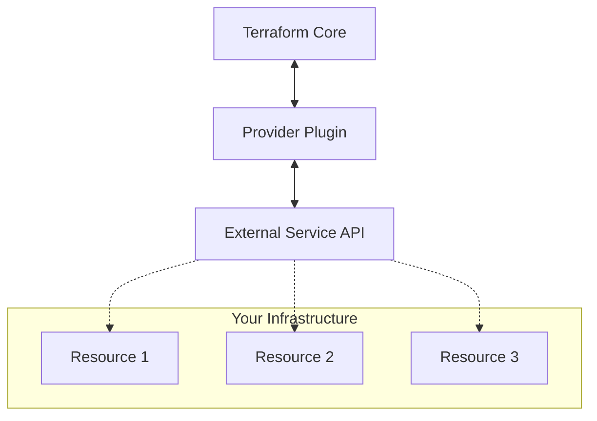

# Terraform Providers

## Introduction

Terraform providers are plugins that allow Terraform to interact with various cloud providers, SaaS platforms, and other APIs. They serve as the bridge between Terraform's configuration language and the external services that you want to manage. Without providers, Terraform would be just a configuration language with no ability to create or manage resources.

Think of providers as translators - they take your Terraform configurations and translate them into API calls that create, modify, and delete resources in your target platforms like AWS, Azure, Google Cloud, and hundreds of other services.

## Understanding Terraform Providers

### What Are Providers?

In the Terraform ecosystem, providers are responsible for understanding API interactions and exposing resources. Each provider extends Terraform with a set of resource types and/or data sources that Terraform can manage.

For example:
- The AWS provider manages resources like `aws_instance` and `aws_s3_bucket`
- The Azure provider manages resources like `azurerm_virtual_machine` and `azurerm_storage_account`
- The Google Cloud provider manages resources like `google_compute_instance` and `google_storage_bucket`

### Provider Architecture

Here's a simple diagram showing how providers fit into the Terraform ecosystem:



## Provider Configuration

### Declaring Providers

Every Terraform configuration must declare which providers it requires so that Terraform can install and use them. Here's how to declare the AWS provider:

```hcl
terraform {
  required_providers {
    aws = {
      source  = "hashicorp/aws"
      version = "~> 4.16"
    }
  }

  required_version = ">= 1.2.0"
}

provider "aws" {
  region = "us-west-2"
}
```

Let's break down this configuration:

1. The `terraform` block contains settings for Terraform itself, including the `required_providers` map.
  
2. Each key in the `required_providers` map is a local name for a provider.

3. The `source` attribute defines where Terraform can download the provider, with the format `[hostname]/[namespace]/[name]`.

4. The `version` attribute constrains which provider versions can be used.

5. The `provider` block configures the specified provider, in this case setting the AWS region to "us-west-2".

### Provider Versions

Controlling provider versions is crucial for reproducible infrastructure. The version constraint uses operators like:

- `=`: Exact version
- `!=`: Not equal to version
- `>`, `>=`, `<`, `<=`: Comparison operators
- `~>`: Allows only the rightmost version component to increment

Example:
```hcl
aws = {
  source  = "hashicorp/aws"
  version = "~> 4.16.0"  # Allows any 4.16.x version but not 4.17.0
}
```

## Using Multiple Providers

### Different Providers

You can use multiple providers in the same configuration:

```hcl
terraform {
  required_providers {
    aws = {
      source  = "hashicorp/aws"
      version = "~> 4.16"
    }
    azurerm = {
      source  = "hashicorp/azurerm"
      version = "~> 3.0"
    }
  }
}

provider "aws" {
  region = "us-west-2"
}

provider "azurerm" {
  features {}
}
```

### Provider Aliases

You can configure a provider with multiple configurations, useful for managing resources in different regions:

```hcl
provider "aws" {
  region = "us-west-2"
}

provider "aws" {
  alias  = "east"
  region = "us-east-1"
}

resource "aws_instance" "example" {
  # This will use the default aws provider (us-west-2)
  ami           = "ami-0c55b159cbfafe1f0"
  instance_type = "t2.micro"
}

resource "aws_instance" "example_east" {
  # This will use the aws.east provider
  provider      = aws.east
  ami           = "ami-0b5eea76982371e91"
  instance_type = "t2.micro"
}
```

## Common Terraform Providers

Here's a list of popular Terraform providers:

1. **Cloud Providers**:
   - `aws` - Amazon Web Services
   - `azurerm` - Microsoft Azure
   - `google` - Google Cloud Platform
   - `digitalocean` - DigitalOcean

2. **Infrastructure Tools**:
   - `docker` - Docker containers
   - `kubernetes` - Kubernetes clusters
   - `helm` - Kubernetes Helm charts

3. **Version Control Systems**:
   - `github` - GitHub repositories, teams, etc.
   - `gitlab` - GitLab resources

4. **Database Systems**:
   - `mysql` - MySQL databases
   - `postgresql` - PostgreSQL databases
   - `mongodb` - MongoDB databases

5. **Other Services**:
   - `random` - Generate random values
   - `local` - Manage local files
   - `null` - Perform arbitrary actions

## Practical Example: Using the AWS Provider

Let's create a simple AWS infrastructure with an S3 bucket and IAM user:

```hcl
# Configure the AWS Provider
provider "aws" {
  region = "us-east-1"
}

# Create an S3 bucket
resource "aws_s3_bucket" "example" {
  bucket = "my-terraform-example-bucket"

  tags = {
    Name        = "My Example Bucket"
    Environment = "Dev"
  }
}

# Create an IAM user
resource "aws_iam_user" "example" {
  name = "terraform-example-user"
}

# Create access keys for the IAM user
resource "aws_iam_access_key" "example" {
  user = aws_iam_user.example.name
}

# Output the S3 bucket name
output "bucket_name" {
  value = aws_s3_bucket.example.bucket
}

# Output IAM user details (careful with sensitive outputs in real projects)
output "iam_user_name" {
  value = aws_iam_user.example.name
}
```

When you run `terraform apply` with this configuration, Terraform will:

1. Initialize the AWS provider
2. Create an S3 bucket named "my-terraform-example-bucket"
3. Create an IAM user named "terraform-example-user"
4. Generate access keys for the IAM user
5. Output the bucket name and IAM user name

The output would look something like:

```
Apply complete! Resources: 3 added, 0 changed, 0 destroyed.

Outputs:

bucket_name = "my-terraform-example-bucket"
iam_user_name = "terraform-example-user"
```

## Creating Custom Providers

While most users rely on existing providers, you can develop custom providers when necessary. This involves:

1. Writing Go code that implements the Terraform plugin framework
2. Compiling the provider as a standalone binary
3. Installing it in the Terraform plugins directory

Here's a simplified structure of a custom provider:

```go
package main

import (
  "github.com/hashicorp/terraform-plugin-sdk/v2/helper/schema"
  "github.com/hashicorp/terraform-plugin-sdk/v2/plugin"
)

func main() {
  plugin.Serve(&plugin.ServeOpts{
    ProviderFunc: Provider,
  })
}

func Provider() *schema.Provider {
  return &schema.Provider{
    ResourcesMap: map[string]*schema.Resource{
      "example_resource": resourceExample(),
    },
    DataSourcesMap: map[string]*schema.Resource{
      "example_data_source": dataSourceExample(),
    },
  }
}

// Implement resourceExample and dataSourceExample functions
```

## Provider Authentication

Providers typically require authentication to access their APIs. Authentication methods vary by provider:

### AWS Provider Authentication

```hcl
provider "aws" {
  region     = "us-west-2"
  access_key = "my-access-key"
  secret_key = "my-secret-key"
}
```

In practice, it's more secure to use environment variables or the AWS configuration file:

```bash
# Using environment variables
export AWS_ACCESS_KEY_ID="your_access_key"
export AWS_SECRET_ACCESS_KEY="your_secret_key"
export AWS_REGION="us-west-2"
```

Then your provider block can be simplified:

```hcl
provider "aws" {
  # No credentials here - they come from environment variables
}
```

### Azure Provider Authentication

```hcl
provider "azurerm" {
  features {}
  subscription_id = "your-subscription-id"
  tenant_id       = "your-tenant-id"
  client_id       = "your-client-id"
  client_secret   = "your-client-secret"
}
```

## Debugging Provider Issues

When you encounter issues with providers, you can enable detailed logs:

```bash
export TF_LOG=DEBUG
terraform apply
```

You can also isolate the log to just provider operations:

```bash
export TF_LOG=DEBUG
export TF_LOG_PATH=terraform-provider.log
terraform apply
```

## Best Practices for Using Providers

1. **Pin provider versions** to ensure consistent behavior
2. **Use provider aliases** for multi-region or multi-account setups
3. **Separate authentication from configuration** by using environment variables or other external sources
4. **Understand resource lifecycle** and how providers handle create, read, update, and delete operations
5. **Review provider documentation** thoroughly before using new resource types

## Summary

Terraform providers are essential plugins that connect Terraform to the real world, enabling it to create and manage resources across various platforms. Key points to remember:

- Providers translate Terraform configuration into API calls
- Each provider manages specific types of resources
- Provider versions should be constrained for configuration stability
- Authentication methods vary by provider
- You can use multiple providers and multiple instances of the same provider

By understanding how providers work, you can effectively use Terraform to manage infrastructure across different cloud providers and services, creating truly multi-cloud and hybrid infrastructure as code solutions.

## Additional Resources

- [Terraform Registry](https://registry.terraform.io/browse/providers) - Browse all available providers
- [Terraform Provider Development](https://developer.hashicorp.com/terraform/plugin) - Learn how to create custom providers
- [Terraform AWS Provider Documentation](https://registry.terraform.io/providers/hashicorp/aws/latest/docs) - Comprehensive guide to the AWS provider

## Exercises

1. Configure the AWS provider to manage resources in two different regions.
2. Create a Terraform configuration using both AWS and Docker providers.
3. Experiment with the "random" provider to generate random values for use in your configurations.
4. Modify the AWS example to include an IAM policy that grants read-only access to the S3 bucket.
5. Try creating a simple configuration using a provider you haven't used before.