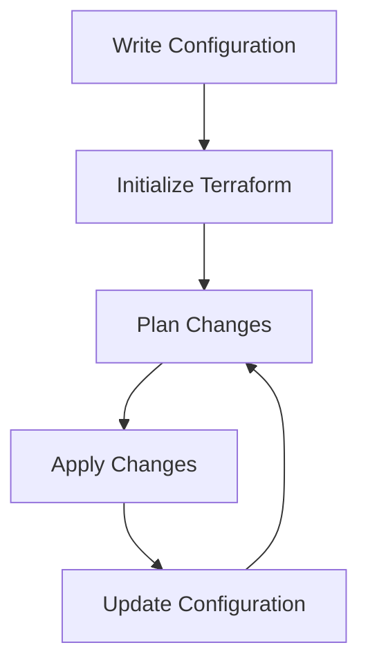

# Terraform Configuration Files

## Introduction

Terraform uses configuration files to define and provision infrastructure. These files, written in HashiCorp Configuration Language (HCL), tell Terraform what resources to create, update, or delete. Understanding how to write and organize these files is the foundation of using Terraform effectively.

In this guide, we'll explore the structure and syntax of Terraform configuration files, learn best practices, and see examples of how to use them to manage real-world infrastructure.

## Configuration File Basics

### File Format and Extension

Terraform configuration files use the `.tf` extension and are written in HCL (HashiCorp Configuration Language), a declarative language designed specifically for defining infrastructure.

```hcl
# This is a basic Terraform configuration file (example.tf)
```

You can also use JSON format with the `.tf.json` extension, though HCL is more common and readable.

### Main Components

Terraform configuration files typically contain several key elements:

1. **Terraform Block**: Configures Terraform settings and required providers
2. **Provider Block**: Configures the specific provider(s) being used
3. **Resource Block**: Defines infrastructure resources to be created
4. **Variable Block**: Declares input variables
5. **Output Block**: Defines output values
6. **Data Block**: Retrieves or computes data from existing resources

Let's look at each of these components in detail.

## Terraform Block

The `terraform` block configures Terraform's behavior and required providers.

```hcl
terraform {
  required_version = ">= 1.0.0"
  
  required_providers {
    aws = {
      source  = "hashicorp/aws"
      version = "~> 4.0"
    }
  }
}
```

This block specifies:
- The minimum Terraform version required
- The provider(s) needed, including their source and version constraints

## Provider Block

The `provider` block configures a specific provider, which is responsible for understanding API interactions with the infrastructure platform.

```hcl
provider "aws" {
  region = "us-east-1"
  profile = "default"
}
```

You can have multiple provider blocks for different providers or multiple configurations of the same provider:

```hcl
# Configure a second AWS provider for a different region
provider "aws" {
  alias  = "west"
  region = "us-west-2"
}
```

## Resource Block

Resource blocks define infrastructure objects that Terraform will manage. Each resource has a type and a local name.

```hcl
resource "aws_instance" "web_server" {
  ami           = "ami-0c55b159cbfafe1f0"
  instance_type = "t2.micro"
  
  tags = {
    Name = "WebServer"
    Environment = "Development"
  }
}
```

In this example:
- `aws_instance` is the resource type
- `web_server` is the local name (used to refer to this resource in the same configuration)
- The attributes inside the block configure the specific resource

## Variable Block

Variables allow you to parameterize your configurations, making them more flexible and reusable.

```hcl
variable "instance_type" {
  description = "The type of EC2 instance to launch"
  type        = string
  default     = "t2.micro"
}

variable "environment" {
  description = "Deployment environment"
  type        = string
  validation {
    condition     = contains(["development", "staging", "production"], var.environment)
    error_message = "Environment must be one of: development, staging, production."
  }
}
```

You can then use these variables in your resource configurations:

```hcl
resource "aws_instance" "web_server" {
  instance_type = var.instance_type
  
  tags = {
    Environment = var.environment
  }
}
```

## Output Block

Outputs expose specific values that can be useful after applying your configuration.

```hcl
output "instance_ip" {
  description = "The public IP of the web server"
  value       = aws_instance.web_server.public_ip
}

output "dns_name" {
  description = "The DNS name of the web server"
  value       = aws_instance.web_server.public_dns
}
```

After applying, you can see these values in the terminal or use them in other Terraform configurations.

## Data Block

Data blocks retrieve information from existing resources that weren't created by Terraform or from other Terraform-managed resources.

```hcl
data "aws_ami" "ubuntu" {
  most_recent = true
  
  filter {
    name   = "name"
    values = ["ubuntu/images/hvm-ssd/ubuntu-focal-20.04-amd64-server-*"]
  }
  
  filter {
    name   = "virtualization-type"
    values = ["hvm"]
  }
  
  owners = ["099720109477"] # Canonical
}

resource "aws_instance" "web_server" {
  ami           = data.aws_ami.ubuntu.id
  instance_type = "t2.micro"
}
```

This example finds the most recent Ubuntu 20.04 AMI and uses it for the EC2 instance.

## File Organization

As your infrastructure grows, organizing your Terraform configuration becomes essential. Here are common patterns:

### Single-File Approach (for simple projects)

```
project/
  |- main.tf         # All configuration in one file
  |- terraform.tfvars # Variable values
```

### Multi-File Approach (recommended for most projects)

```
project/
  |- main.tf         # Primary configuration
  |- variables.tf    # Variable declarations
  |- outputs.tf      # Output declarations
  |- providers.tf    # Provider configurations
  |- terraform.tfvars # Variable values (not tracked in git)
```

### Module Approach (for complex infrastructures)

```
project/
  |- main.tf
  |- variables.tf
  |- outputs.tf
  |- modules/
      |- networking/
          |- main.tf
          |- variables.tf
          |- outputs.tf
      |- compute/
          |- main.tf
          |- variables.tf
          |- outputs.tf
```

## Practical Example: Web Application Infrastructure

Let's create a practical example of Terraform configuration files for a simple web application with a web server and a database.

### providers.tf

```hcl
terraform {
  required_version = ">= 1.0.0"
  
  required_providers {
    aws = {
      source  = "hashicorp/aws"
      version = "~> 4.0"
    }
  }
}

provider "aws" {
  region = var.aws_region
}
```

### variables.tf

```hcl
variable "aws_region" {
  description = "AWS region to deploy resources"
  type        = string
  default     = "us-east-1"
}

variable "environment" {
  description = "Deployment environment"
  type        = string
  default     = "development"
}

variable "instance_type" {
  description = "EC2 instance type"
  type        = string
  default     = "t2.micro"
}

variable "db_username" {
  description = "Database administrator username"
  type        = string
  sensitive   = true
}

variable "db_password" {
  description = "Database administrator password"
  type        = string
  sensitive   = true
}
```

### main.tf

```hcl
# VPC and Networking
resource "aws_vpc" "main" {
  cidr_block = "10.0.0.0/16"
  
  tags = {
    Name = "${var.environment}-vpc"
  }
}

resource "aws_subnet" "public" {
  vpc_id            = aws_vpc.main.id
  cidr_block        = "10.0.1.0/24"
  availability_zone = "${var.aws_region}a"
  
  tags = {
    Name = "${var.environment}-public-subnet"
  }
}

resource "aws_subnet" "private" {
  vpc_id            = aws_vpc.main.id
  cidr_block        = "10.0.2.0/24"
  availability_zone = "${var.aws_region}b"
  
  tags = {
    Name = "${var.environment}-private-subnet"
  }
}

# Security Groups
resource "aws_security_group" "web" {
  name        = "${var.environment}-web-sg"
  description = "Allow HTTP traffic"
  vpc_id      = aws_vpc.main.id

  ingress {
    from_port   = 80
    to_port     = 80
    protocol    = "tcp"
    cidr_blocks = ["0.0.0.0/0"]
  }
  
  egress {
    from_port   = 0
    to_port     = 0
    protocol    = "-1"
    cidr_blocks = ["0.0.0.0/0"]
  }
}

resource "aws_security_group" "db" {
  name        = "${var.environment}-db-sg"
  description = "Allow MySQL traffic from web servers"
  vpc_id      = aws_vpc.main.id

  ingress {
    from_port       = 3306
    to_port         = 3306
    protocol        = "tcp"
    security_groups = [aws_security_group.web.id]
  }
}

# Web Server
resource "aws_instance" "web" {
  ami                    = "ami-0c55b159cbfafe1f0"
  instance_type          = var.instance_type
  subnet_id              = aws_subnet.public.id
  vpc_security_group_ids = [aws_security_group.web.id]
  
  user_data = <<-EOF
              #!/bin/bash
              echo "Hello from Terraform" > index.html
              nohup python -m SimpleHTTPServer 80 &
              EOF
  
  tags = {
    Name        = "${var.environment}-web-server"
    Environment = var.environment
  }
}

# Database
resource "aws_db_instance" "database" {
  allocated_storage    = 10
  engine               = "mysql"
  engine_version       = "5.7"
  instance_class       = "db.t3.micro"
  db_name              = "webapp"
  username             = var.db_username
  password             = var.db_password
  parameter_group_name = "default.mysql5.7"
  db_subnet_group_name = aws_db_subnet_group.default.name
  vpc_security_group_ids = [aws_security_group.db.id]
  skip_final_snapshot  = true
}

resource "aws_db_subnet_group" "default" {
  name       = "${var.environment}-db-subnet-group"
  subnet_ids = [aws_subnet.private.id, aws_subnet.public.id]
}
```

### outputs.tf

```hcl
output "web_server_ip" {
  description = "Public IP address of the web server"
  value       = aws_instance.web.public_ip
}

output "database_endpoint" {
  description = "Endpoint of the database"
  value       = aws_db_instance.database.endpoint
}

output "environment" {
  description = "Deployment environment"
  value       = var.environment
}
```

### terraform.tfvars (example - do not commit sensitive values to version control)

```
aws_region   = "us-east-1"
environment  = "staging"
instance_type = "t2.small"
db_username  = "admin"
db_password  = "securepassword"
```

## Terraform Configuration Language Features

HCL provides several features that make your configurations more maintainable:

### Expressions

Expressions can be used to compute values:

```hcl
locals {
  project_name = "webserver"
  environment  = var.environment
  name_prefix  = "${local.project_name}-${local.environment}"
}

resource "aws_instance" "web" {
  tags = {
    Name = "${local.name_prefix}-instance"
  }
}
```

### Functions

Terraform includes many built-in functions:

```hcl
locals {
  instance_count = 3
  instance_names = [for i in range(local.instance_count) : "web-${i+1}"]
  upper_names    = [for name in local.instance_names : upper(name)]
  timestamp      = formatdate("YYYY-MM-DD", timestamp())
}
```

### Conditional Expressions

Use conditions to make your configuration responsive to variables:

```hcl
resource "aws_instance" "web" {
  count = var.environment == "production" ? 3 : 1
  
  instance_type = var.environment == "production" ? "t2.medium" : "t2.micro"
  
  tags = {
    Environment = var.environment
    Tier        = var.high_availability ? "HA" : "Standard"
  }
}
```

### Dynamic Blocks

Dynamic blocks help you create repeatable nested blocks:

```hcl
resource "aws_security_group" "example" {
  name = "example"
  
  dynamic "ingress" {
    for_each = var.service_ports
    content {
      from_port   = ingress.value
      to_port     = ingress.value
      protocol    = "tcp"
      cidr_blocks = ["0.0.0.0/0"]
    }
  }
}
```

## Best Practices

Here are some best practices for Terraform configuration files:

1. **Use consistent naming conventions**
   - Use snake_case for resource names
   - Prefix resources with their purpose or service

2. **Separate concerns with multiple files**
   - Don't put everything in main.tf
   - Group related resources together

3. **Use modules for reusable components**
   - Create modules for common infrastructure patterns
   - Version and treat modules like software libraries

4. **Store state remotely**
   - Use remote backends like S3, Terraform Cloud, or Terraform Enterprise
   - Enable state locking to prevent conflicts

5. **Use variables and locals effectively**
   - Parameterize your configurations with variables
   - Use locals for computed values used in multiple places

6. **Document your code**
   - Add descriptions to variables, outputs, and resources
   - Include README files in each directory

7. **Use version constraints**
   - Specify versions for Terraform and providers
   - Use version constraints for predictable behavior

8. **Store sensitive values securely**
   - Never commit secrets to version control
   - Use environment variables or secure secret storage

## The Terraform Workflow

Understanding how Terraform uses configuration files is essential:



1. **Write Configuration** - Create your `.tf` files
2. **Initialize Terraform** - Run `terraform init` to download providers
3. **Plan Changes** - Run `terraform plan` to see what will change
4. **Apply Changes** - Run `terraform apply` to create/update resources
5. **Update Configuration** - Modify files and repeat the process

## Summary

Terraform configuration files are the foundation of infrastructure as code with Terraform. Written in HCL, they provide a declarative way to define what infrastructure should look like. Key components include:

- Terraform and provider blocks to set up the environment
- Resource blocks to define infrastructure objects
- Variables and outputs for flexible, reusable configurations
- Data sources to use existing resources
- Expressions and functions for dynamic configurations

By following best practices and organizing your configuration files effectively, you can create maintainable, scalable infrastructure that can grow with your needs.

## Additional Resources

- [Terraform Language Documentation](https://www.terraform.io/docs/language/index.html)
- [Terraform Best Practices](https://www.terraform-best-practices.com/)
- [HashiCorp Learn: Terraform](https://learn.hashicorp.com/terraform)