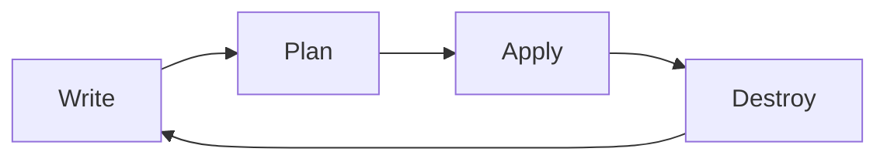

# Terraform CLI

## Introduction

The Terraform Command Line Interface (CLI) is your primary interface for working with Terraform configurations. It provides a consistent workflow for managing infrastructure across various providers such as AWS, Azure, Google Cloud, and many others. Whether you're creating new resources, modifying existing ones, or destroying infrastructure, the Terraform CLI is your go-to tool that translates your declarative configuration files into actual infrastructure changes.

In this guide, we'll explore the most important Terraform CLI commands that you'll use in your day-to-day infrastructure management, understand their purpose, and see how they fit into the Terraform workflow.

## Installing the Terraform CLI

Before diving into the commands, let's make sure you have Terraform installed:

### For macOS (using Homebrew):

```bash
brew install terraform
```

### For Windows (using Chocolatey):

```bash
choco install terraform
```

### For Linux:

```bash
wget -O- https://apt.releases.hashicorp.com/gpg | gpg --dearmor | sudo tee /usr/share/keyrings/hashicorp-archive-keyring.gpg
echo "deb [signed-by=/usr/share/keyrings/hashicorp-archive-keyring.gpg] https://apt.releases.hashicorp.com $(lsb_release -cs) main" | sudo tee /etc/apt/sources.list.d/hashicorp.list
sudo apt-get update && sudo apt-get install terraform
```

Verify your installation:

```bash
terraform -version
```

## The Terraform Workflow

The core Terraform workflow consists of three main steps:



Let's explore the commands that correspond to each step in this workflow.

## Key Terraform CLI Commands

### `terraform init`

The `terraform init` command initializes a working directory containing Terraform configuration files. It's the first command you should run after writing a new Terraform configuration or cloning an existing one.

What this command does:
- Downloads and installs providers defined in your configuration
- Initializes the backend where Terraform will store its state
- Downloads and installs modules referenced in your configuration

**Example:**

```bash
$ terraform init

Initializing the backend...

Initializing provider plugins...
- Finding hashicorp/aws versions matching "~> 4.0"...
- Installing hashicorp/aws v4.67.0...
- Installed hashicorp/aws v4.67.0 (signed by HashiCorp)

Terraform has been successfully initialized!

You may now begin working with Terraform. Try running "terraform plan" to see
any changes that are required for your infrastructure.
```

### `terraform fmt`

The `terraform fmt` command automatically updates configurations in the current directory for readability and consistency. It's a good practice to run this command before committing your code.

**Example:**

Before formatting:
```hcl
resource "aws_instance" "example" {
ami           = "ami-0c55b159cbfafe1f0"
instance_type = "t2.micro"
tags = {
    Name = "example-instance"
}
}
```

Command:
```bash
$ terraform fmt
```

After formatting:
```hcl
resource "aws_instance" "example" {
  ami           = "ami-0c55b159cbfafe1f0"
  instance_type = "t2.micro"
  tags = {
    Name = "example-instance"
  }
}
```

### `terraform validate`

The `terraform validate` command checks whether a configuration is syntactically valid and internally consistent. It's a good idea to run this after writing or making changes to your configuration.

**Example:**

```bash
$ terraform validate

Success! The configuration is valid.
```

If there are errors:

```bash
$ terraform validate

Error: Missing required argument

The argument "region" is required, but no definition was found.
```

### `terraform plan`

The `terraform plan` command creates an execution plan, showing what actions Terraform will take to change real infrastructure to match your configuration. This is a "dry run" and doesn't make any changes.

**Example:**

```bash
$ terraform plan

Terraform used the selected providers to generate the following execution plan.
Resource actions are indicated with the following symbols:
  + create

Terraform will perform the following actions:

  # aws_instance.example will be created
  + resource "aws_instance" "example" {
      + ami                          = "ami-0c55b159cbfafe1f0"
      + instance_type                = "t2.micro"
      + tags                         = {
          + "Name" = "example-instance"
        }
      # (other attributes omitted for brevity)
    }

Plan: 1 to add, 0 to change, 0 to destroy.
```

You can save the plan to a file for later use:

```bash
$ terraform plan -out=tfplan
```

### `terraform apply`

The `terraform apply` command executes the actions proposed in a Terraform plan. It's used to create, update, or destroy infrastructure.

**Example:**

```bash
$ terraform apply

Terraform used the selected providers to generate the following execution plan.
Resource actions are indicated with the following symbols:
  + create

Terraform will perform the following actions:

  # aws_instance.example will be created
  + resource "aws_instance" "example" {
      + ami                          = "ami-0c55b159cbfafe1f0"
      + instance_type                = "t2.micro"
      + tags                         = {
          + "Name" = "example-instance"
        }
      # (other attributes omitted for brevity)
    }

Plan: 1 to add, 0 to change, 0 to destroy.

Do you want to perform these actions?
  Terraform will perform the actions described above.
  Only 'yes' will be accepted to confirm.

  Enter a value: yes

aws_instance.example: Creating...
aws_instance.example: Creation complete after 42s [id=i-1234567890abcdef0]

Apply complete! Resources: 1 added, 0 changed, 0 destroyed.
```

If you've saved a plan, you can apply it directly:

```bash
$ terraform apply tfplan
```

### `terraform destroy`

The `terraform destroy` command destroys all resources managed by your Terraform configuration. It's like `terraform apply` but specifically plans a destroy operation.

**Example:**

```bash
$ terraform destroy

Terraform used the selected providers to generate the following execution plan.
Resource actions are indicated with the following symbols:
  - destroy

Terraform will perform the following actions:

  # aws_instance.example will be destroyed
  - resource "aws_instance" "example" {
      - ami                          = "ami-0c55b159cbfafe1f0" -> null
      - instance_type                = "t2.micro" -> null
      - tags                         = {
          - "Name" = "example-instance"
        } -> null
      # (other attributes omitted for brevity)
    }

Plan: 0 to add, 0 to change, 1 to destroy.

Do you want to perform these actions?
  Terraform will perform the actions described above.
  Only 'yes' will be accepted to confirm.

  Enter a value: yes

aws_instance.example: Destroying...
aws_instance.example: Destruction complete after 32s

Destroy complete! Resources: 1 destroyed.
```

### `terraform state`

The `terraform state` command is used to manage the Terraform state file. It has several subcommands:

#### `terraform state list`

Lists all resources in the state:

```bash
$ terraform state list
aws_instance.example
aws_s3_bucket.data
```

#### `terraform state show`

Shows the attributes of a specific resource:

```bash
$ terraform state show aws_instance.example
# aws_instance.example:
resource "aws_instance" "example" {
    ami                          = "ami-0c55b159cbfafe1f0"
    instance_type                = "t2.micro"
    tags                         = {
        "Name" = "example-instance"
    }
    # (other attributes omitted for brevity)
}
```

#### `terraform state mv`

Moves an item in the state, which is useful when you want to rename a resource:

```bash
$ terraform state mv aws_instance.example aws_instance.production
Move "aws_instance.example" to "aws_instance.production"
Successfully moved 1 object(s).
```

#### `terraform state rm`

Removes items from the state, which is useful when you want to manage a resource outside of Terraform:

```bash
$ terraform state rm aws_instance.example
Removed aws_instance.example
Successfully removed 1 resource instance(s).
```

### `terraform output`

The `terraform output` command is used to extract the values of output variables from the state file.

**Example:**

If your configuration has outputs defined:

```hcl
output "instance_ip" {
  value = aws_instance.example.public_ip
}

output "instance_id" {
  value = aws_instance.example.id
}
```

You can view all outputs:

```bash
$ terraform output
instance_id = "i-1234567890abcdef0"
instance_ip = "203.0.113.10"
```

Or a specific output:

```bash
$ terraform output instance_ip
"203.0.113.10"
```

### `terraform import`

The `terraform import` command imports existing infrastructure into your Terraform state. This is useful when you want to bring existing resources under Terraform management.

**Example:**

```bash
$ terraform import aws_instance.example i-1234567890abcdef0
aws_instance.example: Importing from ID "i-1234567890abcdef0"...
aws_instance.example: Import prepared!
  Prepared aws_instance for import
aws_instance.example: Refreshing state... [id=i-1234567890abcdef0]

Import successful!

The resources that were imported are shown above. These resources are now in
your Terraform state and will henceforth be managed by Terraform.
```

### `terraform workspace`

Terraform workspaces allow you to manage multiple states within a single directory. This is useful for managing different environments (development, staging, production) with the same configuration.

#### `terraform workspace list`

Lists all workspaces:

```bash
$ terraform workspace list
* default
  development
  production
```

#### `terraform workspace new`

Creates a new workspace:

```bash
$ terraform workspace new staging
Created and switched to workspace "staging"!

You're now on a new, empty workspace. Workspaces isolate their state,
so if you run "terraform plan" Terraform will not see any existing state
for this configuration.
```

#### `terraform workspace select`

Switches to another workspace:

```bash
$ terraform workspace select production
Switched to workspace "production".
```

## Real-World Example: Creating a Web Server on AWS

Let's see a complete example of using the Terraform CLI to create an AWS EC2 instance that serves as a web server.

### Step 1: Create the Configuration Files

Create a file named `main.tf`:

```hcl
provider "aws" {
  region = "us-west-2"
}

resource "aws_instance" "web_server" {
  ami           = "ami-0c55b159cbfafe1f0"
  instance_type = "t2.micro"
  
  user_data = <<-EOF
              #!/bin/bash
              echo "Hello, World!" > index.html
              nohup python -m SimpleHTTPServer 80 &
              EOF
              
  tags = {
    Name = "terraform-example-web-server"
  }
}

output "public_ip" {
  value = aws_instance.web_server.public_ip
}
```

### Step 2: Initialize the Directory

```bash
$ terraform init

Initializing the backend...

Initializing provider plugins...
- Finding hashicorp/aws versions matching "~> 4.0"...
- Installing hashicorp/aws v4.67.0...
- Installed hashicorp/aws v4.67.0 (signed by HashiCorp)

Terraform has been successfully initialized!
```

### Step 3: Format and Validate the Configuration

```bash
$ terraform fmt
$ terraform validate

Success! The configuration is valid.
```

### Step 4: Plan the Changes

```bash
$ terraform plan

Terraform used the selected providers to generate the following execution plan.
Resource actions are indicated with the following symbols:
  + create

Terraform will perform the following actions:

  # aws_instance.web_server will be created
  + resource "aws_instance" "web_server" {
      + ami                          = "ami-0c55b159cbfafe1f0"
      + instance_type                = "t2.micro"
      + user_data                    = "#!/bin/bash
echo \"Hello, World!\" > index.html
nohup python -m SimpleHTTPServer 80 &
"
      + tags                         = {
          + "Name" = "terraform-example-web-server"
        }
      # (other attributes omitted for brevity)
    }

Plan: 1 to add, 0 to change, 0 to destroy.

Changes to Outputs:
  + public_ip = (known after apply)
```

### Step 5: Apply the Changes

```bash
$ terraform apply

# Same output as plan, followed by:

Do you want to perform these actions?
  Terraform will perform the actions described above.
  Only 'yes' will be accepted to confirm.

  Enter a value: yes

aws_instance.web_server: Creating...
aws_instance.web_server: Creation complete after 45s [id=i-0abc123def456789]

Apply complete! Resources: 1 added, 0 changed, 0 destroyed.

Outputs:

public_ip = "203.0.113.10"
```

### Step 6: Access the Web Server

You can now access your web server by visiting the IP address in your browser:

```bash
$ curl http://203.0.113.10
Hello, World!
```

### Step 7: Destroy the Infrastructure

When you're done experimenting:

```bash
$ terraform destroy

# Output showing planned destruction...

Do you want to perform these actions?
  Terraform will perform the actions described above.
  Only 'yes' will be accepted to confirm.

  Enter a value: yes

aws_instance.web_server: Destroying...
aws_instance.web_server: Destruction complete after 35s

Destroy complete! Resources: 1 destroyed.
```

## Common Command Options

Many Terraform commands support additional options:

### `-auto-approve`

Skips interactive approval of plan. Use with caution!

```bash
$ terraform apply -auto-approve
$ terraform destroy -auto-approve
```

### `-var`

Sets a value for an input variable:

```bash
$ terraform apply -var="instance_type=t2.micro"
```

### `-var-file`

Specifies a file containing variable values:

```bash
$ terraform apply -var-file="prod.tfvars"
```

### `-target`

Limits operations to only the specified resource:

```bash
$ terraform apply -target=aws_instance.example
```

## Troubleshooting Tips

### 1. Debug Logs

Enable detailed logs for troubleshooting:

```bash
$ export TF_LOG=DEBUG
$ terraform apply
# Very verbose output
```

Log levels: TRACE, DEBUG, INFO, WARN, ERROR

### 2. State Lock Issues

If Terraform can't acquire a state lock:

```bash
$ terraform force-unlock LOCK_ID
```

### 3. Provider Plugin Issues

If you have issues with providers:

```bash
$ rm -rf .terraform/
$ terraform init
```

## Best Practices

1. **Version Control**: Always store your Terraform configurations in version control.
2. **Format Before Commit**: Run `terraform fmt` before committing your code.
3. **Validate Regularly**: Run `terraform validate` to catch syntax errors early.
4. **Always Plan**: Always run `terraform plan` before applying changes.
5. **Use Workspaces**: Use workspaces to manage