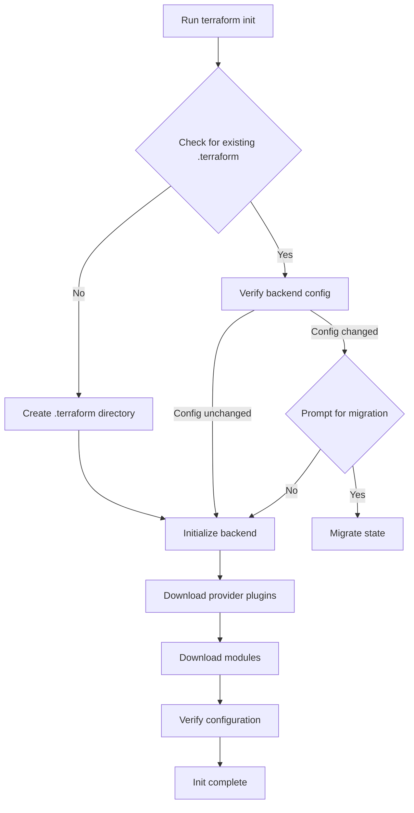

# Terraform Init

## Introduction

The `terraform init` command is the first command you should run after writing a new Terraform configuration or cloning an existing one. It initializes the working directory containing your Terraform configuration files, preparing it for use with Terraform.

Think of `terraform init` as the "setup wizard" for your Terraform project. It performs several critical tasks:

- Downloads and installs provider plugins
- Initializes backend configuration for state storage
- Sets up module dependencies
- Verifies your configuration for basic validity

Without running `terraform init` first, other Terraform commands like `plan`, `apply`, or `destroy` will not work. Let's explore this essential command in detail!

## Basic Usage

The most straightforward way to use the command is simply:

```bash
terraform init
```

Let's see what happens when we run this command in a new directory with some basic Terraform configuration files:

```bash
$ terraform init

Initializing the backend...

Initializing provider plugins...
- Finding hashicorp/aws versions matching "~> 4.0"...
- Installing hashicorp/aws v4.67.0...
- Installed hashicorp/aws v4.67.0 (signed by HashiCorp)

Terraform has been successfully initialized!

You may now begin working with Terraform. Try running "terraform plan" to see
any changes that are required for your infrastructure. All Terraform commands
should now work.

If you ever set or change modules or backend configuration for Terraform,
rerun this command to reinitialize your working directory. If you forget, other
commands will detect it and remind you to do so if necessary.
```

## What Terraform Init Does

### 1. Provider Plugin Installation

Terraform uses provider plugins to interact with cloud providers, SaaS platforms, and other APIs. When you run `terraform init`, it:

- Reads your configuration to determine which providers you need
- Downloads the required provider plugins from the Terraform Registry
- Installs them in a hidden subdirectory (`.terraform/providers/`)

For example, if your configuration includes AWS resources:

```hcl
provider "aws" {
  region = "us-west-2"
  version = "~> 4.0"
}

resource "aws_instance" "example" {
  ami           = "ami-0c55b159cbfafe1f0"
  instance_type = "t2.micro"
}
```

When you run `terraform init`, it will download and install the AWS provider plugin.

### 2. Backend Initialization

Terraform stores state information about your managed infrastructure in a "backend." By default, this is a local file named `terraform.tfstate`, but you can configure Terraform to store state remotely (which is recommended for team environments).

When you run `terraform init`, it configures the backend according to your specifications:

```hcl
terraform {
  backend "s3" {
    bucket = "my-terraform-state"
    key    = "prod/terraform.tfstate"
    region = "us-east-1"
  }
}
```

With this configuration, `terraform init` will set up Terraform to store state in an S3 bucket.

### 3. Module Installation

If your configuration uses modules (reusable components), `terraform init` downloads them from their source locations (like GitHub, Terraform Registry, or local paths) and places them in the `.terraform/modules` directory.

```hcl
module "vpc" {
  source = "terraform-aws-modules/vpc/aws"
  version = "3.14.0"
  
  name = "my-vpc"
  cidr = "10.0.0.0/16"
  # other parameters...
}
```

When you run `terraform init`, it will download this module and make it available for use.

## Common Options and Flags

### `-upgrade`

By default, `terraform init` will not upgrade provider versions if a version is already installed. Use the `-upgrade` flag to get the newest versions that match your configuration:

```bash
terraform init -upgrade
```

This is useful when you want to update providers without changing your configuration.

### `-reconfigure`

If you change your backend configuration and want to start fresh:

```bash
terraform init -reconfigure
```

This ignores any existing configuration and forces Terraform to reconfigure the backend.

### `-migrate-state`

When changing backend types (e.g., from local to S3):

```bash
terraform init -migrate-state
```

This will copy your existing state to the new backend configuration.

### `-backend=false`

To skip backend initialization:

```bash
terraform init -backend=false
```

This is useful for quick initialization when you don't need state operations.

## Real-World Example: Setting Up a Team Project

Let's walk through a complete example of setting up a new Terraform project for a team:

1. First, create your main configuration files:

```hcl
# main.tf
terraform {
  required_providers {
    aws = {
      source  = "hashicorp/aws"
      version = "~> 4.0"
    }
  }
  
  backend "s3" {
    bucket         = "company-terraform-states"
    key            = "projects/website/terraform.tfstate"
    region         = "us-east-1"
    dynamodb_table = "terraform-locks"
    encrypt        = true
  }
}

provider "aws" {
  region = "us-east-1"
}

module "vpc" {
  source = "terraform-aws-modules/vpc/aws"
  version = "3.14.0"
  
  name = "website-vpc"
  cidr = "10.0.0.0/16"
  
  azs             = ["us-east-1a", "us-east-1b", "us-east-1c"]
  private_subnets = ["10.0.1.0/24", "10.0.2.0/24", "10.0.3.0/24"]
  public_subnets  = ["10.0.101.0/24", "10.0.102.0/24", "10.0.103.0/24"]
  
  enable_nat_gateway = true
}
```

2. Run the `terraform init` command:

```bash
$ terraform init

Initializing the backend...
Acquiring state lock. This may take a few moments...

Initializing provider plugins...
- Finding hashicorp/aws versions matching "~> 4.0"...
- Installing hashicorp/aws v4.67.0...
- Installed hashicorp/aws v4.67.0 (signed by HashiCorp)

Initializing modules...
- vpc in .terraform/modules/vpc

Terraform has been successfully initialized!
```

3. Now the project is ready for all team members to use. They can clone the repository and run `terraform init` to get the same setup.

## Working with Terraform Init in CI/CD Pipelines

In automated environments, you might want to run `terraform init` non-interactively:

```bash
terraform init -input=false
```

For a complete CI/CD pipeline example:

```bash
#!/bin/bash
# Example CI/CD script

# Initialize Terraform without prompts
terraform init -input=false

# Check formatting
terraform fmt -check

# Validate configuration
terraform validate

# Plan changes (output to file for approval stage)
terraform plan -out=tfplan -input=false

# In an approval stage, you would inspect the plan

# Apply changes
terraform apply -input=false tfplan
```

## Troubleshooting Common Issues

### Provider Installation Failures

If you see errors like:

```
Error: Failed to install provider
```

You might:
- Be behind a firewall blocking access to the Terraform Registry
- Have network connectivity issues
- Need to configure a proxy

Solution: Consider using a [provider mirror](https://developer.hashicorp.com/terraform/cli/config/config-file#provider-installation) or the `-plugin-dir` option to specify a local directory with provider binaries.

### Backend Configuration Errors

When you see:

```
Error: Backend configuration changed
```

This usually means you've changed backend settings after previously initializing.

Solution: Run `terraform init -reconfigure` or `terraform init -migrate-state` depending on whether you want to start fresh or migrate existing state.

### Module Installation Issues

For errors like:

```
Error: Could not download module
```

Check:
- Network connectivity to the module source
- Correct version specification
- Proper authentication if using private repositories

## Best Practices

1. **Version Control**: Always include backend and provider configurations in version control, but don't commit the `.terraform` directory.

2. **Provider Versions**: Always specify provider versions to ensure consistent behavior across environments:

```hcl
terraform {
  required_providers {
    aws = {
      source  = "hashicorp/aws"
      version = "~> 4.0"
    }
  }
}
```

3. **Remote State**: Use remote state backends in team environments to avoid conflicts:

```hcl
terraform {
  backend "s3" {
    bucket         = "terraform-states"
    key            = "project/terraform.tfstate"
    region         = "us-east-1"
    dynamodb_table = "terraform-locks"
    encrypt        = true
  }
}
```

4. **Consistent Initialization**: Always run `terraform init` after pulling changes from version control to ensure your environment is up-to-date.

## Interactive Flowchart: Terraform Init Process



## Summary

`terraform init` is the essential first step in any Terraform workflow. It:

1. Downloads and installs provider plugins
2. Sets up your backend for state storage
3. Downloads modules
4. Prepares your working directory for other Terraform commands

By understanding how `terraform init` works and its available options, you can ensure smooth Terraform operations and avoid common pitfalls in your infrastructure management workflow.

## Additional Resources

- [Official Terraform Init Documentation](https://developer.hashicorp.com/terraform/cli/commands/init)
- [Terraform Backend Configuration](https://developer.hashicorp.com/terraform/language/settings/backends/configuration)
- [Provider Configuration](https://developer.hashicorp.com/terraform/language/providers/configuration)

## Exercises

1. Create a simple Terraform configuration using the AWS provider and initialize it.
2. Modify your configuration to use a remote S3 backend and observe how `terraform init` handles the change.
3. Create a configuration with multiple providers (e.g., AWS and Azure) and initialize it.
4. Try initializing a configuration with a module from the Terraform Registry.
5. Practice troubleshooting by intentionally creating an invalid provider version constraint and fixing it.