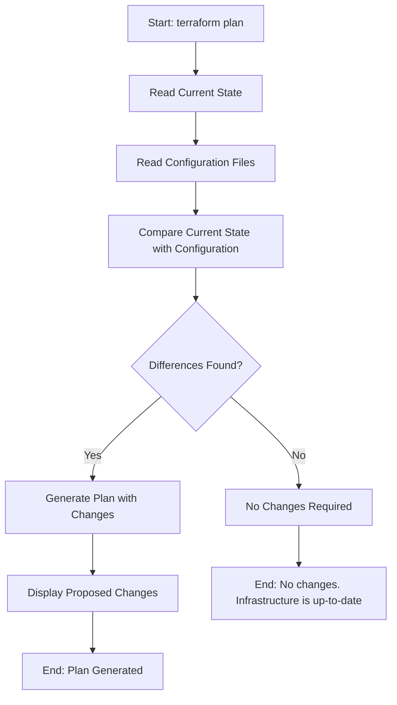

# Terraform Plan

## Introduction

When working with infrastructure as code using Terraform, one of the most important steps before making any changes to your infrastructure is to verify what actions Terraform will take. This is where the `terraform plan` command becomes invaluable.

`terraform plan` allows you to preview the changes that Terraform will make to your infrastructure before actually applying those changes. Think of it as a "dry run" that shows you exactly what would happen if you were to execute `terraform apply`. This preview helps you catch potential issues, verify that Terraform will do what you expect, and avoid costly mistakes.

## Understanding terraform plan

### Basic Syntax

The basic syntax for the terraform plan command is:

```bash
terraform plan [options]
```

When you run this command, Terraform will:

1. Read the current state of any already-existing remote objects to make sure the state is up-to-date
2. Compare the current configuration to the prior state and note any differences
3. Propose a set of change actions that should make the remote objects match the configuration

### Plan Output

The output of `terraform plan` consists of several sections:

```
Terraform will perform the following actions:

  # aws_instance.example will be created
  + resource "aws_instance" "example" {
      + ami                          = "ami-0c55b159cbfafe1f0"
      + instance_type                = "t2.micro"
      + ...
    }

Plan: 1 to add, 0 to change, 0 to destroy.
```

The symbols in the output indicate the type of action:
- `+` means a resource will be created
- `-` means a resource will be destroyed
- `~` means a resource will be modified in-place
- `-/+` means a resource will be destroyed and recreated

At the end of the output, Terraform provides a summary of the actions it will take: the number of resources to add, change, and destroy.

## Working with terraform plan

### Basic Example

Let's look at a simple example. Create a file named `main.tf` with the following content:

```hcl
provider "aws" {
  region = "us-west-2"
}

resource "aws_instance" "example" {
  ami           = "ami-0c55b159cbfafe1f0"
  instance_type = "t2.micro"
  tags = {
    Name = "terraform-example"
  }
}
```

Now, let's run the plan command:

```bash
terraform init
terraform plan
```

The output might look like this:

```
Terraform used the selected providers to generate the following execution plan. Resource actions are indicated with the following symbols:
  + create

Terraform will perform the following actions:

  # aws_instance.example will be created
  + resource "aws_instance" "example" {
      + ami                          = "ami-0c55b159cbfafe1f0"
      + arn                          = (known after apply)
      + associate_public_ip_address  = (known after apply)
      + availability_zone            = (known after apply)
      + instance_type                = "t2.micro"
      + tags                         = {
          + "Name" = "terraform-example"
        }
      # ... other attributes ...
    }

Plan: 1 to add, 0 to change, 0 to destroy.
```

This tells us Terraform will create one new AWS EC2 instance when we run `terraform apply`.

### Modifying Resources

Now, let's modify our configuration to see how Terraform handles changes. Update the `main.tf` file:

```hcl
provider "aws" {
  region = "us-west-2"
}

resource "aws_instance" "example" {
  ami           = "ami-0c55b159cbfafe1f0"
  instance_type = "t2.small"  # Changed from t2.micro to t2.small
  tags = {
    Name = "terraform-example"
    Environment = "dev"  # Added a new tag
  }
}
```

When we run `terraform plan` again, the output will look like:

```
Terraform used the selected providers to generate the following execution plan. Resource actions are indicated with the following symbols:
  ~ update in-place

Terraform will perform the following actions:

  # aws_instance.example will be updated in-place
  ~ resource "aws_instance" "example" {
        ami                          = "ami-0c55b159cbfafe1f0"
      ~ instance_type                = "t2.micro" -> "t2.small"
      ~ tags                         = {
          + "Environment" = "dev"
            "Name"        = "terraform-example"
        }
      # ... other attributes ...
    }

Plan: 0 to add, 1 to change, 0 to destroy.
```

Terraform will update the existing instance in-place, changing its instance type and adding a new tag.

### Destroying Resources

If we want to see what happens when we remove a resource, we could comment out or delete the `aws_instance` block and run `terraform plan` again:

```
Terraform used the selected providers to generate the following execution plan. Resource actions are indicated with the following symbols:
  - destroy

Terraform will perform the following actions:

  # aws_instance.example will be destroyed
  - resource "aws_instance" "example" {
      - ami                          = "ami-0c55b159cbfafe1f0" -> null
      - instance_type                = "t2.small" -> null
      - tags                         = {
          - "Environment" = "dev"
          - "Name"        = "terraform-example"
        } -> null
      # ... other attributes ...
    }

Plan: 0 to add, 0 to change, 1 to destroy.
```

This shows Terraform will destroy the EC2 instance.

## Advanced terraform plan Features

### Saving a Plan File

You can save the plan output to a file and then apply it later:

```bash
terraform plan -out=tfplan
```

This creates a file called `tfplan` that contains all the changes that Terraform would make. You can then apply this specific plan:

```bash
terraform apply tfplan
```

This ensures that what you're applying is exactly what you reviewed during the planning phase.

### Specifying Variables

If your Terraform configuration uses variables, you can provide them during the plan:

```bash
terraform plan -var="instance_type=t2.medium"
```

Or using a variable file:

```bash
terraform plan -var-file="dev.tfvars"
```

### Targeting Specific Resources

You can focus the plan on specific resources:

```bash
terraform plan -target=aws_instance.example
```

This is useful when working with large configurations where you only want to see changes to specific resources.

## The Planning Process Visualized



## Real-world Example: Planning a Web Application Infrastructure

Let's look at a practical example where we plan a simple web application infrastructure.

```hcl
provider "aws" {
  region = "us-east-1"
}

# VPC for the application
resource "aws_vpc" "app_vpc" {
  cidr_block = "10.0.0.0/16"
  tags = {
    Name = "app-vpc"
  }
}

# Public subnet
resource "aws_subnet" "public" {
  vpc_id            = aws_vpc.app_vpc.id
  cidr_block        = "10.0.1.0/24"
  availability_zone = "us-east-1a"
  tags = {
    Name = "public-subnet"
  }
}

# EC2 instance for web server
resource "aws_instance" "web_server" {
  ami           = "ami-0c55b159cbfafe1f0"
  instance_type = "t2.micro"
  subnet_id     = aws_subnet.public.id
  tags = {
    Name = "web-server"
  }
}

# S3 bucket for static assets
resource "aws_s3_bucket" "assets" {
  bucket = "my-app-assets-bucket"
  tags = {
    Name = "Static Assets"
  }
}
```

When we run `terraform plan` on this configuration, Terraform will show us that it plans to create:
1. A new VPC
2. A public subnet within that VPC
3. An EC2 instance in the public subnet
4. An S3 bucket for static assets

This helps us verify that our infrastructure matches our design before we actually create anything in AWS.

## Common Issues and Troubleshooting

### 1. Plan Shows Unexpected Changes

If the plan shows changes you don't expect, it could be due to:
- Resources created outside of Terraform
- State file is out of sync
- Provider version differences

Solution: Run `terraform refresh` to update the state or use `terraform import` to bring existing resources under Terraform management.

### 2. Error: No configuration files

```
Error: No configuration files
```

This occurs when you run `terraform plan` in a directory with no `.tf` files.

Solution: Make sure you are in the correct directory containing your Terraform configuration files.

### 3. Error: Provider configuration not present

Solution: Run `terraform init` before `terraform plan` to initialize providers.

## Best Practices

1. **Always Plan Before Applying**: Get in the habit of running `terraform plan` before `terraform apply`.

2. **Review Plans Carefully**: Read through the plan output thoroughly to understand all changes.

3. **Save Plans for Important Changes**: Use `-out` to save plans for significant infrastructure changes.

4. **Version Control Your Terraform Files**: Keep your `.tf` files in version control, but exclude plan files and state files.

5. **Use Plan in CI/CD Pipelines**: Include `terraform plan` in your CI/CD pipelines to catch issues early.

## Summary

`terraform plan` is a crucial command in the Terraform workflow that helps you:
- Preview changes before applying them
- Catch potential issues early
- Understand how your code maps to actual infrastructure
- Avoid costly mistakes

By incorporating `terraform plan` into your workflow, you ensure that your infrastructure changes are intentional and understood before they're applied.

## Additional Resources

- [Terraform CLI Documentation](https://www.terraform.io/docs/cli/commands/plan.html)
- [Understanding Terraform Plan](https://learn.hashicorp.com/tutorials/terraform/plan)

## Exercises

1. Create a simple Terraform configuration for a resource type of your choice and run `terraform plan` to see what would be created.

2. Modify your configuration and run `terraform plan` again to see what changes Terraform would make.

3. Try using the `-out` flag to save your plan to a file.

4. Try using the `-var` flag to override a variable in your configuration during planning.

5. Create a configuration with multiple resources and use the `-target` flag to plan changes to only one resource.