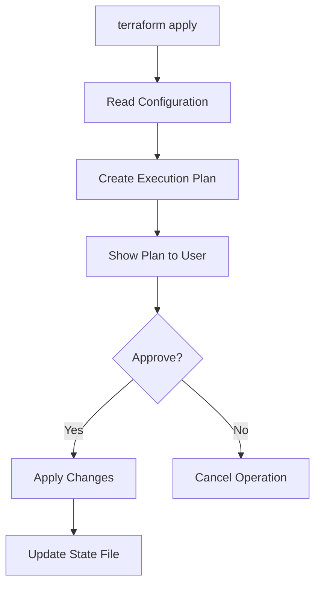

# Terraform Apply

## Introduction

`terraform apply` is one of the most important commands in Terraform, an Infrastructure as Code (IaC) tool. This command is used to apply the changes required to reach the desired state of your infrastructure as defined in your Terraform configuration files. In simpler terms, it's the command that takes your infrastructure code and turns it into actual cloud resources.

In this tutorial, we'll explore the `terraform apply` command in depth, understanding its purpose, how it works, and how to use it effectively in your infrastructure management workflows.

## Prerequisites

Before diving into `terraform apply`, make sure you:

- Have [Terraform installed](https://www.terraform.io/downloads) on your system
- Understand basic Terraform concepts like providers, resources, and state
- Have valid Terraform configuration files (.tf) prepared

## How Terraform Apply Works

The `terraform apply` command follows this general workflow:



Let's break down what happens step by step:

1. **Read Configuration**: Terraform reads all `.tf` files in your directory
2. **Create Execution Plan**: Terraform compares your configuration against the current state
3. **Show Plan**: The plan shows what changes will be made (create, update, destroy)
4. **User Approval**: By default, Terraform asks for confirmation
5. **Apply Changes**: Terraform makes API calls to create/modify/delete resources
6. **Update State**: Terraform updates the state file with the new infrastructure state

## Basic Usage

### Simple Apply Command

The most basic form of the command is:

```bash
terraform apply
```

When you run this, Terraform will:
1. Generate an execution plan
2. Display the plan
3. Ask for your approval
4. Apply the changes after approval

### Sample Output

Here's what the output might look like when running `terraform apply` on a simple AWS EC2 instance configuration:

```
Terraform will perform the following actions:

  # aws_instance.example will be created
  + resource "aws_instance" "example" {
      + ami                          = "ami-0c55b159cbfafe1f0"
      + arn                          = (known after apply)
      + associate_public_ip_address  = (known after apply)
      + availability_zone            = (known after apply)
      + cpu_core_count               = (known after apply)
      + cpu_threads_per_core         = (known after apply)
      + get_password_data            = false
      + host_id                      = (known after apply)
      + id                           = (known after apply)
      + instance_state               = (known after apply)
      + instance_type                = "t2.micro"
      + ipv6_address_count           = (known after apply)
      + ipv6_addresses               = (known after apply)
      + key_name                     = (known after apply)
      + outpost_arn                  = (known after apply)
      + password_data                = (known after apply)
      + placement_group              = (known after apply)
      + primary_network_interface_id = (known after apply)
      + private_dns                  = (known after apply)
      + private_ip                   = (known after apply)
      + public_dns                   = (known after apply)
      + public_ip                    = (known after apply)
      + security_groups              = (known after apply)
      + source_dest_check            = true
      + subnet_id                    = (known after apply)
      + tags                         = {
          + "Name" = "example-instance"
        }
      + tenancy                      = (known after apply)
      + vpc_security_group_ids       = (known after apply)
    }

Plan: 1 to add, 0 to change, 0 to destroy.

Do you want to perform these actions?
  Terraform will perform the actions described above.
  Only 'yes' will be accepted to approve.

  Enter a value:
```

## Advanced Options

### Auto-approve

If you want to skip the approval step (useful in automation scenarios), you can use:

```bash
terraform apply -auto-approve
```

This applies the changes immediately without asking for confirmation. Be careful with this in production environments!

### Targeting Specific Resources

You can target specific resources to apply:

```bash
terraform apply -target=aws_instance.example
```

This is useful when you want to update only specific parts of your infrastructure.

### Using Plan Files

You can create a plan file and apply it later:

```bash
terraform plan -out=tfplan
terraform apply tfplan
```

This approach is common in CI/CD pipelines where you might want to:
1. Generate the plan during the build phase
2. Have someone review it
3. Apply it during the deployment phase if approved

### Variables

You can provide variables during apply:

```bash
terraform apply -var="instance_count=5"
```

Or use var files:

```bash
terraform apply -var-file="prod.tfvars"
```

## Practical Example

Let's walk through a complete example. We'll create a simple AWS infrastructure with a VPC, subnet, and EC2 instance.

### Step 1: Create Configuration Files

Create a file named `main.tf` with the following content:

```hcl
provider "aws" {
  region = "us-west-2"
}

resource "aws_vpc" "main" {
  cidr_block = "10.0.0.0/16"
  
  tags = {
    Name = "main-vpc"
  }
}

resource "aws_subnet" "main" {
  vpc_id     = aws_vpc.main.id
  cidr_block = "10.0.1.0/24"
  
  tags = {
    Name = "main-subnet"
  }
}

resource "aws_instance" "web" {
  ami           = "ami-0c55b159cbfafe1f0"
  instance_type = "t2.micro"
  subnet_id     = aws_subnet.main.id
  
  tags = {
    Name = "web-server"
  }
}
```

### Step 2: Initialize Terraform

Before applying, you need to initialize your Terraform configuration:

```bash
terraform init
```

Output:
```
Initializing the backend...

Initializing provider plugins...
- Finding latest version of hashicorp/aws...
- Installing hashicorp/aws v4.15.0...
- Installed hashicorp/aws v4.15.0 (signed by HashiCorp)

Terraform has created a lock file .terraform.lock.hcl to record the provider
selections it made above. Include this file in your version control repository
so that Terraform can guarantee to make the same selections by default when
you run "terraform init" in the future.

Terraform has been successfully initialized!
```

### Step 3: Apply Configuration

Now, let's apply the configuration:

```bash
terraform apply
```

You'll see the execution plan showing the resources to be created:

```
Terraform used the selected providers to generate the following execution plan.
Resource actions are indicated with the following symbols:
  + create

Terraform will perform the following actions:

  # aws_instance.web will be created
  + resource "aws_instance" "web" {
      + ami                          = "ami-0c55b159cbfafe1f0"
      # ... (additional instance properties)
    }

  # aws_subnet.main will be created
  + resource "aws_subnet" "main" {
      + arn                             = (known after apply)
      + cidr_block                      = "10.0.1.0/24"
      # ... (additional subnet properties)
    }

  # aws_vpc.main will be created
  + resource "aws_vpc" "main" {
      + arn                              = (known after apply)
      + cidr_block                       = "10.0.0.0/16"
      # ... (additional vpc properties)
    }

Plan: 3 to add, 0 to change, 0 to destroy.

Do you want to perform these actions?
  Terraform will perform the actions described above.
  Only 'yes' will be accepted to approve.

  Enter a value: yes

aws_vpc.main: Creating...
aws_vpc.main: Creation complete after 2s [id=vpc-0a1b2c3d4e5f6g7h8]
aws_subnet.main: Creating...
aws_subnet.main: Creation complete after 1s [id=subnet-0a1b2c3d4e5f6g7h8]
aws_instance.web: Creating...
aws_instance.web: Still creating... [10s elapsed]
aws_instance.web: Still creating... [20s elapsed]
aws_instance.web: Creation complete after 30s [id=i-0a1b2c3d4e5f6g7h8]

Apply complete! Resources: 3 added, 0 changed, 0 destroyed.
```

### Step 4: Verify Created Resources

After applying, you can verify the resources were created by checking the AWS console or using the AWS CLI. You can also use `terraform show` to display the current state:

```bash
terraform show
```

## Common Issues and Troubleshooting

### Error: Resource Already Exists

If you try to create a resource that already exists outside of Terraform's management:

```
Error: Error creating instance: InvalidParameterValue: Value (my-instance-name)
for parameter virtualMachineName is invalid.
```

**Solution**: Import the existing resource into Terraform state:

```bash
terraform import aws_instance.example i-1234567890abcdef0
```

### Dependency Errors

When Terraform can't determine the correct order to create resources:

```
Error: Error creating instance: InvalidSubnetID: The subnet ID 'subnet-abcdef'
does not exist
```

**Solution**: Check your resource dependencies and make sure they're explicitly defined when needed:

```hcl
resource "aws_instance" "web" {
  # Explicitly define the dependency
  depends_on = [aws_subnet.main]
  
  ami           = "ami-0c55b159cbfafe1f0"
  instance_type = "t2.micro"
  subnet_id     = aws_subnet.main.id
}
```

### State Lock Errors

When someone else is modifying the same infrastructure:

```
Error: Error acquiring the state lock
```

**Solution**: If you're sure no one else is running Terraform, you can force unlock:

```bash
terraform force-unlock LOCK_ID
```

## Best Practices

1. **Always review the plan**: Never apply without reviewing what changes will be made
2. **Use version control**: Keep your Terraform files in a version control system
3. **Use workspaces**: Separate your environments (dev, staging, prod) using workspaces
4. **Modularize your code**: Break down complex infrastructure into reusable modules
5. **Use remote state**: Store your state file remotely for collaboration
6. **Lock your provider versions**: Prevent unexpected changes due to provider updates

## Terraform Apply in CI/CD Pipelines

Terraform apply works well in automated pipelines. Here's a common pattern:

1. **CI Build Stage**: Run `terraform plan -out=tfplan`
2. **Review Stage**: Have someone review the plan
3. **CD Deploy Stage**: Run `terraform apply tfplan`

This ensures that what you review is exactly what gets applied.

Example GitLab CI/CD pipeline:

```yaml
stages:
  - validate
  - plan
  - apply

validate:
  stage: validate
  script:
    - terraform init
    - terraform validate

plan:
  stage: plan
  script:
    - terraform init
    - terraform plan -out=tfplan
  artifacts:
    paths:
      - tfplan

apply:
  stage: apply
  script:
    - terraform init
    - terraform apply -auto-approve tfplan
  when: manual
  only:
    - master
```

## Summary

The `terraform apply` command is central to the Infrastructure as Code approach, allowing you to create, update, and manage infrastructure in a declarative way. By understanding how it works and following best practices, you can safely and efficiently manage your infrastructure across multiple environments.

Key points to remember:
- Terraform apply transforms your code into real infrastructure
- Always review the plan before applying
- Use targeting and variables for more control
- Incorporate apply into your CI/CD pipelines for automation
- Follow best practices for safe and effective infrastructure management

## Additional Resources

- [Official Terraform Documentation](https://www.terraform.io/docs/cli/commands/apply.html)
- [Terraform Best Practices](https://www.terraform-best-practices.com/)
- [Learn Terraform](https://learn.hashicorp.com/terraform)

## Exercises

1. Create a Terraform configuration for a simple web server and apply it
2. Make a change to your configuration and apply only that change using the target flag
3. Create a plan file, examine it, and then apply it
4. Set up a simple CI/CD pipeline that runs terraform apply
5. Practice handling common errors like dependency issues and resource conflicts