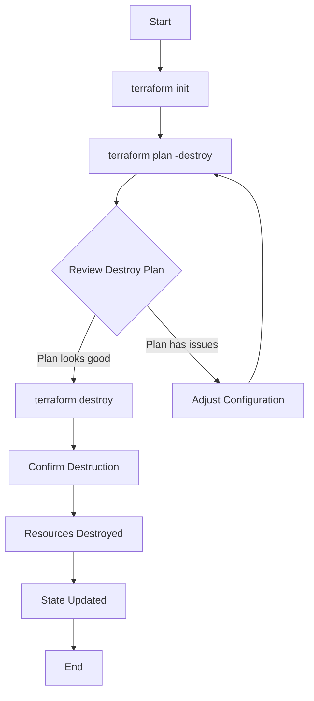

# Terraform Destroy

## Introduction

When working with Infrastructure as Code (IaC) using Terraform, creating resources is only half the story. Managing the complete lifecycle of your infrastructure includes the ability to cleanly and safely tear down resources when they're no longer needed. This is where the `terraform destroy` command comes into play.

The `terraform destroy` command is a powerful tool that allows you to remove all resources defined in your Terraform configuration. This functionality is crucial for:

- Cleaning up test environments
- Avoiding unnecessary cloud costs
- Managing the complete lifecycle of infrastructure
- Implementing ephemeral environments
- Ensuring your infrastructure remains manageable and under control

In this tutorial, we'll explore the `terraform destroy` command, its options, best practices, and real-world applications.

## Understanding Terraform Destroy

### What Does Terraform Destroy Do?

The `terraform destroy` command looks at your Terraform configuration files and state, then proceeds to destroy all the resources that were created by Terraform. It's essentially the opposite of `terraform apply`.

When you run `terraform destroy`, Terraform:

1. Reads your configuration files
2. Examines the current state file
3. Creates a destruction plan
4. After confirmation, systematically removes all managed resources
5. Updates the state file to reflect the changes

### Basic Usage

The basic syntax for the command is:

```bash
terraform destroy
```

When executed, Terraform will display a destruction plan showing everything that will be removed, and ask for confirmation before proceeding.

Here's an example output:

```
Terraform will perform the following actions:

  # aws_instance.example will be destroyed
  - resource "aws_instance" "example" {
      - ami                          = "ami-0c55b159cbfafe1f0" -> null
      - instance_type                = "t2.micro" -> null
      # ... additional attributes ...
    }

  # aws_s3_bucket.example will be destroyed
  - resource "aws_s3_bucket" "example" {
      - bucket                       = "my-terraform-example-bucket" -> null
      - acl                          = "private" -> null
      # ... additional attributes ...
    }

Plan: 0 to add, 0 to change, 2 to destroy.

Do you really want to destroy all resources?
  Terraform will destroy all your managed infrastructure, as shown above.
  There is no undo. Only 'yes' will be accepted to confirm.

  Enter a value:
```

To proceed with the destruction, you must type `yes`. This confirmation step helps prevent accidental destruction of resources.

## Destroy Options and Flags

The `terraform destroy` command can be customized with various flags to control its behavior:

### Important Flags

| Flag | Description |
|------|-------------|
| `-auto-approve` | Skip interactive approval of plan before applying |
| `-target=resource` | Target a specific resource for destruction |
| `-var 'name=value'` | Set a variable in the Terraform configuration |
| `-var-file=filename` | Set variables from a file |
| `-parallelism=n` | Limit the number of concurrent operations |

### Targeted Destruction

One of the most useful options is `-target`, which allows you to destroy specific resources rather than everything:

```bash
terraform destroy -target=aws_instance.example
```

This will only destroy the specified AWS instance, leaving all other resources intact.

## The Destroy Workflow

Let's walk through a typical destroy workflow:



### Step 1: Initialize the Working Directory

Before running destroy, ensure your Terraform environment is properly initialized:

```bash
terraform init
```

### Step 2: Preview the Destruction Plan (Optional)

You can preview what Terraform plans to destroy without making any actual changes:

```bash
terraform plan -destroy
```

This gives you a chance to review everything that will be destroyed before proceeding.

### Step 3: Execute the Destroy Command

Once you're ready to proceed:

```bash
terraform destroy
```

### Step 4: Verify Results

After the destruction completes, verify that all resources have been properly removed by checking your cloud provider's console or using appropriate CLI commands.

## Real-World Examples

Let's explore some practical examples of using `terraform destroy` in real-world scenarios.

### Example 1: Cleaning Up a Development Environment

Imagine you have a development environment with multiple resources defined in Terraform:

```hcl
# main.tf
provider "aws" {
  region = "us-west-2"
}

resource "aws_vpc" "dev_vpc" {
  cidr_block = "10.0.0.0/16"
  tags = {
    Name = "Development VPC"
    Environment = "Development"
  }
}

resource "aws_subnet" "dev_subnet" {
  vpc_id     = aws_vpc.dev_vpc.id
  cidr_block = "10.0.1.0/24"
  tags = {
    Name = "Development Subnet"
    Environment = "Development"
  }
}

resource "aws_instance" "dev_server" {
  ami           = "ami-0c55b159cbfafe1f0"
  instance_type = "t2.micro"
  subnet_id     = aws_subnet.dev_subnet.id
  tags = {
    Name = "Development Server"
    Environment = "Development"
  }
}
```

To clean up this entire environment at the end of the day to save costs:

```bash
terraform destroy
```

After confirmation, Terraform will destroy the EC2 instance, the subnet, and the VPC in the correct order (reversing the order of creation to handle dependencies).

### Example 2: Targeted Destruction of Resources

Sometimes you only need to remove specific parts of your infrastructure. For example, if you want to recreate just the EC2 instance from our previous example:

```bash
terraform destroy -target=aws_instance.dev_server
```

This will destroy only the EC2 instance while leaving the VPC and subnet intact.

The output will show that only the instance is being targeted:

```
Terraform will perform the following actions:

  # aws_instance.dev_server will be destroyed
  - resource "aws_instance" "dev_server" {
      - ami                          = "ami-0c55b159cbfafe1f0" -> null
      - instance_type                = "t2.micro" -> null
      # ... additional attributes ...
    }

Plan: 0 to add, 0 to change, 1 to destroy.

Do you really want to destroy all resources?
  Terraform will destroy all your managed infrastructure, as shown above.
  There is no undo. Only 'yes' will be accepted to confirm.

  Enter a value:
```

### Example 3: Using Variables with Destroy

If your Terraform configuration uses variables, you can specify them during the destroy process:

```hcl
# variables.tf
variable "environment" {
  description = "Environment to deploy to"
  type        = string
  default     = "development"
}
```

```hcl
# main.tf
resource "aws_instance" "server" {
  ami           = "ami-0c55b159cbfafe1f0"
  instance_type = "t2.micro"
  tags = {
    Name = "${var.environment} Server"
  }
}
```

To destroy with a specific environment variable:

```bash
terraform destroy -var="environment=staging"
```

## Best Practices for Using Terraform Destroy

To use `terraform destroy` safely and effectively, consider these best practices:

### 1. Always Review the Plan Before Confirming

Take time to carefully review what Terraform plans to destroy before typing "yes". This helps prevent unintended destruction of critical resources.

### 2. Use Workspaces to Isolate Environments

Terraform workspaces allow you to manage multiple environments with the same configuration files:

```bash
terraform workspace select development
terraform destroy
```

This ensures you're destroying resources in the intended environment.

### 3. Back Up Your State Before Destruction

Consider creating a backup of your state file before running destroy:

```bash
cp terraform.tfstate terraform.tfstate.backup
```

This can be invaluable if you need to recover information about destroyed resources.

### 4. Use Targeted Destroy When Appropriate

Rather than destroying everything, use targeted destruction when you only need to remove specific resources:

```bash
terraform destroy -target=module.database
```

### 5. Implement Safeguards in CI/CD Pipelines

If integrating Terraform in CI/CD pipelines, implement safeguards to prevent accidental destruction of production environments, such as:

- Requiring multiple approvals
- Limiting who can trigger destroy operations
- Using separate pipelines for different environments

## Common Challenges and Solutions

### Challenge: Dependencies Blocking Destruction

Sometimes Terraform cannot destroy resources due to dependencies.

**Solution**: Use `-target` to destroy resources in the correct order, or identify and remove the external dependencies first.

### Challenge: Resources Were Modified Outside of Terraform

If resources were modified manually outside of Terraform, the destroy operation might fail.

**Solution**: Use `terraform refresh` to update the state file before attempting the destroy operation:

```bash
terraform refresh
terraform destroy
```

### Challenge: State File Is Missing

If your state file is missing, Terraform won't know what resources to destroy.

**Solution**: If using remote state, ensure you have the correct backend configuration. If state is truly lost, you may need to manually clean up resources or import them back into Terraform.

## Summary

The `terraform destroy` command is an essential part of the Terraform workflow that allows you to cleanly remove infrastructure when it's no longer needed. Key points to remember:

- `terraform destroy` removes all resources defined in your Terraform configuration
- Use `-target` to destroy specific resources
- Always review the destruction plan before confirming
- Follow best practices to avoid unintended consequences
- The command completes the infrastructure lifecycle, allowing for true "Infrastructure as Code"

By mastering the `terraform destroy` command, you ensure that you have complete control over the entire lifecycle of your infrastructure, from creation to destruction, leading to better resource management and cost control.

## Additional Resources and Exercises

### Exercises

1. **Basic Destroy Exercise**:
   - Create a simple Terraform configuration with a few resources (e.g., an S3 bucket and a DynamoDB table)
   - Apply the configuration
   - Destroy the resources
   - Verify the resources were removed

2. **Targeted Destroy Exercise**:
   - Create a multi-resource configuration
   - Use targeted destroy to remove only specific resources
   - Observe how dependencies are handled

3. **Variable-Based Destruction**:
   - Create a configuration that uses variables to control resource creation
   - Destroy resources using different variable values
   - Observe how the different variables affect what gets destroyed

### Additional Resources

- [Official Terraform Documentation on Destroy Command](https://www.terraform.io/docs/cli/commands/destroy.html)
- [Terraform Best Practices Guide](https://www.terraform-best-practices.com/)
- HashiCorp Learn: [Terraform Core Workflow](https://learn.hashicorp.com/collections/terraform/core-workflow)