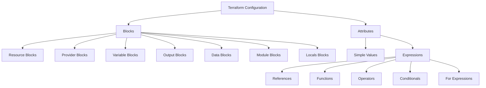

# Terraform HCL Syntax

## Introduction

HashiCorp Configuration Language (HCL) is the language used to write Terraform configuration files. It's a structured language specifically designed for defining infrastructure resources in a human-readable format. If you're getting started with Terraform, understanding HCL syntax is your foundation for creating, modifying, and managing infrastructure as code.

In this guide, we'll explore the basic building blocks of HCL and how they work together to define your infrastructure.

## HCL Basic Structure

HCL syntax primarily consists of **blocks** and **attributes**. Let's break down these fundamental components:

### Blocks

Blocks are containers that group content together. They have a type, optional labels, and a body containing arguments.

```hcl
block_type "optional_label" "another_optional_label" {
  // Block body - contains arguments
  key = value
}
```

Real-world examples of blocks include:

```hcl
# Resource block for creating an AWS EC2 instance
resource "aws_instance" "web_server" {
  ami           = "ami-0c55b159cbfafe1f0"
  instance_type = "t2.micro"
}

# Provider block for configuring AWS provider
provider "aws" {
  region = "us-west-2"
}
```

### Attributes

Attributes are simple key-value pairs that configure the properties of a block:

```hcl
key = value
```

Values can be:
- Strings: `"hello"`
- Numbers: `5`, `3.14`
- Booleans: `true`, `false`
- Lists: `["item1", "item2"]`
- Maps: `{key1 = "value1", key2 = "value2"}`

### Comments

HCL supports three forms of comments:

```hcl
# This is a single line comment

// This is also a single line comment

/*
This is a 
multi-line comment
*/
```

## Working with Variables and Expressions

### Variables

In Terraform, variables make your configurations more flexible and reusable. Variables are defined in a `variable` block:

```hcl
variable "instance_type" {
  description = "The type of EC2 instance to launch"
  type        = string
  default     = "t2.micro"
}
```

You can then reference these variables using the `var` keyword:

```hcl
resource "aws_instance" "example" {
  instance_type = var.instance_type
}
```

### Expressions

HCL supports various expressions for manipulating values:

#### String Interpolation

String interpolation allows you to include the result of an expression within a string:

```hcl
resource "aws_instance" "web" {
  tags = {
    Name = "Web server for ${var.environment}"
  }
}
```

#### Conditional Expressions

Terraform supports ternary conditional expressions:

```hcl
resource "aws_instance" "example" {
  instance_type = var.environment == "production" ? "m5.large" : "t2.micro"
}
```

#### For Expressions

For expressions create complex data structures by transforming one list or map into another:

```hcl
locals {
  subnet_ids = [
    "subnet-abcdef",
    "subnet-123456",
    "subnet-789012"
  ]
  
  # Create tags for each subnet
  subnet_tags = {
    for id in local.subnet_ids :
    id => "Subnet ${id}"
  }
}
```

## Common HCL Blocks

### Provider Block

The provider block configures a specific provider, which is a plugin that Terraform uses to create and manage resources:

```hcl
provider "aws" {
  region = "us-east-1"
  profile = "default"
}
```

### Resource Block

Resource blocks define infrastructure objects like virtual networks, compute instances, or DNS records:

```hcl
resource "aws_s3_bucket" "data" {
  bucket = "my-terraform-bucket"
  acl    = "private"

  tags = {
    Name        = "My bucket"
    Environment = "Dev"
  }
}
```

### Data Block

Data blocks fetch information from provider APIs or other Terraform states:

```hcl
data "aws_ami" "ubuntu" {
  most_recent = true

  filter {
    name   = "name"
    values = ["ubuntu/images/hvm-ssd/ubuntu-focal-20.04-amd64-server-*"]
  }

  filter {
    name   = "virtualization-type"
    values = ["hvm"]
  }

  owners = ["099720109477"] # Canonical's AWS account ID
}
```

### Output Block

Output blocks define values that will be highlighted to the user when Terraform applies, and can be queried using the terraform output command:

```hcl
output "instance_ip_addr" {
  value       = aws_instance.web.private_ip
  description = "The private IP address of the web server"
}
```

## Special Syntax Features

### Heredoc Strings

For multi-line strings, HCL provides heredoc syntax:

```hcl
user_data = <<-EOF
  #!/bin/bash
  echo "Hello, World!" > index.html
  nohup python -m SimpleHTTPServer 80 &
EOF
```

### Dynamic Blocks

Dynamic blocks let you dynamically construct repeatable nested blocks:

```hcl
resource "aws_security_group" "example" {
  name = "example"

  dynamic "ingress" {
    for_each = var.service_ports
    content {
      from_port   = ingress.value
      to_port     = ingress.value
      protocol    = "tcp"
      cidr_blocks = ["0.0.0.0/0"]
    }
  }
}
```

## Practical Example: Creating a Complete AWS Infrastructure

Let's build a practical example that brings together many of the HCL concepts we've covered. This example sets up a basic web server infrastructure on AWS:

```hcl
# Define the AWS provider
provider "aws" {
  region = var.aws_region
}

# Define variables
variable "aws_region" {
  description = "AWS region to deploy resources"
  default     = "us-west-2"
}

variable "vpc_cidr" {
  description = "CIDR block for the VPC"
  default     = "10.0.0.0/16"
}

variable "subnet_cidr" {
  description = "CIDR block for the subnet"
  default     = "10.0.1.0/24"
}

variable "instance_type" {
  description = "EC2 instance type"
  default     = "t2.micro"
}

# Create a VPC
resource "aws_vpc" "main" {
  cidr_block = var.vpc_cidr
  
  tags = {
    Name = "terraform-example-vpc"
  }
}

# Create a subnet within the VPC
resource "aws_subnet" "main" {
  vpc_id     = aws_vpc.main.id
  cidr_block = var.subnet_cidr
  
  tags = {
    Name = "terraform-example-subnet"
  }
}

# Create a security group
resource "aws_security_group" "web" {
  name        = "web-server-sg"
  description = "Allow HTTP/HTTPS and SSH traffic"
  vpc_id      = aws_vpc.main.id

  # HTTP access from anywhere
  ingress {
    from_port   = 80
    to_port     = 80
    protocol    = "tcp"
    cidr_blocks = ["0.0.0.0/0"]
  }

  # SSH access from anywhere (not recommended for production)
  ingress {
    from_port   = 22
    to_port     = 22
    protocol    = "tcp"
    cidr_blocks = ["0.0.0.0/0"]
  }

  # Outbound internet access
  egress {
    from_port   = 0
    to_port     = 0
    protocol    = "-1"
    cidr_blocks = ["0.0.0.0/0"]
  }
}

# Get the latest Amazon Linux AMI
data "aws_ami" "amazon_linux" {
  most_recent = true
  owners      = ["amazon"]
  
  filter {
    name   = "name"
    values = ["amzn2-ami-hvm-*-x86_64-gp2"]
  }
}

# Create an EC2 instance
resource "aws_instance" "web" {
  ami           = data.aws_ami.amazon_linux.id
  instance_type = var.instance_type
  subnet_id     = aws_subnet.main.id
  
  vpc_security_group_ids = [aws_security_group.web.id]
  
  user_data = <<-EOF
    #!/bin/bash
    yum update -y
    yum install -y httpd
    systemctl start httpd
    systemctl enable httpd
    echo "<h1>Hello from Terraform</h1>" > /var/www/html/index.html
  EOF
  
  tags = {
    Name = "terraform-example-webserver"
  }
}

# Output the public IP of the web server
output "web_server_ip" {
  value = aws_instance.web.public_ip
}
```

## HCL Syntax Visualization

Here's a diagram that illustrates the relationship between different HCL components:



## Best Practices for HCL

1. **Use consistent formatting**: Terraform includes a `terraform fmt` command that automatically formats your configuration files according to the recommended style.

2. **Modularize your code**: Use modules to encapsulate and reuse configuration.

3. **Use variables effectively**: Define variables with clear descriptions, types, and sensible defaults.

4. **Comment your code**: Include comments explaining complex logic or decisions.

5. **Follow naming conventions**: Use snake_case for resource names and descriptive identifiers.

6. **Version your configurations**: Use a version control system like Git to track changes.

7. **Validate before applying**: Always run `terraform validate` and `terraform plan` before applying changes.

## Summary

In this guide, we've covered the essentials of Terraform's HCL syntax:

- Basic structures like blocks and attributes
- Working with variables and expressions
- Common block types and their purposes
- Special syntax features like heredocs and dynamic blocks
- A practical example bringing everything together

HCL's declarative nature makes it powerful for defining infrastructure as code. By understanding these syntax elements, you're now ready to start creating your own Terraform configurations.

## Additional Resources

- Practice by creating a simple infrastructure for a different cloud provider
- Try implementing a multi-environment setup using variables and conditionals
- Experiment with the `terraform console` command to test expressions
- Consider these exercises:
  1. Create a configuration that provisions multiple similar resources using `count` or `for_each`
  2. Convert an existing manual infrastructure into Terraform HCL code
  3. Create a module that can be reused across different projects

## Next Steps

Now that you understand HCL syntax, you're ready to dive deeper into Terraform's state management, modules, and workflow commands.