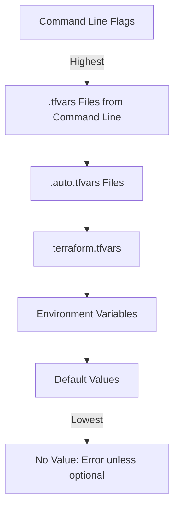

# Terraform Variables

## Introduction

Variables are a fundamental building block in Terraform that allow you to write more flexible, reusable, and maintainable infrastructure code. They serve as parameters for your Terraform configurations, enabling you to customize your infrastructure without modifying the core configuration files.

In this guide, we'll explore how variables work in Terraform, different ways to define and use them, and best practices for managing variables in your projects.

## Why Use Variables?

Before diving into the syntax, let's understand why variables are essential:

- **Reusability**: Define infrastructure once, deploy it multiple times with different parameters
- **Separation of concerns**: Keep sensitive or environment-specific values separate from your core configuration
- **Collaboration**: Allow team members to work with consistent configurations while customizing specific values
- **Maintainability**: Change values in one place instead of throughout your code

## Variable Declaration

In Terraform, variables must be declared before they can be used. The basic syntax for declaring a variable is as follows:

```hcl
variable "name" {
  type        = string
  description = "A description of the variable"
  default     = "default_value"
}
```

Let's break down this syntax:

- `variable`: The keyword that tells Terraform you're declaring a variable
- `name`: The name of the variable (will be referenced as `var.name`)
- `type`: The data type of the variable (string, number, bool, list, map, etc.)
- `description`: A human-readable description of what the variable is used for
- `default`: An optional default value if no value is provided

### Example: Basic Variable Declaration

```hcl
variable "region" {
  type        = string
  description = "AWS region to deploy resources"
  default     = "us-west-2"
}

variable "instance_count" {
  type        = number
  description = "Number of EC2 instances to create"
  default     = 1
}

variable "enable_monitoring" {
  type        = bool
  description = "Enable detailed monitoring for EC2 instances"
  default     = false
}
```

## Variable Types

Terraform supports several variable types:

### Basic Types

- `string`: Text values
- `number`: Numeric values
- `bool`: Boolean values (true/false)

### Complex Types

- `list`: An ordered collection of values
- `map`: A collection of key-value pairs
- `set`: An unordered collection of unique values
- `object`: A group of named attributes, each with their own type
- `tuple`: A sequence of elements, each with potentially different types

### Examples of Complex Types

```hcl
variable "availability_zones" {
  type        = list(string)
  description = "List of availability zones to deploy into"
  default     = ["us-west-2a", "us-west-2b", "us-west-2c"]
}

variable "tags" {
  type        = map(string)
  description = "Tags to apply to all resources"
  default     = {
    Environment = "development"
    Project     = "terraform-demo"
  }
}

variable "instance_settings" {
  type = object({
    size  = string
    count = number
    public = bool
  })
  description = "EC2 instance configuration"
  default = {
    size  = "t2.micro"
    count = 1
    public = true
  }
}
```

## Using Variables

To use a declared variable in your Terraform configuration, reference it using the syntax `var.name`:

```hcl
provider "aws" {
  region = var.region
}

resource "aws_instance" "web" {
  count         = var.instance_count
  ami           = "ami-0c55b159cbfafe1f0"
  instance_type = var.instance_settings.size
  
  tags = var.tags
}
```

## Setting Variable Values

There are multiple ways to set values for your variables:

### 1. Default Values

The simplest way is to provide a default value in the variable declaration:

```hcl
variable "region" {
  type    = string
  default = "us-west-2"
}
```

### 2. Variable Definition Files (.tfvars)

Create a file with the extension `.tfvars` or `.tfvars.json` to set variable values:

**terraform.tfvars**:
```hcl
region         = "us-east-1"
instance_count = 3
tags = {
  Environment = "production"
  Owner       = "DevOps Team"
}
```

Terraform automatically loads variables from files named:
- `terraform.tfvars`
- `terraform.tfvars.json`
- Any files with names ending in `.auto.tfvars` or `.auto.tfvars.json`

### 3. Command Line Flags

You can provide variable values directly on the command line:

```bash
terraform apply -var="region=eu-west-1" -var="instance_count=5"
```

### 4. Environment Variables

Terraform can read variables from environment variables named `TF_VAR_name`:

```bash
export TF_VAR_region=eu-central-1
export TF_VAR_instance_count=2
terraform apply
```

## Variable Precedence

If you provide the same variable value in multiple ways, Terraform follows this order of precedence (highest to lowest):

1. Command line flags (`-var` or `-var-file`)
2. `.tfvars` files specified on command line (`-var-file`)
3. `.auto.tfvars` files (alphabetical order)
4. `terraform.tfvars`
5. Environment variables (`TF_VAR_name`)
6. Default values in variable declarations



## Variable Validation

You can add validation rules to your variables to ensure they meet specific criteria:

```hcl
variable "instance_type" {
  type        = string
  description = "EC2 instance type"
  default     = "t2.micro"
  
  validation {
    condition     = contains(["t2.micro", "t2.small", "t3.micro", "t3.small"], var.instance_type)
    error_message = "Instance type must be one of: t2.micro, t2.small, t3.micro, t3.small"
  }
}
```

## Local Variables

In addition to input variables, Terraform also supports local variables, which can be used to simplify your configuration:

```hcl
locals {
  common_tags = {
    Project     = "terraform-demo"
    Environment = var.environment
    ManagedBy   = "terraform"
  }
  
  instance_name = "${var.project_name}-instance-${var.environment}"
}

resource "aws_instance" "example" {
  ami           = var.ami_id
  instance_type = var.instance_type
  
  tags = merge(
    local.common_tags,
    {
      Name = local.instance_name
    }
  )
}
```

## Sensitive Variables

For sensitive data like passwords or API keys, you can mark variables as sensitive:

```hcl
variable "database_password" {
  type        = string
  description = "Password for database"
  sensitive   = true
}
```

When a variable is marked sensitive:
- The value won't be displayed in Terraform output
- The value will be redacted in logs and error messages
- The state file will still contain the value, so ensure your state is secured properly

## Practical Example: Configurable Web Server

Let's put everything together in a practical example - a configurable web server deployment:

**variables.tf**:
```hcl
variable "region" {
  type        = string
  description = "AWS region for resources"
  default     = "us-west-2"
}

variable "environment" {
  type        = string
  description = "Deployment environment"
  default     = "dev"
  
  validation {
    condition     = contains(["dev", "staging", "prod"], var.environment)
    error_message = "Environment must be one of: dev, staging, prod"
  }
}

variable "instance_type" {
  type        = string
  description = "EC2 instance type"
  default     = "t2.micro"
}

variable "vpc_cidr" {
  type        = string
  description = "CIDR block for VPC"
  default     = "10.0.0.0/16"
}

variable "enable_monitoring" {
  type        = bool
  description = "Enable detailed monitoring"
  default     = false
}

variable "subnet_cidrs" {
  type        = list(string)
  description = "List of subnet CIDR blocks"
  default     = ["10.0.1.0/24", "10.0.2.0/24"]
}
```

**main.tf**:
```hcl
provider "aws" {
  region = var.region
}

locals {
  tags = {
    Environment = var.environment
    ManagedBy   = "terraform"
    CreatedAt   = timestamp()
  }
  
  is_production = var.environment == "prod" ? true : false
}

resource "aws_vpc" "main" {
  cidr_block = var.vpc_cidr
  
  tags = merge(local.tags, {
    Name = "main-vpc-${var.environment}"
  })
}

resource "aws_subnet" "subnets" {
  count      = length(var.subnet_cidrs)
  vpc_id     = aws_vpc.main.id
  cidr_block = var.subnet_cidrs[count.index]
  
  tags = merge(local.tags, {
    Name = "subnet-${count.index}-${var.environment}"
  })
}

resource "aws_instance" "web_server" {
  ami           = "ami-0c55b159cbfafe1f0"
  instance_type = local.is_production ? "t3.medium" : var.instance_type
  monitoring    = var.enable_monitoring || local.is_production
  
  tags = merge(local.tags, {
    Name = "webserver-${var.environment}"
  })
}
```

**production.tfvars**:
```hcl
environment       = "prod"
region            = "us-east-1"
instance_type     = "t3.medium"
enable_monitoring = true
subnet_cidrs      = ["10.0.1.0/24", "10.0.2.0/24", "10.0.3.0/24", "10.0.4.0/24"]
```

**Usage**:
```bash
# For development environment (using defaults)
terraform apply

# For production environment
terraform apply -var-file="production.tfvars"
```

## Variable Best Practices

1. **Provide descriptive names and descriptions**: Make your variable names clear and self-documenting
2. **Set appropriate defaults**: Choose sensible default values when possible
3. **Use variable validation**: Add validation rules to prevent misconfigurations
4. **Structure complex configurations**: Use maps and objects for related settings
5. **Separate sensitive values**: Store sensitive variables in separate files that are not committed to version control
6. **Document variables**: Add detailed descriptions to help others understand the purpose and expected values

## Summary

Terraform variables are a powerful feature that allow you to create flexible, reusable, and maintainable infrastructure configurations. By understanding how to declare, set, and use variables effectively, you can build infrastructure code that can be adapted for different environments and requirements without duplicating or heavily modifying your core configuration.

In this guide, we covered:
- Variable declarations and types
- Multiple methods for setting variable values
- Variable precedence
- Validation and sensitive variables
- Local variables for internal configuration
- Practical examples of variables in action

## Additional Resources

To deepen your understanding of Terraform variables, consider exploring these resources:

- [Terraform Input Variables Documentation](https://www.terraform.io/docs/language/values/variables.html)
- [Variable Validation](https://www.terraform.io/docs/language/values/variables.html#custom-validation-rules)
- [Local Values](https://www.terraform.io/docs/language/values/locals.html)
- Practice exercises:
  - Create a modular Terraform configuration for different environments
  - Build a configuration that deploys different resources based on variable values
  - Refactor an existing Terraform project to use variables effectively

## Practice Exercise

Try creating a Terraform configuration that:
1. Uses variables for all configurable values
2. Includes variables of different types (string, number, bool, list, map)
3. Adds validation rules for at least two variables
4. Uses local variables to derive values from input variables
5. Creates different tfvars files for development and production environments
6. Uses environment-specific settings to adjust resource configurations

This exercise will help reinforce your understanding of Terraform variables and their practical applications.