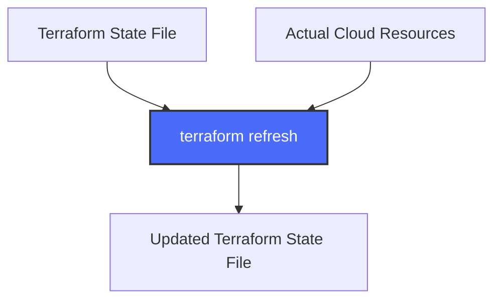

# Terraform Refresh

## Introduction

When working with Terraform, one of the key challenges is keeping your Terraform state file in sync with your actual infrastructure. As infrastructure changes occur—whether through the Terraform CLI, cloud provider console, or other means—discrepancies can develop between what Terraform "thinks" exists and what actually exists in your environment.

This is where the `terraform refresh` command comes in. It updates the state file to match the real-world infrastructure without making any changes to that infrastructure. Let's explore how this essential command works and when you should use it.

## What is Terraform Refresh?

The `terraform refresh` command is used to reconcile the Terraform state with the actual resources deployed in your infrastructure. It:

- Reads the current state of all managed resources
- Updates the state file to match what exists in your actual infrastructure
- Does NOT modify your actual infrastructure resources

In Terraform versions prior to 0.15.0, `refresh` was a standalone command. In more recent versions, it's available as the `-refresh-only` flag on `terraform plan` and `terraform apply`.

## When to Use Terraform Refresh

You might want to use the refresh command in several scenarios:

1. When you know changes were made outside of Terraform
2. When your state file might be out of date
3. Before running a plan to ensure you're working with current information
4. When troubleshooting state/infrastructure discrepancies

## Basic Syntax

For Terraform 0.15.0 and later:

```bash
terraform plan -refresh-only
terraform apply -refresh-only
```

For older Terraform versions:

```bash
terraform refresh
```

## How Terraform Refresh Works

Let's visualize the refresh process:



The process involves:

1. Terraform reads your configuration files
2. It checks each resource in your state file
3. It calls the provider's API to get the current status of each resource
4. It updates the state file with any differences found

## Practical Example

Let's say you've created an AWS EC2 instance using Terraform:

```hcl
provider "aws" {
  region = "us-west-2"
}

resource "aws_instance" "example" {
  ami           = "ami-0c55b159cbfafe1f0"
  instance_type = "t2.micro"
  tags = {
    Name = "terraform-example"
  }
}
```

After applying this configuration, you go to the AWS Console and manually change the tag from "terraform-example" to "updated-manually".

Now your state file is out of sync with the actual infrastructure. Let's fix that:

```bash
terraform plan -refresh-only
```

Output would look something like:

```
Terraform will perform the following actions:

  # aws_instance.example will be read during refresh
    ~ tags = {
        ~ Name = "terraform-example" -> "updated-manually"
    }

Plan: 0 to add, 0 to change, 0 to destroy.
```

If you approve this with a `terraform apply -refresh-only`, Terraform will update the state file to match the actual infrastructure without trying to revert your manual change.

## Common Use Cases

### 1. Drift Detection

One of the most common uses is to detect "drift" between your state and actual resources:

```bash
terraform plan -refresh-only
```

This shows you what changed outside of Terraform without making any changes.

### 2. Fixing State After Manual Changes

If you've made intentional changes outside of Terraform:

```bash
terraform apply -refresh-only
```

This accepts those changes into your state file so Terraform doesn't try to revert them later.

### 3. Addressing Missing Resources

If a resource was deleted outside of Terraform:

```bash
terraform plan -refresh-only
```

You'll see output indicating that the resource can't be found:

```
# aws_instance.example has been deleted
    - resource "aws_instance" "example" {
        - ami                          = "ami-0c55b159cbfafe1f0" -> null
        - instance_type                = "t2.micro" -> null
        - tags                         = {
            - "Name" = "terraform-example"
          } -> null
        # (additional attributes hidden)
      }
```

## Caution: Refresh vs Import

It's important to understand what refresh can and cannot do:

- ✅ Refresh can update attributes of resources that already exist in your state
- ❌ Refresh cannot add new resources to your state that were created outside of Terraform

For resources created outside of Terraform, you need the `terraform import` command instead.

## Best Practices

1. **Run refresh regularly**: Incorporate refresh into your workflow to catch drift early
2. **Refresh before plan**: Always run a refresh before planning changes
3. **Version control your state**: Even with refresh, keep your state files in version control or use remote state
4. **Review changes carefully**: Always review the proposed state changes before applying them

## Example Workflow

Here's a recommended workflow incorporating refresh:

```bash
# Update the state with any external changes
terraform plan -refresh-only

# Review the drift detected
# If acceptable, apply the refresh
terraform apply -refresh-only

# Now that state is current, plan actual changes
terraform plan

# Apply the changes if the plan looks good
terraform apply
```

## Working with Remote State

When using remote state (like with Terraform Cloud or an S3 backend), the refresh process works the same way:

```hcl
terraform {
  backend "s3" {
    bucket = "my-terraform-state"
    key    = "prod/terraform.tfstate"
    region = "us-east-1"
  }
}
```

The refresh operation will:
1. Download the state file from the remote location
2. Perform the refresh locally
3. Upload the updated state back to the remote location

## Summary

The Terraform refresh operation is an essential tool for keeping your infrastructure state accurate and up to date. While it doesn't make changes to your actual infrastructure, it ensures that Terraform has an accurate understanding of what exists, allowing your future operations to work correctly.

Remember:
- Use `-refresh-only` for read-only inspections of drift
- Apply changes only after carefully reviewing what will be updated
- Refresh doesn't replace import for resources created outside of Terraform

## Additional Resources

- [Official Terraform Documentation on Refresh](https://www.terraform.io/cli/commands/refresh)
- [Terraform State Management Guide](https://www.terraform.io/language/state)
- [Detecting and Managing Drift with Terraform](https://www.hashicorp.com/blog/detecting-and-managing-drift-with-terraform)

## Exercises

1. Create a simple Terraform configuration with an AWS S3 bucket
2. Apply the configuration to create the bucket
3. Manually change a tag on the bucket using the AWS Console
4. Run `terraform plan -refresh-only` to see the detected changes
5. Apply the refresh and verify the state has been updated