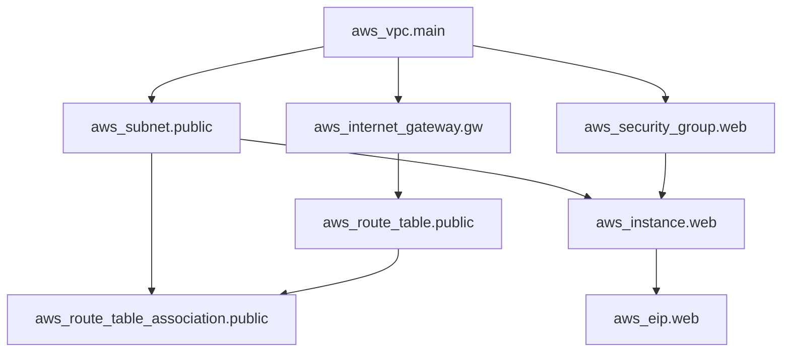

# Terraform Resources

## Introduction

Resources are the most important element in Terraform configuration. They define the infrastructure components that Terraform will manage, such as virtual machines, networks, storage accounts, or any other service provided by cloud platforms like AWS, Azure, or Google Cloud.

A resource block tells Terraform to create and manage a specific infrastructure component. Think of resources as the building blocks of your infrastructure. Each resource maps to a specific provider's service, and Terraform handles its creation, updating, and deletion based on your configuration.

## Resource Block Syntax

The basic syntax of a resource block is:

```hcl
resource "provider_type" "resource_name" {
  argument1 = value1
  argument2 = value2
  
  nested_block {
    nested_argument1 = nested_value1
  }
}
```

Let's break down the components:

- `resource`: The keyword that starts the block
- `provider_type`: The type of resource to create (e.g., `aws_instance`, `azurerm_virtual_machine`)
- `resource_name`: A unique identifier you assign to reference this resource elsewhere in your code
- Arguments inside the block: Configuration specific to that resource

## Basic Resource Example

Here's a simple example of an AWS EC2 instance resource:

```hcl
resource "aws_instance" "web_server" {
  ami           = "ami-0c55b159cbfafe1f0"
  instance_type = "t2.micro"
  
  tags = {
    Name = "WebServer"
    Environment = "Production"
  }
}
```

This tells Terraform to create an EC2 instance with the Amazon Machine Image (AMI) specified, using a t2.micro instance type, and with specific tags.

## Resource Arguments

Each resource type has its own set of arguments that configure its behavior. These arguments fall into a few categories:

1. **Required arguments**: Must be provided for the resource to be created successfully
2. **Optional arguments**: Have default values if not specified
3. **Computed arguments**: Generated by the provider and can be referenced but not set directly

You can find the available arguments for each resource type in the Terraform Registry documentation for that provider.

## Resource Dependencies

Resources often depend on other resources. For example, a web server might need a network to be created first. Terraform automatically determines the dependency order based on references between resources.

### Implicit Dependencies

When one resource references attributes of another resource, Terraform creates an implicit dependency:

```hcl
resource "aws_vpc" "main" {
  cidr_block = "10.0.0.0/16"
}

resource "aws_subnet" "primary" {
  vpc_id     = aws_vpc.main.id
  cidr_block = "10.0.1.0/24"
}
```

In this example, the subnet implicitly depends on the VPC because it references `aws_vpc.main.id`.

### Explicit Dependencies

Sometimes you need to create dependencies that aren't based on attribute references. You can use the `depends_on` meta-argument:

```hcl
resource "aws_s3_bucket" "example" {
  bucket = "my-example-bucket"
}

resource "aws_iam_role_policy" "example" {
  name   = "example"
  role   = aws_iam_role.example.id
  policy = data.aws_iam_policy_document.example.json
  
  depends_on = [
    aws_s3_bucket.example
  ]
}
```

## Resource Attributes

Each resource has attributes that can be referenced after the resource is created. These attributes are often used to link resources together or to output important information.

To reference a resource attribute, use the syntax: `resource_type.resource_name.attribute`

```hcl
resource "aws_instance" "web" {
  ami           = "ami-0c55b159cbfafe1f0"
  instance_type = "t2.micro"
}

output "public_ip" {
  value = aws_instance.web.public_ip
}
```

In this example, `aws_instance.web.public_ip` references the public IP address attribute of the EC2 instance.

## Resource Lifecycle

Resources have a lifecycle that Terraform manages:

1. **Creation**: When you first run `terraform apply`
2. **Updates**: When you change the configuration and run `terraform apply` again
3. **Destruction**: When you remove the resource from your configuration or run `terraform destroy`

You can control aspects of this lifecycle using the `lifecycle` block:

```hcl
resource "aws_instance" "web" {
  ami           = "ami-0c55b159cbfafe1f0"
  instance_type = "t2.micro"
  
  lifecycle {
    create_before_destroy = true
    prevent_destroy = false
    ignore_changes = [
      tags,
    ]
  }
}
```

The `lifecycle` options include:

- `create_before_destroy`: Create the new resource before destroying the old one
- `prevent_destroy`: Prevent Terraform from destroying this resource
- `ignore_changes`: List of attributes to ignore when Terraform detects changes

## Provisioners

Provisioners let you execute commands on a local or remote machine as part of resource creation or destruction. While generally discouraged in favor of built-in provider functionality, they can be useful for specific scenarios:

```hcl
resource "aws_instance" "web" {
  ami           = "ami-0c55b159cbfafe1f0"
  instance_type = "t2.micro"
  
  provisioner "local-exec" {
    command = "echo The server's IP address is ${self.private_ip}"
  }
  
  provisioner "remote-exec" {
    inline = [
      "sudo apt-get update",
      "sudo apt-get install -y nginx",
      "sudo systemctl start nginx"
    ]
    
    connection {
      type        = "ssh"
      user        = "ubuntu"
      private_key = file("~/.ssh/id_rsa")
      host        = self.public_ip
    }
  }
}
```

Terraform supports several provisioner types, including:

- `local-exec`: Run commands on the machine running Terraform
- `remote-exec`: Run commands on the resource after it's created
- `file`: Copy files from the local machine to the resource

## Count and For Each

Terraform allows you to create multiple instances of a resource using `count` or `for_each`.

### Count

The `count` meta-argument creates multiple instances based on a number:

```hcl
resource "aws_instance" "server" {
  count = 3
  
  ami           = "ami-0c55b159cbfafe1f0"
  instance_type = "t2.micro"
  
  tags = {
    Name = "Server ${count.index + 1}"
  }
}
```

This creates three EC2 instances with the names "Server 1", "Server 2", and "Server 3".

### For Each

The `for_each` meta-argument creates instances based on a map or set of strings:

```hcl
resource "aws_instance" "server" {
  for_each = {
    web = "t2.micro"
    app = "t2.small"
    db  = "t2.medium"
  }
  
  ami           = "ami-0c55b159cbfafe1f0"
  instance_type = each.value
  
  tags = {
    Name = "${each.key}-server"
  }
}
```

This creates three EC2 instances with different instance types, named "web-server", "app-server", and "db-server".

## Real-World Example: Web Application Infrastructure

Let's put everything together in a real-world example of a web application infrastructure on AWS:

```hcl
# Define a VPC
resource "aws_vpc" "main" {
  cidr_block = "10.0.0.0/16"
  
  tags = {
    Name = "MainVPC"
  }
}

# Create a public subnet
resource "aws_subnet" "public" {
  vpc_id            = aws_vpc.main.id
  cidr_block        = "10.0.1.0/24"
  availability_zone = "us-west-2a"
  
  tags = {
    Name = "PublicSubnet"
  }
}

# Create an internet gateway
resource "aws_internet_gateway" "gw" {
  vpc_id = aws_vpc.main.id
  
  tags = {
    Name = "MainInternetGateway"
  }
}

# Create a route table with a route to the internet
resource "aws_route_table" "public" {
  vpc_id = aws_vpc.main.id
  
  route {
    cidr_block = "0.0.0.0/0"
    gateway_id = aws_internet_gateway.gw.id
  }
  
  tags = {
    Name = "PublicRouteTable"
  }
}

# Associate the route table with the public subnet
resource "aws_route_table_association" "public" {
  subnet_id      = aws_subnet.public.id
  route_table_id = aws_route_table.public.id
}

# Create a security group
resource "aws_security_group" "web" {
  name        = "web-server-sg"
  description = "Allow HTTP and SSH traffic"
  vpc_id      = aws_vpc.main.id
  
  ingress {
    from_port   = 80
    to_port     = 80
    protocol    = "tcp"
    cidr_blocks = ["0.0.0.0/0"]
  }
  
  ingress {
    from_port   = 22
    to_port     = 22
    protocol    = "tcp"
    cidr_blocks = ["0.0.0.0/0"]
  }
  
  egress {
    from_port   = 0
    to_port     = 0
    protocol    = "-1"
    cidr_blocks = ["0.0.0.0/0"]
  }
  
  tags = {
    Name = "WebServerSG"
  }
}

# Create an EC2 instance
resource "aws_instance" "web" {
  ami                    = "ami-0c55b159cbfafe1f0"
  instance_type          = "t2.micro"
  subnet_id              = aws_subnet.public.id
  vpc_security_group_ids = [aws_security_group.web.id]
  
  user_data = <<-EOF
              #!/bin/bash
              sudo apt-get update
              sudo apt-get install -y nginx
              sudo systemctl enable nginx
              sudo systemctl start nginx
              EOF
  
  tags = {
    Name = "WebServer"
  }
}

# Create an Elastic IP
resource "aws_eip" "web" {
  instance = aws_instance.web.id
  vpc      = true
  
  tags = {
    Name = "WebServerEIP"
  }
}

# Output the public IP
output "web_server_ip" {
  value = aws_eip.web.public_ip
}
```

This example demonstrates how various resources work together to create a functional web server infrastructure in AWS.

## Resource Visualization

The relationship between resources can be visualized as follows:



## Summary

Resources are the core building blocks of Terraform configuration. They represent the infrastructure components you want to create and manage. Understanding resource syntax, dependencies, attributes, and lifecycle management is fundamental to using Terraform effectively.

Key points to remember:

1. Resources define infrastructure components using a `resource` block
2. Each resource has a type and a name
3. Resources can depend on other resources implicitly or explicitly
4. Resource attributes can be referenced using the `resource_type.resource_name.attribute` syntax
5. Resources have a lifecycle that Terraform manages
6. You can create multiple instances of a resource using `count` or `for_each`

## Additional Resources

To deepen your understanding of Terraform resources:

- Practice writing resource configurations for different providers
- Explore the following exercises:
  1. Create a simple web server on your preferred cloud provider
  2. Set up a multi-tier application with database and web servers
  3. Create a load-balanced application with auto-scaling
  4. Use modules to organize your resources into reusable components

Continue to the next section to learn about Terraform data sources, which allow you to use information defined outside of Terraform.